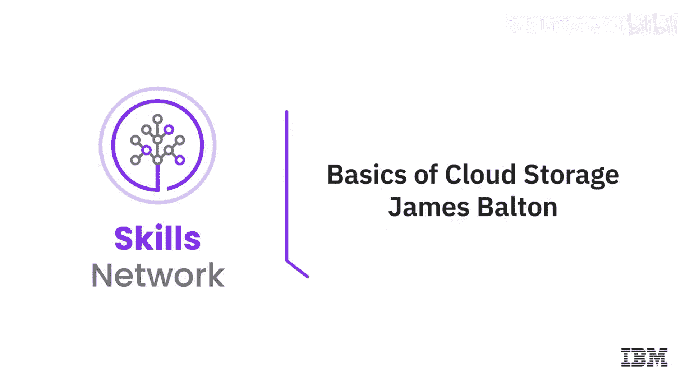
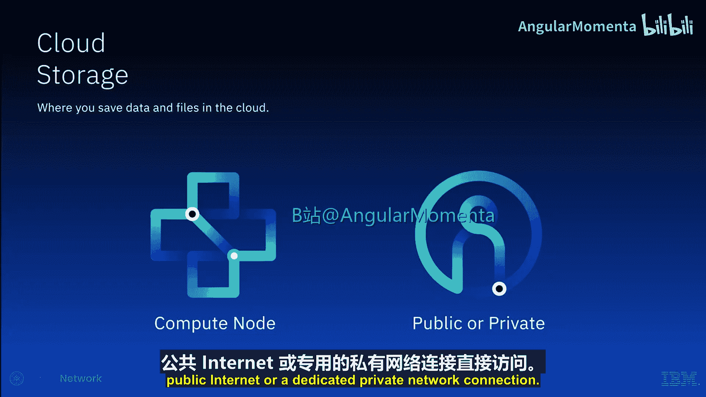
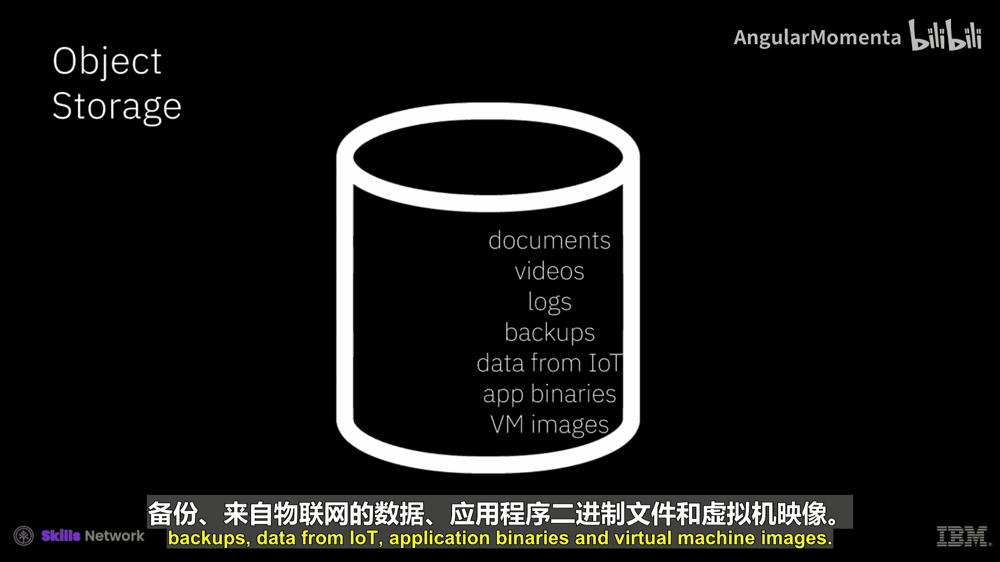

# 028：云端存储基础 🗂️

在本节课中，我们将要学习云计算中存储服务的基础知识。我们将了解什么是云存储、它的主要类型、各自的特点以及适用场景。

## 概述

云存储是您在云端保存数据文件的地方。云服务提供商负责托管、保护、管理和维护云存储及其相关基础设施，确保您在需要时可以访问数据。

## 云存储的核心特性

云存储服务允许您根据需要扩展容量，通常按每千兆字节（GB）付费。存储成本因类型而异，但一般而言，存储的读写速度越快，每GB的成本就越高。

## 云存储的主要类型

云存储主要有四种类型：直接附加存储、文件存储、块存储和对象存储。

### 直接附加存储

直接附加存储，有时称为本地存储，是直接提供给云服务器的存储，实际上位于主机服务器机箱内或同一机架内。

这种存储速度很快，通常仅用于存储服务器的操作系统，尽管它也可以有其他几种用途。直接附加存储除了存储操作系统外不太适合其他用途的两个主要原因是：
*   它通常是临时的，意味着其生命周期与它所连接的计算资源相同。
*   它无法与其他节点共享。虽然您可以使用RAID技术，但其故障恢复能力不如其他类型的存储。

### 文件存储

文件存储通常以NFS存储的形式提供给计算节点。NFS代表网络文件系统，意味着存储通过标准以太网网络连接到计算节点。

NFS挂载的存储很常见，但由于数据通过以太网传输，它往往比直接附加存储或块存储慢。它的成本也往往低于直接附加存储或块存储。

文件存储的一个优点是它可以同时挂载或在多个服务器上使用。基于文件的存储是一种简单直接的数据存储方法，非常适合以桌面用户熟悉的层次化文件夹结构来组织数据。

### 块存储

块存储使用高速光纤连接提供给计算节点，这意味着读写速度通常比文件存储快得多且更可靠，使得块存储适合用于数据库和其他磁盘速度很重要的应用程序。

您通常以卷的形式配置块存储，然后可以将其挂载到计算节点上，计算节点会将其视为另一个硬盘驱动器。卷通常一次只能挂载到一个计算节点上。

对于文件和块存储，您可能还会听到术语 **IOPS**。IOPS代表每秒输入/输出操作次数，与存储速度有关，换句话说，就是数据从存储读取或写入存储的速度。我们将在后面的视频中更详细地介绍这一点。

**持久性** 是在配置文件或块存储时使用的一个术语，关系到所连接的计算节点终止后存储会发生什么。如果存储设置为持久，则它不会随计算节点一起被删除，意味着它及其数据将被保留并可挂载到另一个计算节点，但您需要继续为该存储付费。在某些情况下，您也可以将存储设置为随其挂载的计算节点自动删除。在这种情况下，它就变成了临时存储，您也将停止为该存储付费，但会丢失所有数据，除非数据在其他地方有备份。

在云中有多种备份数据的方法，但备份文件和块存储的一种方法是拍摄快照，即特定时刻的存储映像。快照创建通常很快，它们实际上不写入任何数据，或者更确切地说，它们创建元数据，不需要停机，后续快照仅记录数据的更改。它们非常适合将存储恢复到特定快照时的状态，但请注意，它们不能用于恢复单个文件。

### 对象存储

第四种存储是对象存储。这是一种不同类型的存储，因为它不附加到计算节点，而是通过API访问。

在所有存储类型中，对象存储就读写速度而言是目前最便宜也是最慢的，但对最终用户来说容量是无限的。与文件和块存储不同（您配置一定的存储容量，它会随着时间的推移而填满），对于对象存储，您可以不断向其中添加文件，它永远不会填满，您只需为使用的部分付费。

这使得对象存储成为存储各种非结构化数据类型的绝佳仓库，无论大小，包括文档、视频、日志、备份、物联网数据、应用程序二进制文件和虚拟机映像。

## 总结

本节课中，我们一起学习了云存储的基础知识。我们了解了云存储按需付费和可扩展的核心特性，并详细探讨了四种主要存储类型：**直接附加存储**（快速、临时）、**文件存储**（通过网络共享、成本较低）、**块存储**（高速、适合数据库）和**对象存储**（无限容量、通过API访问、成本最低）。理解这些类型的区别和适用场景，是有效利用云服务管理数据的关键。在接下来的视频中，将有关于不同类型存储的更详细信息。