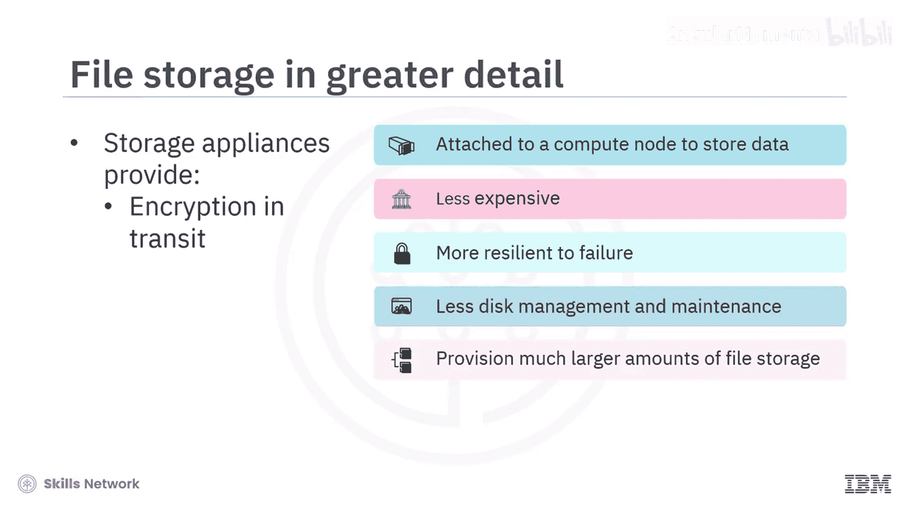
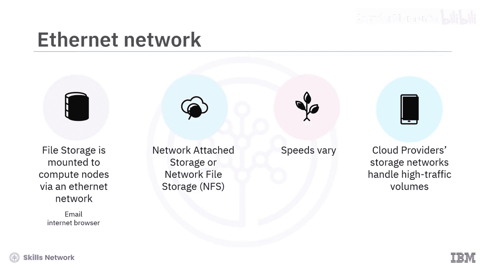
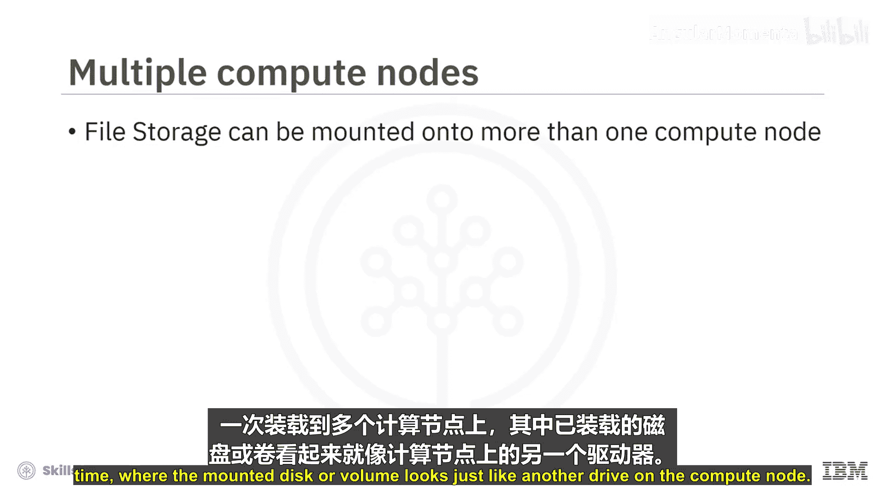
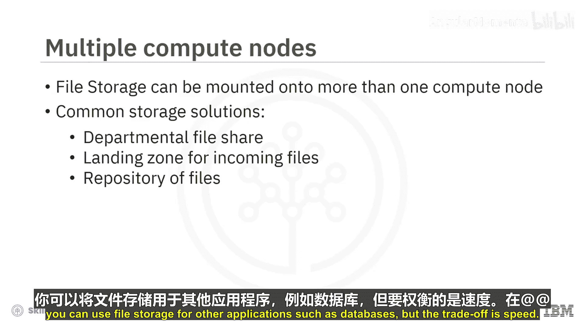
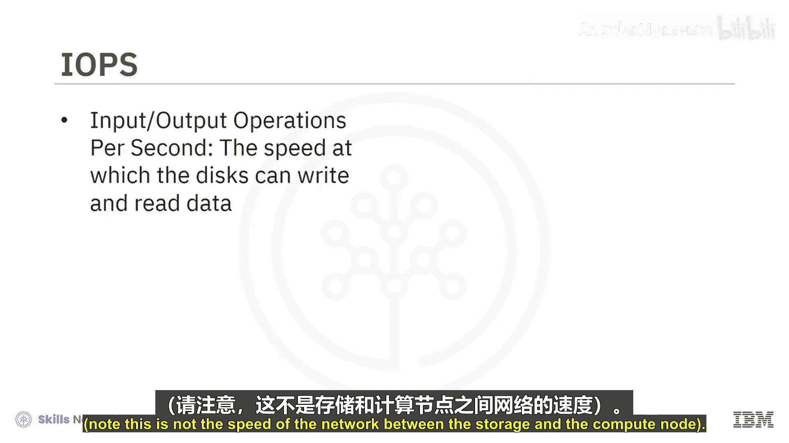
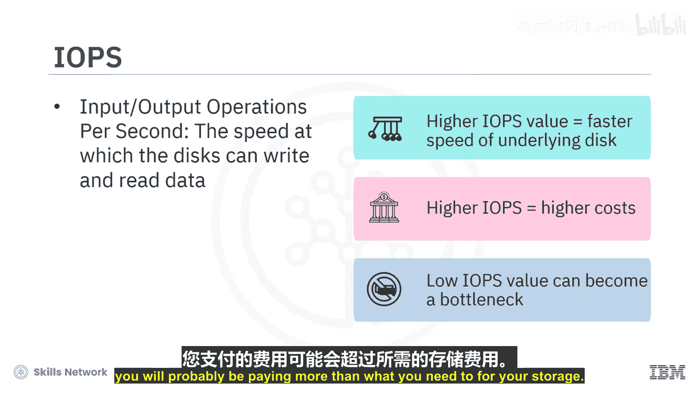
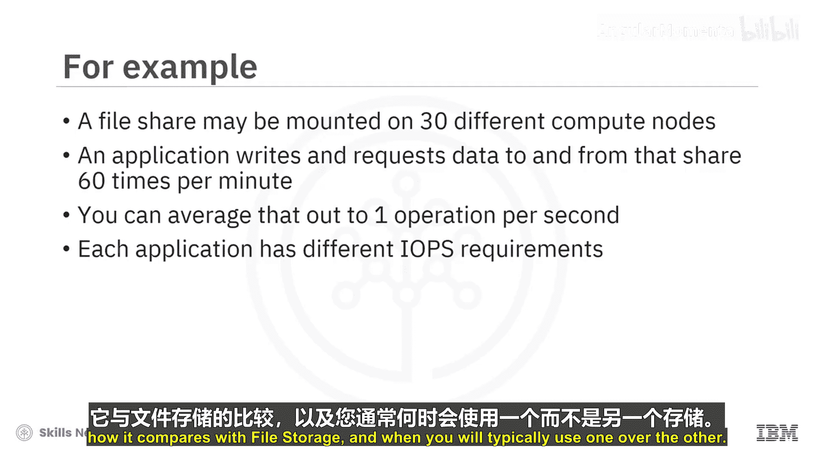

# 029：文件存储详解 📁

在本节课程中，我们将深入探讨云计算中的文件存储。我们将了解其工作原理、特点、适用场景以及一个关键的性能指标：IOPS。

---

## 概述

文件存储是一种通过网络挂载到计算节点的远程存储解决方案。与直接附加存储相比，它通常成本更低、容错性更强，并且为用户减少了磁盘管理和维护工作。它非常适合需要多个计算节点共享数据的场景。

## 文件存储的工作原理

上一节我们介绍了直接附加存储，本节中我们来看看文件存储。与直接附加存储类似，文件存储也必须挂载到计算节点才能访问和存储数据。然而，文件存储通常更经济，对故障的弹性更强，并且用户需要进行的磁盘管理和维护工作更少。

文件存储从远程存储设备挂载。这意味着物理磁盘位于一个独立的、专门的硬件设备中，然后通过数据中心底层的基础设施连接到计算节点。

这些存储设备不仅对故障的容忍度极高，而且数据在其中也安全得多，因为它们通常提供加密和传输安全等服务。所有这些应用都由服务提供商管理。

## 网络连接与性能考量

文件存储通过以太网网络挂载到计算节点。这种网络与你收发电子邮件或浏览互联网所使用的网络类型相同，尽管它通常专用于存储任务。因此，文件存储有时也被称为网络附加存储（NAS）、网络文件存储或简称NFS。

以太网网络的一个问题是其速度可能波动。网络负载越重，其速度或带宽受到影响的可能性就越大。当然，云服务商会构建其存储网络以处理非常高的流量。但即便如此，也无法保证速度始终一致。因此，文件存储倾向于用于那些不要求网络速度持续保持高水平的负载。

## 文件存储的典型应用场景

文件存储的一个关键特性是，它可以同时挂载到多个计算节点上，被挂载的磁盘或卷在计算节点上看起来就像另一个驱动器。

这种能够同时挂载到多个计算节点的能力，使其成为需要某种公共存储场景的理想解决方案。以下是几个典型用例：

*   **部门文件共享**：团队成员可以访问和编辑同一组文件。
*   **应用程序输入文件的着陆区**：需要由应用程序处理的传入文件可以集中存放于此。
*   **Web服务访问的文件仓库**：多个Web服务器实例可以读取相同的静态资源。

在这些应用中，连接网络速度的潜在波动通常不是大问题。当然，在成本是首要考虑因素时，你也可以将文件存储用于其他应用，例如数据库，但代价是速度。

## 理解关键性能指标：IOPS

当你配置文件存储时，需要考虑的一个关键因素是存储的IOPS容量。

**IOPS** 代表每秒输入/输出操作次数，指的是磁盘写入和读取数据的速度。请注意，这不是存储与计算节点之间网络的速度。

IOPS值越高，底层磁盘的速度就越快，但通常成本也更高。理解IOPS很重要，因为如果IOPS值对你的应用来说太低，存储可能会成为瓶颈，导致你的应用运行缓慢。反之，如果IOPS过高，你可能会为存储支付超出实际所需的费用。

为了帮助你理解，我们来看一个简单的例子。假设一个文件共享被挂载在30个不同的计算节点上，一个应用程序每分钟向该共享写入和请求数据60次。平均下来，每秒只有一次操作。通过这个简单的例子，你可以看到每个应用程序都有不同的IOPS需求。

## 总结

本节课中我们一起学习了云计算中的文件存储。我们了解到，文件存储是一种通过网络提供的共享存储服务，具有成本效益高、易于管理、支持多节点同时访问的特点。它非常适合文件共享、内容仓库等对网络延迟不敏感的应用。同时，我们引入了**IOPS**这一关键性能指标，它衡量了存储设备本身的数据处理能力，是配置存储时需要考虑的重要因素。

在下一个视频中，我们将详细讨论块存储，比较它与文件存储的异同，并分析在何种情况下通常会选择其中一种而非另一种。