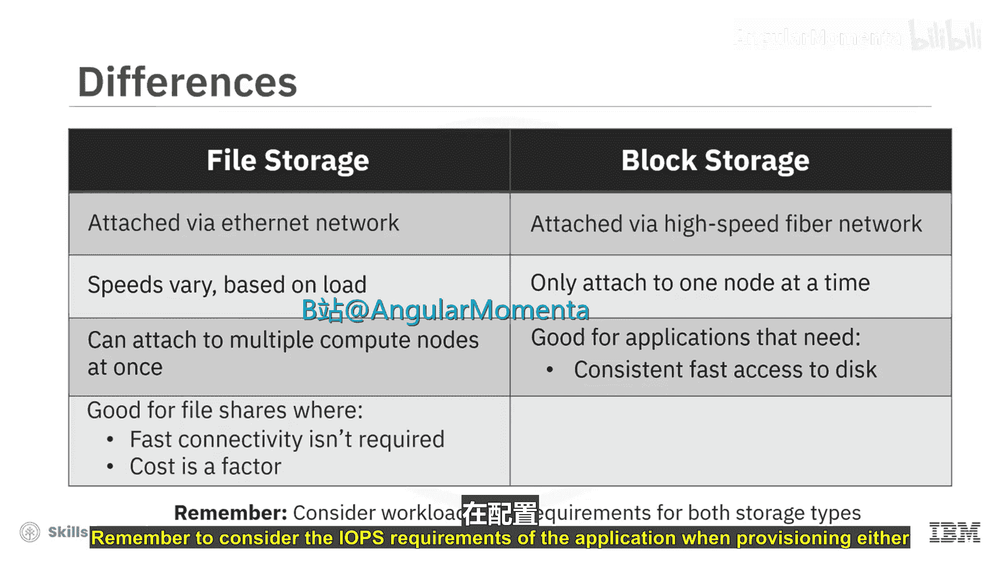
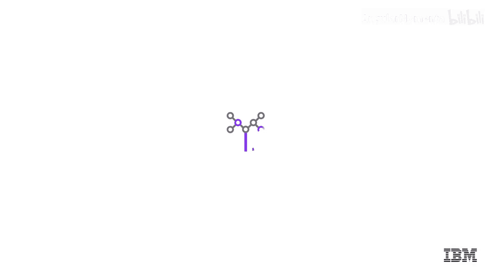

# 030：块存储 📦

在本节课中，我们将要学习块存储，并了解它与云中文件存储的区别。我们将探讨块存储的工作原理、适用场景以及如何根据应用需求在块存储和文件存储之间做出选择。

## 块存储概述

块存储将文件分解成数据块，并将每个数据块作为独立的单元，通过唯一地址进行存储。与直连存储和文件存储类似，块存储也必须挂载到计算节点上才能被工作负载使用。

块存储可以从远程存储设备挂载，这使其具备极高的故障恢复能力。由于这些设备通常提供传输中加密和静态加密服务，数据安全性也更高。

块存储通过专用的光纤网络作为卷挂载到计算节点，信号在其中以光速传输。虽然构建这种光纤网络的成本高于提供文件存储的以太网，但这也使得块存储的价格通常更高。然而，其优势在于流量传输更快且速度稳定。

## 块存储与文件存储的对比

上一节我们介绍了块存储的基本概念，本节中我们来看看它与文件存储的关键异同。

以下是两种存储类型的共同点：
*   两者通常都来自服务提供商维护的存储设备。
*   两者通常都具有高可用性和弹性。
*   两者通常都包含静态和传输中的数据加密。

以下是两种存储类型的主要区别：
*   **连接网络**：文件存储使用以太网连接到计算节点，因此有时被称为网络附加存储或NFS存储。文件存储非常可靠，但连接网络的速度可能因负载而异。块存储通过高性能光纤网络连接，非常可靠且速度稳定。
*   **挂载节点数**：文件存储可以同时挂载到多个计算节点。块存储一次只能挂载到一个节点。
*   **适用场景**：文件存储适用于需要文件共享、工作负载不需要极快存储连接速度或成本是重要因素的场景。块存储则适用于需要持续快速访问磁盘的应用程序，例如数据库。

## 块存储的深入解析

块存储是一种将数据以原始块的形式写入存储，并通过存储区域网络由服务器访问的存储方式。服务器可以位于相同或不同的网络中，但它们都通过这个存储区域网络连接到存储。

以下是使用块存储的一些优势：
*   **低延迟**：块存储能为应用程序提供尽可能低的延迟。
*   **高性能**：适用于需要高性能或高IOPS的应用程序。
*   **高冗余性**：大多数块存储服务都内置了冗余能力，数据在卷之间是冗余的。这意味着即使某个卷或磁盘出现故障，也可以从其他地方恢复数据，而不会对应用程序造成任何影响。

## 文件存储的补充说明

文件存储与服务器的连接方式与块存储不同。所有文件或文件共享都位于同一网络上，该网络上的任何服务器都可以访问它们，因此它被称为网络附加存储。

文件存储具有高度可扩展性，可以在网络上拥有多个文件共享，并让所有服务器同时连接到它们。它支持多运行时访问，允许多个服务器同时访问单个文件共享，并且可以同时进行多次读写操作，而无需担心数据被覆盖。

## 如何选择存储类型

了解了两者的特性后，我们来看看如何根据具体需求做出选择。

以下是选择存储类型时需要考虑的应用场景：
*   **选择块存储的场景**：例如，在VMware配置中，需要为多个虚拟服务器提供启动卷；或者工作负载是事务型数据库或关系型数据库，需要极低延迟和高性能。
*   **选择文件存储的场景**：当数据混合了结构化和非结构化数据时，例如同时包含文本文件和媒体文件的Web托管服务器；或者需要一个协作空间，允许多个用户同时访问、协同工作并进行读写操作。

## 总结

本节课中我们一起学习了块存储的核心概念。块存储通过专用高速网络提供低延迟、高性能的存储访问，非常适合数据库等需要持续快速磁盘I/O的应用。它与文件存储的关键区别在于连接方式、可共享性以及适用场景。文件存储适合共享访问和成本敏感型工作负载，而块存储则专为对性能有苛刻要求的单一工作负载设计。在选择时，务必考虑应用程序的IOPS需求。虽然块存储和文件存储是传统的存储类型，但它们在云上和本地环境中对于不同类型的工作负载仍然非常相关且实用。