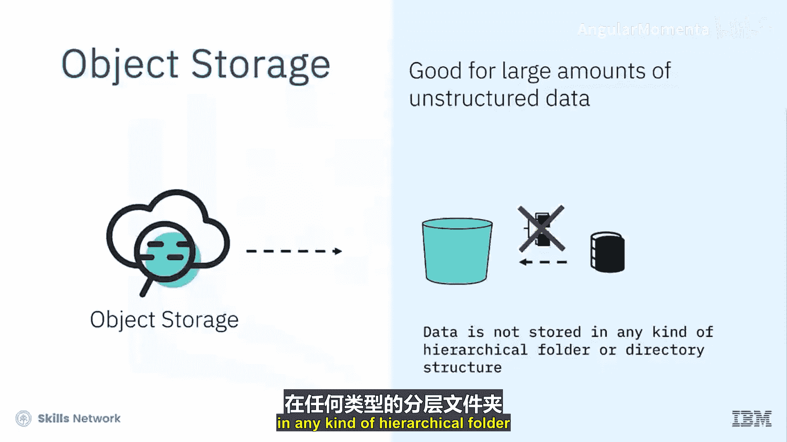
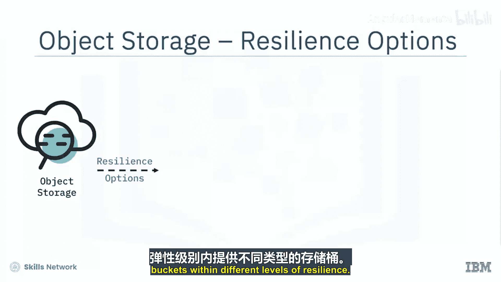
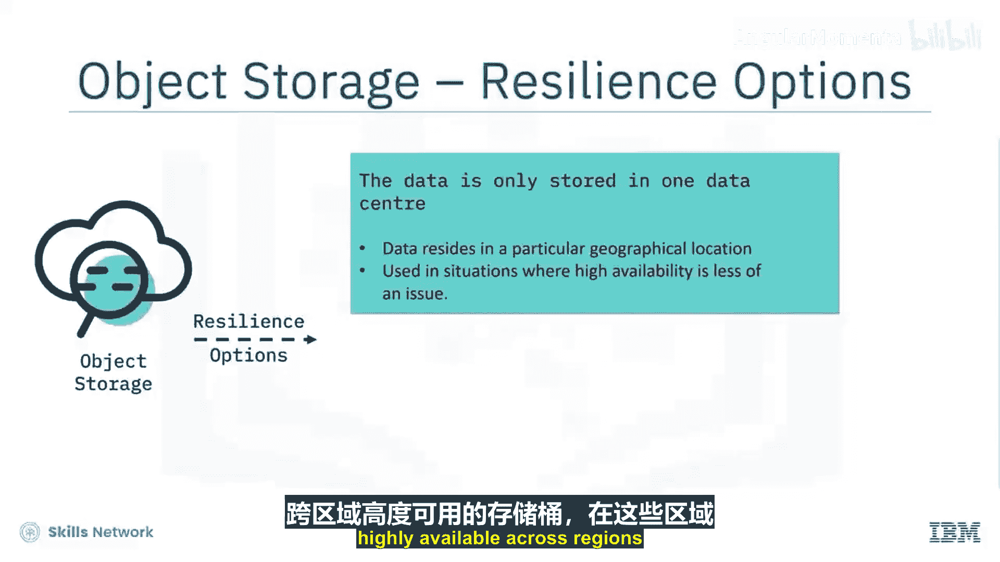
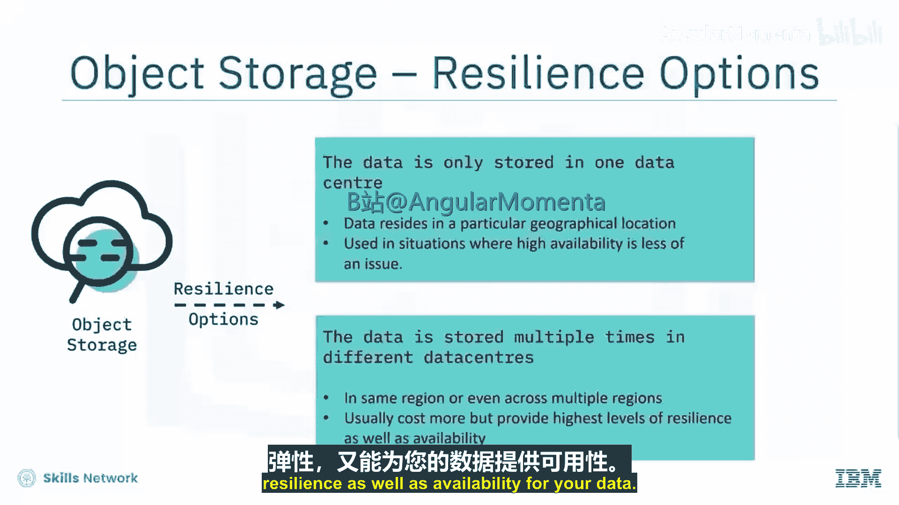
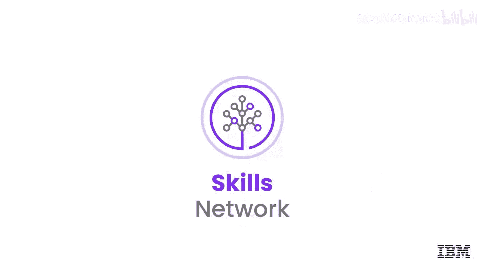

# 031：对象存储概述 🗂️

在本节课中，我们将要学习什么是对象存储，了解数据在对象存储中如何存储，以及它与文件存储和块存储等传统存储类型有何不同。

## 什么是对象存储？

对象存储是一种用于存储大量非结构化数据的云存储服务。与需要连接到特定计算节点才能使用的传统存储不同，对象存储通过API（应用程序编程接口）进行访问和管理。

## 对象存储的核心特点

以下是对象存储的三个关键特点：

1.  **通过API访问**：您无需将对象存储连接到特定的计算节点。相反，您创建一个对象存储服务实例，并使用API来上传、下载和管理数据。这意味着任何可以调用API的程序都能直接使用对象存储。
    *代码示例：* `PUT /bucket-name/object-key`

2.  **成本低廉**：对象存储的每GB成本通常比其他云存储选项更低，每月仅需几美分。具体成本取决于所使用的存储层级。

3.  **容量无限**：与需要预先指定容量（GB/TB）的文件和块存储不同，对象存储按实际使用量付费。您可以持续上传文件，存储空间永远不会耗尽。

## 对象存储的结构：桶与对象

对象存储使用“桶”和“对象”来组织数据。

*   **桶**：类似于文件夹，您可以为其命名，并用不同的桶存放不同类型的对象。但**桶内不能嵌套另一个桶**。创建桶时，**无需指定其大小**，它会自动容纳您放入的所有数据，容量可以从几字节到数PB。
*   **对象**：即您存储的文件本身。对象被放入桶中，并以结构扁平的方式存储。每个对象都附带有**元数据**（关于数据的数据），例如对象ID、创建时间等，这有助于应用程序定位和访问对象。

## 对象存储的适用场景

对象存储非常适合存储**静态的、非结构化的大量数据**。所谓非结构化，是指数据不以层级式的文件夹或目录结构存储。

**适合存储的数据类型包括：**
*   文本文件、音频文件、视频文件
*   物联网数据、虚拟机镜像
*   备份文件、数据档案

**对象存储不适用于：**
*   运行操作系统
*   运行数据库等应用程序（因为这些场景中文件内容频繁变化，且需要高速读写）

## 服务等级与可用性

云服务提供商通常提供具有不同韧性和可用性级别的桶。

*   **标准桶**：数据可能只存储在一个数据中心内，适用于对高可用性要求不高或数据有特定地理位置要求的场景。
*   **高可用桶**：数据会在同一区域的不同数据中心（可用区）甚至多个区域中多次存储。这提供了最高级别的数据韧性和可用性，但成本也更高。

## 总结

本节课中我们一起学习了对象存储的核心概念。对象存储用于存储静态的文件或对象，数据通过API访问，按使用量付费，且容量近乎无限。数据存储在“桶”中的“对象”里，桶无法嵌套，也无需预设大小。它非常适合存储大量非结构化数据，如媒体文件、备份和归档数据，但不适用于运行操作系统或数据库。不同的存储桶类型在数据韧性和可用性上有所区别，以满足不同场景的需求和预算。

在下一节视频中，我们将深入探讨对象存储的数据层级和API。