云计算导论：P32：对象存储层级与API

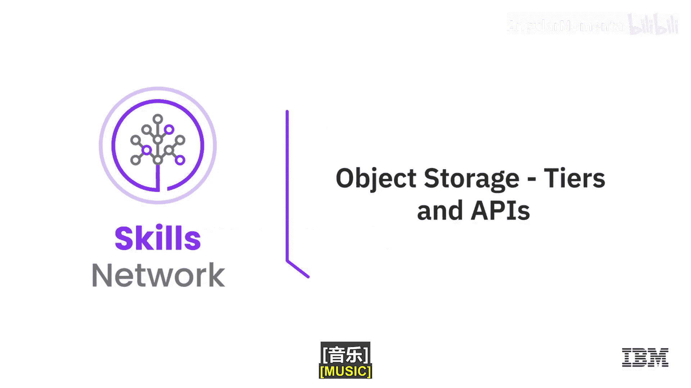

在本节课中，我们将更深入地探讨对象存储的数据层级和访问接口。我们将了解对象存储如何根据数据访问频率划分不同的存储层级，以及如何通过标准化的API来访问和管理这些数据。

---

上一节我们介绍了对象存储的基本概念，本节中我们来看看对象存储的具体层级划分和访问方式。

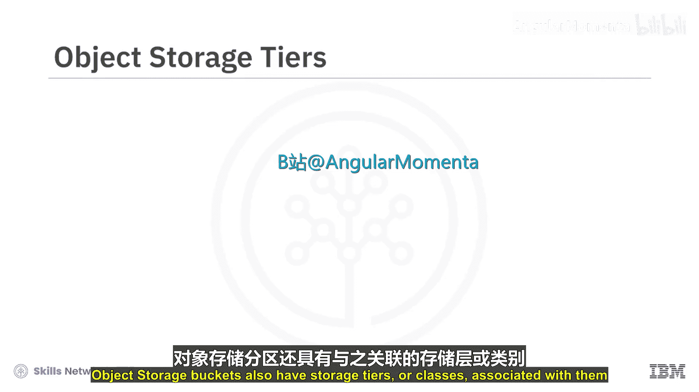

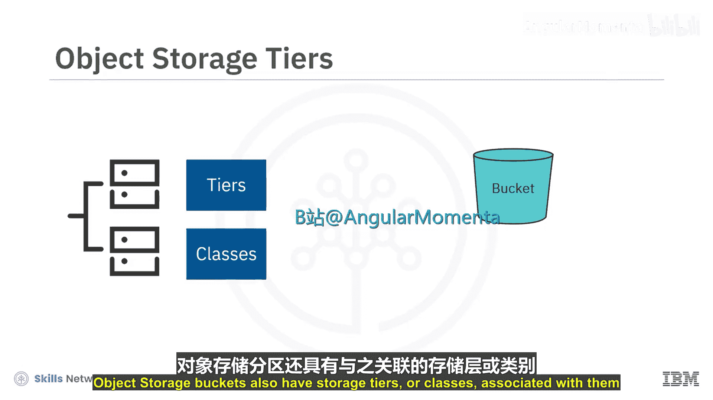

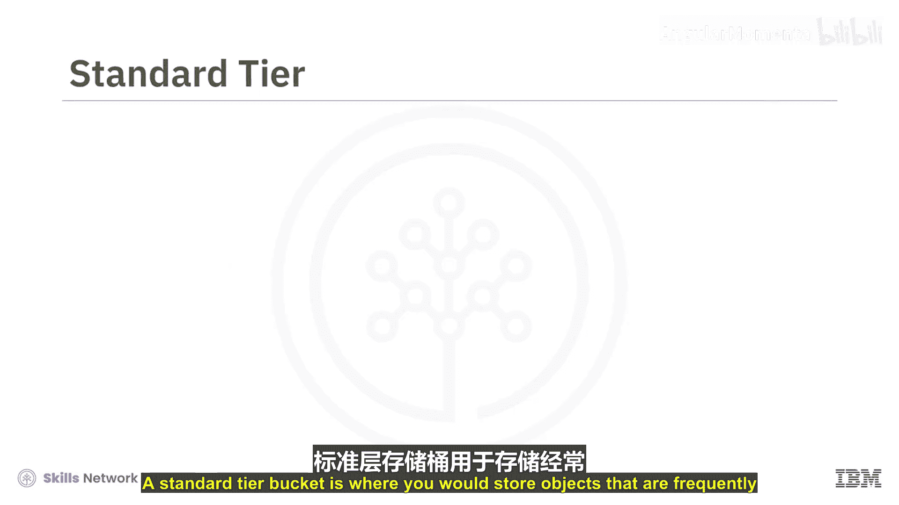

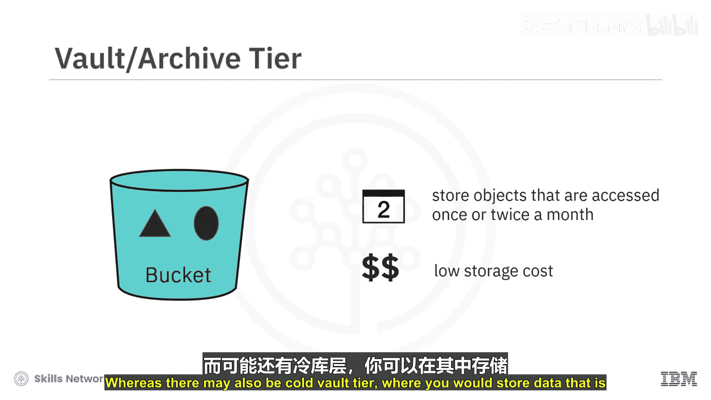

对象存储桶通常关联着不同的存储层级或类别。这些层级的划分主要依据数据的访问频率。

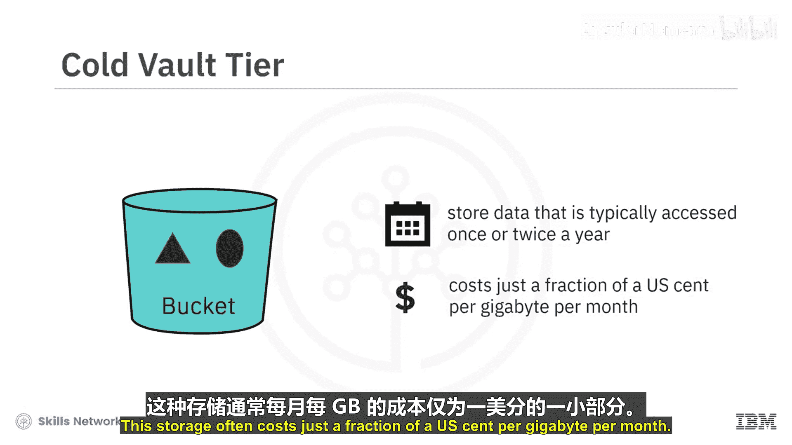

以下是主要的存储层级：

*   **标准层**：用于存储需要被频繁访问的对象。此层级通常具有最高的每GB存储成本。
*   **归档层**：用于存储访问频率较低（例如每月仅访问一两次或更少）的文档。此层级的存储成本较低。
*   **冷归档层**：用于存储极少被访问的数据（例如每年仅访问一两次）。此层级的月度存储成本通常仅为每GB几美分甚至更低。

通常，你可以为数据设置自动归档规则。这意味着如果一个对象在一定时间内未被访问，系统会自动将其移动到成本更低的存储层级。该规则利用对象的部分元数据来判断何时应进行归档。

需要注意的是，对象存储不提供IOPS选项。与文件存储或块存储相比，对象存储的访问速度通常较慢，下载操作往往需要数秒甚至更长时间才能完成。对于提供冷归档层的服务商，从这些层级检索数据有时甚至需要数小时，因为数据可能被保存在离线介质中。如果你的应用程序需要快速访问文件，那么对象存储可能不是一个好的选择。

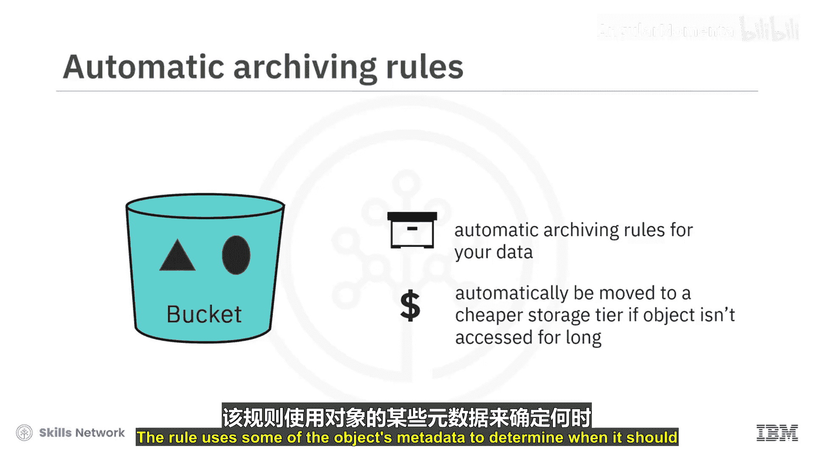

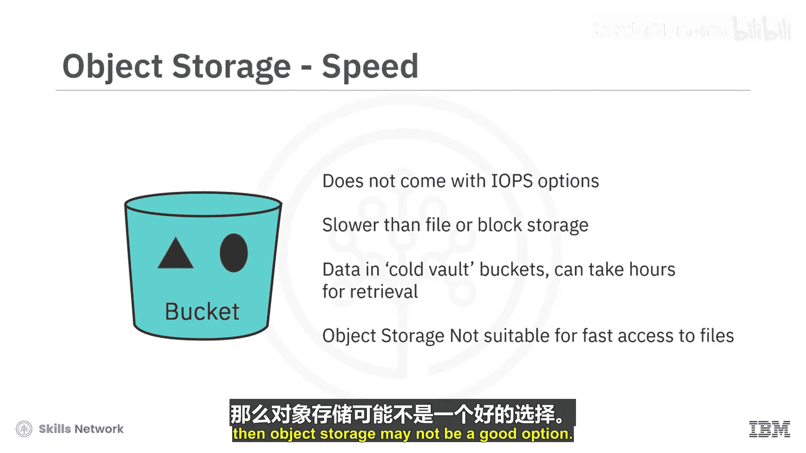

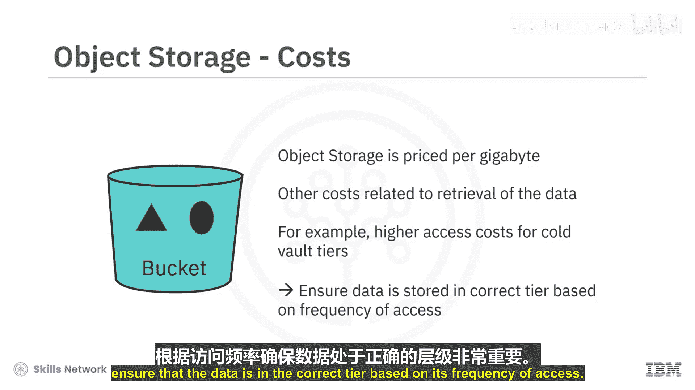

我们提到对象存储按每月使用的GB数计费，但也可能存在与数据检索相关的其他成本。这些成本通常也很低，但对于归档层或冷归档层中的数据，访问费用可能更高。因此，根据数据的访问频率将其放置在正确的层级中非常重要。

---

对象存储无需挂载到计算节点即可访问。相反，你通过应用程序编程接口来访问对象存储。

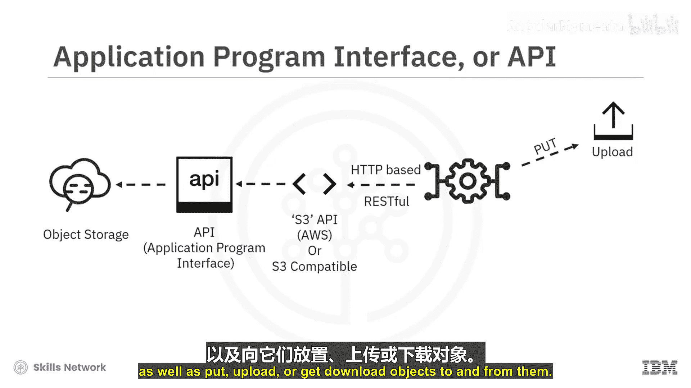

对象存储最常用的API称为**S3 API**。这是一个基于亚马逊AWS S3对象存储服务建立的标准。许多服务商都提供与其对象存储兼容的S3 API，这非常有用，因为它意味着开发者可以编写能够访问多个供应商对象存储的代码。

API本身是一个基于HTTP的RESTful API或RESTful Web服务。通过API调用，应用程序可以管理对象存储和存储桶，以及向其中上传或从中下载对象。

对象存储不仅适用于新应用程序，也可用于满足现有应用程序的需求。它还可以作为异地磁带备份解决方案的有效替代，用于备份和灾难恢复，从而缩短数据恢复时间。许多备份软件现在都包含使用对象存储将数据备份到云中的功能。与需要物理加载、卸载磁带并将其移至异地以实现地理冗余的磁带备份方案相比，对象存储效率更高。

---

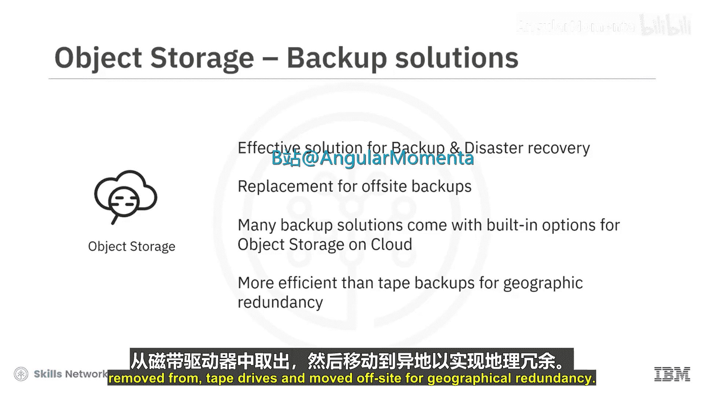

本节课中我们一起学习了以下核心内容：

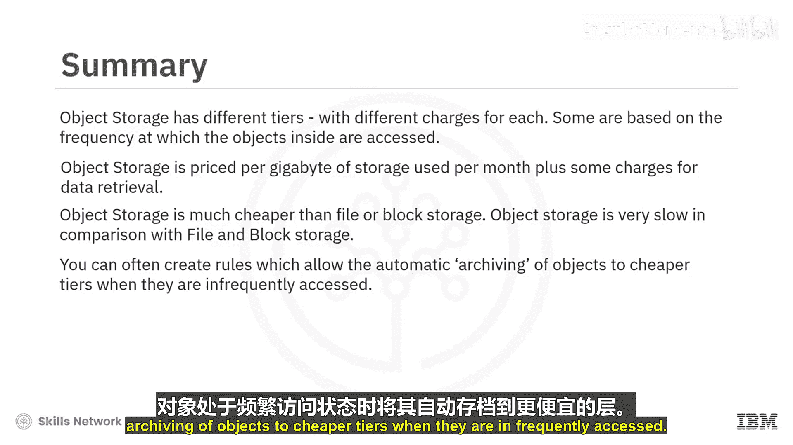

*   对象存储具有不同的层级，每个层级的费用不同。部分层级基于桶内对象的访问频率来划分。
*   对象存储按每月使用的存储容量（GB）计费，外加部分数据检索费用。
*   与文件存储或块存储相比，对象存储的成本要低得多。
*   与文件存储和块存储相比，对象存储的访问速度非常慢。
*   你可以创建规则，允许在对象不常被访问时自动将其归档到更便宜的层级。
*   对象存储使用API进行访问。
*   许多对象存储提供商都提供S3兼容的API，这意味着开发者可以创建适用于多个供应商对象存储解决方案的代码。
*   云中的对象存储提供了有效的备份和灾难恢复解决方案。

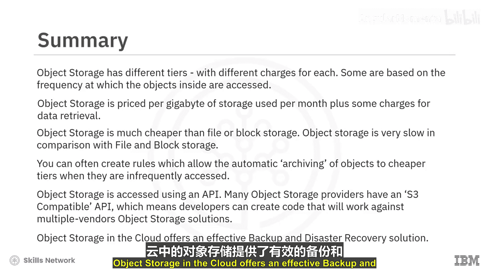

在下一个视频中，我们将介绍由块存储驱动的内容分发网络。