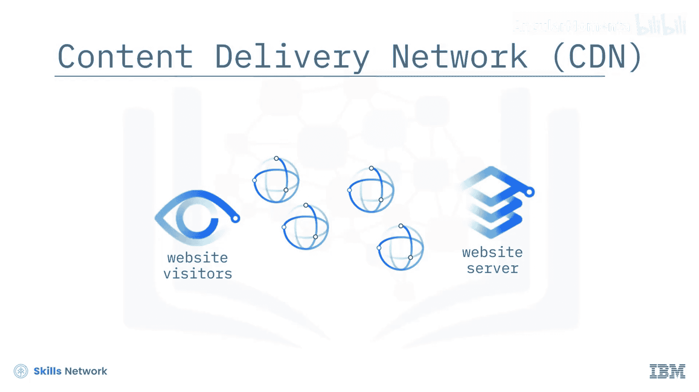

# 033：内容分发网络 (CDN) 🌐

在本节课中，我们将要学习什么是内容分发网络（CDN）。我们将了解其工作原理、核心优势以及它如何提升全球用户的网站访问体验。

内容分发网络（CDN）是一个分布式服务器网络，它根据用户的地理位置，向用户交付临时存储或缓存的网站内容副本。CDN将这些内容存储在分布式位置，从而缩短了网站访问者与网站服务器之间的距离。

---

## CDN 的工作原理

上一节我们介绍了CDN的基本概念，本节中我们来看看它是如何具体工作的。

假设你的网站服务器位于达拉斯，而你的用户遍布全球，例如悉尼、伦敦、纽约和洛杉矶。当悉尼的用户访问你的网站时，其请求需要往返跋涉8600英里到达达拉斯的服务器，仅这个往返过程就可能产生约170毫秒的延迟。距离越远，延迟越高，网站加载速度就越慢。

CDN通过在全球各地部署多个端点（或称为“边缘节点”）来解决这个问题。这些节点缓存了来自源站（如达拉斯的服务器）的内容。

以下是CDN工作的核心流程：
1.  用户首次请求某一内容时，CDN会从源站服务器（如达拉斯）获取该内容。
2.  CDN将该内容缓存到全球各地的边缘节点上。
3.  当同一地区或其他地区的用户再次请求相同内容时，请求将被路由到地理位置上最近的边缘节点，直接从该节点获取内容，无需再访问遥远的源站。

**核心机制公式化描述：**
`用户访问延迟 ≈ 用户到最近CDN节点的延迟`，而非 `用户到源站服务器的延迟`。

通过这种方式，CDN极大地减少了内容检索所需的时间。

---

## CDN 带来的主要优势

了解了CDN如何工作后，我们来看看它能带来哪些具体好处。CDN的优势可以分为直接优势和间接优势。

**直接优势**是显而易见的：
*   **提升网站速度**：这是CDN最主要的好处。用户从附近的节点获取内容，加载时间显著缩短，体验更流畅。

**间接优势**同样重要，它们体现在服务器端：
*   **降低源站负载**：由于大部分用户请求由边缘节点处理，直接到达源站服务器的流量大幅减少。这意味着源站服务器所需的处理能力和带宽容量可以降低。
*   **提高可用性与正常运行时间**：源站服务器压力减小，因过载而导致宕机的风险也随之降低，从而提升了网站的整体可用性。
*   **增强安全性**：用户不直接与源站服务器通信，这在一定程度上隐藏了源站，增加了攻击者直接攻击源站的难度，提供了“通过隐蔽性实现安全”的间接保护。

---

## 总结

本节课中我们一起学习了内容分发网络（CDN）。我们了解到，CDN是一个通过在全球部署边缘节点来缓存和分发内容的分布式网络。它的核心工作原理是**让用户从地理上最近的节点获取数据**，从而直接降低了访问延迟，提升了网站速度。此外，CDN还能为服务器端带来降低负载、提高可用性和增强安全性等间接好处。对于拥有全球用户的网站而言，使用CDN是优化性能、改善用户体验的关键策略之一。