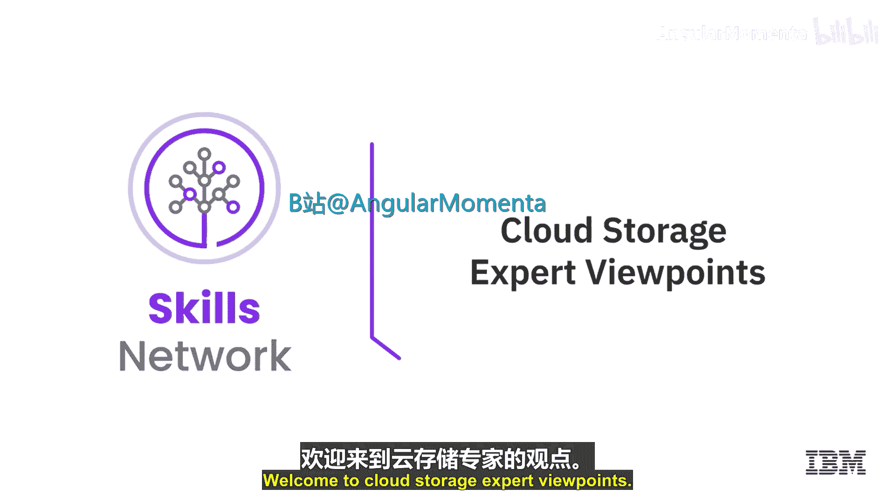
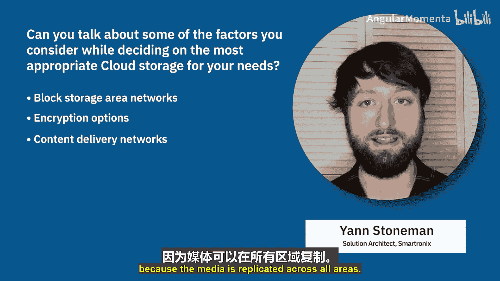
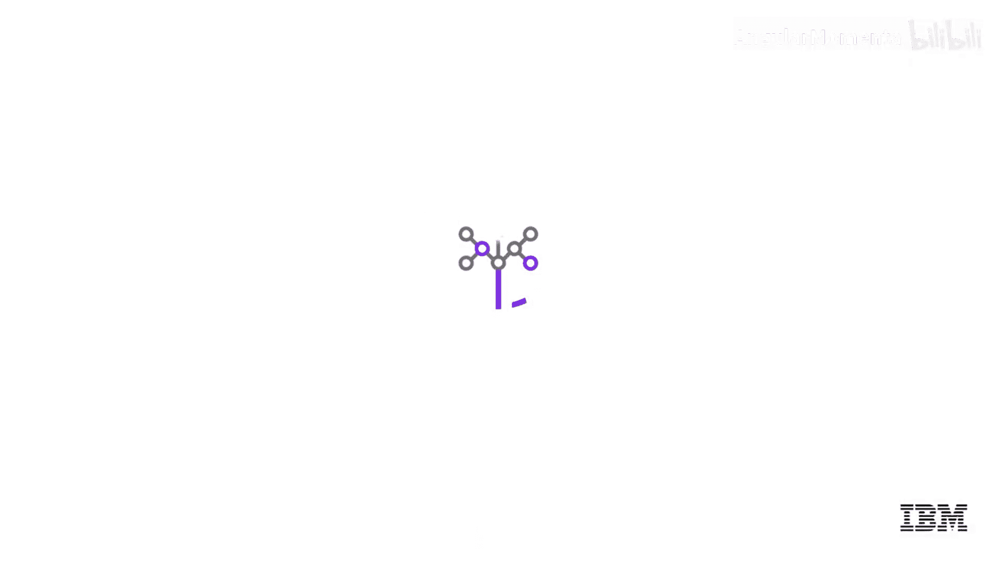

# 034：云存储 💾

在本节中，我们将聆听几位云应用专家的观点，了解他们在选择云存储服务时考虑的关键因素。我们将学习如何根据项目需求，从成本、性能、可用性等多个维度评估不同的存储方案。

上一节我们介绍了云存储的基本概念，本节中我们来看看专家们如何在实际项目中做出选择。

---

## 选择云存储的考量因素

当为项目选择云存储时，我主要关注三个核心方面：**成本**、**数据输入/输出的速度**以及**存储的可用性时长**。存储选择可能相当复杂，通常需要组合使用不同类型的存储。首要问题是明确存储的用途：它需要多快？有多少人使用？使用频率如何？成本考量也很关键，且成本计算不仅涉及存储容量，还常常与数据访问的频率和数量有关。

因此，我的建议是：**真正理解你使用存储的目的**，然后将所有相关因素纳入考量，这将帮助你找到解决问题所需的正确存储方案，或多种存储方案的组合。

以下是选择云存储时需要考虑的关键因素：
*   **成本**
*   **性能**
*   **安全性**
*   **操作的便捷性**

---

## 云存储的主要类型

在决定云存储时，通常需要在**文件存储**、**块存储**和**对象存储**之间进行选择。

**文件存储**的接口对大多数人来说最为熟悉，它本质上就像一个本地计算机上的文件系统。它支持多个客户端同时挂载访问，这也是我过去选择它的主要原因。

**块存储**不支持并发访问，但它具有**极低的延迟**，通常是高性能密集型应用（如数据库）的首选存储类型。

另一方面，**对象存储**往往是处理**大型、非结构化、不常修改数据**时的首选，例如大型数据集、视频文件、数据库备份等。

存储可以通过多种方式分类。一种类型是对象存储，第二种是块存储，文件存储（如NFS）或数据库存储（SQL或NoSQL服务）也属于不同类别。在云计算中，你可以获得不同等级或类别的存储。

如果我的应用需要存储用户数据或某些配置，我会考虑云对象存储。云对象存储（如AWS S3）提供近乎无限的存储空间或“桶”。

如果我需要更快的速度，例如为数据库提供存储，那么我可能会考虑块级存储。这种存储基于光纤网络工作，因此比通过互联网访问的云对象存储要快一些。

第三类是文件存储。文件存储的缺点是比块存储稍慢。然而，由于文件存储可以挂载到特定服务器上，我能够将其用作多个应用和多个服务器的公共存储。

---

## 性能、成本与高级特性

使用对象存储，你可能获得较低的成本，但未必能获得最高或最低的延迟。因为在对象存储中，每次更新文件的微小部分（比如一个字母），都需要更新整个对象。你需要为整个更新过程付费，并且必须等待整个对象更新完成。

相比之下，使用文件存储，你能够在数据中插入内容，而且文件存储通常更紧密地连接到你的实际计算资源，从而可以获得更低的延迟。

另一种类型是块存储。在云中，你可以选择**块存储优化的虚拟机**，这些虚拟机在块存储和服务器之间具有极低的延迟。对于需要极低延迟的场景，这是一个很好的解决方案。

以下是一些其他需要考虑的方面：
*   **安全与加密**：理想情况下，你希望数据在静态（存储时）和传输中都被加密。
*   **数据访问频率**：从需要低延迟的频繁访问，到不频繁访问，再到冷存储甚至长期归档存储。
*   **成本**：更频繁的访问和更低的延迟通常意味着更高的成本。
*   **业务需求**：数据可能是不可变的或受保护的，以防止被修改或删除。
*   **数据生命周期管理**：如何自动化执行保留、移动、归档或删除旧数据的策略。

此外，一些云提供商现在推出了**存储区域网络**，这样你就可以将一大堆块存储作为一个SAN，从你的云虚拟机进行访问。

另一个需要考虑的是**加密选项**。幸运的是，目前云中的大多数存储解决方案都具备加密存储的能力，但你需要确认这是一个可用的功能。

还有一个选项是**内容分发网络**。如果你希望媒体内容（例如图片）尽可能靠近终端用户存储，以便他们在加载你的网站时能瞬间看到图片，那么CDN是一个选择，因为它将媒体内容复制到所有区域。

---

## 总结

本节课中，我们一起学习了专家在选择云存储时的核心思路。关键点在于：首先明确存储用途（用途决定需求），然后综合评估**成本**、**性能**（速度与延迟）、**可用性**、**安全性**以及**数据生命周期管理**等因素。云存储主要分为**对象存储**（适合海量非结构化数据）、**块存储**（适合高性能数据库）和**文件存储**（适合共享文件系统）三大类，每种类型都有其适用的场景和优缺点。理解这些基础概念和权衡因素，是为你项目选择合适云存储方案的第一步。