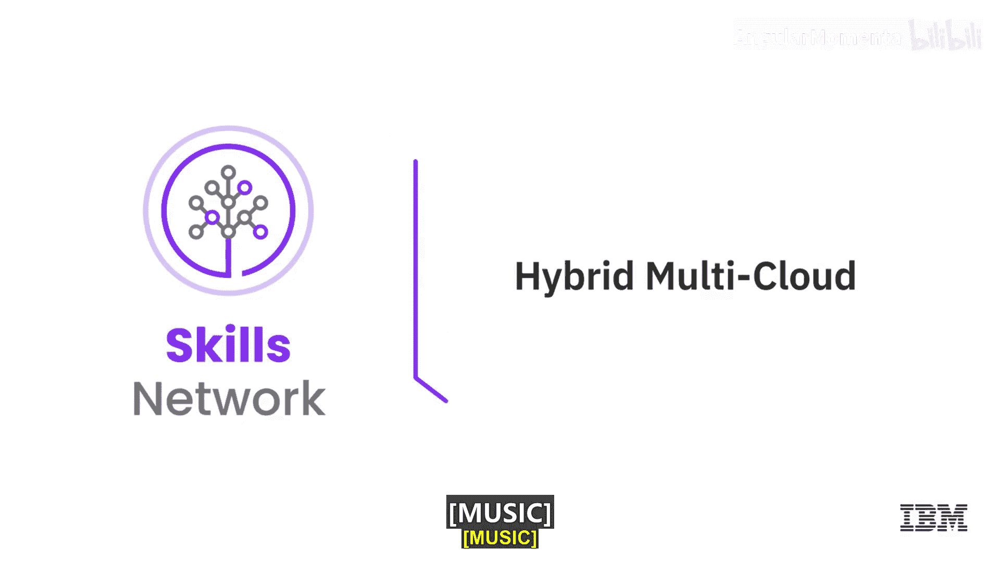
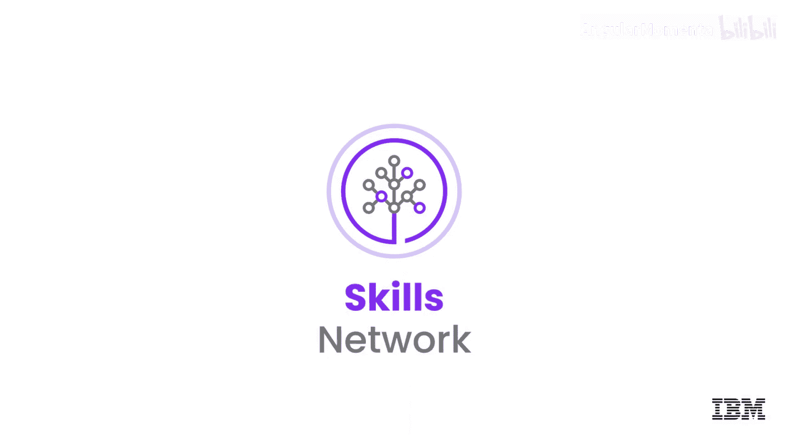

# 035：混合多云

在本节课中，我们将要学习混合多云的概念，并探讨企业为何以及如何采用这种策略。我们将通过具体的行业用例，来理解混合多云如何帮助企业实现灵活扩展、应用现代化和智能创新。

---

## 混合多云的定义

上一节我们介绍了云计算的基本模型，本节中我们来看看两种更复杂的云采用策略：混合云与多云。

**混合云** 是一种计算环境，它将一个组织的本地部署设施、私有云以及第三方公有云连接成一个统一的基础设施，用以运行该组织的应用程序。其核心是**连接与统一**。

**多云** 是一种云采用策略，它融合了来自不同服务提供商（跨越基础设施、平台或软件服务层）的多种云模型，包括公有云、私有云和托管云。例如，一家企业可能从A提供商处使用电子邮件服务，从B提供商处使用CRM应用，又从C提供商处获取基础设施。

因此，**混合多云** 意味着你能够利用不同服务提供商提供的、最优的云模型和服务，并让你的应用程序和工作负载在多个不同的云环境中无缝协同工作。

---

## 混合多云的应用场景

以下是企业可能希望采用混合多云策略的几个关键原因和场景。

### 场景一：云扩展

大多数人对云扩展都很熟悉，这是采用云的主要原因之一。以一个鲜花配送服务为例。

*   **背景**：该服务拥有本地基础设施，能够承受一定的用户负载。
*   **挑战**：在全年中，其负载会因特定节假日（如情人节、母亲节）而出现峰值。为了应对这些峰值，他们可以扩展本地架构，但这意味着高昂的前期成本和维护费用。
*   **解决方案**：利用云计算的弹性。他们可以采用混合多云策略，在负载激增时自动从云上调配资源进行扩展，在需求下降时自动释放这些资源。这实现了**按需付费**的成本效益。

虽然云扩展是云计算的通用概念，但混合多云能将其应用得更加精细，这引出了我们的下一个话题。

### 场景二：构建复合云

复合云指的是应用程序的各个组件分布在多个云环境中。让我们继续以鲜花配送服务为例。

*   **背景**：该服务总部位于欧盟，其应用主要包含三个组件：**Web用户界面**、**计费API**和**会员奖励框架**，最初都运行在欧盟的本地设施上。
*   **挑战**：对于北美客户，在退伍军人节或感恩节等美国本土节日期间，系统响应变慢。
*   **解决方案**：采用混合多云架构，将应用组件组合部署到多个云环境。
    1.  将会员奖励框架保留在欧盟的本地设施中。
    2.  将Web用户界面和计费API迁移到位于北美数据中心的某个云平台上。

这样，他们就能针对美国节假日灵活扩展相关组件，同时保持欧盟部分独立扩展。这实现了**全球级别的精细化扩展**。

### 场景三：应用现代化（以航空业为例）

许多传统企业的核心系统仍运行在本地。航空业就是一个典型例子。

*   **背景**：航空公司的**订票系统**可能仍运行在本地。
*   **现代化步骤1**：为了创造新的用户体验，他们开发了**移动应用**。该应用的移动后端可以部署在公有云上，并通过API与本地订票系统交互。公式如下：
    `移动应用 -> (公有云)移动后端 -> (本地)订票系统`
    这实现了基本的现代化，提供了新的用户入口。

*   **现代化步骤2**：进一步利用云改善用户体验。例如，处理航班延误。
    *   **挑战**：航班延误是用户不满的主要来源，重新订票过程繁琐。
    *   **解决方案**：在云端构建一个**智能推荐功能**。一旦航班发生延误，系统能通过移动后端实时为用户推荐并预订替代航班。这提升了用户体验和航空公司运营效率。

### 场景四：数据与人工智能（以航空业为例）

混合多云为处理海量数据和运行AI模型提供了强大平台。

*   **背景**：航空公司拥有数十年的历史运营数据，例如非计划性维护记录。
*   **挑战**：航空业中约30%的延误时间是由非计划性维护造成的。
*   **解决方案**：采用混合多云策略。
    1.  将本地庞大的历史数据与云端的**机器学习**或**AI能力**连接。
    2.  利用云的计算能力进行**预测性分析**，在故障或非计划性维护发生之前就获得洞察。

这能帮助航空公司提前安排维护，减少延误，从而提升运营效率和客户满意度。核心是利用 `本地历史数据 + 云端AI算力 = 预测性洞察`。

### 避免供应商锁定

除了上述场景，采用混合多云策略的另一个重要原因是**避免被单一云服务供应商锁定**。它提供了灵活性，允许企业根据需求变化（如成本、服务特性、合规要求），将工作负载从一个云平台迁移到另一个。

---

## 总结

本节课中我们一起学习了混合多云的核心概念及其应用价值。我们通过鲜花配送和航空业的例子，探讨了混合多云在**云扩展**、**构建复合云**、**应用现代化**以及**数据与AI**创新方面的四大应用场景。此外，我们也了解到这种策略有助于企业保持灵活性，**避免供应商锁定**。理解这些用例，是规划企业云战略的重要基础。

在下一节视频中，我们将了解什么是微服务架构，及其特点、优势和用例。