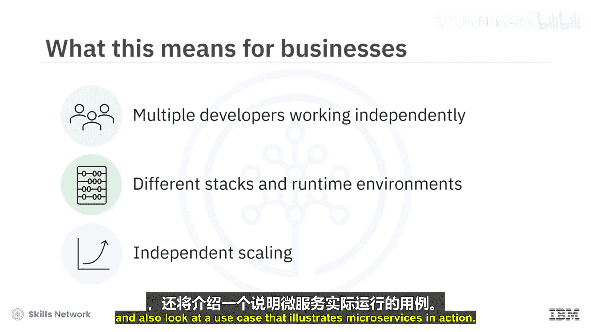
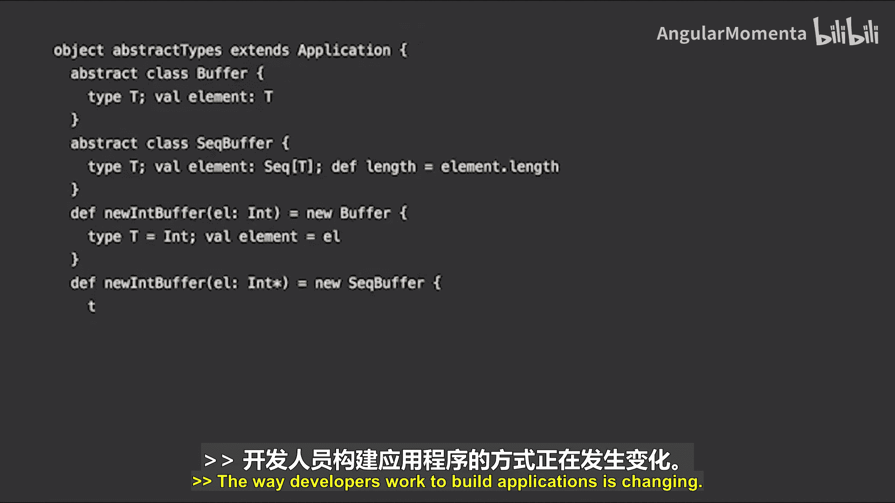
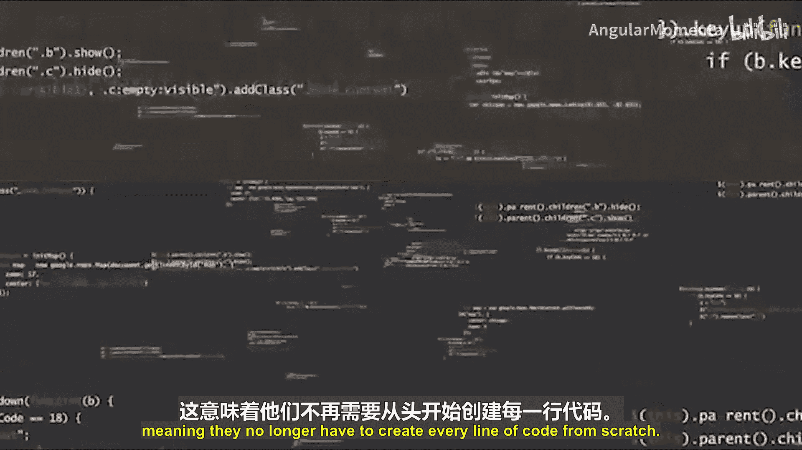
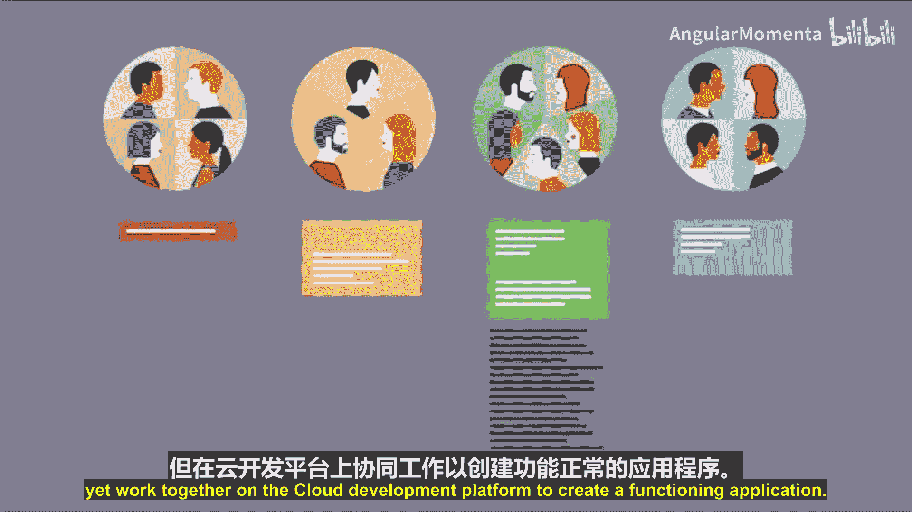
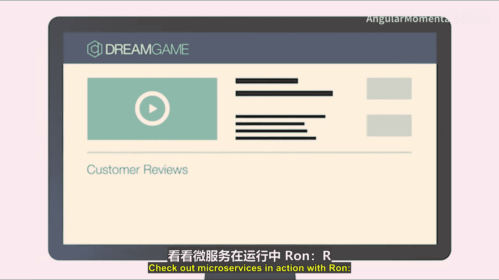
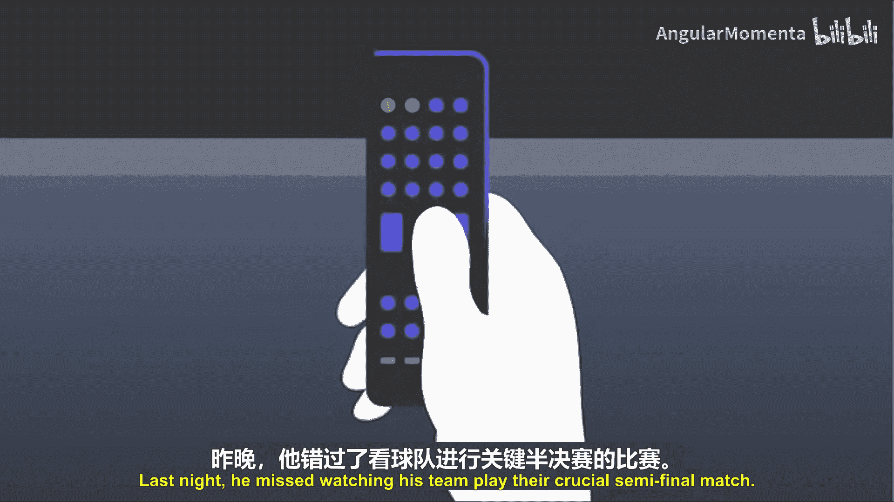
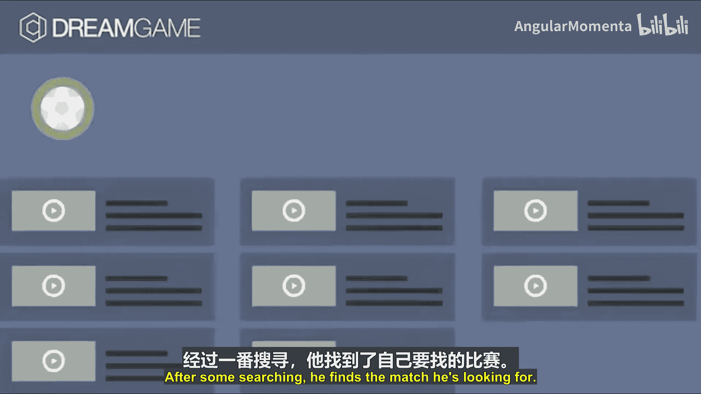
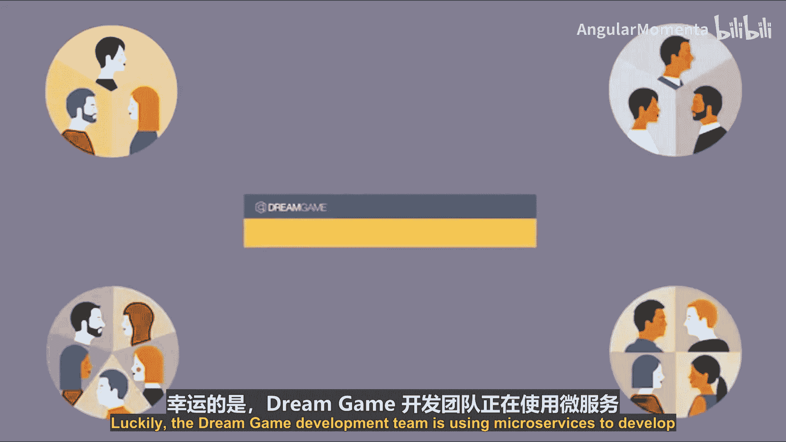
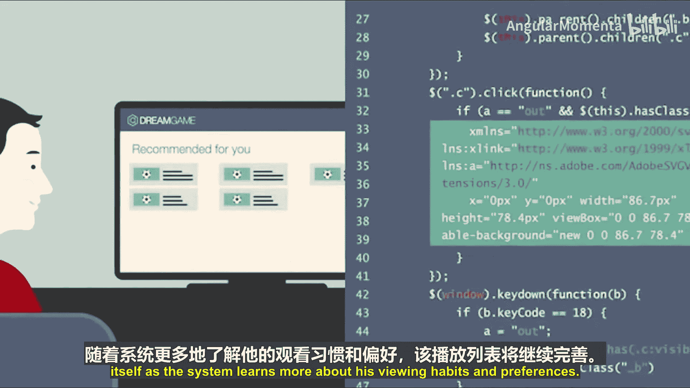
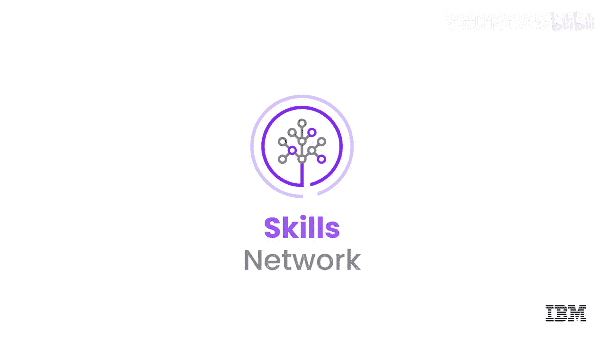

# 036：微服务架构 🏗️

在本节课中，我们将要学习微服务架构。这是一种将单个应用程序构建为许多松散耦合、可独立部署的小型服务的方法。我们将了解其核心概念、优势，并通过一个实际案例来理解其工作原理。

## 微服务架构概述

微服务架构是一种方法，在这种方法中，单个应用程序由许多松散耦合且可独立部署的较小组件或服务组成。这些服务通常拥有自己的技术栈，并在自己的容器中运行。它们通过**API**、**事件流**和**消息代理**的组合进行相互通信。

对于企业而言，这意味着应用程序组件可以由多个独立工作的开发人员更高效地开发和更新。团队可以为不同的组件使用不同的技术栈和运行时环境。面临过大负载的组件可以独立扩展，从而减少因必须扩展整个应用程序而产生的浪费和成本。

## 应用程序开发方式的演变

上一节我们介绍了微服务的基本概念，本节中我们来看看它是如何改变开发方式的。

过去，软件被构建为大型单体应用程序。一个开发团队需要花费数月时间，在一个公共代码库上构建一个大型应用程序。这些开发人员需要从头开始编写应用程序的每个部分。

如今，经过数十年的软件开发，已经存在大量现成的代码，开发人员可以将其用作应用程序的基础。这意味着他们不再需要从零开始编写每一行代码。

云开发平台为开发人员提供了一个代码生态系统，这些代码可以轻松、安全地集成到应用程序中。

现在，开发人员不再由一个团队构建一个庞大的应用程序，而是分成小型、独立的团队。他们编写被称为微服务的少量代码。

## 微服务的核心概念与容器

微服务将大型应用程序分解为其核心功能，例如**搜索**、**推荐**、**客户评分**或**产品目录**。每个功能都独立开发，但又在云开发平台上协同工作，共同构成一个功能完整的应用程序。

容器是每个微服务的分发方式，意味着它将代码运送到需要的地方。容器是即插即用的，因此，如果一个微服务对某个应用程序不起作用，开发人员可以将其取出并放入另一个，而不会破坏应用程序其余部分的功能。

## 微服务实战案例：Dream Game

为了更具体地理解微服务，让我们通过一个名为Dream Game的在线流媒体服务案例来观察其运作。

罗恩是一位足球迷，他使用一个名为Dream Game的在线流媒体服务。昨晚，他错过了观看自己球队关键的半决赛。幸运的是，他今晚可以在Dream Game上观看比赛。当他登录时，他看到的是所有Dream Game用户中最受欢迎的内容。经过一番搜索，他找到了他要找的比赛。但他真正希望的是能一键找到他的比赛。

幸运的是，Dream Game开发团队正在使用微服务为像罗恩这样的观众开发更好的用户体验。

以下是构成该应用的几个核心微服务：

*   **内容目录微服务**：容纳Dream Game提供的数百万场比赛。
*   **搜索功能微服务**：开发人员团队使用元数据描述每一块内容。这些元数据输入到第二个微服务——搜索功能中，确保罗恩的搜索结果被捕获并与Dream Game目录进行比较。
*   **推荐微服务**：捕获所有Dream Game用户中最受欢迎内容的数据。这就是生成罗恩首次登录时看到的主页的原因。

这三个微服务都位于各自独立的容器中，准备加入应用程序。但在它们协同工作之前，它们需要找到彼此。它们通过一种称为**服务发现**的机制来实现这一点，该机制为这些以及许多其他微服务创建了相互通信的路线图。

当微服务找到彼此时，它们使用**应用程序编程接口（API）**进行通信。因此，当罗恩搜索他最喜欢的足球队时，搜索微服务会通过API与内容目录微服务通信，告知罗恩正在寻找什么。

现在回到手头的目标：让罗恩一键找到他的足球比赛。负责推荐微服务的开发团队正在更新代码，添加一个**分析算法**。

利用分析技术，推荐微服务会将罗恩的观看历史和偏好与其他用户（包括足球迷以及罗恩所在地区和人口统计特征的观众）中的热门内容进行比较。由于开发人员不需要从头开始创建代码，他们能够在几天内部署这项新功能。

这些更新在后台进行，而其他微服务容器则正常运行。下次罗恩查看Dream Game时，他将不再仅仅看到最受欢迎或最新的内容，而是会看到一个个性化的播放列表。随着系统更多地了解他的观看习惯和偏好，这个列表会不断自我完善。

结果是：罗恩立刻找到了他最喜欢的球队的最新比赛。

## 总结

本节课中我们一起学习了微服务架构。微服务方法使开发人员能够并行地快速创新应用程序，并让像罗恩这样的用户专注于他们真正感兴趣的事情。在用户兴趣日新月异的今天，微服务帮助企业跟上客户步伐并与客户共同成长。