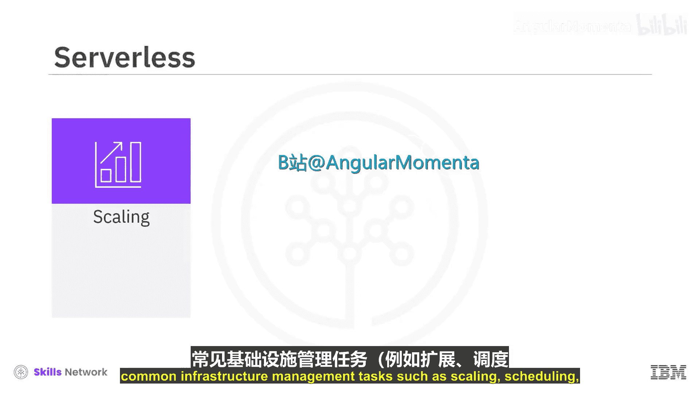
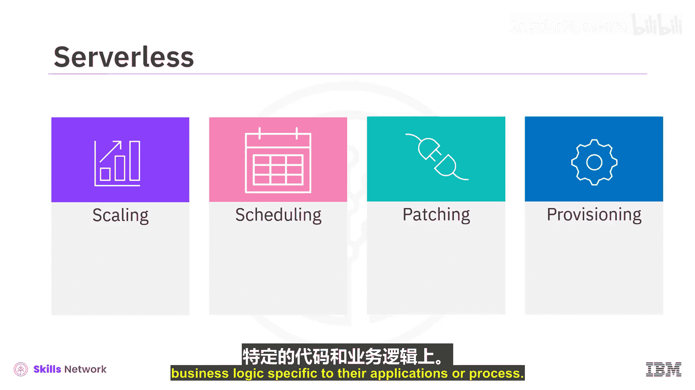
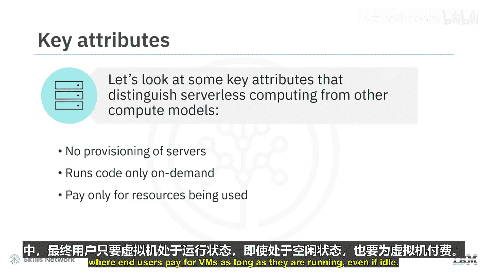
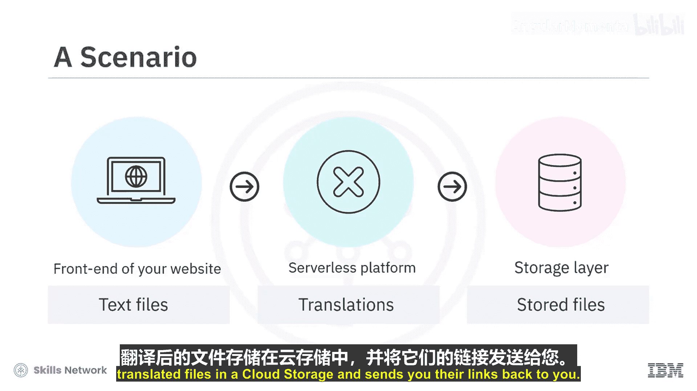
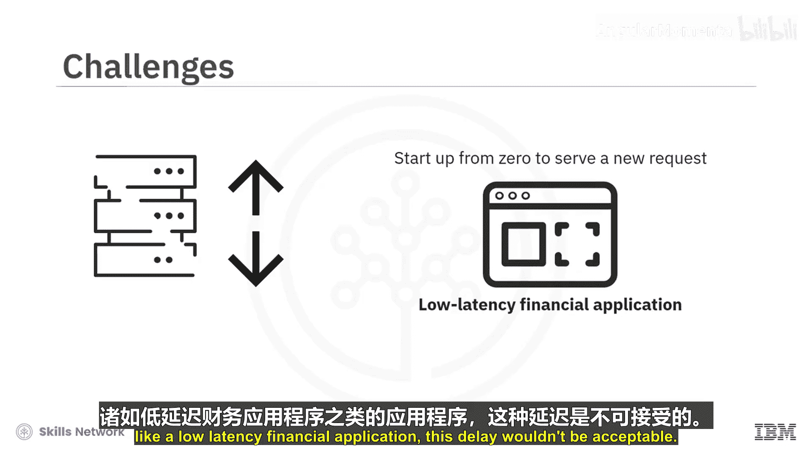

# 037：无服务器计算

在本节课中，我们将要学习无服务器计算的核心概念、关键特性、适用场景以及需要考虑的挑战。这是一种让开发者专注于业务逻辑，而无需管理底层基础设施的云计算模式。

## 概述





无服务器计算是一种将常见基础设施管理任务（如扩展、调度、打补丁和配置应用堆栈）卸载给云提供商的计算方法。这使得开发者能够将时间和精力集中在与其应用程序或流程相关的代码和业务逻辑上。

## 无服务器计算的核心特性

上一节我们介绍了无服务器的基本概念，本节中我们来看看它区别于其他计算模型的关键属性。

以下是区分无服务器计算的关键特性列表：



*   **无需管理基础设施**：开发者无需预置服务器、安装应用堆栈和软件，也无需运维基础设施。
*   **按需执行与自动扩展**：无服务器计算仅在每次请求时按需运行代码，并随着服务的请求数量透明地扩展。其核心模式是：`函数执行次数 ∝ 请求数量`。
*   **按使用付费**：用户仅为实际使用的资源付费，无需为闲置容量付费。这与云上的虚拟机不同，虚拟机只要在运行（即使闲置）就会持续计费。

## 无服务器的工作原理

理解了关键特性后，我们来深入探讨其工作原理。本质上，无服务器对开发者抽象了基础设施。代码以独立的函数形式执行，每个函数在一个无状态的容器中运行。服务请求不需要先前的执行上下文，每个新请求都会触发一个新的函数实例。

让我们看一个场景示例。例如，你可以在网站前端和存储层之间部署一个无服务器平台来运行独立函数。其工作流程可以用以下伪代码描述：

```
# 伪代码示例：一个翻译函数
def translate_and_store(file, target_language):
    translated_content = translate(file.content, target_language)
    storage_link = upload_to_cloud_storage(translated_content)
    return storage_link
```

具体过程是：用户通过网站前端上传文本文件到无服务器应用。该应用创建不同语言的翻译版本，然后将这些翻译后的文件存储在云存储中，并将链接返回给用户。



目前主流的无服务器计算服务包括基于 Apache OpenWhisk 的 **IBM Cloud Functions**、**AWS Lambda** 和 **Microsoft Azure Functions**。

## 无服务器计算的适用场景

值得注意的是，无服务器并非适用于所有应用或场景。你需要评估应用特性，确保其符合无服务器架构模式。

以下是适合采用无服务器架构的应用通常具备的一些特征：

*   **短期运行的无状态函数**：执行时间在秒或分钟级别。
*   **季节性工作负载**：具有波动的非高峰和高峰时段。
*   **存在大量闲置时间的应用**：生产量数据表明存在过多空闲时间。
*   **基于事件的处理或异步请求处理**：用于实现特定用例。
*   **可构建为无状态函数的微服务**。

无服务器架构非常适合于数据处理、事件处理、物联网（IoT）、微服务和移动后端等用例。鉴于其固有的自动扩展、快速部署以及不为闲置时间付费的定价模式，支持微服务架构已成为当今无服务器计算最常见的用例之一。

无服务器同样非常适合处理结构化文本、音频、图像和视频数据，用于完成诸如数据丰富化、转换、验证和清洗、PDF处理、音频标准化、缩略图生成和视频转码等任务。并行任务，如数据搜索、处理以及基因组处理，也非常适合在无服务器运行时上执行。

此外，无服务器也适用于处理各种数据流摄入，包括业务数据流、物联网传感器数据、日志数据和金融市场数据。

## 无服务器计算的挑战

最后，让我们看看无服务器计算中一些值得考虑的挑战。

*   **不适用于长时间运行进程**：无服务器工作负载设计为随工作负载扩展和收缩，但对于以长时间运行进程为特征的工作负载，管理传统的服务器环境可能更简单且更具成本效益。
*   **潜在的供应商锁定**：无服务器应用架构可能依赖于特定供应商，因此存在供应商锁定的风险，特别是在涉及身份验证、扩展、监控或配置管理等平台能力时。
*   **冷启动延迟**：由于无服务器架构会响应工作负载进行伸缩，有时为了服务新请求需要从零开始启动（即“冷启动”）。对于某些应用，这种延迟影响不大，但对于像低延迟金融应用这样的场景，这种延迟是不可接受的。

## 总结



本节课中我们一起学习了无服务器计算。它是一种由云提供商完全管理基础设施，开发者只需按需编写和部署函数代码的模型。我们探讨了其按需执行、自动扩展和按使用付费的核心优势，也分析了它在长时间运行任务、供应商锁定和冷启动延迟方面存在的挑战。理解这些特性和限制，有助于你判断何时采用无服务器架构是最佳选择。