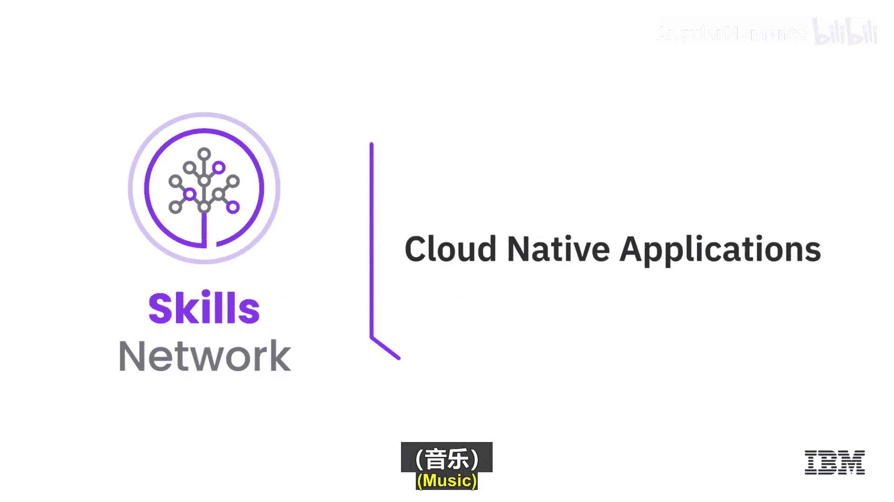
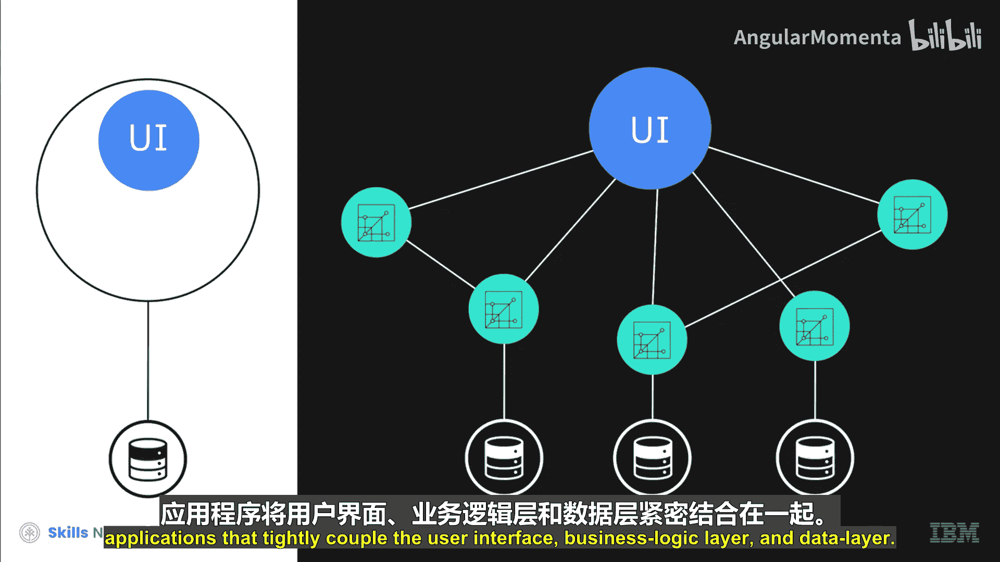
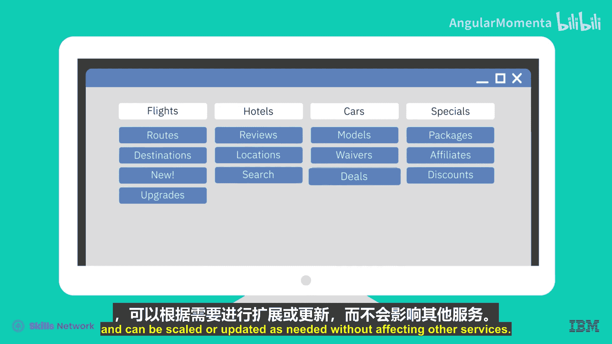
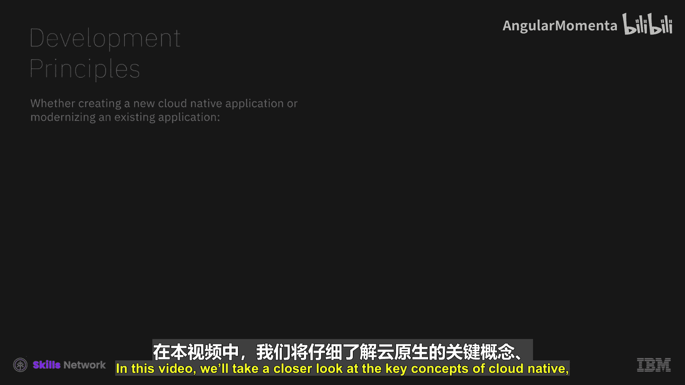
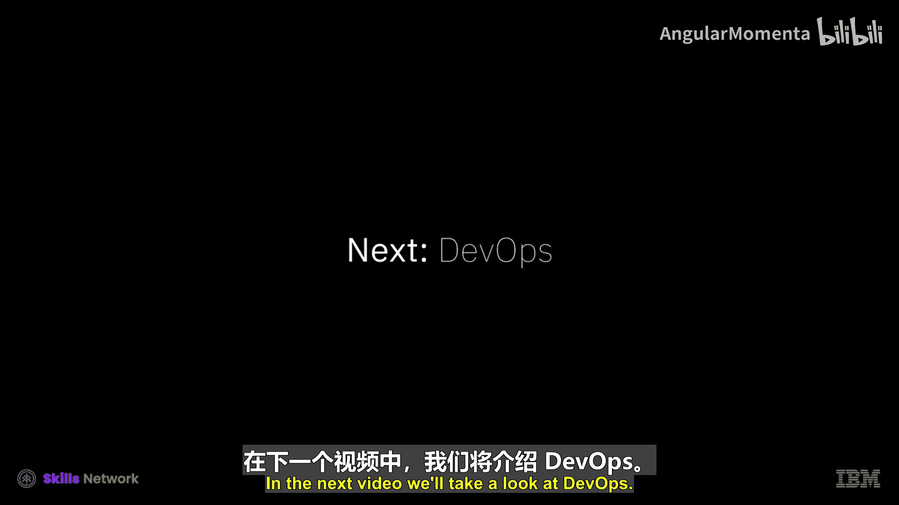
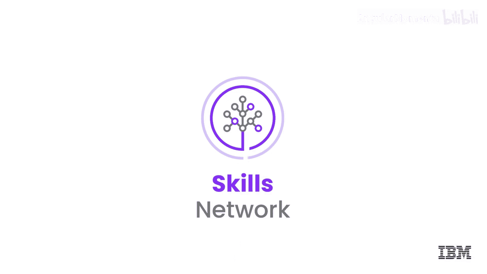

# 038：云原生应用

在本节课中，我们将要学习什么是云原生应用，了解其核心架构、开发原则以及它相较于传统单体应用的优势。

简单来说，云原生应用是指从一开始就设计为仅在云环境中运行的应用，或者是根据云原生原则进行重构和重新配置的现有应用。

一个云原生应用由多个微服务组成，这些微服务作为一个整体共同构成一个应用。然而，每个微服务都可以通过自动化和编排流程进行独立的扩展和迭代。

这些微服务通常被打包在容器中。容器是软件的可执行单元，它将应用程序代码与其库和依赖项打包在一起，从而可以在任何地方运行。这种独立性使得云原生应用能够在不影响最终用户体验的情况下，进行频繁的迭代改进。

云原生应用不同于传统的单体应用，后者是由一个庞大的软件块构建而成。单体应用将用户界面、业务逻辑层和数据层紧密耦合在一起。

## 云原生应用示例 🧳

上一节我们介绍了云原生应用的基本概念，本节中我们通过一个具体例子来看看它的运作方式。

以一个旅游网站为例，说明云原生应用如何被使用。网站涵盖的每个主题，如航班、酒店、租车、特惠，都是一个独立的微服务。

以下是其运作特点：
*   每个微服务可以独立于其他微服务推出新功能。
*   特惠和折扣也可以独立扩展。
*   虽然旅游网站作为一个整体呈现给客户，但每个微服务保持独立，可以根据需要单独进行扩展或更新，而不影响其他服务。

## 云原生开发原则 ⚙️

了解了云原生应用的结构和优势后，我们来看看构建它们时需要遵循哪些核心原则。

无论是创建新的云原生应用还是对现有应用进行现代化改造，开发者都需要遵循一套一致的开发原则。

以下是关键的开发原则：
*   **遵循微服务架构方法**：将应用程序分解为单一功能的微服务。
*   **依赖容器**：以获得最大的灵活性、可扩展性和可移植性。
*   **采用敏捷方法**：通过基于用户反馈的快速迭代更新，加速创建和改进流程。

## 深入探讨：架构、优势与用例 🏗️

在本节中，我们将更深入地探讨云原生应用的关键概念、优势以及适用场景。

在传统世界中，我们拥有庞大笨重的单体应用。而在新世界中，我们的微服务运行在云上。观察架构图，我们可以看到：
1.  **云基础设施层**：包括私有云、公有云和企业基础设施。云原生应用适用于混合云和多云场景。
2.  **调度与编排层**：这一层关乎控制平面，例如 Kubernetes。
3.  **应用与数据服务层**：这一层关乎支撑服务，能够将我们的应用代码与其他云上甚至本地的现有服务集成。
4.  **应用运行时层**：这通常是传统意义上的中间件。
5.  **云原生应用层**：这是核心所在。我们的应用代码在设计和交付方式上，与传统的单体应用截然不同。

那么，为什么云原生应用能够带来好处呢？它能够实现创新、提升业务敏捷性，并且从技术角度看，最重要的是实现了解决方案栈的商品化。

随着时间推移和技术成熟，许多服务实际上被重构到了这个栈的更底层。这意味着核心服务的重心开始降低，从而释放了顶层的创新空间。

何时应该构建云原生应用？答案是：所有在云上运行的应用都应该采用云原生应用的设计。这意味着我们的应用代码需要配备标准化的日志记录、标准化的事件，并且能够将这些日志和事件与一个标准目录匹配，以供多个微服务和云原生应用使用。我们最不希望看到开发团队各自决定日志和事件消息的格式，我们需要将其标准化和商品化。

我们还需要分布式追踪等功能。在微服务世界中，有许多移动部件，这意味着我们需要利用系统核心服务，如负载均衡、服务发现和路由。这些正是通过 Istio 等项目在这一层实现商品化的东西。随着 K native 等新项目的出现，这一趋势更加明显。

总而言之，云原生应用的核心优势在于实现企业级的大规模工程化。

本节课中我们一起学习了云原生应用的定义、其基于微服务和容器的架构、核心开发原则，以及它通过解耦和标准化实现敏捷性、可扩展性和创新能力的核心优势。在接下来的视频中，我们将了解 DevOps。