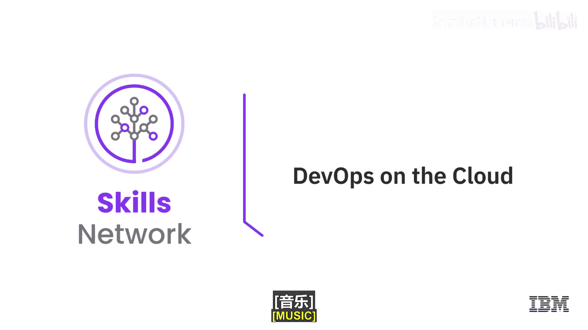
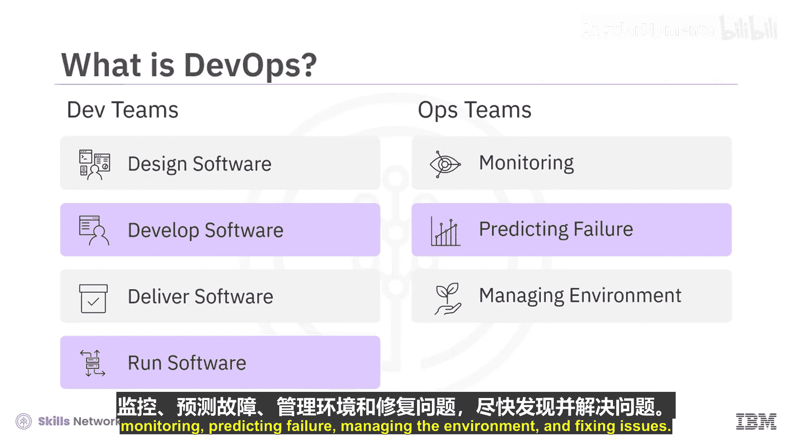
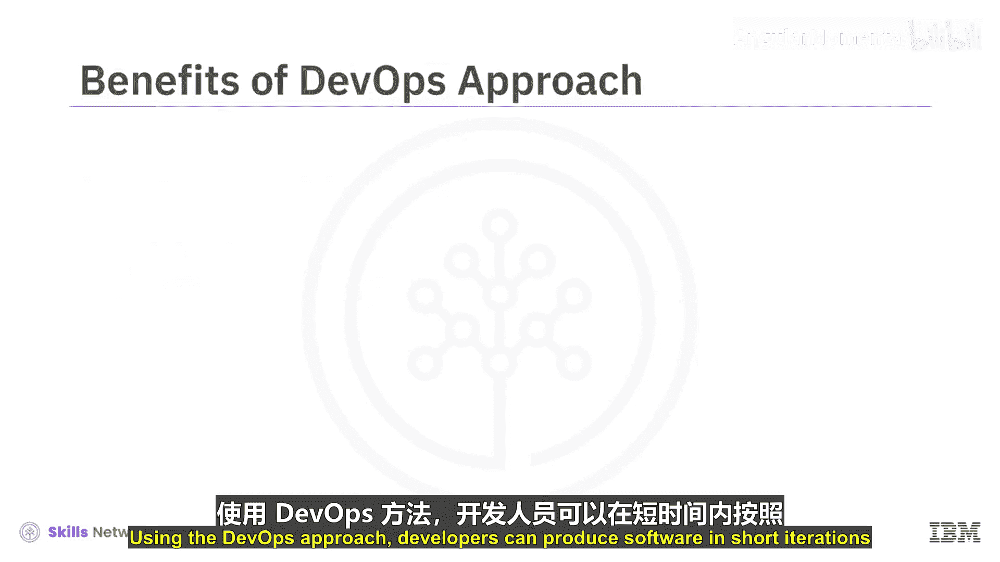
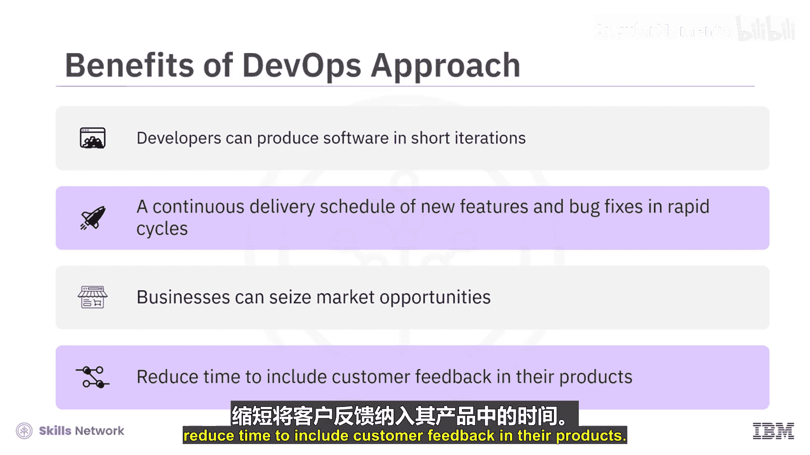
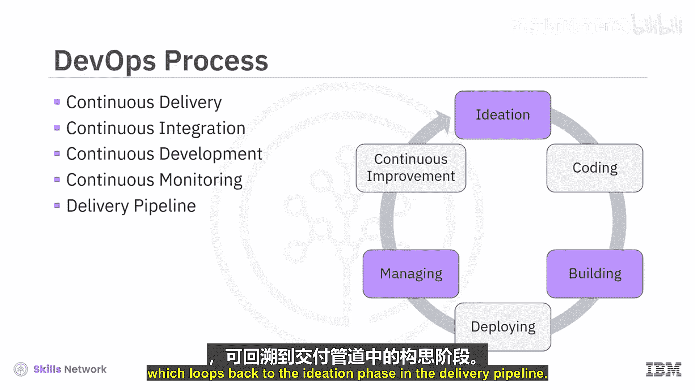
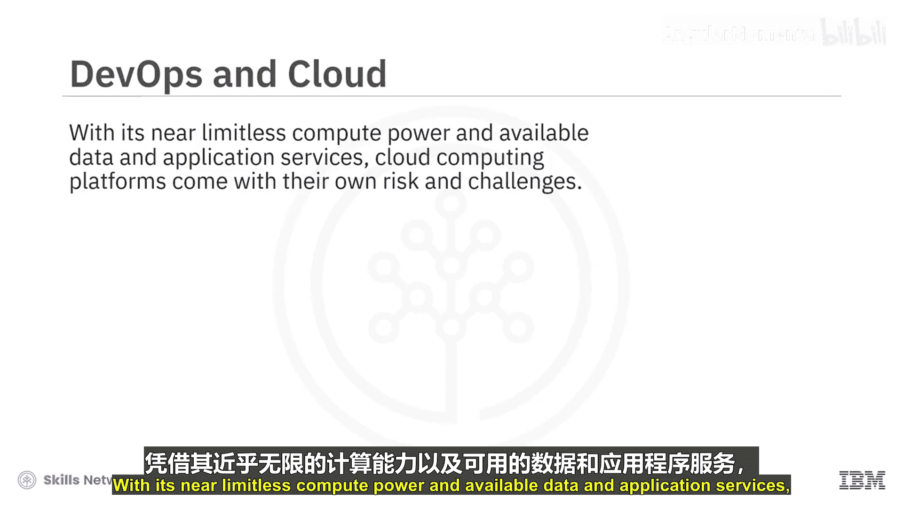
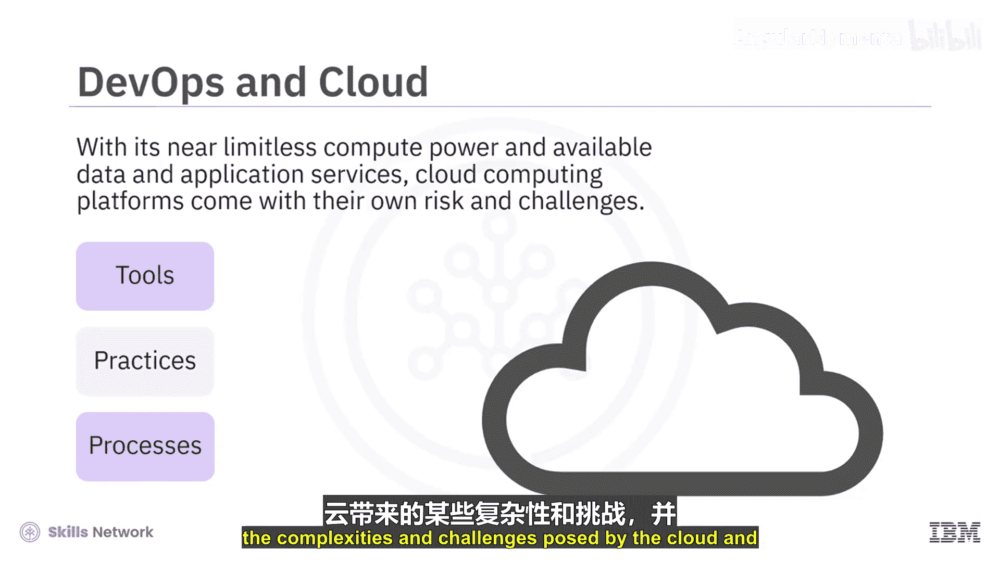
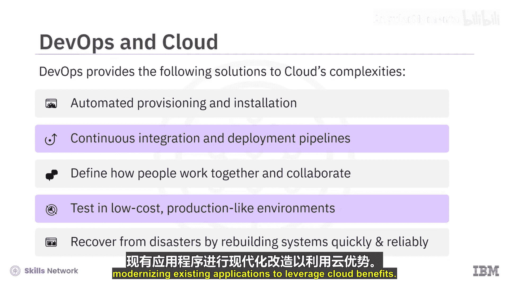

# 039：云端开发运维 🚀

在本节课中，我们将要学习开发运维（DevOps）的核心概念，了解它如何通过整合开发与运营团队、应用自动化流程来提升软件交付的效率与可靠性，特别是在云计算环境中。

---

## 什么是DevOps？🤝

开发团队需要尽可能可靠、高效地设计、开发和交付软件。运营团队则需要通过监控、预测故障、管理环境和修复问题来尽快识别并解决问题。将开发与运营相结合，并赋予监控、分析和优化瓶颈的能力，就形成了DevOps。这是一种协作方法，业务所有者、开发、运营和质量保证团队共同协作，以持续交付软件。

DevOps方法将敏捷和精益思维原则应用于组织中所有开发、运营或受益于业务软件系统的利益相关者，包括客户、供应商和合作伙伴。通过将精益原则扩展到软件供应链，DevOps能力通过加速客户反馈周期、统一企业内的度量和协作，以及减少开销、重复工作和返工来提高生产力。

---

## DevOps的核心流程与实践 🔄

上一节我们介绍了DevOps的基本理念，本节中我们来看看其核心的流程与实践。采用DevOps方法，开发者可以在快速迭代中持续交付新功能和错误修复，企业也能抓住市场机遇，并缩短将客户反馈纳入产品的时间。

以下是DevOps流程涉及的关键实践：

*   **持续交付**：向客户交付经过精心设计、高质量的软件小增量。
*   **持续集成**：创建代码变更的打包构建，并以**不可变镜像**的形式发布。这里的“不可变”意味着当需要修改时，整个组件会被升级版本完全替换。
*   **持续部署**：让每个新的打包构建尽可能快地通过部署生命周期。
*   **持续监控**：使用工具帮助开发者了解其应用程序的性能和可用性，甚至在它们部署到生产环境之前。
*   **交付流水线**：一个自动化的步骤序列，涉及构思、编码、构建、部署、管理和持续改进等阶段，其中持续改进阶段会循环回到构思阶段。

---

## DevOps与云计算的结合 ☁️

虽然DevOps可以应用于任何地方的应用程序，但当涉及到云就绪和云原生应用时，DevOps尤其具有强大的说服力。云计算平台拥有近乎无限的计算能力和可用的数据及应用服务，但也带来了自身的风险与挑战。DevOps的工具、实践和流程正帮助应对云带来的一些复杂性和挑战，使解决方案能够快速、可靠地交付。

让我们看看DevOps提供的一些核心能力，它们使得在云中构建和运行应用程序变得更加易于管理。

以下是DevOps在云环境中的关键能力：

*   **自动化与可重复性**：DevOps最佳实践使得以编程方式配置服务器、构建中间件、安装应用程序代码并完全自动化安装过程成为可能，这种方式是**有文档记录的、可重复的、可验证的和可追溯的**。
*   **简化复杂部署**：应用程序部署通常涉及相当大的复杂性。持续集成和持续部署的DevOps实践有助于创建完全自动化的部署流水线，这在应用程序开发生命周期中至关重要。
*   **管理云原生系统**：云原生应用构成了一个复杂的分布式系统，包含多个移动部件、独立的技术栈和快速的发布周期。DevOps原则对于定义人们如何以云原生方式协作构建、部署和管理应用程序至关重要。
*   **低成本环境复制**：借助自动化配置和持续部署的DevOps最佳实践，开发者、质量保证人员和其他利益相关者可以低成本地创建类似生产环境的测试环境，这在以前是无法实现的，从而同时提高了生产力和质量。
*   **快速可靠的系统恢复**：当系统遭到破坏或难以从自然灾害中恢复时，DevOps最佳实践使得能够快速、可靠地重建这些系统。

---

## 总结 📝

本节课中我们一起学习了DevOps如何作为一种协作文化和方法论，通过整合开发与运营、实施自动化流程（如持续集成、持续交付和持续部署）来加速软件交付并提高可靠性。我们特别探讨了DevOps在云计算环境中的关键作用，它提供了一套强大的原则、实践和工具，既能充分发挥云原生计算的潜力，也能帮助现代化现有应用程序以利用云的优势。