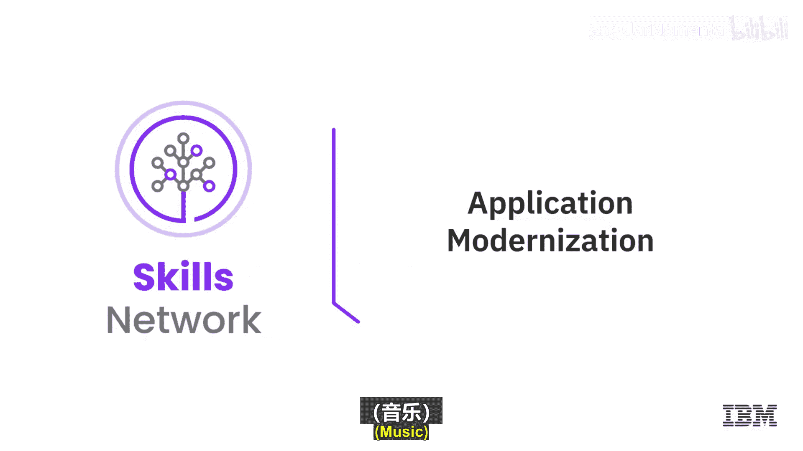
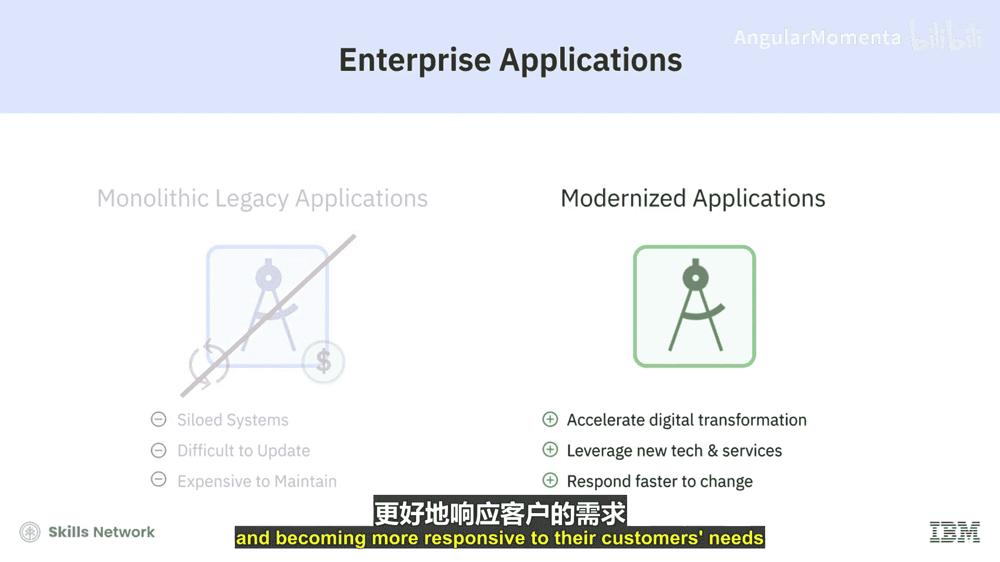
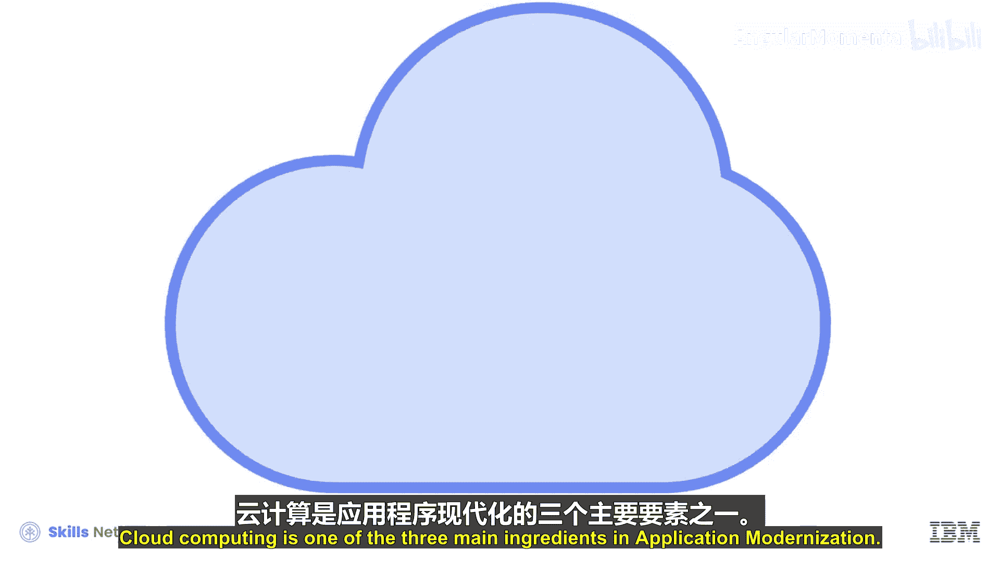
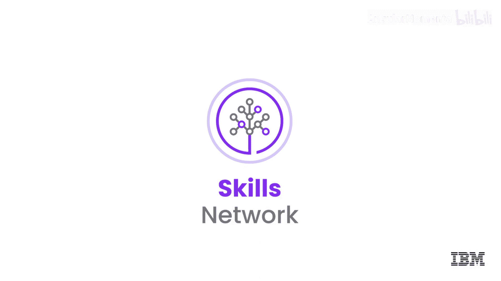

# 040：应用现代化 🚀

在本节课中，我们将要学习应用现代化的核心概念。许多组织在现有的、通常孤立于遗留系统中的应用程序上投入巨大，这些程序更新和维护起来既困难又昂贵。对这些应用进行现代化改造，可以为组织带来巨大收益，例如加速其数字化转型、利用新技术和服务，以及更快速地响应客户需求和市场变化。

云计算是应用现代化的三大核心要素之一。在本节视频的其余部分，我们将探讨应用现代化还包含哪些内容以及如何实现。

---

## 应用现代化的三大并行转型 🔄

上一节我们介绍了应用现代化的必要性，本节中我们来看看驱动现代化的三大关键转型。我是IBM云的Eric Minnick，我想谈谈应用现代化以及正在同时发生的三大转型。这三件事相互关联，它们共同改变了我们的架构、基础设施和工作方式。

如果我们回顾过去，会看到应用程序通常是**单体式**的。它们运行在物理服务器上，开发采用**瀑布模型**，即拥有漫长的规划、开发、测试阶段，一个项目可以规划一整年。这正是我们今天正在摒弃的模式。

现在，大多数组织的工作方式如下：
*   **架构层面**：采用某种分布式架构，例如几年前流行的面向服务架构。它由一系列相互通信的Web服务、后端数据库和前端界面组成。
*   **基础设施层面**：运行在某种**虚拟机**上。我们意识到，与其每次有新服务都要订购新服务器，不如将资源虚拟化以提高密度。
*   **工作方式层面**：采用**敏捷开发**，并尝试优化后续流程。

这大致是许多团队当前的状况，但并非他们的最终目标。

---

## 迈向未来的现代化路径 🛣️

接下来，我们看看迈向未来的阶段。我们正在对面向服务架构进行进一步改造，充分利用更动态的基础设施，将服务规模缩得更小，这就是**微服务**。

以下是现代化转型的具体方向：
*   **架构转型**：转向**微服务架构**。服务变得非常小且专注，从SOA中基于XML的繁重通信转向更多基于REST的通信。核心思想是将应用拆分成越来越小的独立部分，每个服务可以独立部署和变更。
*   **基础设施转型**：采用**云**。这里的“云”是一个广义概念，包括公有云和私有云。它提供了可编程、动态伸缩的基础设施。
*   **工作方式转型**：拥抱**DevOps**及相关实践，如站点可靠性工程。这强调开发与运维的协作，以实现快速交付和系统韧性。

你可能会认为这是三个独立的转型，但实际上它们紧密相连。例如：
*   **微服务需要云**：如果每次发布新微服务都需要订购、上架物理服务器，将无法获得微服务应有的上市时间优势和弹性优势。微服务期望能立即放入**容器**并动态运行和伸缩。
*   **云青睐微服务**：动态伸缩的优势在拥有众多可独立伸缩的小型服务时才能充分发挥。对于一个无法分布式的单体应用，云的优势就不那么明显。
*   **DevOps将其融合**：开发人员追求速度，运维人员追求韧性。DevOps将两者结合。运维人员需要理解韧性，同时掌握开发技能来“编程”云基础设施。要充分利用新架构和基础设施，就必须采用新的工作方式，告别长达一年的项目计划，转向更敏捷、更能响应业务需求的方式。

因此，虽然许多组织同时进行这三项转型，但它们本质上是同一场变革的不同侧面。当它们不同步时，效果就会大打折扣。

---

## 总结 📝

本节课中我们一起学习了应用现代化的核心。应用现代化正是这场集大成的转型：从单体或面向服务架构转向**微服务架构**，采用**云**基础设施，并将工作方式现代化为**DevOps和SRE**。这是一个激动人心的时代，以整体、协同的方式推进这些转型至关重要。