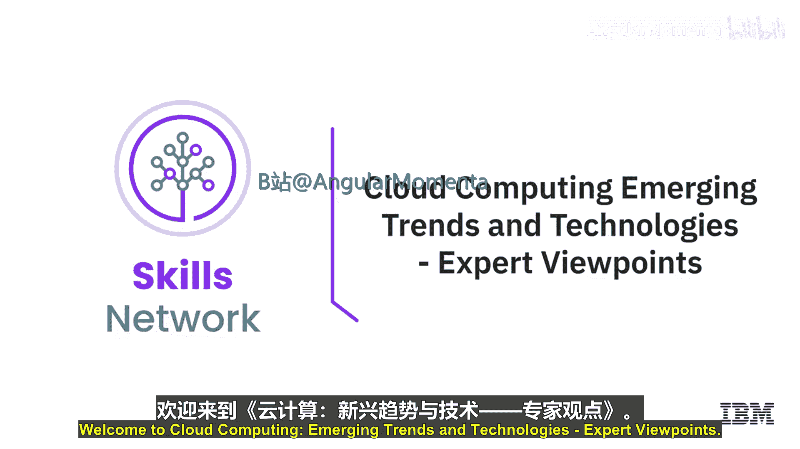
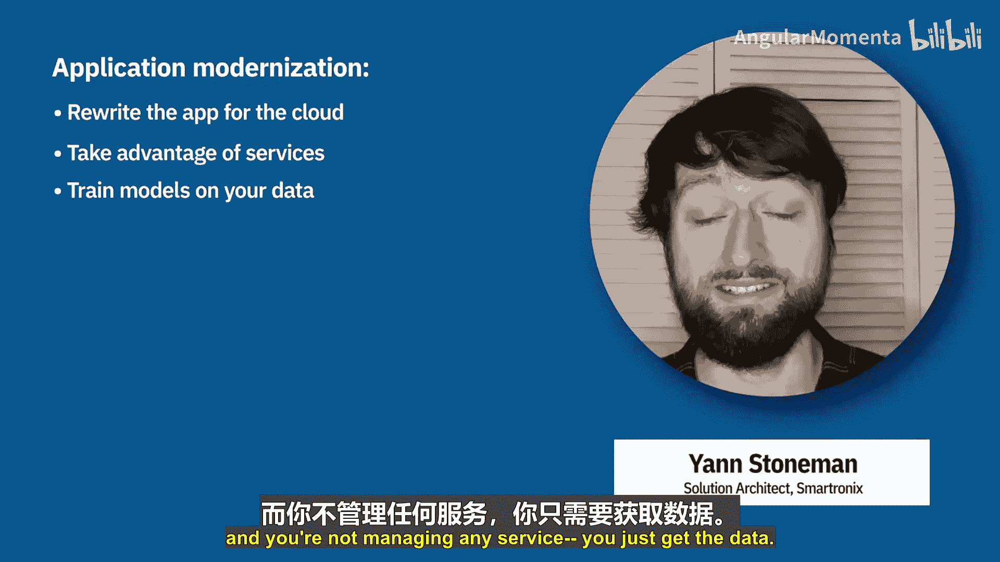
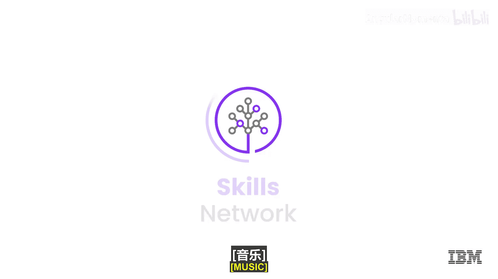

# 041：云原生与新兴云趋势 🌟

在本节中，我们将聆听几位云计算领域专家的见解，了解他们眼中未来几年云计算的主要发展趋势与技术。专家们将重点讨论混合云、边缘计算、人工智能、无服务器计算、云原生架构、DevOps、数据与AI服务、网络安全以及应用现代化等关键主题。

## 混合云、边缘计算与人工智能 🤖

上一节我们介绍了云计算的基本模型，本节中我们来看看专家们预测的几大宏观趋势。

第一位专家指出了未来几年的三大趋势：

1.  **混合云**：正如IBM所预测，许多企业和客户将从单一云提供商转向多个云提供商。这可能是多个公有云，或是公有云与本地私有云的组合。
2.  **边缘计算**：边缘计算在云计算领域正变得日益重要。虽然“云”与“边缘”听起来不同甚至有些脱节，但在很大程度上，云计算将向边缘延伸。数据显示，到2025年预计将有750亿台设备联网，因此设备之间以及设备与服务器之间的通信将变得至关重要。
3.  **人工智能与机器学习**：在云计算领域，利用机器学习和人工智能为我们做出决策的应用将越来越广泛。

## 无服务器计算 ⚡

接下来，我们探讨一个具体的技术趋势：无服务器计算。

无服务器计算是云计算的一个领域，开发者只需向云平台提供应用逻辑代码。这意味着：
*   你无需为任何服务器打补丁。
*   你无需管理基础设施的高可用性。
*   你无需配置多个可用区。

云服务提供商会为你处理所有这些运维问题。你只需提供代码，它就会按需运行。例如，每次与语音助手对话触发一个事件时，它就会触发一个云函数。这就是无服务器计算。开发者喜爱它，因为它消除了大量“无差别”的工作（即那些不能使你的应用独特的工作），从而可以专注于让应用独特的业务逻辑。

## 云原生架构 🏗️

在云原生与新兴技术方面，专家提到了云原生架构。

云原生架构包含以下关键趋势与技术：
*   **微服务**：将传统的单体应用程序拆分为细粒度的微服务，这带来了诸多优势。
*   **容器与容器编排**：最著名的是Docker和Kubernetes技术。
*   **无服务器服务**：可以极低延迟启动某些功能代码，而无需管理任何虚拟服务器。

“云原生架构”这一术语通常涵盖了这些技术的某种组合。

## DevOps与开发流程 🔄

另一个重要的新兴趋势是DevOps。

在DevOps模式下，开发人员与运维团队的结合更加紧密。通过CI/CD（持续集成/持续部署）流水线，开发人员可以推送自己的代码并看到它在服务器或无服务器函数上实时运行。DevOps的定义有很多，其中一个有趣的定义是：它意味着开发人员与运维人员在进行对话，而不仅仅是像过去那样，开发人员交付出代码就结束。现在，开发人员会关注代码在生产环境中被维护的完整生命周期。

## 数据、AI与网络安全 🔐

云计算服务也在数据、人工智能和网络安全领域快速发展。

我们看到云服务商提供了全面的服务来构建数据管道、进行数据科学和人工智能应用。具体包括：
*   用于从零开始构建AI解决方案的低层级AI服务。
*   用于图像识别、语音应用等场景的、经过预训练的高层级AI解决方案。

网络安全是另一个不断进步的领域。我们必须时刻保持警惕并持续改进。云服务商正在不断推出改进措施，以保护你在云中的网络边界、计算资源和数据安全。

## 应用现代化 🚀

最后一个关键趋势是应用现代化。

随着云提供商推出各种强大的服务，企业开始思考：云提供商在某些应用功能上做得比我们自己更好。与其继续自行维护应用的这些部分，不如重写应用程序以利用这些云原生服务。

例如，现在已有提供转录或图像识别功能的云服务。与其自己管理推理和训练服务器、使用开源机器学习模型并自行训练，不如直接将图像放入云提供商的图像识别服务中。这样，你无需管理任何服务，就能直接获得结果。

---

本节课中，我们一起学习了云计算专家眼中的核心趋势：从宏观的**混合云**、**边缘计算**和**AI集成**，到具体的技术实践如**无服务器计算**、基于**微服务**和**容器**的**云原生架构**，再到提升效率的**DevOps**文化，以及强大的**数据/AI服务**、持续演进的**网络安全**和推动业务转型的**应用现代化**。这些趋势共同描绘了云计算灵活、智能和以开发者为中心的未来发展方向。