# 042：什么是云安全 - 第一部分 🔐

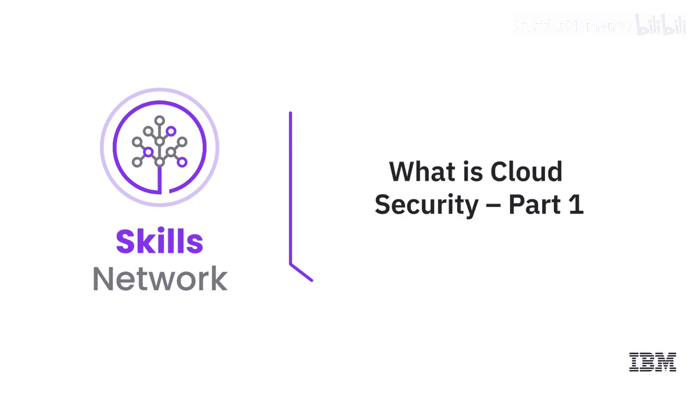

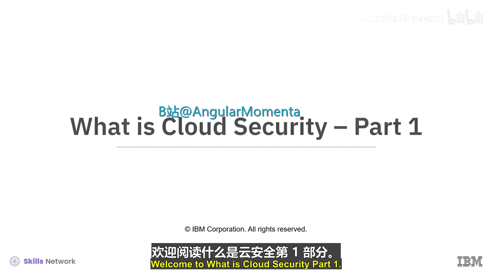

在本节课中，我们将要学习云安全的基础概念。随着企业向数字化转型并采用云计算技术，理解如何安全地使用云环境变得至关重要。我们将探讨云安全的重要性、面临的挑战、主要威胁以及核心的安全责任模型。

---

## 向云环境的过渡与安全需求

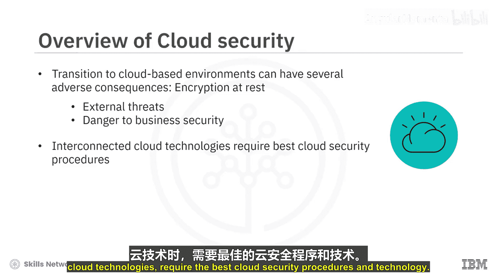

如今，许多组织正通过引入云计算技术迈向数字化转型。它们正在改变自身的基础设施，并整合基于云的工具与技术。

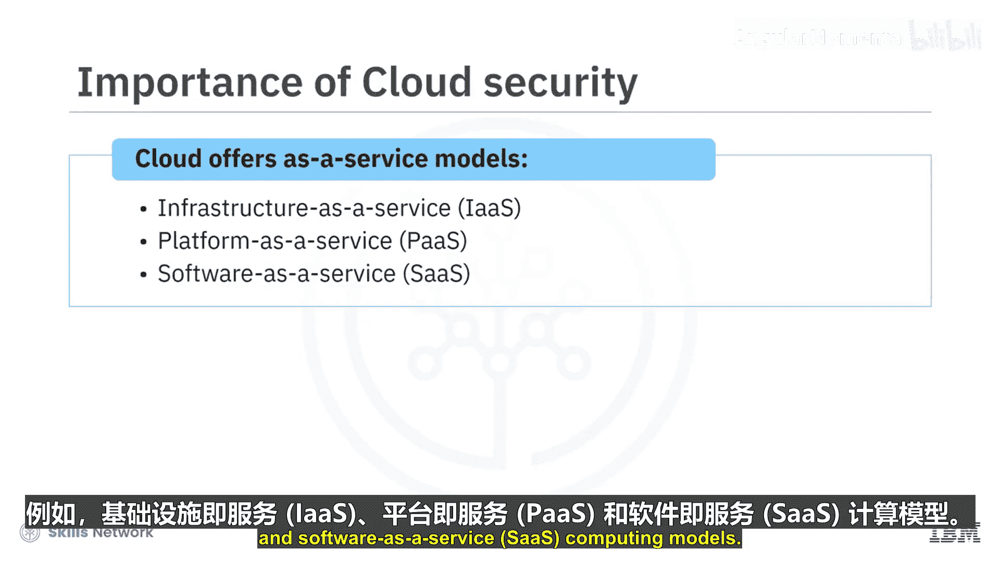

然而，向基于云的环境过渡可能带来一些不利后果。如果未能安全地使用基于云的技术，组织可能面临外部威胁，从而危及其业务安全。因此，为了在使用互联的云技术时获得最大收益，企业需要在技术上采用最佳的云安全流程。

---

## 云服务模型与安全挑战

云计算环境提供了不同的“即服务”模型，使组织能够卸载许多耗时的IT相关任务。例如：**基础设施即服务 (IaaS)**、**平台即服务 (PaaS)** 和 **软件即服务 (SaaS)**。

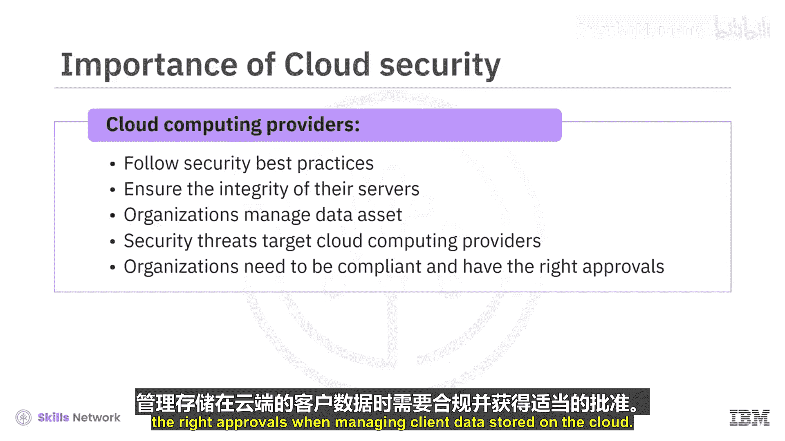

然而，在使用这些服务时，组织可能会遇到许多与数据安全相关的挑战。尽管第三方云计算提供商遵循安全最佳实践并确保其服务器的完整性，但数据资产管理仍然是使用这些服务的组织的责任。

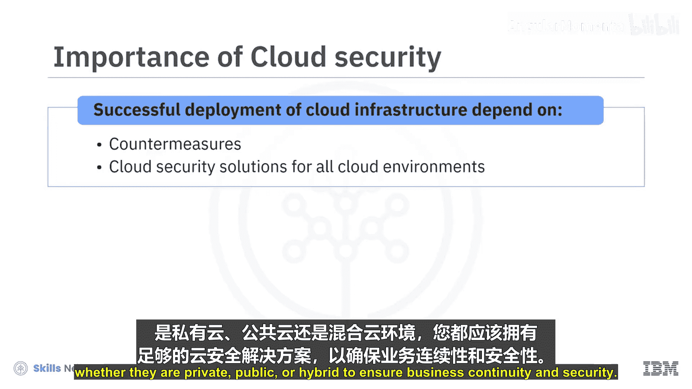

随着云计算环境的发展，安全威胁也变得更加先进。这些威胁之所以针对云计算提供商，是因为数据在云中的流动和访问缺乏透明度。因此，组织在管理存储在云上的客户数据时，需要合规并拥有适当的授权。云基础设施的成功部署，取决于能否采取有效措施来抵御现代网络攻击。

您应该在所有云环境（无论是私有云、公有云还是混合云）中部署足够的云安全解决方案，以确保业务的连续性和安全性。

---

## 选择云安全解决方案的考量因素

识别合适的云安全解决方案需要考虑多种因素。以下是主要的考量点：

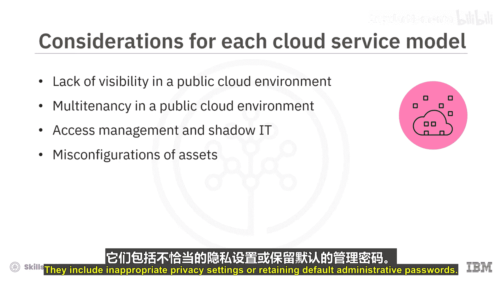

*   **公有云环境中的可见性不足**：在公有云环境中，很难跟踪组织外部谁在访问您的数据以及他们正在使用哪些云服务。
*   **公有云环境中的多租户问题**：多个客户的基础设施可能由同一个云计算提供商托管。当恶意攻击者针对其他企业时，您的服务可能会受到牵连。
*   **访问管理与影子IT**：在云环境中，您可能会发现很难限制来自任何设备和地理位置的、未经筛选的对您服务的访问。
*   **资产配置错误**：资产配置不当也是云环境中记录泄露的原因之一。这包括不恰当的隐私设置或保留默认的管理员密码。

---

## 云计算中的新兴威胁与风险

上一节我们介绍了选择方案时的考量，本节中我们来看看云计算环境中具体存在哪些威胁与风险。

*   **内部威胁**：由现任或前任员工、业务合作伙伴、承包商或任何过去曾有权访问系统或网络的人引起。他们可能随时滥用其访问权限。这类威胁对外部安全系统是不可见的，因此更加危险。
*   **分布式拒绝服务攻击**：DDoS攻击通过来自多个同步系统的流量使企业服务器过载，从而使其瘫痪。这种攻击通常利用简单网络管理协议来针对调制解调器、打印机、交换机、路由器和服务器等设备。
*   **数据泄露**：云面临的另一个关键风险是数据泄露。泄露可能是由于组织使用的云安全措施存在漏洞。恶意用户可能获得敏感数据的访问权并滥用这些信息。一次泄露可能给组织带来财务和声誉损失。

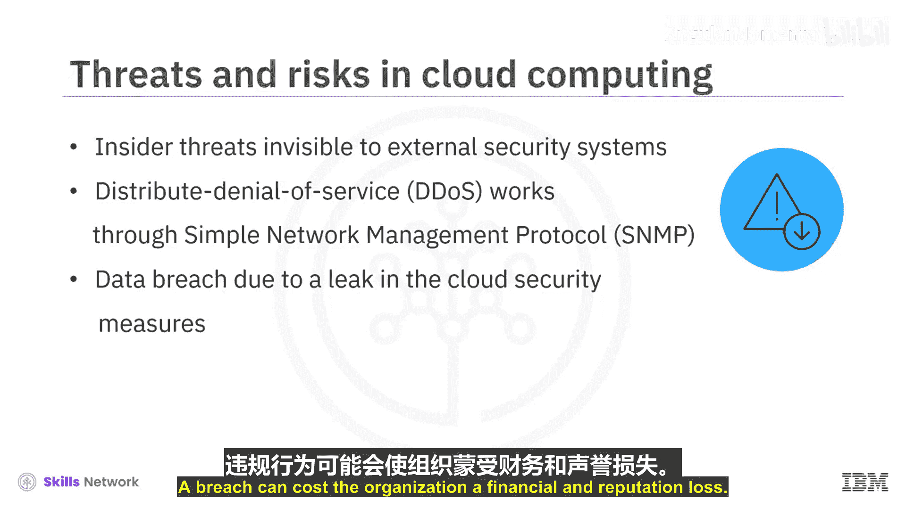

---

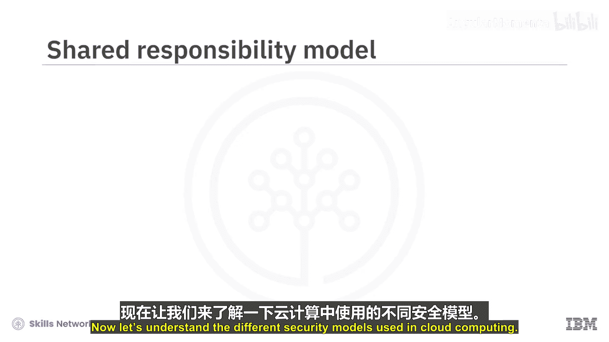

## 云计算中的安全责任模型

现在，让我们了解云计算中使用的不同安全模型。

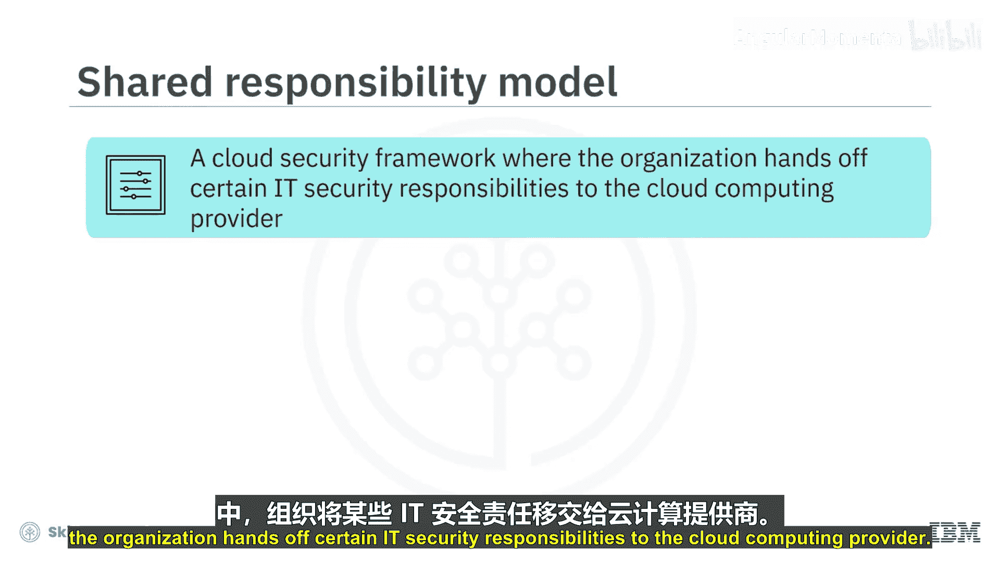

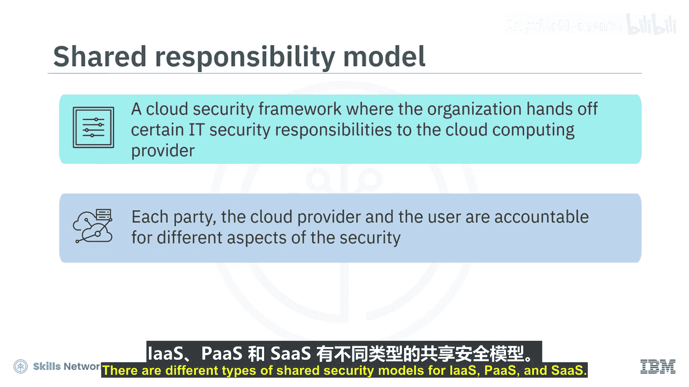

**共享责任模型**是一个云安全框架，在该框架下，组织将某些IT安全责任移交给云计算提供商。云提供商和用户双方对安全的不同方面负责，他们共同协作以实现全面的安全覆盖。

针对IaaS、PaaS和SaaS，存在不同类型的共享安全模型：

*   **在IaaS模型中**，提供商负责其数据中心的物理基础设施安全。**IaaS用户**则负责软件（包括运行其应用程序所需的操作系统）及其数据的安全。
*   **在PaaS模型中**，提供商负责平台安全，包括操作系统、用户订阅和登录凭证。但**用户**需对在平台上生成的任何代码、数据或其他内容的安全负责。
*   **在SaaS模型中**，提供商几乎负责安全的各个方面，包括底层基础设施、服务应用程序以及应用程序产生的数据。**用户**仍负有一些安全责任，例如保护登录凭证。

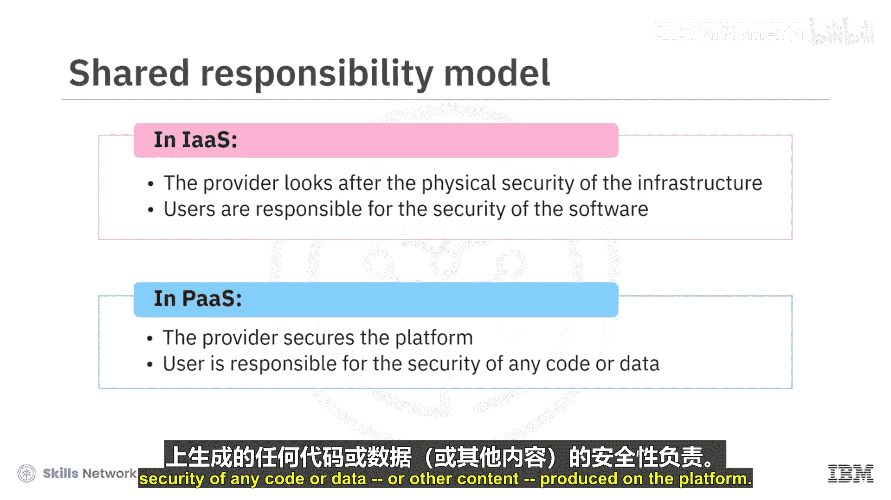

---

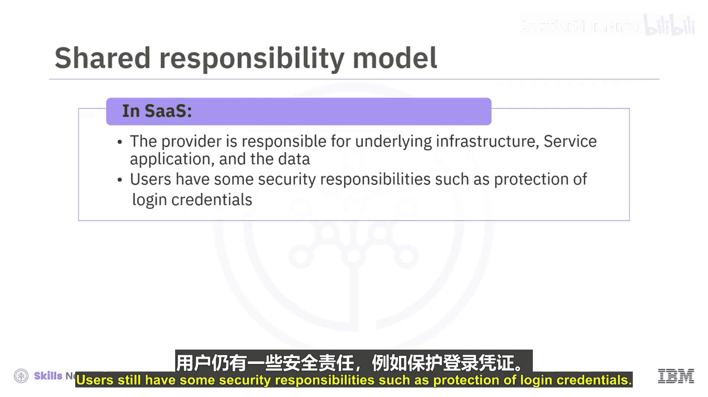

本节课中我们一起学习了云安全的基本概念。我们了解到，虽然云计算带来了效率和灵活性，但也引入了独特的安全挑战，如可见性不足、多租户风险和内部威胁等。通过理解共享责任模型，我们可以明确在IaaS、PaaS和SaaS等不同服务模式下，用户与提供商各自的安全职责，这是构建有效云安全策略的基础。