# 043：什么是云安全 - 第二部分 🔐

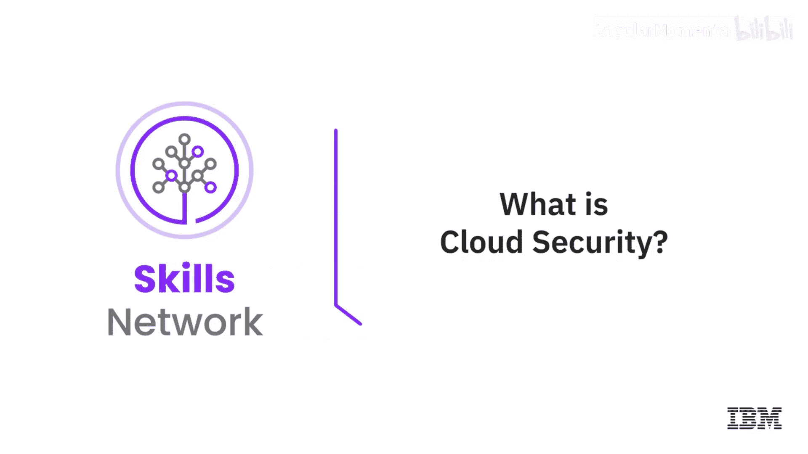

在本节课中，我们将要学习云安全的核心组成部分，包括数据安全、访问控制、网络安全以及行业最佳实践。我们将探讨如何通过人员、流程和技术三个维度来构建强大的云安全体系，并了解当前云安全领域的主要趋势。

---

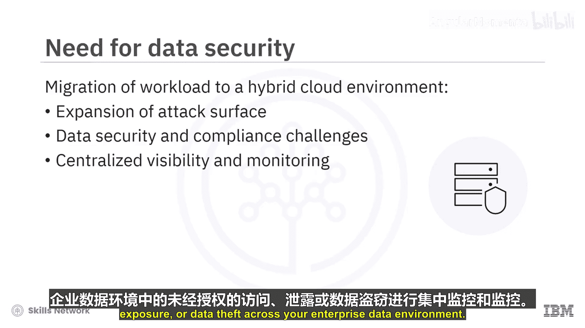

随着越来越多的企业将其工作负载迁移到混合云环境，威胁攻击面也随之扩大。这种扩张可能导致新的数据安全和合规性挑战。因此，你需要一个强大的、以数据为中心的网络安全计划来保护你的数据。

此外，你还需要在整个企业数据环境中，建立针对未经授权的访问、数据暴露或数据盗窃的集中式可见性和监控能力。

## 数据安全能力 🛡️

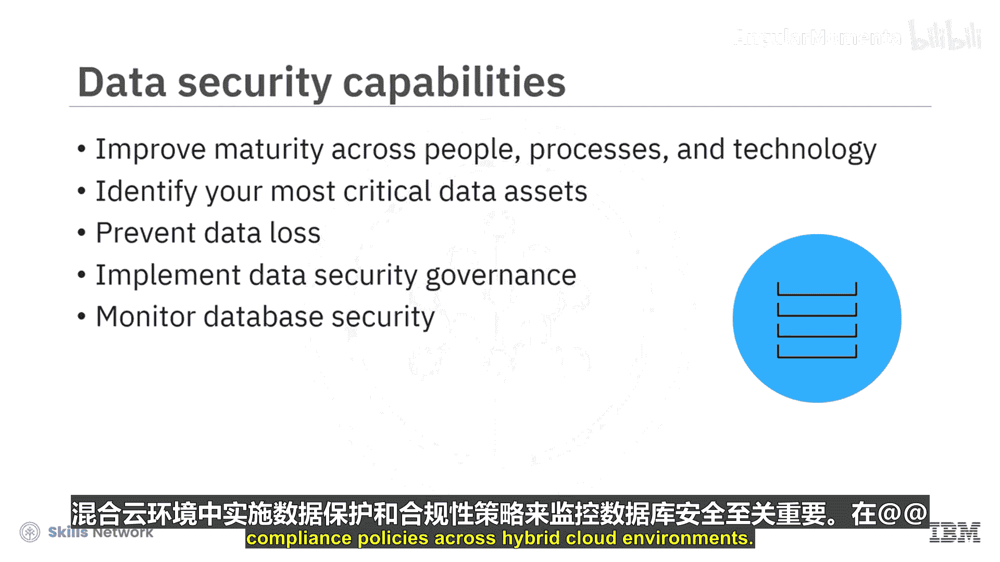

上一节我们介绍了云安全面临的挑战，本节中我们来看看如何通过具体的能力来保护数据。要保护数据安全，你可以从人员、流程和技术三个层面提升成熟度。

以下是你可以实施的一些关键数据安全能力：

*   **识别关键资产**：识别你最关键的数据资产、谁有权访问它们以及它们是如何被保护的。
*   **防止数据丢失**：通过检测、预防和执行策略违规来避免意外的数据丢失。
*   **实施数据安全治理**：建立流程、指标以及持续、稳定的数据发现和分类机制。
*   **监控数据库安全**：在混合云环境中强制执行数据保护和合规策略，这一点至关重要。

## 访问控制与身份认证 🔑

在云环境中，你的下一个关注点应该是访问控制和身份认证的管理。你需要制定云身份和访问管理策略，该策略应基于零信任架构、风险保护，并对任何用户访问任何资源进行持续的身份验证。

一个组织在构建云环境时应考虑以下几点：

*   **按需现代化**：根据你的业务需求，以你自己的节奏进行现代化改造。
*   **逐步引入云IAM**：在逐步引入合适的云IAM架构以补充或替换现有框架的同时，保留现有的本地投资和应用程序。
*   **建立零信任模型**：建立一个零信任实施方案，以提供集中式访问控制、保护客户机密性、减少内部威胁并保护你的远程资源。零信任模型旨在确保在正确的条件下，将正确的用户安全地连接到正确的数据，同时保护组织免受网络威胁。
*   **实现可扩展性**：使你的云IAM能够支持数百万用户或事务，而无需对基础设施进行重大修改。

## 云网络安全 🌐

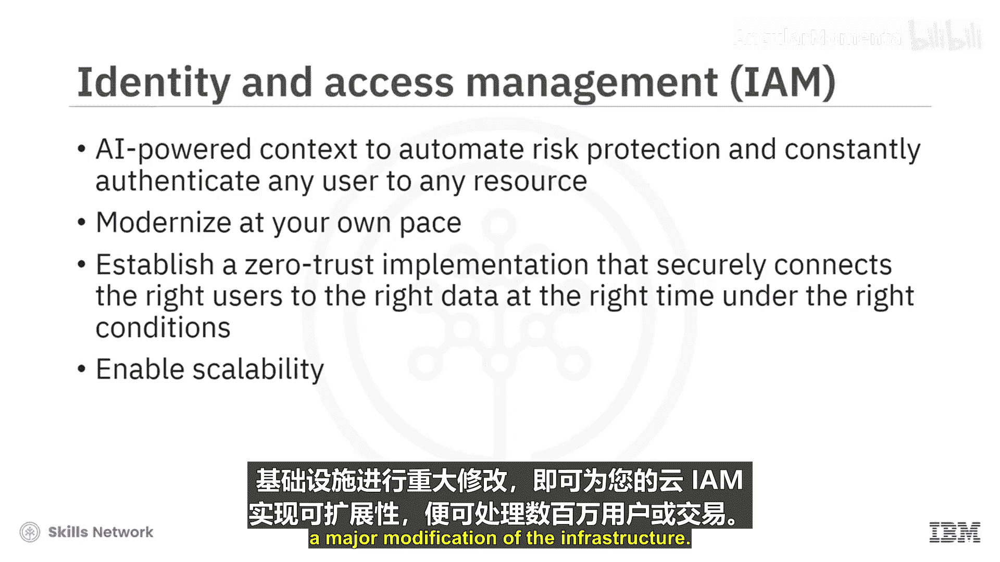

云安全的另一个要素是云网络安全，它指的是用于保护公共云、私有云和混合云网络上数据的安全措施、技术、策略、控制流程。

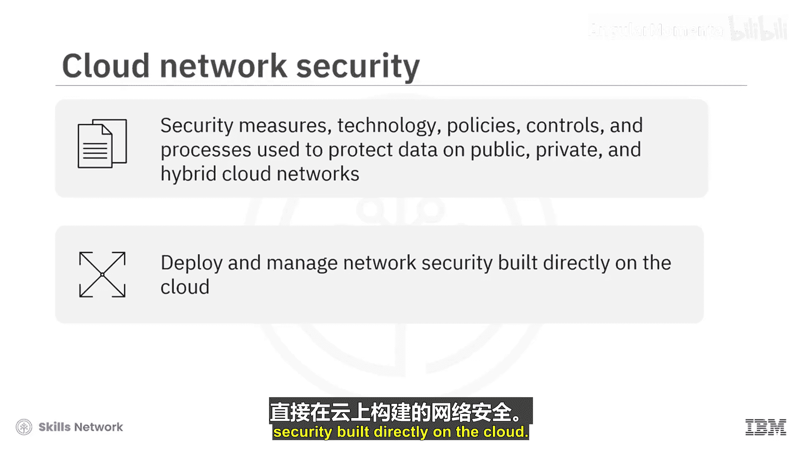

当你将网络扩展到云环境时，会面临许多安全影响。为了满足现代网络安全需求，组织需要直接部署和管理构建在云上的网络安全。

以下是云网络安全带来的好处：

*   **集中式安全监控与管理**。
*   **易于管理和更新精细化的策略**。
*   **实时检测并有效防御入侵、DDoS攻击和其他基于Web的攻击**。
*   **自动化配置与管理**，有助于消除配置错误并保持对流量的控制。
*   **加密服务**，保护静态和传输中的数据。
*   **集中式身份与访问的保护和管理**。

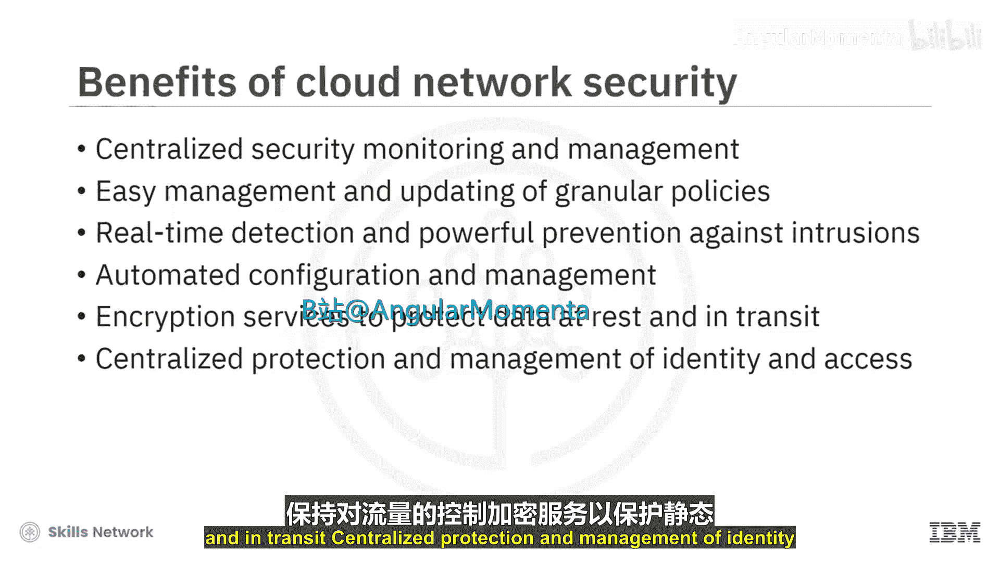

## 云安全最佳实践 📋

接下来，让我们总结一下你可以遵循的云安全最佳实践。你可以遵循三个阶段中的一些关键步骤：首先是识别你的云使用状态和风险，其次是保护你的云系统，最后是响应攻击。

**第一阶段：识别**
此阶段包括识别你的数据如何被访问、检测未经授权的云使用、检查你的云服务配置、监控云数据被恶意使用的迹象。

**第二阶段：保护**
在第二阶段，你可以通过以下方式保护你的云系统：
*   分配保护策略。
*   加密敏感数据。
*   制定数据共享策略。
*   限制向未知设备共享数据。
*   实施机器人防护和缓解解决方案。
*   使用合适的反恶意软件解决方案。

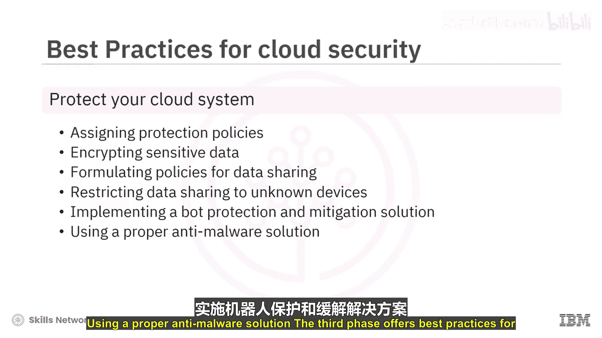

**第三阶段：响应**
第三阶段提供了响应攻击和攻击尝试的最佳实践：
*   为高风险访问场景增加额外的身份验证和验证步骤。
*   为新的云服务添加新策略。

## 标准框架与新兴技术 🏛️

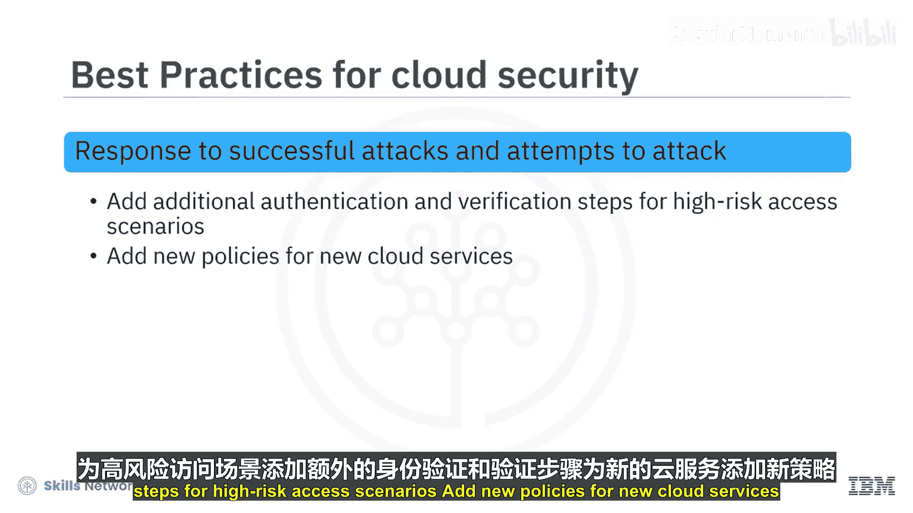

美国国家标准与技术研究院制定了一系列最佳实践和原则，以建立一个安全且可持续的云计算框架。

这些原则是NIST网络安全框架的五大支柱：**识别、保护、检测、响应、恢复**。

另一个支持网络安全框架的新兴云安全技术是**云安全态势管理**。CSPM解决方案旨在解决许多云环境中的一个常见错误，即**配置错误**。CSPM还通过帮助部署云安全的核心组件来解决其他问题。

这些核心组件包括：
*   身份和访问管理。
*   法规合规性管理。
*   流量监控。
*   威胁响应。
*   风险缓解。
*   数字资产管理。

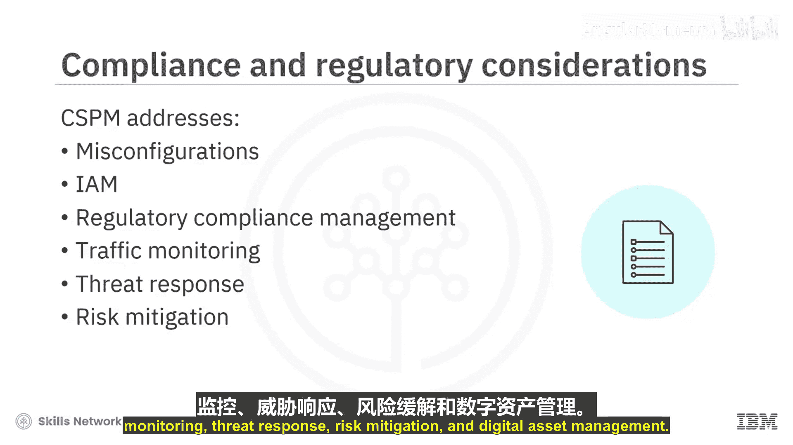

## 当前趋势与未来展望 🚀

网络世界中云采用的巨大增长将促使网络犯罪分子将目标对准云环境中的组织。尽管组织正在采取充分的安全措施，但它们仍然容易受到网络攻击。

当前云安全的主要趋势包括：
*   多云策略，如网络安全网格。
*   零信任安全模型。
*   混合云和多云环境。
*   云原生工具和应用程序。
*   DevSecOps的部署。
*   保护远程员工。
*   用于威胁检测的人工智能和机器学习。
*   关注隐私和数据保护法规。

---

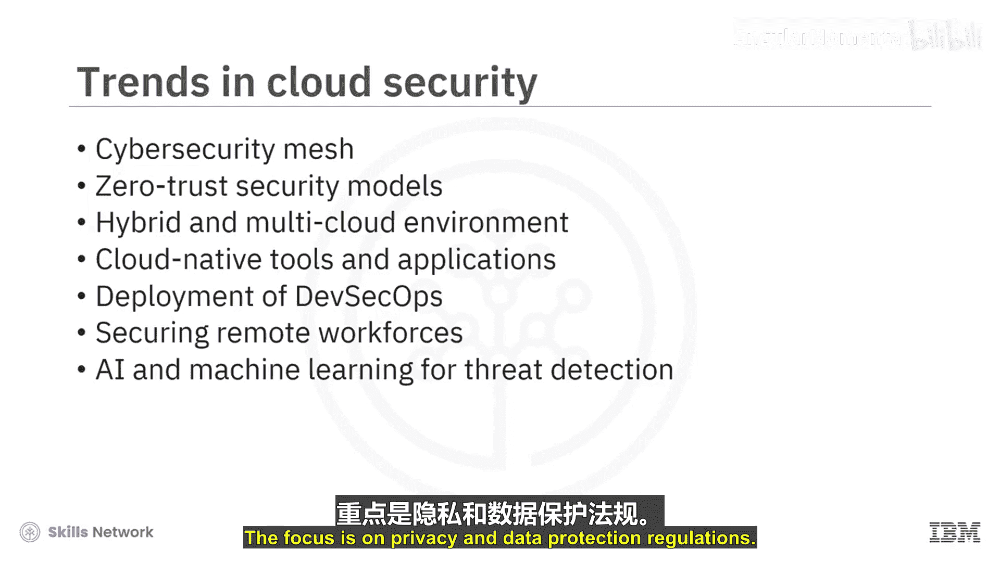

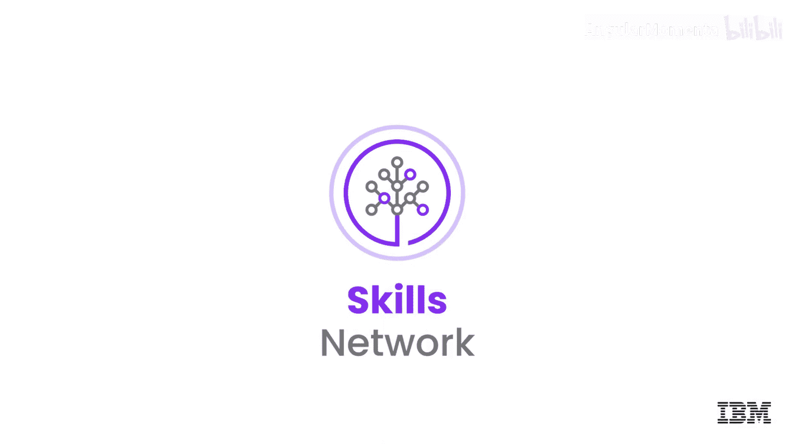

本节课中我们一起学习了云安全的关键领域。我们从保护数据的核心能力出发，探讨了访问控制与身份认证的重要性，并深入了解了云网络安全的优势。接着，我们梳理了分阶段的云安全最佳实践，介绍了NIST框架和CSPM等标准与工具。最后，我们展望了云安全领域的主要发展趋势。构建全面的云安全策略需要从多个层面入手，并持续适应不断变化的威胁环境。