# 044：身份与访问管理 🔐

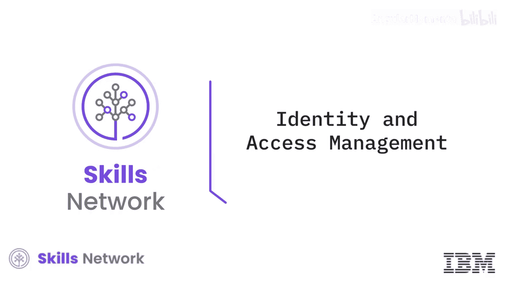

在本节课中，我们将要学习身份与访问管理（IAM）如何作为云安全的第一道防线，通过认证和授权用户来控制对云资源、服务和应用的访问。

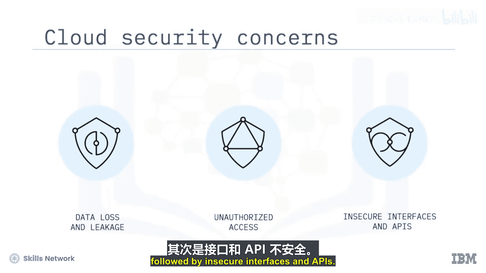

---

根据Cybersecurity Insiders发布的云安全报告，网络安全专业人士最关注的云安全问题是数据丢失和泄露。其中，因员工凭证滥用和访问控制不当导致的未授权访问，被认为是云安全最大的单一漏洞，其次是不安全的接口和API。

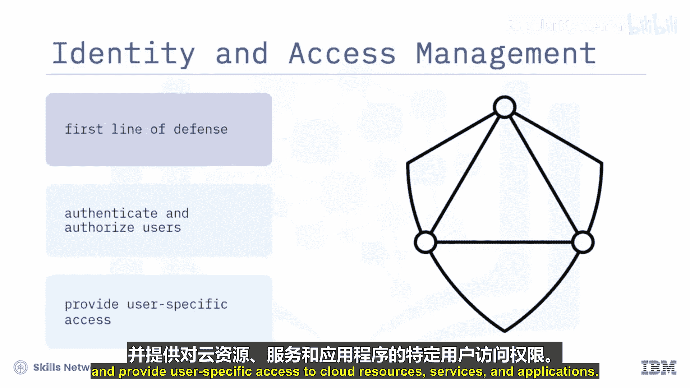

---

## 用户类型 👥

一个全面的安全策略需要涵盖广泛用户群体的安全需求，包括组织用户、互联网及社交用户、第三方业务伙伴组织和供应商。用户主要分为三种类型：管理用户、开发用户和应用用户。

以下是各类用户的详细说明：

*   **管理用户**：包括云平台管理员、操作员和经理。这类角色通常负责创建、更新和删除应用及服务实例，并需要了解团队成员的活动。攻击者若获取管理账户，可从生产数据库服务实例中窃取数据，在客户域内部署恶意应用，甚至篡改或销毁现有应用。
*   **开发用户**：包括云应用开发者、平台开发者和应用发布者。开发用户被授权读取敏感信息，并创建、更新和删除应用。
*   **应用用户**：即云托管应用的使用者。

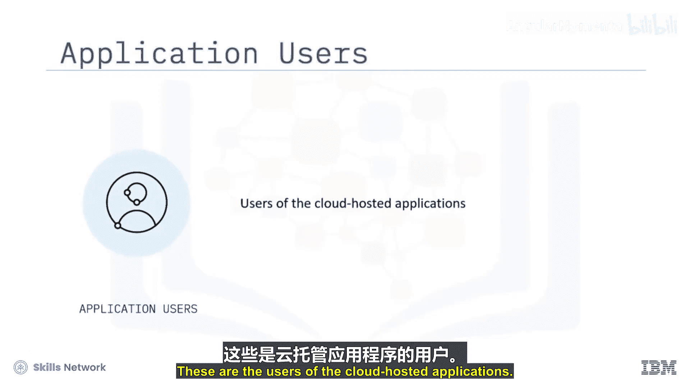

---

## IAM的核心组件 ⚙️

上一节我们介绍了云环境中的主要用户类型，本节中我们来看看身份与访问管理的关键组件及其工作原理。

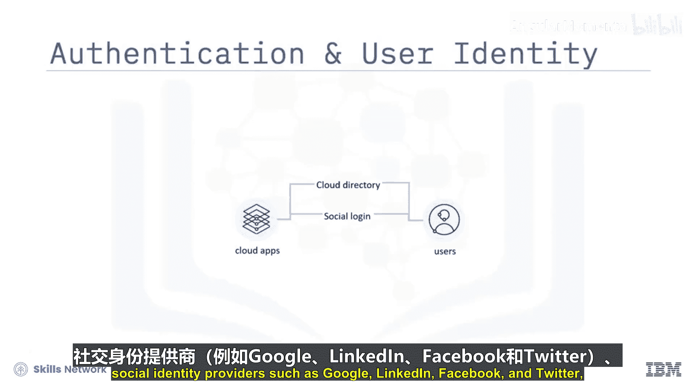

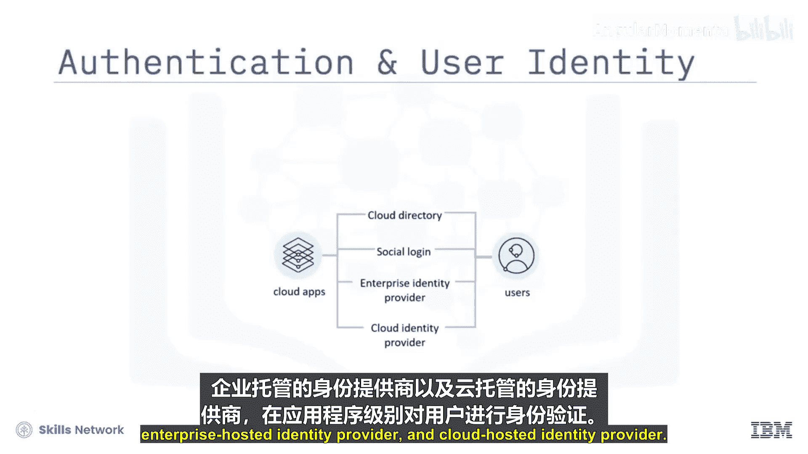

以下是IAM的关键组成部分：

*   **认证服务**：使部署在云上的应用能够基于一系列身份提供商对用户进行应用级认证。身份提供商包括：
    *   云目录
    *   社交身份提供商（如Google、LinkedIn、Facebook、Twitter）
    *   企业托管身份提供商
    *   云托管身份提供商
*   **API密钥**：有时会通过向API传递API密钥或唯一标识符来识别调用应用或用户。
*   **多因素认证**：用于通过增加额外的认证层来防范身份盗窃，例如一次性密码或PIN码、证书、令牌，以及基于风险的认证（如用户位置变化、过往活动和偏好）。
*   **云目录服务**：用于在云环境中安全地管理用户配置文件及其关联的凭证和密码策略。云内的目录服务意味着托管在云上的应用无需使用自己的用户存储库。
*   **报告**：帮助提供以用户为中心的访问资源视图，或以资源为中心的用户访问视图。报告通常提供以下信息：哪些用户有权访问哪些资源、哪些用户的访问权限发生了变化、每个用户在何种条件下利用了哪些访问权限。
*   **审计与合规**：这是IAM框架中的一项关键服务，对云提供商和云消费者都至关重要。审计员使用这些流程来验证已实施的控制措施是否符合组织的安全策略、行业合规性和风险策略，并报告偏差。

---

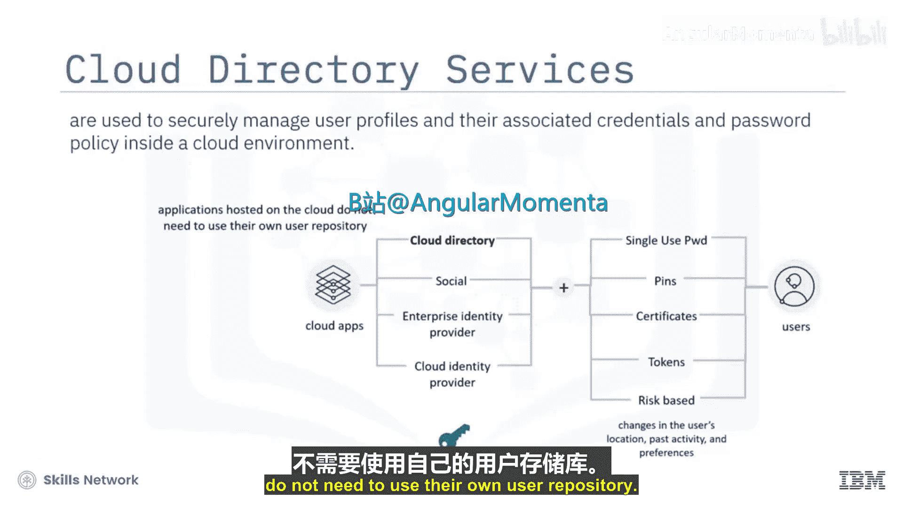

## 用户与服务访问管理 🔧

IAM框架提供了强大的控制能力，本节我们将聚焦于用户与服务访问管理的具体能力。

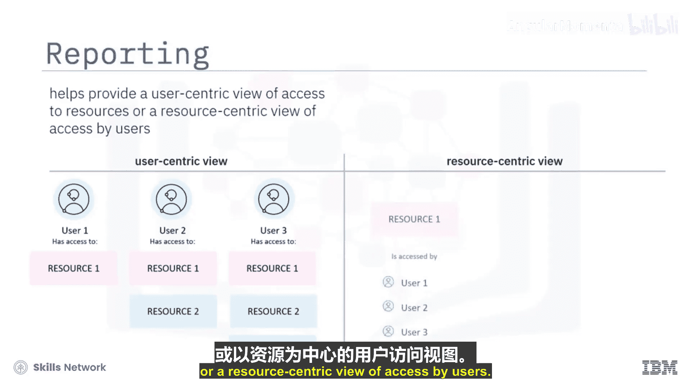

用户和服务访问管理能力使云应用和服务所有者能够以最少的人工交互，配置和取消配置客户、合作伙伴和供应商的用户配置文件。这基于所有者定义的角色、组织和访问策略，简化了访问控制流程。

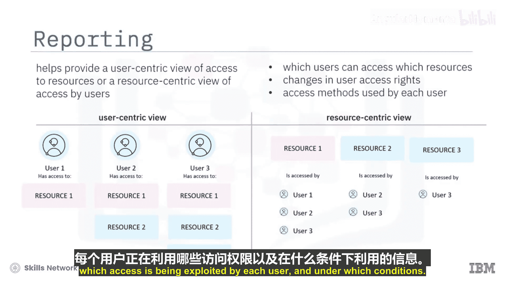

管理员或开发人员的用户账户可以访问敏感信息。为了降低这些账户被入侵的风险，您需要对这些用户的全生命周期进行最大程度的控制。

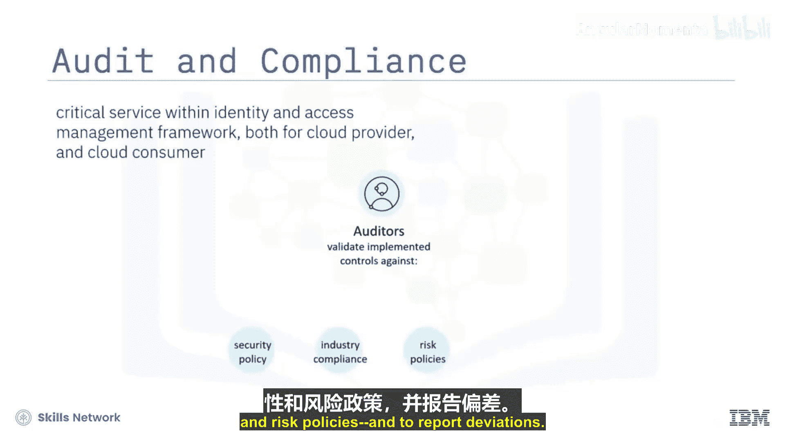

以下是一些有助于保护这些敏感账户的控制措施：

*   **按角色配置用户**：通过为每个用户在资源上指定角色来配置用户。
*   **密码策略**：控制特殊字符的使用、最小密码长度及其他类似设置。
*   **多因素认证**：例如基于时间的一次性密码。
*   **即时取消访问权限**：当用户离职或角色变更时，立即取消其访问权限。

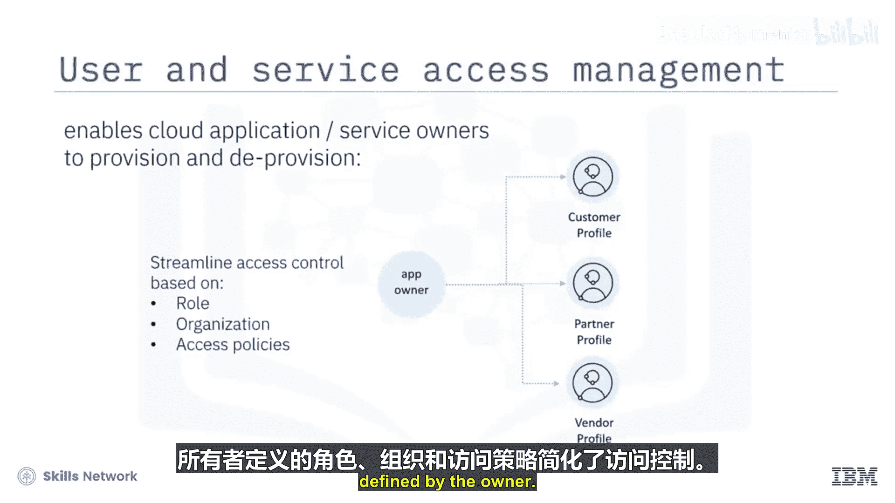

云提供商通常提供身份访问和管理服务，包括创建访问组、将用户添加到访问组以及管理现有用户访问权限的能力。

---

## 访问组与访问策略 📋

了解了用户管理的基础后，我们来看看如何通过访问组和策略来高效地管理权限。

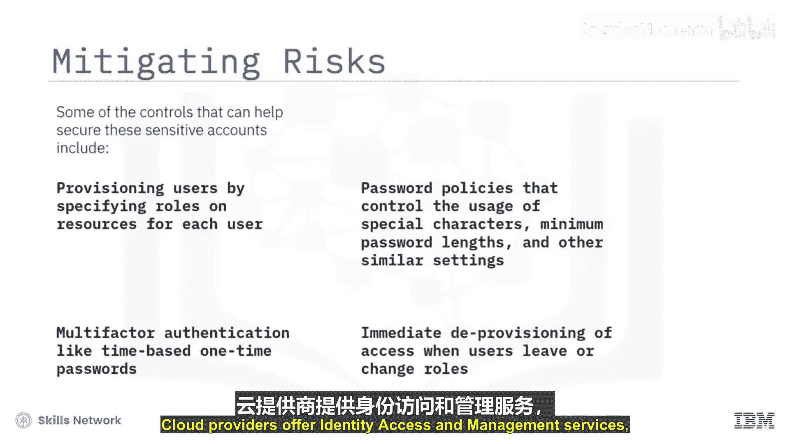

**访问组** 是为了将相同的访问权限分配给组内所有实体而创建的一组用户和服务ID，通过一个或多个访问策略实现。

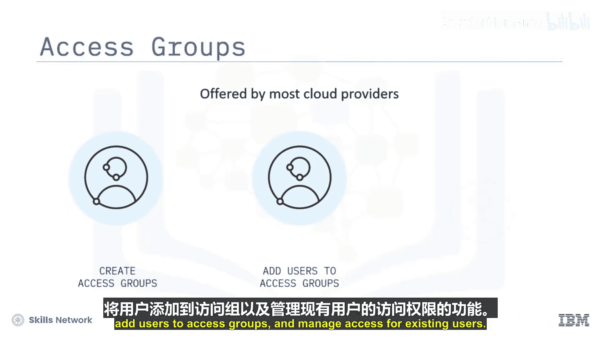

**访问策略** 定义了账户中的用户、服务ID和访问组如何获得访问账户资源的权限。

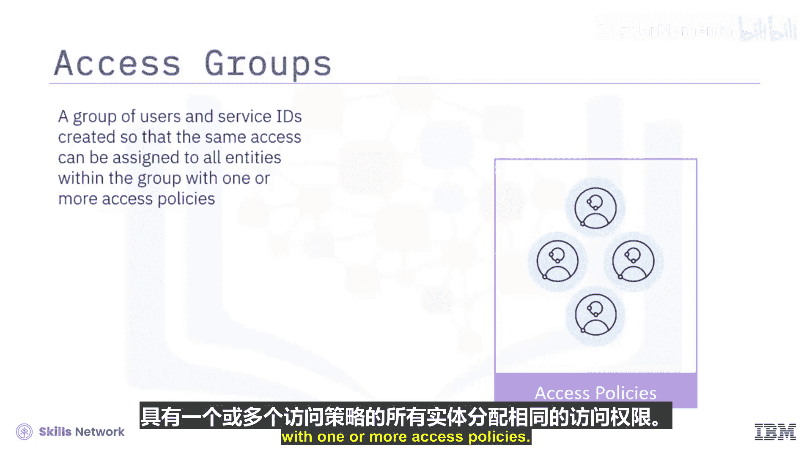

一个策略包含以下部分：
*   **主体**：可以是用户、服务ID或访问组。
*   **目标**：您希望授予访问权限的资源或配置的服务产品。
*   **角色**：定义了允许在策略目标（即被授予访问权限的资源）上执行的操作。

与为每个用户单独分配访问权限相比，访问组提供了更简化的访问分配流程，并有助于减少账户中的策略数量。

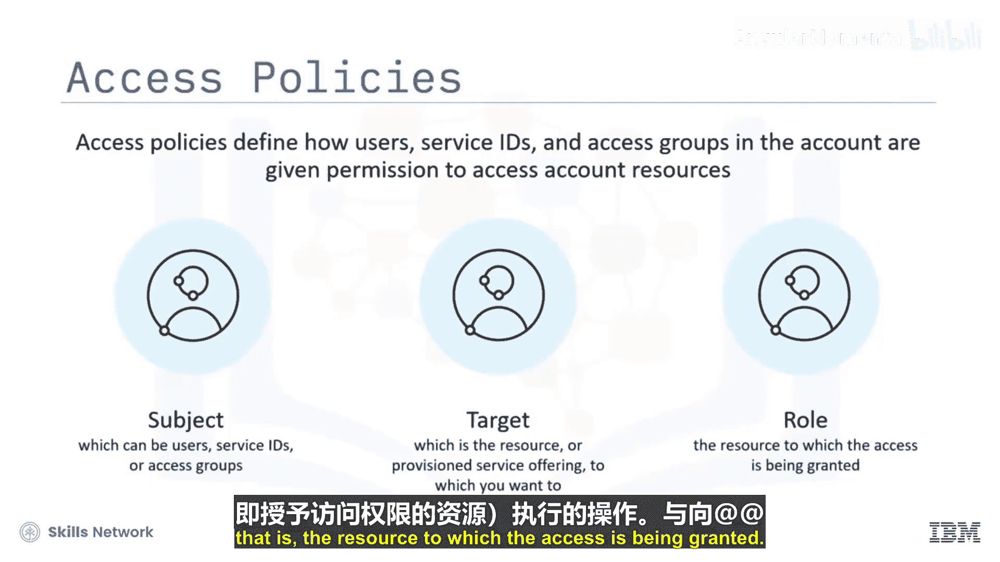

---

## 总结 📝

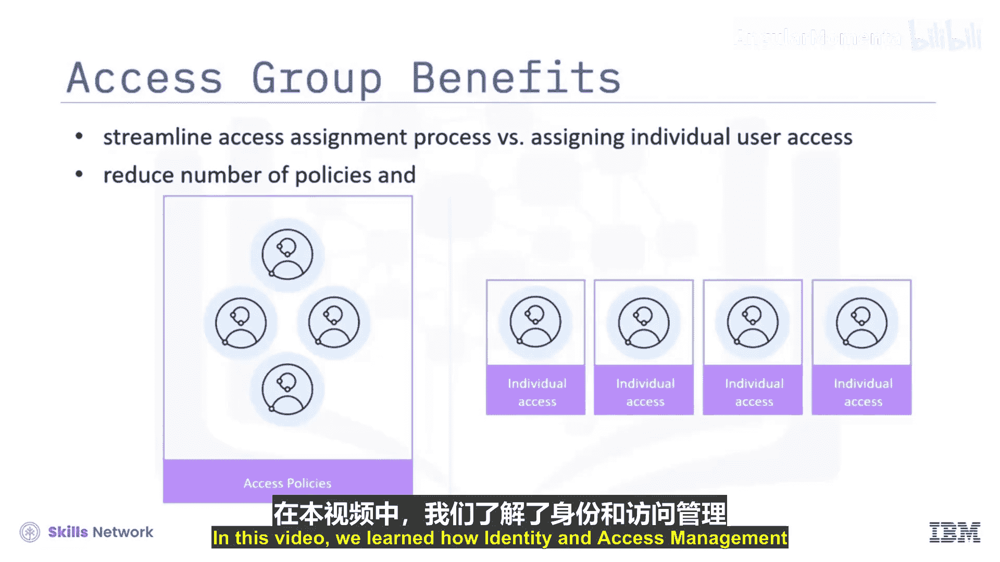

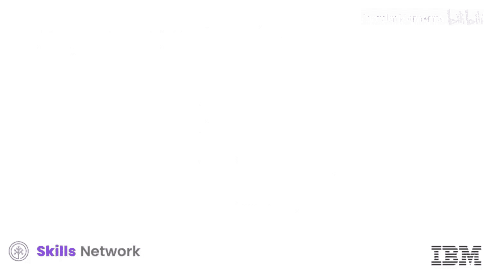

本节课中我们一起学习了身份与访问管理（IAM）如何作为保护云安全的第一道防线。我们了解了云环境中的主要用户类型（管理用户、开发用户、应用用户），探讨了IAM的核心组件（如认证、多因素认证、目录服务、报告和审计），并学习了如何通过用户访问管理、访问组和访问策略来有效地控制和管理对云资源的访问权限。