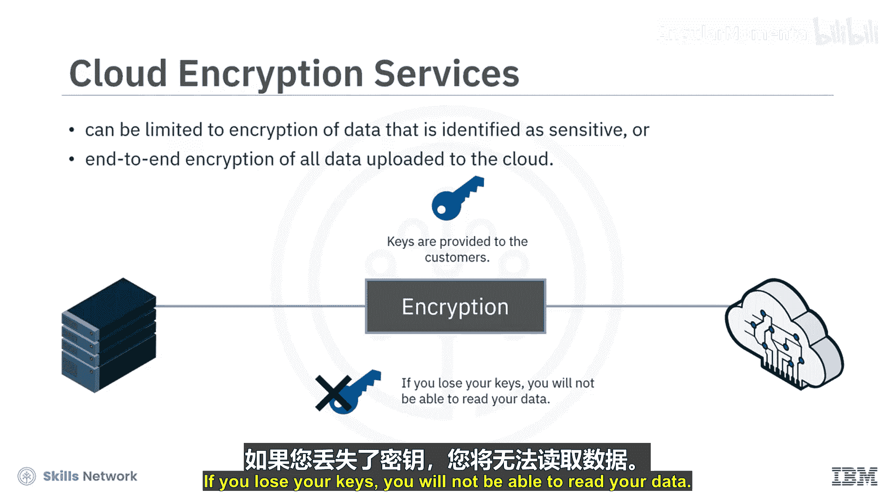
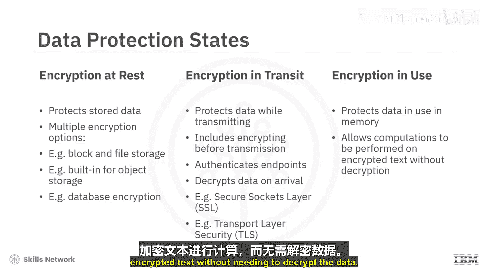
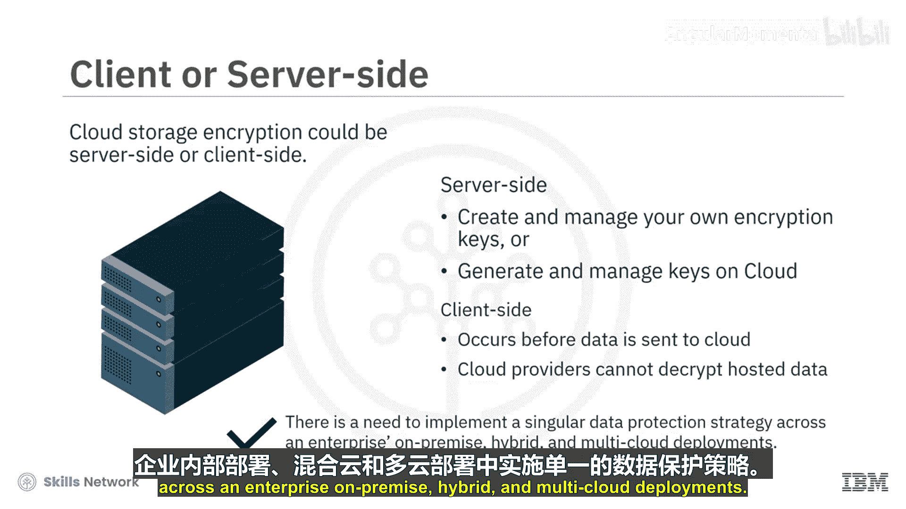
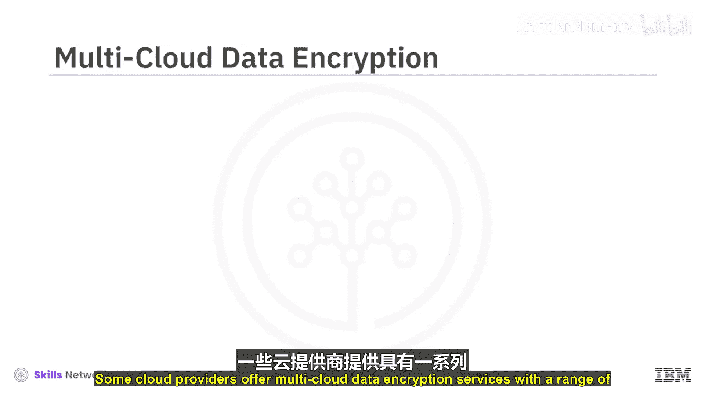
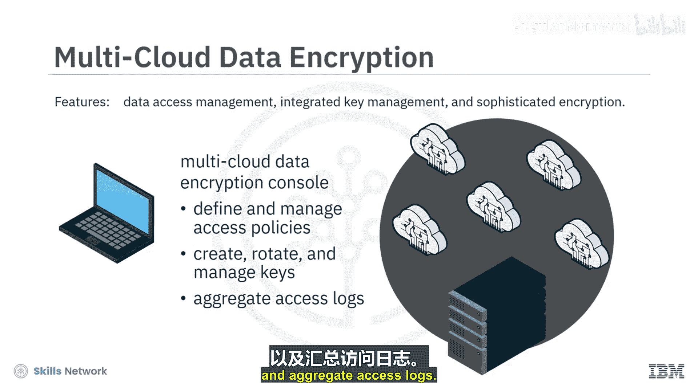
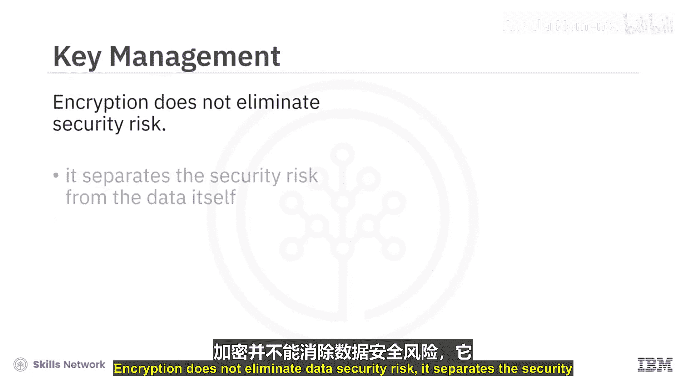
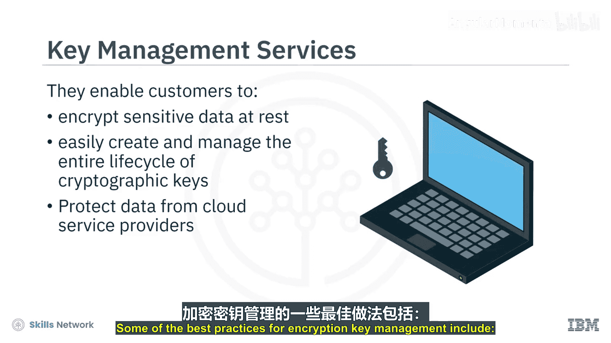
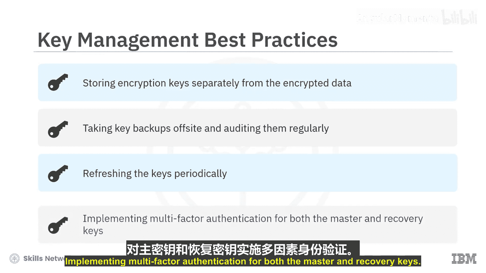

# 045：云加密 🔐

在本节课中，我们将要学习云加密的核心概念、工作原理以及云服务提供商提供的不同加密服务。加密是数据安全防护体系中的最后一道防线，对于保护云端数据至关重要。

考虑到数据安全与隐私问题，尤其是在公共云环境中，加密扮演着关键角色，常被称为分层安全模型中的最后一道防线。这种保护不仅加密数据，还提供强大的数据访问控制、密钥管理和证书管理功能。

## 什么是加密？ 🔑

上一节我们提到了加密的重要性，本节中我们来看看加密的具体定义。加密被定义为以某种方式扰乱数据，使其变得不可读。一个加密系统包含两个部分：**加密算法**和**解密密钥**。

*   **加密算法**：定义了数据将被如何转换以变得不可读的规则。
*   **解密密钥**：定义了如何将加密数据转换回可读数据。

加密确保只有授权用户才能访问敏感数据。当数据在未经授权的情况下被访问或截获时，数据将是不可读且无意义的。

## 云加密服务 🛡️

了解了加密的基础后，我们来看看云环境下的具体服务。云服务提供商提供多种云加密服务。这可能仅限于对识别为敏感的数据进行加密，也可能对所有上传到云端的数据进行端到端加密。数据在接收时被加密，解密密钥会交给客户，以便在需要时解密数据。

**密钥需要被安全地管理。如果你丢失了密钥，你将无法读取你的数据。**

## 数据的三种状态 🔄

数据需要在三种状态下得到保护：**静态**、**传输中**和**使用中**。

以下是针对这三种状态的加密保护措施：

*   **静态加密**：保护物理存储在数据库或存储层中的数据。根据应用和业务需求，有多种静态加密选项，例如块和文件存储加密、对象存储的内置加密以及数据库加密服务。
*   **传输中加密**：保护数据从一个位置传输到另一个位置时的安全。这包括在传输前加密数据、验证端点身份，以及在到达时解密和验证数据。安全套接字层（SSL）和传输层安全（TLS）是传输中加密的常用协议。它们不仅用于安全访问网站，也用于云内服务器与服务之间的数据传输。
*   **使用中加密**：保护在内存中进行计算时正在使用的数据。它允许在加密文本上执行计算，而无需解密数据。

## 云存储加密方式 💾

云存储加密可以是**服务器端**或**客户端**的。

以下是两种加密方式的对比：

*   **服务器端加密**：发生在云存储接收你的数据之后，但在数据被写入磁盘存储之前。对于服务器端加密，你可以创建和管理自己的加密密钥（称为客户提供的加密密钥），也可以使用云存储提供商提供的密钥管理服务来生成和管理你的加密密钥（称为客户管理的加密密钥）。
*   **客户端加密**：发生在数据发送到云存储之前。这样，用户可以使用云提供商不可见的加密密钥和算法，使得云提供商几乎不可能解密数据。

## 多云环境下的加密 🌐

鉴于当今大多数企业在多云环境中运营，需要在整个企业（包括本地、混合云和多云部署）中实施统一的数据保护策略。一些云提供商提供多云数据加密服务，其功能包括数据访问管理、集成密钥管理和复杂的加密技术。这些功能结合起来，提供了可扩展性和灵活性，有助于保护整个企业中最敏感的工作负载，无论数据位于何处。

使用多云数据加密控制台，你可以定义和管理访问策略、创建、轮换和管理加密密钥，并聚合访问日志。

## 密钥管理 🔐

加密并不能消除数据安全风险。它通过将安全风险转移到加密密钥本身，从而将风险与数据分离开来。这些密钥需要被管理和保护，以防范威胁，从而确保数据安全。

一些云提供商提供的密钥管理服务，有助于对云服务或客户构建的应用程序中使用的加密密钥进行生命周期管理。它们使客户能够加密静态的敏感数据，并轻松创建和管理用于加密数据的加密密钥的整个生命周期。由于密钥由客户持有，数据可以免受云服务提供商和其他用户的侵害。

以下是一些加密密钥管理的最佳实践：

*   将加密密钥与加密数据分开存储。
*   对密钥进行异地备份并定期审计。
*   定期轮换密钥。
*   对主密钥和恢复密钥实施多因素认证。

## 总结 📝

本节课中我们一起学习了云加密。我们了解到加密是保护云端数据的关键技术，它通过加密算法和密钥将数据转换为不可读的形式。数据在静态、传输中和使用中三种状态下都需要加密保护。云存储加密可分为服务器端和客户端两种方式。在多云时代，统一的数据加密策略和专业的密钥管理服务对于保障企业数据安全至关重要。记住，妥善管理你的加密密钥是确保加密有效性的核心。