# 046：云监控基础与优势 🛰️

在本节课中，我们将要学习云监控的基础概念、核心优势以及最佳实践。云监控是确保云上应用和服务稳定、高效、安全运行的关键。

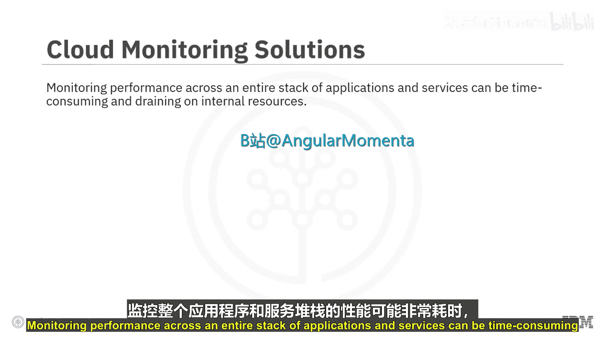

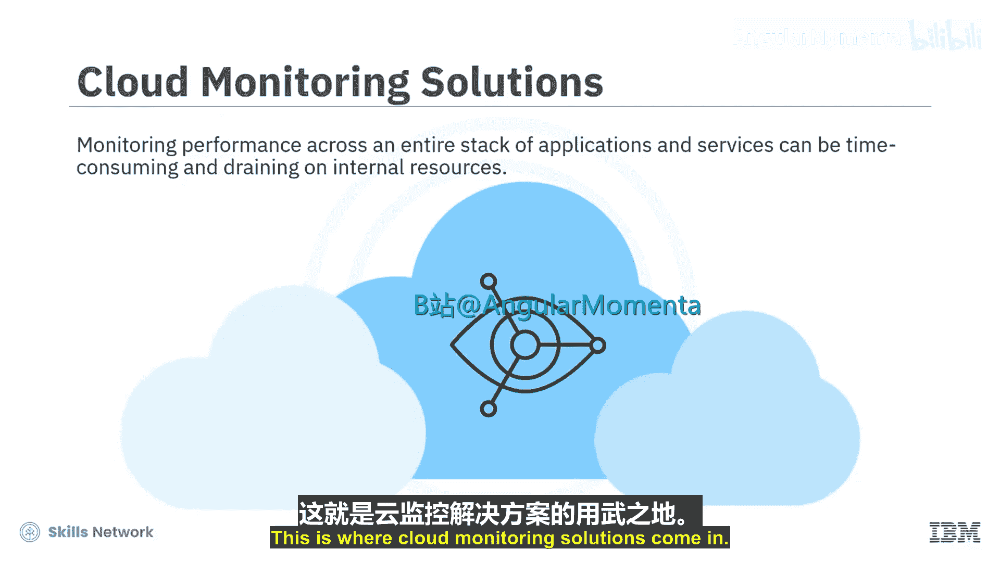

基于云的部署可能非常复杂，监控整个应用和服务堆栈的性能可能耗时且消耗内部资源。这正是云监控解决方案发挥作用的地方。云监控解决方案评估数据、应用和基础设施的行为，以监控性能、资源分配、网络可用性、合规性以及安全风险和威胁。

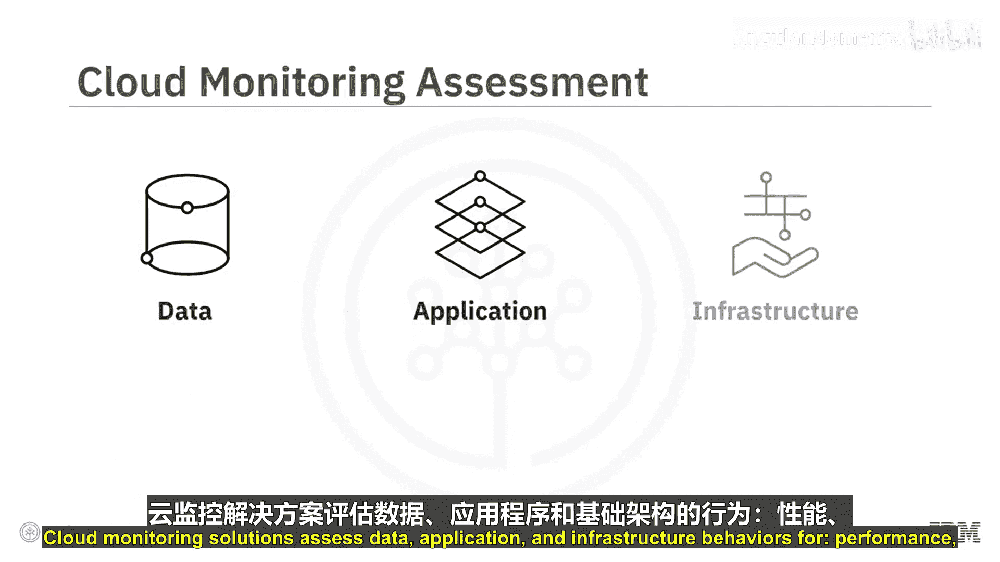

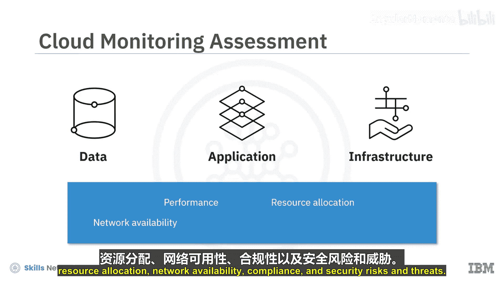

上一节我们介绍了云监控的必要性，本节中我们来看看云监控的具体内涵与核心价值。

## 什么是云监控？🔍

云监控不仅仅是自动化工具，它还包括为分析、跟踪和管理基于云的服务及应用而需要落实的策略、实践和流程。它旨在提供可操作的洞察，以帮助提高可用性和用户体验。

## 云监控的核心优势 💪

以下是云监控能够带来的主要好处：

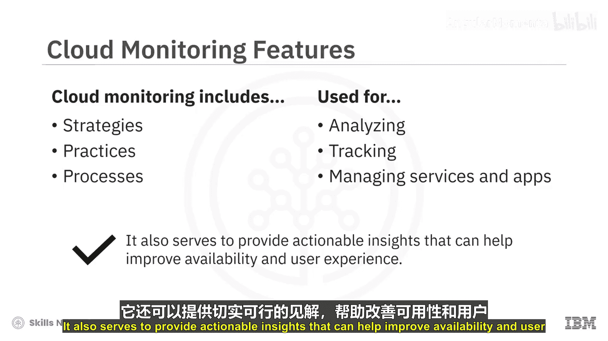

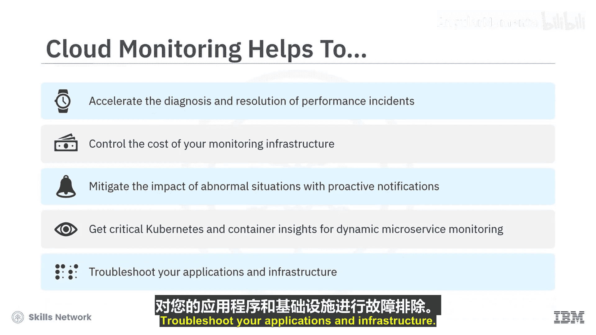

*   **加速诊断与解决**：帮助加速性能事件的诊断和解决。
*   **控制成本**：控制监控基础设施的成本。
*   **主动预警**：通过主动通知，减轻异常情况的影响。
*   **洞察动态微服务**：为动态微服务监控提供关键的Kubernetes和容器洞察。
*   **全面故障排除**：对您的应用和基础设施进行故障排除。

云监控解决方案旨在让组织对其整个基于云的基础设施拥有可见性和控制力。它们提供实时数据，对虚拟机、服务、数据库和应用程序进行全天候监控。

## 云监控解决方案的关键能力 📊

上一节我们了解了云监控的优势，本节中我们来看看一个成熟的云监控方案应具备哪些关键能力。

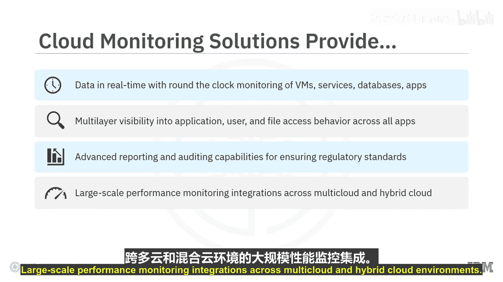

*   **多层可见性**：对跨所有基于云的应用和服务的应用、用户及文件访问行为具有多层可见性。
*   **高级报告与审计**：具备高级报告和审计能力，以确保符合监管标准。
*   **大规模性能监控**：支持跨多云和混合云环境的大规模性能监控集成。

## 云监控工具的分类 🧰

云监控工具和解决方案的一种分类方法是将其分解为基础设施监控、数据库监控和应用性能监控。

*   **基础设施监控工具**：帮助识别小型和大型硬件故障及安全漏洞，以便开发人员和管理员在问题影响用户体验之前采取纠正措施。
*   **数据库监控工具**：帮助跟踪进程、查询和服务可用性，以确保数据库管理系统的准确性和可靠性。
*   **应用性能监控（APM）**：衡量应用程序的可用性和性能，提供在应用环境中排查问题所需的工具。APM解决方案有助于改善用户体验、满足应用和用户的服务水平协议（**SLA**）、最大限度地减少停机时间并降低总体运营成本。

## 云监控最佳实践 🏆

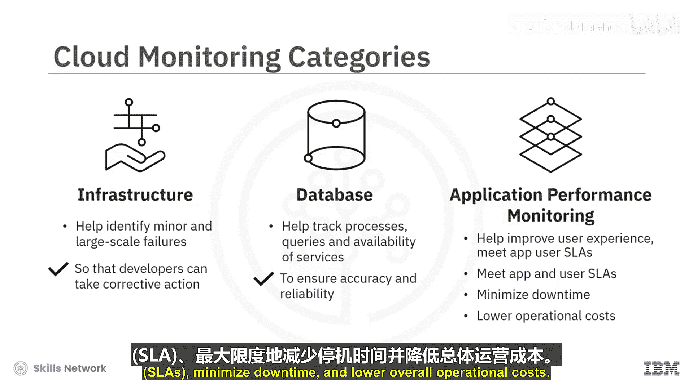

为了从基于云的部署中获得最大收益，您可以遵循一些标准的云监控最佳实践。

以下是值得关注的关键实践：

*   **利用终端用户体验监控**：采用终端用户体验监控解决方案，从最终用户的角度捕获应用程序的性能。这些解决方案监控用户旅程，以跟踪不同条件下的应用响应时间和使用频率等参数。这些洞察将帮助您显著改善客户体验。
*   **统一监控平台**：考虑将您基础设施的所有方面（无论是在私有云、公有云还是混合云中）都纳入一个统一的监控平台。这可以帮助您在一个地方管理所有关键绩效指标（**KPI**），并完全了解性能优化情况。
*   **跟踪资源使用与成本**：使用能帮助您跟踪云资源和服务使用情况及成本的监控工具。
*   **提高监控自动化**：增加云监控的自动化。这可以帮助您获得显著的运营效率。
*   **模拟故障场景**：模拟中断和违规场景，以评估您的监控工具在捕获故障和发出警报方面的表现如何。

## 总结 📝

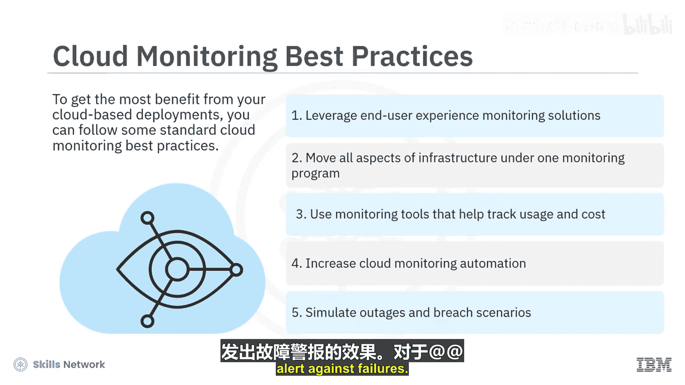

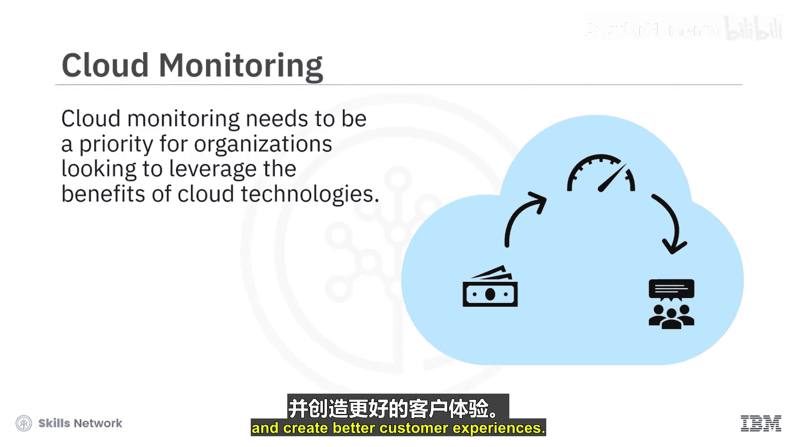

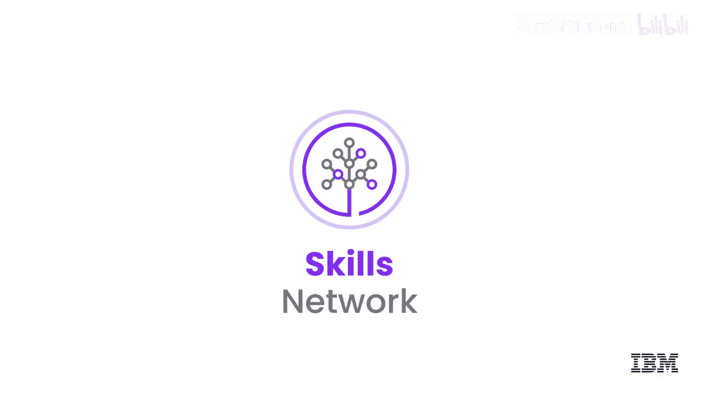

本节课中我们一起学习了云监控的基础知识。对于希望利用云技术优势的组织而言，云监控必须成为优先事项。它将帮助您管理和优化云资源以实现成本与性能的最佳平衡，并创造更好的客户体验。