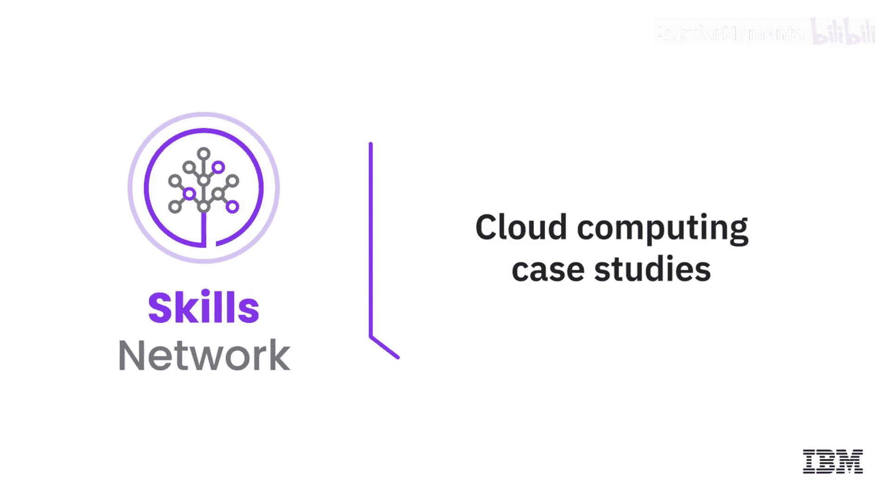
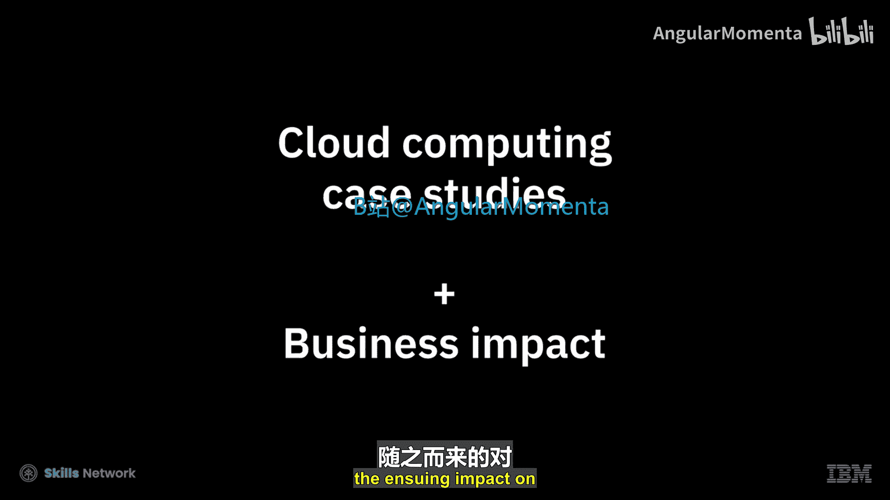
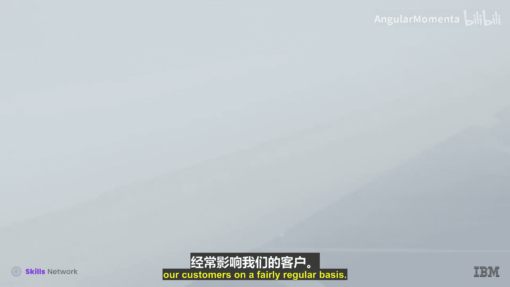

# 047：不同行业垂直领域的案例研究 🌩️✈️🍇

在本节课中，我们将通过几个真实的商业案例，了解云计算在不同行业中的应用及其带来的业务影响。这些案例将展示企业如何利用云技术解决特定挑战、提升效率并创造新的价值。

---

上一节我们概述了案例研究的目标，本节中我们来看看第一个案例：气象服务行业。

## 气象公司：精准预报与全球扩展 🌍

气象公司的使命是绘制地球大气图，并基于此生成最准确、最精细的本地化天气预报，分发给全球数百万的消费者和设备。天气难以预测，因此系统需要能够像天气变化一样快速地进行扩展和收缩。

以下是气象公司面临的核心挑战与云解决方案：

*   **业务规模与波动性**：日常负载为3000万独立用户，但在恶劣天气期间，用户量可能激增至1亿以上。系统需要处理每天**2500亿次**的预报请求，API平台需支撑约**每秒15万次**的请求。
*   **关键性要求**：产品必须快速、可靠地运行，否则可能危及人们的生命安全。
*   **云迁移效益**：该公司迁移至IBM Kubernetes服务后，获得了显著收益：
    *   **开发运维效率提升**：DevOps流程将工作流和管道减少了约**80%**。
    *   **弹性伸缩能力**：在飓风等事件中，能够轻松、无缝地随IBM云扩展，实现“随天气变化而扩展”。
    *   **管理服务优势**：作为托管服务，它解放了团队，使其无需手动维护系统，可以专注于其他工作。
    *   **自动化与安全**：获得了内置的自动化安全功能，IBM安全团队会主动通知任何安全漏洞。

通过IBM云的全球覆盖能力，结合自身的技术，气象公司得以扩展其产品和服务，更好地保护全球人们的安全。

---

了解了气象行业对弹性和规模的需求后，我们接下来看看航空业如何利用云技术改善客户体验。

## 美国航空：提升航班异常处理体验 ✈️

当航班取消或发生计划外情况时，美国航空希望创建一个系统，让客户能够主动看到替代的出行选项，从而在客户选择的渠道上，以自动化方式为其提供更好的抵达目的地的体验。

以下是美国航空实现这一目标的关键步骤：

*   **业务驱动力**：飓风、风暴等自然事件会严重影响客户。传统解决方案的推出存在风险，而云技术提供了应对此类场景所需的能力。
*   **技术选择**：采用微服务等云技术，可以将复杂问题分解为更小、更易理解和开发的部分。
*   **战略认识**：公司意识到，为了跟上客户的期望，现在就必须采用这类技术。

通过云平台，美国航空能够更灵活、快速地开发和部署服务，从而在关键时刻为客户提供更优的解决方案。

---

看过了服务行业的案例，我们再将目光转向制造业，看他们如何利用云驱动数字化转型。

## 三菱电机：加速产品上市与数字化转型 🍇

在三菱电机工作充满挑战，因为技术发展日新月异，公司也正同步走在数字化转型的道路上。客户要求更快的产品上市时间和更广泛的产品组合，公司需要跟上节奏，在最短时间内提供最好的服务和产品。

以下是三菱电机的云转型实践：

*   **云平台选择**：在IBM云上部署了SAP S/4HANA，因为它能提供具有成本效益且可扩展的基础设施。
*   **业务模式转变**：公司正在从产品驱动型向服务驱动型转变。
*   **具体收益**：
    *   **财务部门**：能够实时洞察财务报表，这是过去所没有的。
    *   **供应链与采购部门**：通过仪表板，能够及时做出决策。

云计算为三菱电机提供了加速创新和优化内部运营的关键支撑。

---

最后，我们来看两个传统企业如何通过云迁移实现业务独立与聚焦核心价值。

## 传统企业的云迁移之路：Welch食品与Liquid Power 🏭

### Welch食品：聚焦核心价值

Welch食品是一家有150年历史的合作社，由农民所有。其IT系统是业务的核心，连接所有制造系统和ERP数据。

以下是他们的云迁移策略：

*   **循序渐进**：从私有云开始旅程，同时评估新应用是否适合公有云。
*   **策略核心**：逐步将非关键任务系统迁移到公有云，让专业的人做专业的事，从而使自身团队能专注于公司的核心价值。

### Liquid Power：实现独立运营与竞争优势

Liquid Power是一家销售管道流体改性剂的公司。在成为伯克希尔·哈撒韦旗下独立公司时，面临如何在没有自建基础设施或SAP经验的情况下运营的挑战。

以下是他们的决策与收获：

*   **关键决策**：在咨询多位CIO和IT专业人士后，一致认为应该选择云而非本地部署。
*   **迁移收益**：
    *   **竞争优势**：整个迁移到云的过程带来了竞争优势。
    *   **敏捷与可扩展性**：基于IBM云的SAP解决方案具有可扩展性，公司能够以更快的速度实施和变更。

---

本节课中我们一起学习了云计算在气象、航空、制造和传统食品/工业等不同垂直行业的应用案例。我们看到，无论是应对极高的流量波动、改善客户服务、驱动数字化转型，还是实现业务独立与聚焦核心，云计算都提供了弹性、敏捷性、成本效益和创新能力等关键优势，帮助企业解决实际挑战并把握新的机遇。