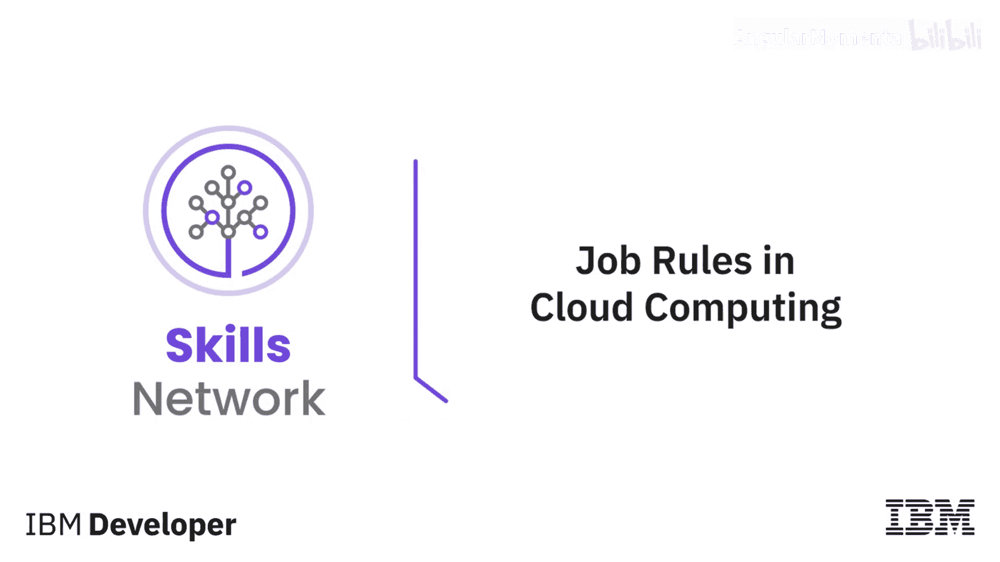
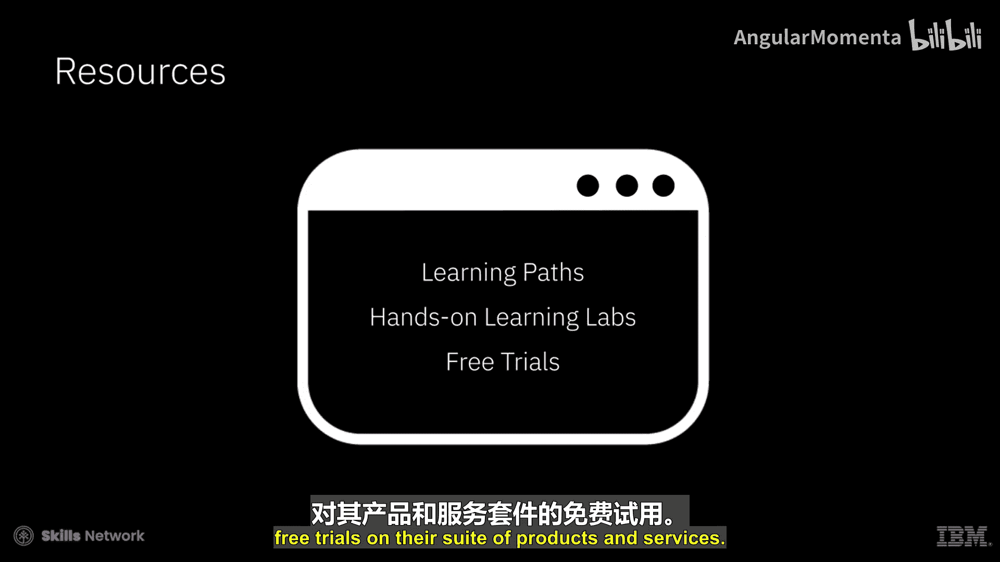
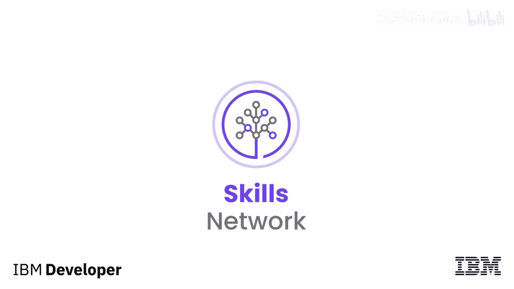

# 048：云计算领域的职业机遇与岗位角色 🚀

在本节课中，我们将要学习云计算领域当前的人才需求状况，并详细介绍该领域内几种常见的核心岗位角色及其职责与技能要求。

随着越来越多的企业将关键业务流程和应用迁移到混合云基础设施上，云计算已成为企业数字化转型战略的关键组成部分。因此，市场对合格的云计算专业人才需求旺盛。Grandview Research估计，云计算市场将以14.1%的年复合增长率增长，到2030年收入将达到15549.4亿美元。雇主的需求超过了合格候选人的数量，Gartner Talent Neuron数据库对需要云计算技能的职位招聘难度评分为78分，这意味着雇主很难为云技术相关职位找到合适的申请人。

该领域内有许多专业方向。以下是当前一些常见角色的介绍。

## 常见云计算岗位角色

以下是云计算领域内几种核心的技术岗位及其主要职责。

1.  **云开发人员 / 云软件工程师**
    *   他们参与软件开发生命周期的所有阶段，负责编写、测试和维护代码。
    *   他们需要处理应用程序的前端和后端，以及应用程序运行所依赖的平台和系统。
    *   云开发人员需要具备技术技能、业务知识，并至少熟悉一家主流云服务提供商。
    *   所需技术技能通常包括：数据结构、分布式系统、操作系统和算法知识；数据库使用经验；熟练掌握常用的Web应用开发语言，如 `Python`、`JavaScript`、`Java`、`HTML` 和 `CSS`。

2.  **云集成专家**
    *   他们负责将新的云服务、应用程序和基础设施集成到组织的内部系统和现有云服务组合中。
    *   这些专家评估不同解决方案在内外系统集成方面的影响和权衡，优化集成和用户体验，并确保性能标准符合与企业达成的服务级别协议。

3.  **云数据工程师**
    *   他们负责设计、开发和部署可扩展的数据管道和数据服务。
    *   他们致力于将新的数据管理技术和软件工程工具集成到现有基础设施中。
    *   其职责包括：理解现有系统，以推荐不同数据集的自动化集成方案；与数据科学家和研究人员合作开发预测模型和概念验证；推广最佳实践，帮助团队加速数据消费和理解；通过引入新的工程流程和工具来提高整体效率。

4.  **云安全工程师**
    *   他们提供保护组织系统和应用程序数据的机密性、完整性和可用性所需的系统和流程方面的专业知识。
    *   他们确定安全要求，规划、实施和测试安全系统，执行威胁模拟以检测潜在风险，并推荐能够增强基于云的环境安全性的创新技术。
    *   云安全工程师需要深入了解云平台和服务、软件设计模式以及DevOps工具和方法论。

5.  **云DevOps工程师**
    *   他们与开发和运维团队协作，为软件和更新创建可靠且快速的发布管道。
    *   这通常涉及：创建自定义自动化工具；构建和维护配置与部署框架；跟踪设计缺陷并为开发人员自动化调试过程；维护和部署基于Web的应用程序；监控安全问题；根据预期的业务成果衡量性能。
    *   容器化专业知识日益成为DevOps工程师的必备技能。

6.  **云解决方案架构师**
    *   他们致力于将业务需求转化为应用架构和设计。
    *   云架构师角色所需的一些技术技能包括：对云平台和服务的深入了解；对软件设计模式的深刻理解；了解DevOps工具和方法论；良好的网络知识；对关键安全概念的高层次理解。
    *   解决方案架构师与云开发人员、网络专家、安全工程师、集成专家和DevOps工程师密切合作，共同架构和设计解决方案。

## 学习资源与路径

上一节我们介绍了主要的岗位角色，本节中我们来看看如何获取相关技能。有多种资源可用于学习云技术，其交付形式多样，包括讲师指导课程、自定进度的在线课程、在线视频、书籍以及技术社区论坛。

许多云服务提供商都设有专门的学习门户，提供涵盖其全部云技术和服务的广泛资源。他们提供以下支持：

*   **学习路径**：根据特定的职业角色提供相应的学习资源。
*   **动手实验**：提供交互式学习资源，可按角色、级别或产品进行筛选。
*   **免费试用**：提供其产品和服务套装的免费试用。

本节课中我们一起学习了云计算领域强劲的人才市场需求，并详细了解了云开发、集成、数据工程、安全、DevOps和解决方案架构等核心岗位的职责与技能要求。同时，我们也认识到，通过主流云厂商提供的丰富学习路径和资源，可以系统地构建相关技能，为进入这一高增长领域做好准备。