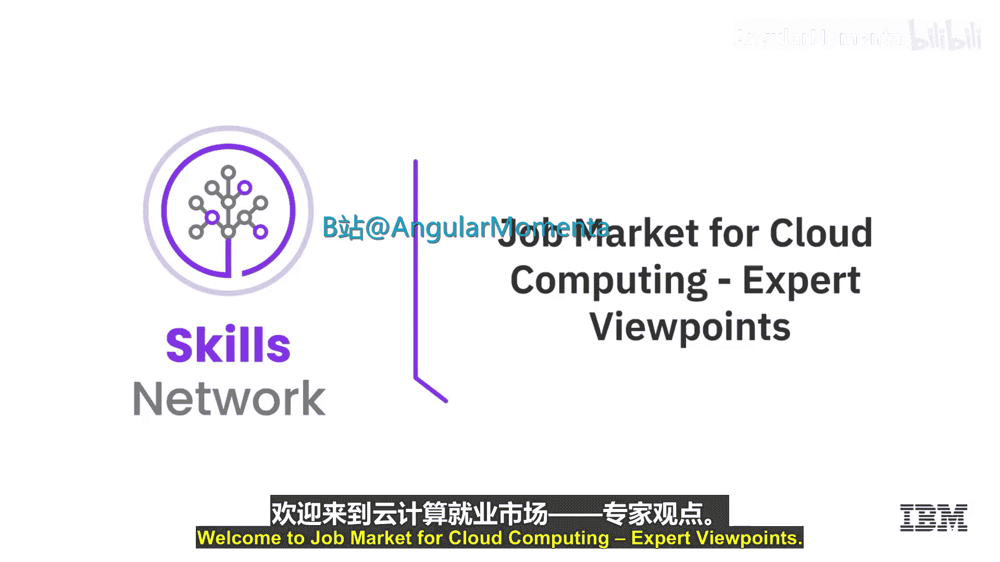
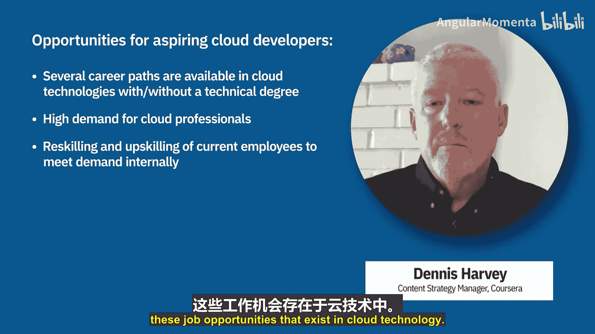

云计算导论：05_02_03：专家观点：云计算就业市场 💼

在本节中，我们将聆听几位云计算应用专家的观点，了解云计算领域的就业市场现状、为有志进入该领域的人士提供的机会，以及他们对未来机遇的展望。

随着越来越多的公司采用某种形式的云服务并变得更加“云化”，对于有抱负的软件开发者而言，机会并不缺乏。

以下是云计算领域一些主要的职业角色：

*   **云架构师**：负责思考如何设计应用程序架构。需要指出的是，为分布式云环境开发应用，与在单一服务器上开发单体应用，其架构思路大相径庭。这是一个非常突出的角色。
*   **数据工程师**：专注于构建数据管道，使数据能够从源数据库和其他存储系统流向可能大规模部署在云上的数据科学模型。
*   **云安全工程师**：这个角色非常重要，其职责是确保云环境的各个层面对于开发者和最终用户都是安全的。

因此，对于考虑进入云计算领域的人来说，机会非常多。

你可能会惊讶于仍有大量公司尚未上云。但很明显，它们最终都会转向云端，原因正如我们之前讨论过的，云在诸多方面都更具优势。然而，目前市场上没有足够的人才来满足所有这些需求，并且这种需求将持续增长。

实际上，关于云的知识浩如烟海，一个人不可能全部掌握。所以，如果你能深入掌握一两个云相关的领域，就已经能为某些公司创造巨大价值。

例如，即使你只是对某一存储服务和某一计算服务有深入或不错的了解，这对许多公司来说就已经非常有价值了。对于刚起步的人，我建议：

**获取一项认证**。我最初在云领域毫无经验，但通过获得一项云认证，我立刻在招聘者眼中变得更为突出，并因此获得了一份工作。所以，如果你的简历上缺乏相关经验，可以从获取认证开始。

根据你的兴趣领域，你可以进入云计算下的不同方向：

*   **如果你喜欢编程**，可以成为一名**云应用开发者**。你需要掌握前端和后端技术知识，如 Python、Java、Angular、React 等。同时还需要具备数据库技能，包括关系型数据库（如 SQL、MySQL）和非关系型数据库（如 HBase、MongoDB 等）。
*   **机器学习和人工智能的需求正在快速增长**。你需要对机器学习概念有良好的理解，并具备处理和操作大数据的能力。你可以选择成为**大数据科学家**或**机器学习工程师**。
*   **市场也需要专精于云安全技能的专家**。这些专业人士需要理解云安全，并能有效利用各组织提供的云安全工具。
*   **云计算的另一个机会领域是 DevOps**。DevOps 工程师需要理解 Docker、Kubernetes、GitHub 等工具，并应专注于理解 CI/CD 流水线，实现开发和部署过程的自动化。

总而言之，云技术领域存在着无数的职业路径，包括为拥有或没有学士学位、或拥有非技术类大学学位的人提供的专业选择。公司们难以找到足够多的受过云技术培训的人才，因此机会和需求无疑是存在的。此外，各公司也正专注于通过内部再培训和技能提升来满足这一需求。像 Coursera 这样的平台也致力于帮助没有大学学位或正在转行的人们，获得存在于云技术领域的这些工作机会。

在本节中，我们一起探讨了云计算就业市场的广阔前景、多样化的职业角色以及入行的实用建议。专家们指出，市场需求旺盛而人才供给不足，这为初学者和转行者提供了绝佳的机会。通过专注于特定技能、获取认证，并选择符合个人兴趣的细分领域，任何人都可以开启在云计算领域的成功职业生涯。