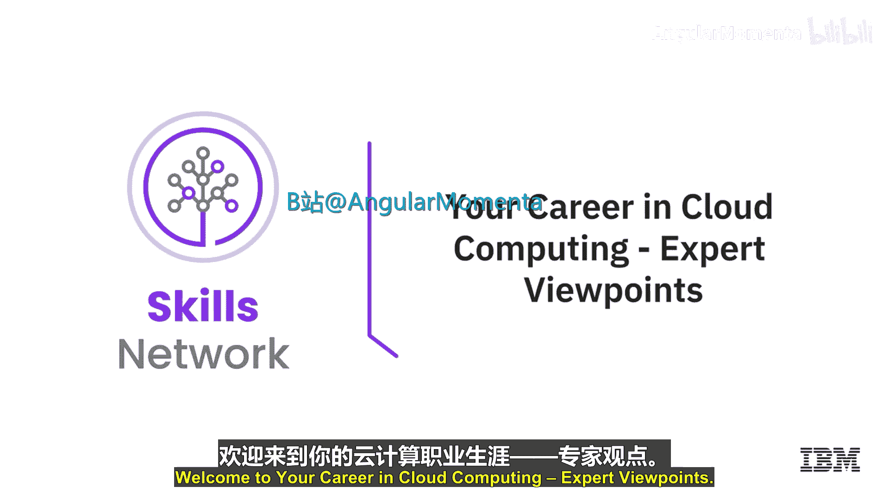
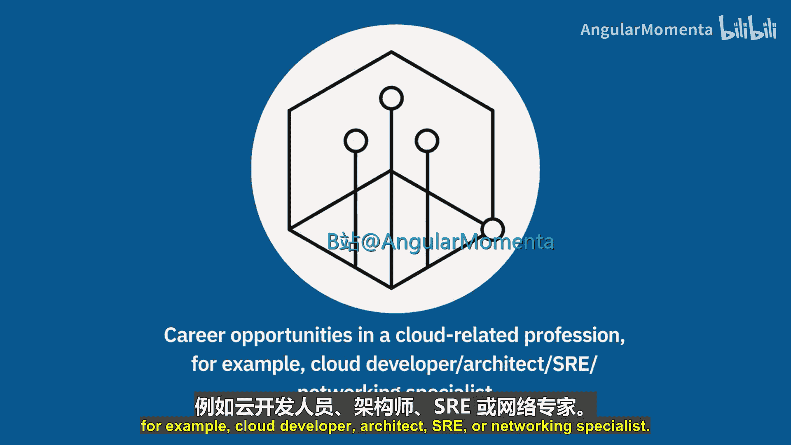
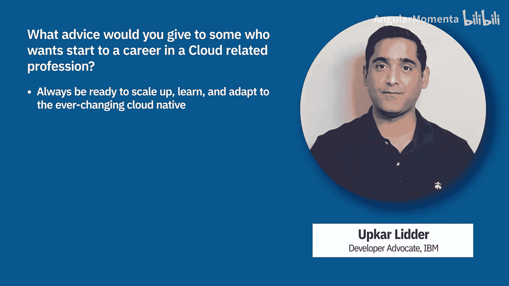

# 050：您的云计算职业生涯 🚀

在本节课中，我们将聆听多位云计算应用专家的见解，共同探讨云计算领域的职业机会，例如云开发工程师、架构师、站点可靠性工程师或网络专家。专家们将分享宝贵的入门建议与职业发展路径。

## 入门基础：理解核心差异

首先，云原生领域非常多样化，其复杂性可能令人望而生畏。当你看到云原生计算基金会展示的、包含不同层级和众多解决方案的图谱时，可能会迅速感到不知所措。

因此，我给任何进入云计算领域的人的第一条建议是：**扎实掌握和理解基础知识**。

你需要思考，为云环境开发应用与在你的笔记本电脑、单台服务器或小型集群上开发有何不同。具体来说，应关注如何为云计算世界设计不同的应用架构，以及如何将其拆分为多个相互通信的小型服务，而不是构建一个庞大的单体应用，并理解这样做的重要性。

## 实践路径：从学习到项目

上一节我们强调了基础的重要性，本节中我们来看看如何通过实践来巩固学习。

如果你想从事云计算相关职业，首先要认识到：几乎所有实际专业人士使用的工具都是可获取的。其中许多是开源的，许多都有免费版本，可以直接在互联网上找到。

因此，我认为最重要的事情就是**动手实践**。使用专业人士使用的工具，开始学习。互联网上有大量免费的教育资源和材料，足以让你学到绝大部分所需知识。但仅仅阅读是远远不够的。

所以，请使用这些工具、运行代码、编写代码、做任何你需要做的事情。坦率地说，如果你能开始创建自己的项目，这在我看来将成为吸引招聘人员的最重要因素之一。我认为，持续学习并始终将所学应用于项目（无论是在家、在工作还是在学校的项目）至关重要。

我给初学者的第二条建议是：**尝试不同的云平台**，观察在这些不同平台上如何设计和构建应用。通过研究不同的架构，你可以学到很多。

## 职业启动：分步行动指南

理解了基础并开始实践后，接下来我们系统性地看看如何启动云计算职业生涯。

以下是启动云计算相关职业的具体步骤：

1.  **自主学习**：从不同来源开始自学。可以从学习基本的云概念入手。
2.  **探索机会**：了解云计算提供的各种职业机会。
3.  **选择方向**：一旦明确最感兴趣的职业方向，就报名参加相应的专业课程。
4.  **项目实践**：通过创建自己的项目并将其托管在GitHub仓库中，来获取扎实的知识。
5.  **获取认证**：对自己的技能有信心后，获取认证总是一个好主意。
6.  **保持规划**：随时了解公司中的不同机会，并保持职业规划。

## 专家建议：认证、实践与持续学习

综合多位专家的观点，我们可以总结出以下关键建议。

**关于认证的价值**：
我给那些考虑成为云架构师但缺乏多年经验的人的建议是：先从获取一个或几个认证开始。这将使你立即在招聘人员面前获得认可。即使你没有在生产环境中亲身犯错的实战经验，你也将能够理解服务的高层概念，并在需要时深入细节。

**关于实践的重要性**：
在云计算开发中，你必须适应持续学习。所有服务都在不断变化，你很难成为某个领域的永久专家，因为一切都在更新。因此，要适应所有的不确定性。我建议从一家或多家云提供商（如IBM、AWS、微软或谷歌云）获取认证。为此，我建议利用像Coursera提供的性价比高的在线课程，以确保你获得通过认证考试以及胜任目标工作所需的知识。

**关于持续学习**：
我建议用一些实践经验来补充你的认证，这些经验可以通过工作获得，也可以通过利用Coursera上的指导项目获得，甚至可以通过实验自己的动手项目来获得。以Coursera的指导项目为例，它们旨在让你在大约两小时内获得某项技能的实践经验。在云中尝试各种操作，动手实践，在云中启动一台虚拟机，启动一个函数，编写一个函数，让它连接到一个队列，再触发另一个函数。尝试在云中将各种组件连接在一起。

关于职业建议还有一点：一旦你获得云认证，请将其添加到LinkedIn个人资料中。因为招聘人员会搜索云认证，这几乎能为你保证获得面试机会。

我最后的建议是：**始终保持技能更新的准备**。云原生领域的变化非常快，你必须保持警觉，不断学习新技术和新框架。

## 课程总结

本节课中，我们一起学习了多位云计算专家对职业生涯的宝贵建议。核心要点包括：**扎实掌握云基础原理**、**通过动手项目和工具使用来积累实践经验**、**考取权威认证以验证技能**、**积极尝试不同云平台**，以及最重要的——**培养持续学习的能力以适应快速变化的技术环境**。记住，将所学应用于实际项目并展示出来，是开启云计算职业生涯的关键一步。