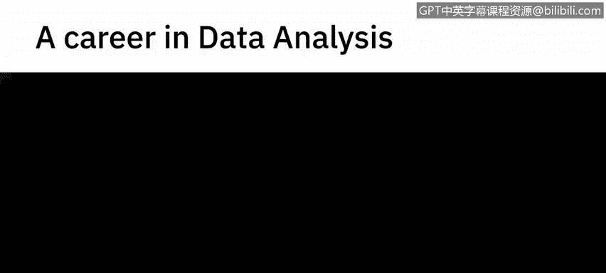
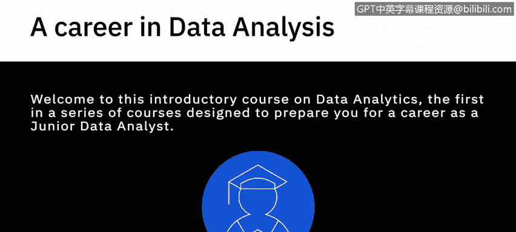
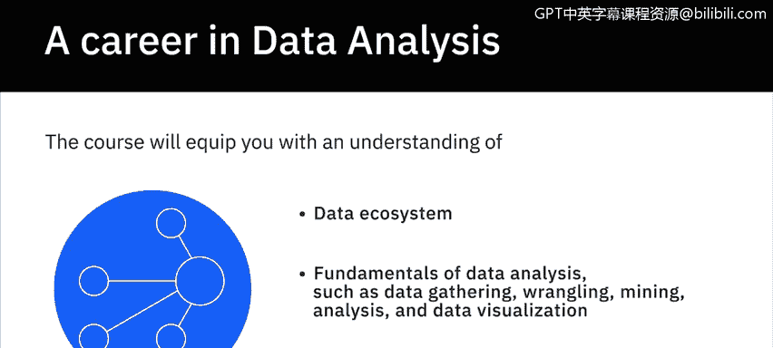
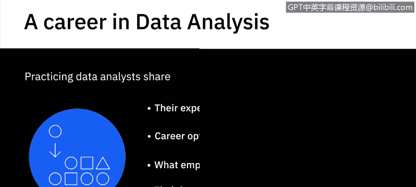
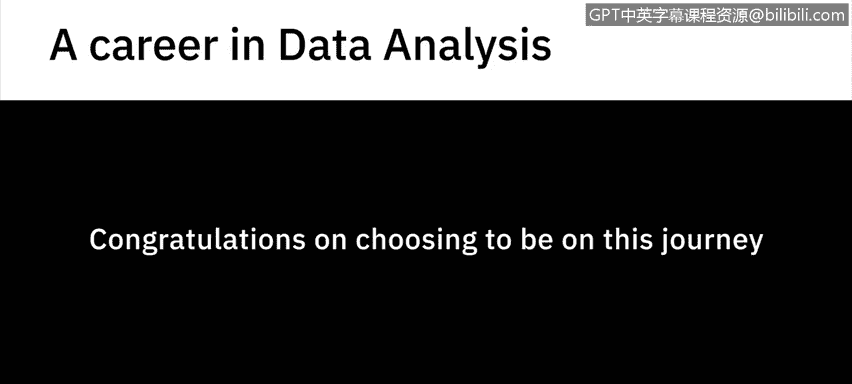

# 001：《数据分析简介》📊

## 概述

在本节课中，我们将学习《数据分析简介》课程的整体介绍。课程将阐述数据分析的重要性、适用人群以及你将学到的核心内容，为你开启数据分析师职业生涯奠定基础。

---

欢迎来到数据分析入门课程。

这是系列课程中的第一门，旨在为你成为一名初级数据分析师做好准备。

引用一份福雷斯特咨询公司关于数据变革商业力量的报告：
> 当今企业认识到数据及数据分析中蕴含的未开发价值，并将其视为商业竞争力的关键因素。

为了推动其数据与分析计划，公司正在招聘和提升员工技能。

他们正在扩大团队并建立卓越中心，以便在组织内建立多管齐下的数据与分析实践。

与此同时，熟练的数据分析师存在显著的供需不匹配。

这使得数据分析师成为一个备受追捧且薪酬丰厚的职业。

你可以选择将掌握数据分析作为职业道路，或将其作为跳板，扩展到其他数据专业领域，例如数据科学、数据工程、商业分析和商业智能分析。

本课程适合以下人群：任何专业的应届毕业生、考虑中期职业转型的在职专业人士、数据驱动型决策者或任何与数据分析相关的角色。

本课程将向你介绍进入数据分析领域所需的核心概念、流程和工具。

它甚至可以帮助你强化当前作为数据驱动决策者的角色。

它将使你了解数据生态系统和数据分析的基础知识，例如数据收集、整理、挖掘、分析和数据可视化。

你还将体验数据分析师的日常工作。

---

## 实践分享

上一节我们了解了课程的整体目标，本节中我们来看看从业者的经验分享。

以下是来自实践中的数据分析师分享的经验：

*   他们分享了进入该领域的经验。
*   他们讨论了你可以考虑的职业选择和学习路径。
*   他们说明了雇主在数据分析师身上寻找的特质。
*   他们还分享了关于数据分析过程中某些方面的知识和最佳实践。

---

前方的道路对数据分析领域和你个人而言都令人兴奋。

祝贺你选择踏上这段旅程，祝你好运。

---

## 总结

本节课中我们一起学习了《数据分析简介》课程的概述。我们了解到数据分析在现代商业中的关键作用，明确了本课程的目标人群与学习价值，并对课程内容和从业者经验分享有了初步认识。这为后续深入学习数据分析的具体技能和流程做好了准备。