# 002：现代数据生态系统 🌐

在本节课中，我们将要学习现代数据生态系统的构成及其关键组成部分。我们将了解数据如何从各种源头被采集、处理，并最终服务于不同的用户和应用程序。

---

根据《福布斯》2020年一份关于未来十年数据的报告，数据处理速度与带宽的持续提升、用于创建、共享和消费数据的新工具不断涌现，以及全球范围内新的数据创建者和消费者的稳定增加，共同确保了数据的增长势头不减。数据会催生更多数据，形成一个持续不断的良性循环。

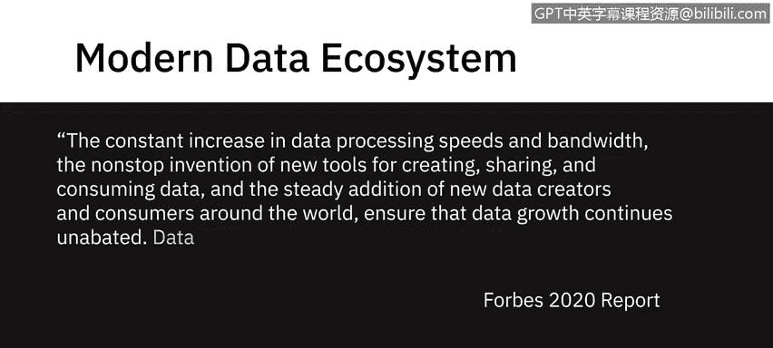

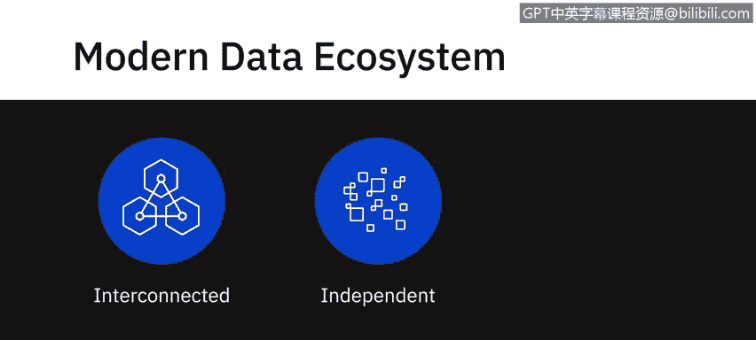

一个现代数据生态系统包含一个由相互关联、独立且不断演进的实体组成的完整网络。

它包含需要从不同来源整合的数据、用于生成洞察的不同类型的分析与技能、积极协作并根据生成的洞察采取行动的活跃利益相关者，以及用于按需存储、处理和传播数据的工具、应用程序和基础设施。

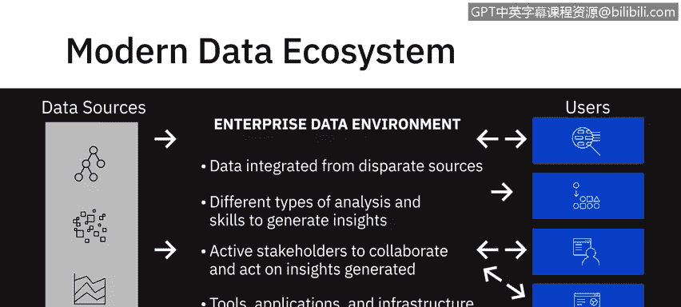

---

上一节我们介绍了现代数据生态系统的整体概念，本节中我们来看看它的第一个关键环节：数据来源。

数据以各种结构化和非结构化数据集的形式存在，来源极其多样和动态。以下是主要的数据来源类型：
*   文本、图像、视频
*   点击流、用户对话
*   社交媒体平台
*   物联网设备
*   实时数据流事件
*   遗留数据库
*   专业数据提供商和机构

当处理如此多不同的数据源时，第一步是将数据从原始来源提取到数据存储库中。在此阶段，重点是获取所需数据，并处理数据格式、来源和提取接口。数据获取的**可靠性、安全性和完整性**是此阶段需要应对的主要挑战。

---

在数据被采集之后，接下来需要对其进行组织、清理和优化，以供最终用户访问。

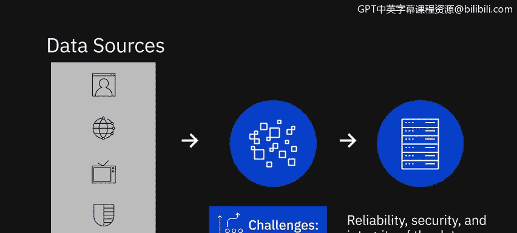

数据还需要符合组织内部执行的合规性与标准。例如，遵守关于存储和使用个人数据（如健康、生物识别或物联网设备中的家庭数据）的法规指南。

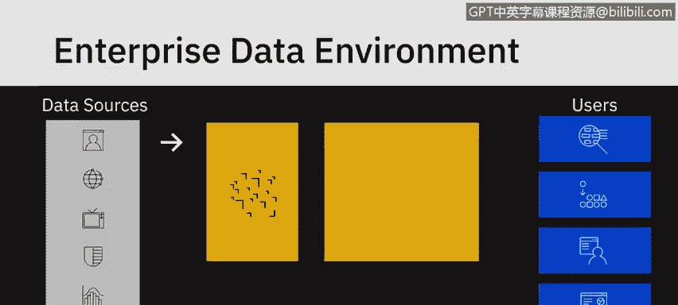
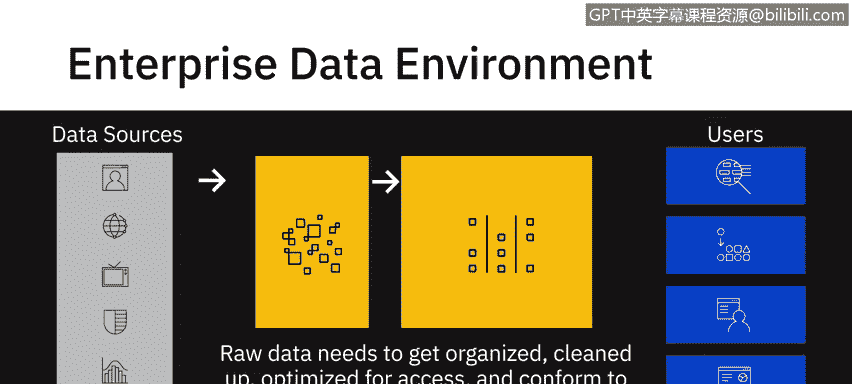

另一个例子是遵循组织内的主数据表，以确保主数据在组织所有应用和系统中的标准化。此阶段的关键挑战可能涉及**数据管理**，以及使用能提供**高可用性、灵活性、可访问性和安全性**的数据存储库。

---

数据经过处理后，最终将服务于各类用户和应用。现在，我们来看看数据如何被消费。

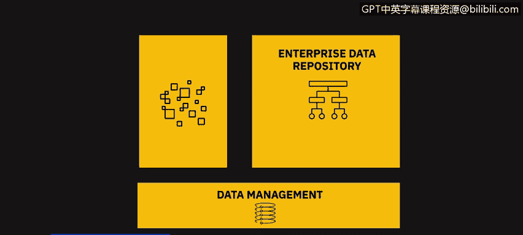

最终，我们的业务利益相关者、应用程序、程序员、分析师和数据科学用例都会从企业数据存储库中提取这些数据。

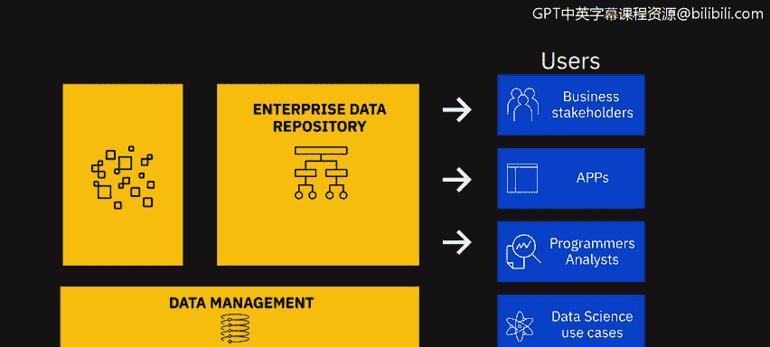

此阶段的关键挑战可能包括能够根据用户特定需求将数据送达最终用户的**接口、API 和应用程序**。

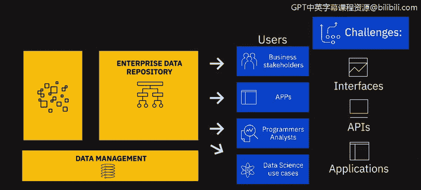

例如：
*   **数据分析师**可能需要原始数据进行处理。
*   **业务利益相关者**可能需要报告和仪表板。
*   **应用程序**可能需要自定义 API 来提取数据。

---

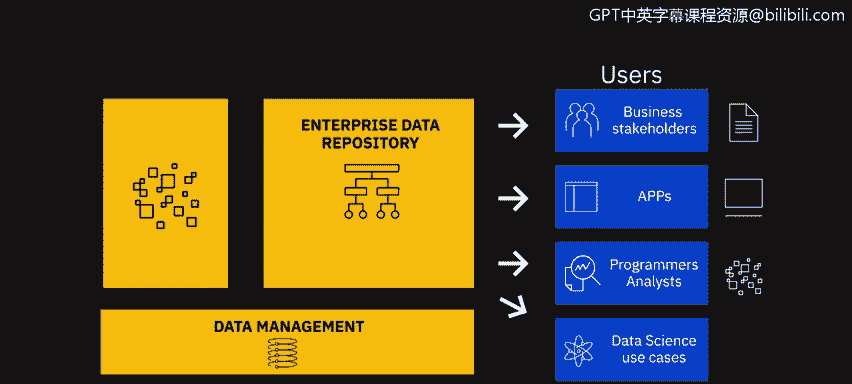

现代数据生态系统的演进离不开新技术的推动。最后，我们来了解一些正在塑造当今数据生态系统及其可能性的新兴技术。

值得注意的是，一些新兴技术正在塑造当今的数据生态系统及其可能性，例如**云计算、机器学习和大数据**等。

得益于云技术，当今每个企业都能获得近乎无限的存储、高性能计算、开源技术、机器学习技术以及最新的工具和库。数据科学家通过用历史数据训练机器学习算法来创建预测模型。

😊

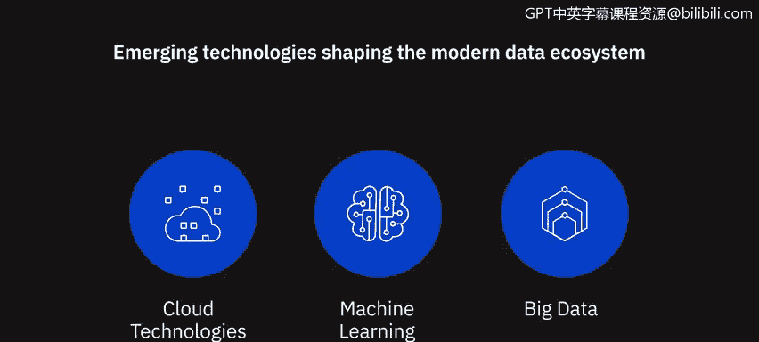

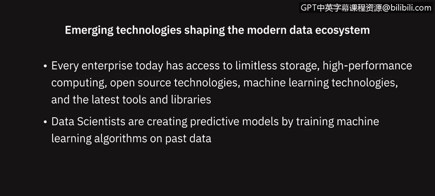

此外，大数据意味着我们正在处理的数据集如此庞大和多样，以至于传统工具和分析方法已不再适用，这为新工具、新技术以及新知识和洞察铺平了道路。我们将在本课程后续部分进一步了解大数据及其对商业决策的影响。

---

本节课中我们一起学习了现代数据生态系统的完整流程：从多样化的**数据来源**，到数据的**采集与整合**，再到数据的**处理与治理**，最后到数据的**消费与应用**。我们还看到了**云计算、机器学习和大数据**等关键技术如何驱动这一生态系统不断演进。理解这个生态系统是成为一名合格数据分析师的重要基础。