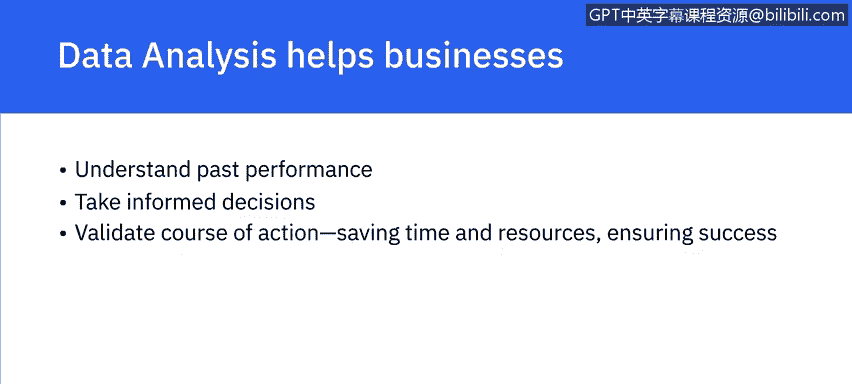
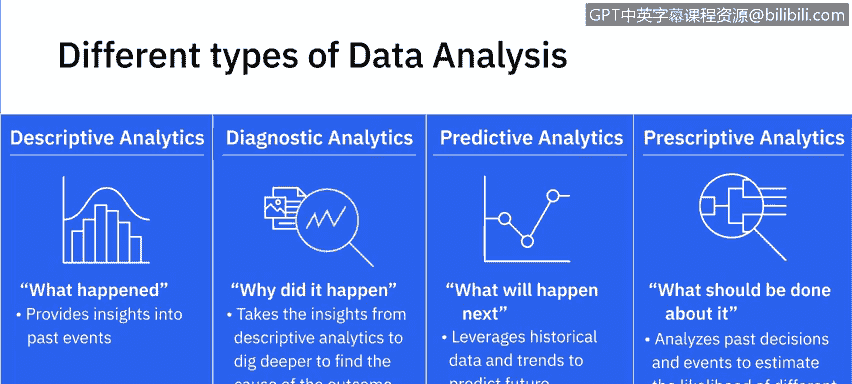
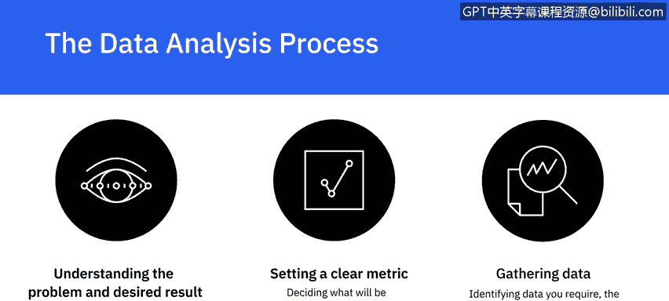
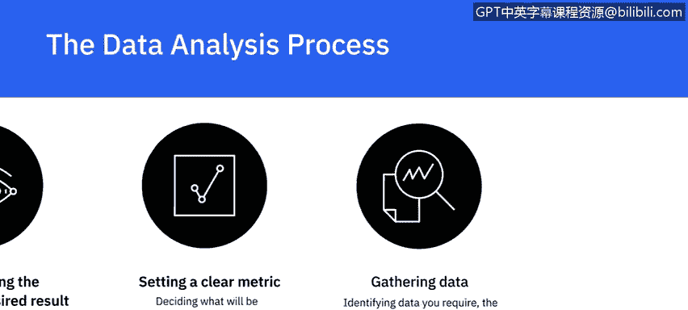
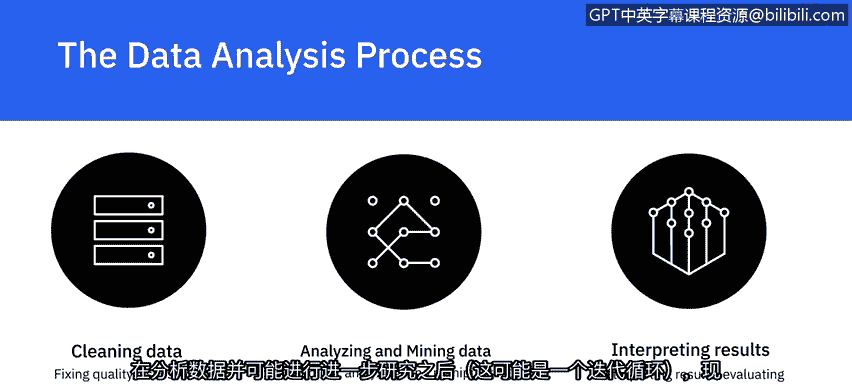

# 004：定义数据分析

在本节课中，我们将学习数据分析的定义、主要类型以及其核心流程。数据分析是一个系统性的过程，旨在从数据中提取有价值的信息，以支持决策制定。

---

## 🔍 什么是数据分析？

数据分析是**收集、清洗、分析、挖掘数据，解释结果，并报告发现**的过程。

通过数据分析，我们能在数据中发现**模式**以及不同数据点之间的**关联**。正是通过这些模式和关联，我们得以生成见解并得出结论。

数据分析帮助企业理解其过去的表现，并为未来的行动决策提供信息。通过数据分析，企业可以在投入资源前验证行动方案的可行性，从而节省宝贵的时间和资源，并确保更高的成功率。

---

## 📈 数据分析的四种主要类型

上一节我们介绍了数据分析的基本概念，本节中我们来看看数据分析的四种主要类型。每种类型在数据分析过程中都有不同的目标和位置。

以下是四种主要的数据分析类型：

1.  **描述性分析**
    *   目标：帮助回答“**发生了什么**”的问题。
    *   方法：通过总结过去的数据并向利益相关者呈现结果来实现。
    *   作用：提供对过去事件的基本见解。
    *   示例：基于组织的关键绩效指标跟踪过去表现，或进行现金流分析。

2.  **诊断性分析**
    *   目标：帮助回答“**为什么会发生**”的问题。
    *   方法：利用描述性分析得出的见解，更深入地挖掘结果的原因。
    *   示例：网站流量在无明显原因的情况下突然变化，或某个区域在营销策略未变的情况下销售额增加。

3.  **预测性分析**
    *   目标：帮助回答“**接下来会发生什么**”的问题。
    *   方法：使用历史数据和趋势来预测未来结果。
    *   作用：其目的不是断言未来一定会发生什么，而是**预测未来可能发生的情况**。所有预测本质上都是概率性的。
    *   应用领域：企业将其应用于风险评估和销售预测等领域。

4.  **规范性分析**
    *   目标：帮助回答“**对此应该做什么**”的问题。
    *   方法：通过分析过去的决策和事件，估计不同结果的可能性，并据此决定行动方案。
    *   示例：自动驾驶汽车分析环境以做出关于速度、变道、路线选择等决策；航空公司根据客户需求、油价、天气或联程路线的交通状况自动调整机票价格。

---

## 🛠️ 数据分析的关键步骤

了解了数据分析的类型后，我们来看看任何数据分析过程都包含的一些关键步骤。这个过程是一个系统性的工作流。

以下是数据分析流程的关键步骤：

1.  **理解问题与期望结果**
    *   数据分析始于理解需要解决的问题和需要达成的期望结果。
    *   在分析过程开始之前，必须明确定义“现状”和“目标”。

2.  **设定清晰的指标**
    *   此阶段包括决定**测量什么**（例如，某个区域产品X的销售量）以及**如何测量**（例如，在一个季度内或在某个节日期间）。

3.  **收集数据**
    *   一旦明确了测量内容和方式，就需要确定所需的数据、需要从中提取数据的数据源，以及完成这项工作的最佳工具。

4.  **清洗数据**
    *   收集数据后，下一步是修复数据中可能影响分析准确性的质量问题。
    *   这是一个关键步骤，因为**只有数据干净，才能确保分析的准确性**。
    *   清洗工作包括处理缺失值、不完整值以及异常值。
    *   示例：在客户人口统计数据中，年龄字段值为150就是一个异常值。
    *   此外，还需要对来自多个来源的数据进行**标准化**处理。

5.  **分析与挖掘数据**
    *   数据清洗干净后，将从不同角度提取和分析数据。
    *   可能需要以多种不同方式操作数据，以理解趋势、识别关联、发现模式和变化。

6.  **解释结果**
    *   在分析数据并可能进行进一步研究（这可能是一个迭代循环）之后，就到了解释结果的时候。
    *   在解释结果时，需要评估你的分析是否能够经得起质疑，以及是否存在任何局限性或特定情况，使得你的分析可能不成立。

7.  **呈现你的发现**
    *   最终，任何分析的目标都是影响决策。
    *   以清晰且有影响力的方式沟通和呈现你的发现，是数据分析过程中与分析本身同等重要的一部分。
    *   报告、仪表板、图表、图形、地图和案例研究等都是呈现数据的有效方式。

---

## 📝 总结

本节课中，我们一起学习了数据分析的核心定义。我们了解到数据分析是一个包含收集、清洗、分析、解释和报告的系统过程。我们探讨了四种主要的数据分析类型：描述性、诊断性、预测性和规范性分析，它们分别回答了“发生了什么”、“为什么发生”、“将发生什么”和“应该做什么”的问题。最后，我们梳理了数据分析的关键步骤，从理解问题到呈现发现，这是一个确保分析有效且能支持决策的完整工作流。掌握这些基础知识是成为一名合格数据分析师的第一步。