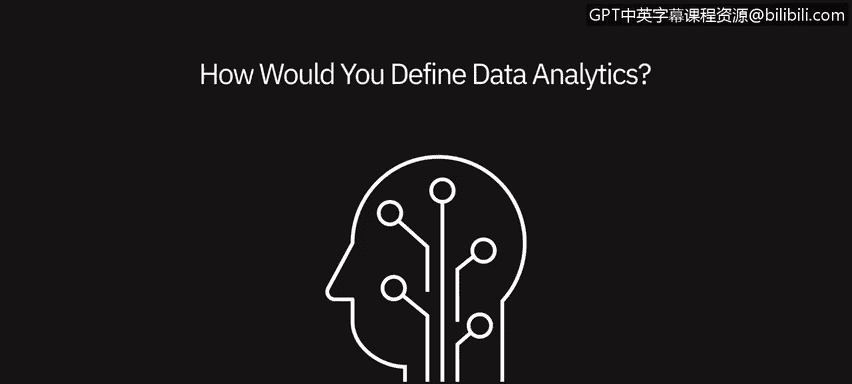
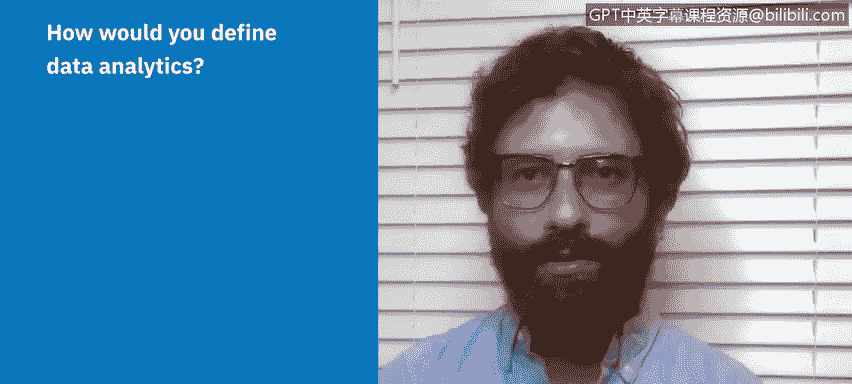
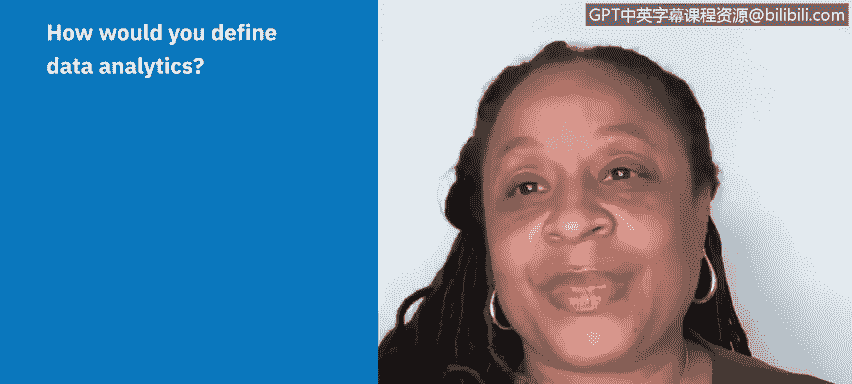
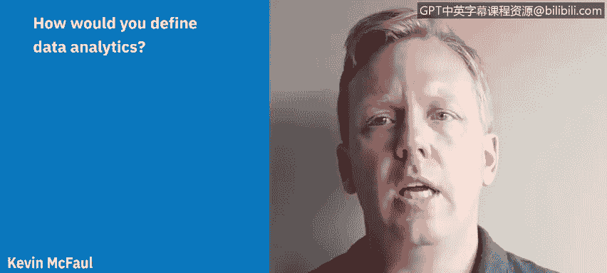

# 005：什么是数据分析 📊

## 概述

在本节课中，我们将聆听几位数据专业人士分享他们如何定义数据分析，以及这个术语对他们意味着什么。通过他们的视角，我们可以更全面地理解数据分析的本质和应用。

---

## 专业人士的观点

上一节我们了解了数据分析的基本概念，本节中我们来看看几位从业者是如何具体描述它的。

### 定义与过程

一位专业人士将数据分析定义为收集信息并分析这些信息以验证各种假设的过程。同时，数据分析也意味着用数据讲故事，清晰简洁地向周围的人传达世界的状态。

另一位专业人士的表述是：你遇到了一个问题，需要使用事实来检验一个假设。数据分析就在此发挥作用。这个过程从定义问题开始，然后你需要建立自己的假设并进行检验。为此，你需要**收集数据、清理数据、分析数据，然后向关键利益相关者展示结果**。

### 日常决策与商业应用

数据分析是利用周围的信息来做决策。就像你每天早上起床，看新闻时，天气预报会告诉你当天的温度和是否会下雨，这可能会决定你穿什么或能进行什么活动。因此，数据分析不是一个抽象概念，而是我们自然而然在做的事情，只是它现在有了一个技术名称，并且人们以此为职业，在更大规模或更宏大的场景中应用它，但其核心并不复杂。

在商业环境中，数据分析是任何可以用来审查信息、帮助你理解当前状况的数据集。以注册会计师为例，他们总是查看财务报表，分析数据以预测一家公司的过去、现在和未来走向。这些数据帮助他们看得更远，几乎可以预测所合作公司的未来。

### 核心流程与目标

数据分析是**清理、分析、呈现并最终分享数据及你的分析结果**的过程，目的是帮助准确传达你的业务或数据中正在发生的情况，以便做出更好的决策。

另一位定义是：数据分析是一个过程，或者说是一种现象，即从相关群体（如你的客户或社交受众）那里收集信息，将这些信息分解成子集，并利用这些数据来决策你想要提供的产品或服务。在我们所处的数字环境中，这也意味着决定发布哪些内容以吸引你的目标受众。

---

## 总结

本节课中，我们一起学习了多位数据专业人士对“数据分析”的定义。尽管表述角度不同，但核心都指向一个过程：**从定义问题或目标出发，收集和处理相关数据，通过分析验证假设或发现洞察，最终将结果清晰呈现以支持决策**。数据分析既是我们日常生活中的自然行为，也是一项可以系统化、专业化并创造巨大商业价值的技术活动。