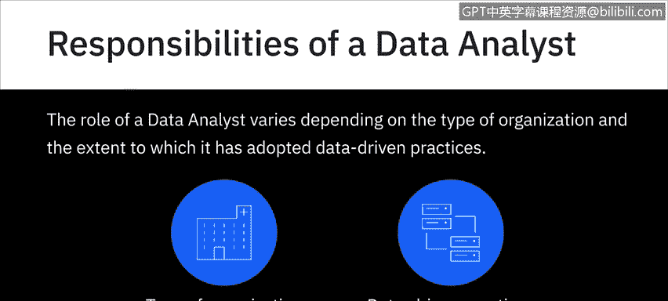
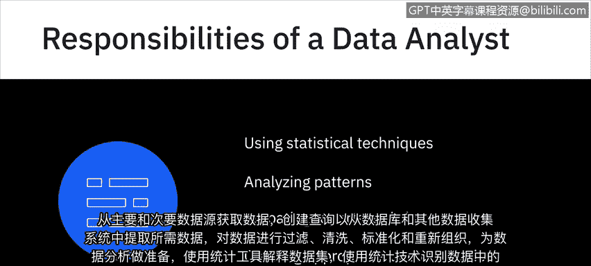
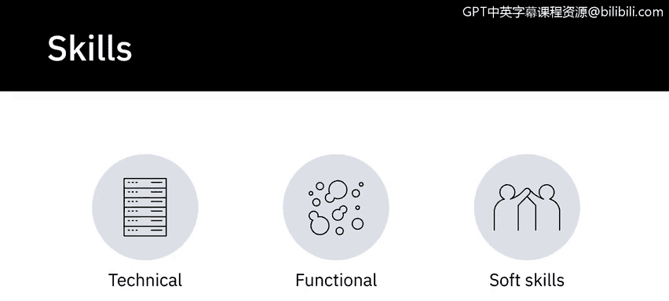
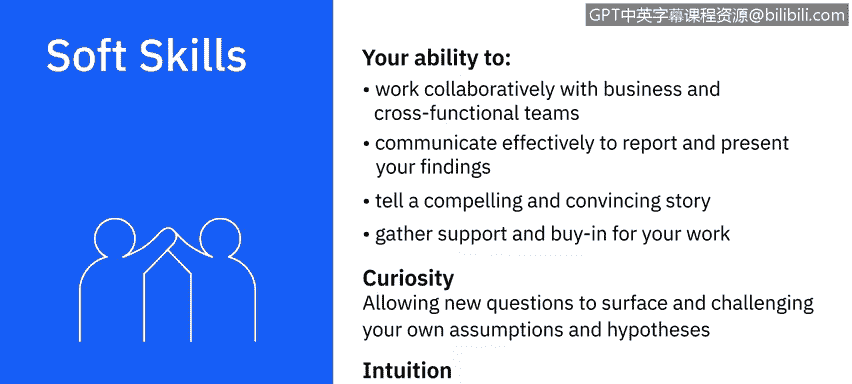

# 006：数据分析师的职责

在本节课中，我们将学习数据分析师在组织中的典型职责，以及成功履行这些职责所需的关键技能组合。我们将职责与技能对应起来，帮助你全面理解这一角色的要求。

## 📋 数据分析师的典型职责

虽然数据分析师的角色因组织类型及其数据实践采用程度而异，但在当今组织中，数据分析师通常承担一些共同的职责。

以下是数据分析师的核心职责列表：

*   **数据获取**：从主要和次要数据源获取数据。
*   **数据提取**：创建查询，从数据库和其他数据收集系统中提取所需数据。
*   **数据准备**：对数据进行过滤、清洗、标准化和重组，为分析做好准备。
*   **数据解读**：使用统计工具解读数据集。
*   **模式识别**：使用统计技术识别数据中的模式和相关性。
*   **趋势分析**：分析复杂数据集中的模式并解读趋势。
*   **结果呈现**：准备有效传达趋势和模式的报告与图表。
*   **流程记录**：创建适当的文档，以定义和展示数据分析过程的各个步骤。

## 🔧 数据分析师的关键技能

与上述职责相对应，我们来看看数据分析师需要具备哪些有价值的技能。数据分析过程需要技术技能、职能技能和软技能的结合。

### 技术技能

首先，我们看看作为数据分析师需要的一些技术技能。这些技能是你处理数据的工具箱。

以下是数据分析师所需的核心技术技能：

*   **电子表格精通**：熟练使用电子表格软件，如 Microsoft Excel 或 Google Sheets。
*   **分析可视化工具**：精通统计分析和可视化工具及软件，例如 IBM Cognos、IBM SPSS、Oracle Visual Analyzer、Microsoft Power BI 和 Tableau。
*   **编程语言**：至少精通一种编程语言，如 R 或 Python；在某些情况下，也可能需要 C++、Java 和 MATLAB。
*   **数据库查询**：熟练掌握 SQL，并具备在关系型和非 SQL 数据库中处理数据的能力。
*   **数据仓库操作**：能够访问和提取数据仓库（如数据集市、数据仓库、数据湖和数据管道）中的数据。
*   **大数据处理**：熟悉 Hadoop、Hive 和 Spark 等大数据处理工具。

> 我们将在课程后续部分更深入地了解其中一些编程语言、数据库、数据仓库和大数据处理工具的特性及用例。

### 职能技能

现在，让我们看看数据分析师角色所需的一些职能技能。这些技能帮助你更有效地理解和运用数据。

以下是数据分析师所需的职能技能列表：

*   **统计学知识**：精通统计学，以帮助你分析数据、验证分析结果并识别谬误和逻辑错误。
*   **分析能力**：具备帮助你研究和解读数据、建立理论并进行预测的分析能力。
*   **问题解决能力**：因为所有数据分析的最终目标都是解决问题。
*   **探究能力**：这对于发现过程至关重要，即从不同利益相关者和用户的角度理解问题，因为数据分析过程真正始于对问题陈述和期望结果的清晰阐述。
*   **数据可视化技能**：帮助你根据受众、数据类型、背景和分析的最终目标，决定有效呈现研究结果的技术和工具。
*   **项目管理技能**：用于管理项目流程、依赖关系和时间线。

### 软技能

这让我们来到了数据分析师的软技能部分。数据分析既是一门科学，也是一门艺术。你可以精通技术和职能专长，但成功的关键区别因素之一将是软技能。

以下是数据分析师成功所需的关键软技能：

*   **协作能力**：与业务部门和跨职能团队协作的能力。
*   **有效沟通**：有效沟通以报告和呈现你的发现。
*   **故事叙述能力**：讲述引人入胜且令人信服的故事，并为你的工作争取支持和认同。
*   **好奇心**：最重要的是，好奇心是数据分析的核心。在你的工作过程中，你会遇到可能指引你走向不同路径的模式、现象和异常。允许新问题浮现并挑战你的假设和假设的能力，是进行出色分析的关键。
*   **直觉**：你还会听到数据分析从业者将直觉视为必备品质。必须注意的是，这里的直觉是指基于模式识别和过去经验对未来有所感知的能力。

## 📝 课程总结

本节课中，我们一起学习了数据分析师的核心职责，包括从数据获取、清洗到分析、解读和呈现的全过程。同时，我们详细探讨了履行这些职责所需的三类关键技能：处理数据的技术技能、理解与应用数据的职能技能，以及促进协作与沟通的软技能。理解这些职责与技能的对应关系，是迈向成功数据分析师职业生涯的重要一步。