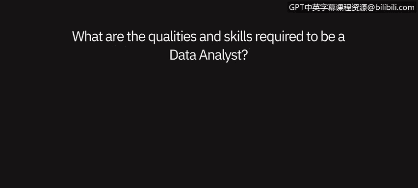
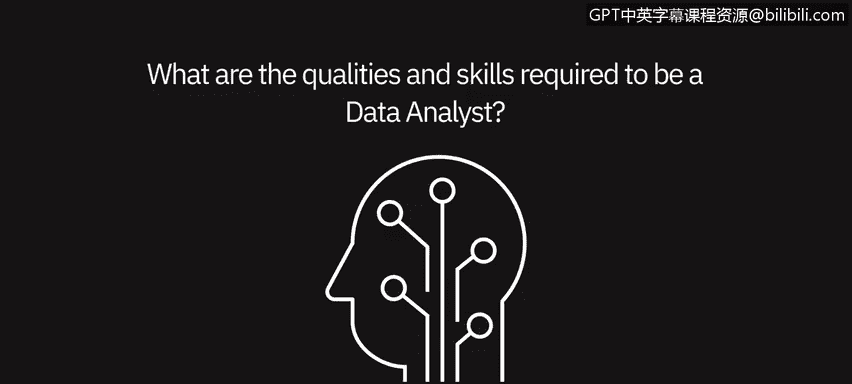

# 007：成为数据分析师的素质和技能 💼





在本节课中，我们将聆听从业的数据专业人士分享成为数据分析师所需的素质和技能。我们将这些内容归纳为软技能和硬技能两大类，并详细探讨每类中的关键要素。

---

## 概述

数据分析师需要具备一系列特定的素质和技能，以有效地处理数据、发现洞察并支持决策。本节将介绍从业者眼中成功数据分析师的核心特质。

---

## 软技能：成功的基础

上一节我们概述了课程内容，本节中我们来看看数据分析师需要具备哪些软技能。软技能涉及个人特质和人际交往能力，是理解业务需求、有效沟通和持续学习的基础。

以下是几位从业者强调的关键软技能：

*   **好奇心**：主动探索数据，即使在没有明确问题的情况下也乐于寻找答案和模式。
*   **注重细节**：能够深入观察，不满足于表面信息，例如对比不同时期的数据以发现异常。
*   **持续学习的心态**：由于技术领域发展迅速，需要愿意不断学习新工具和方法以适应变化。
*   **沟通与理解能力**：仔细倾听，理解用户和同事的视角，明确他们从数据中最需要获得什么。
*   **商业敏锐度**：知道在特定情境下应使用哪些数据和工具，以及如何向利益相关者清晰呈现数据。

---

## 硬技能：必备的技术工具

了解了软技能的重要性后，我们来看看支撑数据分析工作的硬技能。硬技能主要指具体的技术和工具使用能力，是执行数据分析任务的核心。

以下是数据分析师需要掌握的关键硬技能：

*   **SQL**：这是**最重要**的技能。几乎所有从数据库提取数据的场景都需要使用SQL。掌握扎实的SQL技能至关重要。
    ```sql
    -- 示例：从“销售表”中查询2023年的数据
    SELECT * FROM sales WHERE year = 2023;
    ```
*   **编程语言**：Python和R是进行数据分析的两大主要编程语言。作为新手，无需同时精通两者，但熟练掌握其中一种将对职业生涯大有裨益。
    ```python
    # 示例：使用Python的pandas库加载数据
    import pandas as pd
    data = pd.read_csv('sales_data.csv')
    ```
*   **数据可视化**：需要精通至少一种数据可视化工具（如Tableau、Power BI），并理解数据可视化的通用原则，以便清晰、简洁地呈现洞察。
*   **端到端数据处理能力**：现代数据分析师的工作流程是动态的，需要能够：定义待解决的问题 → 使用SQL从数据湖中提取并整合所需数据 → 清理、整理、处理数据 → 挖掘洞察 → 通过可视化和仪表板讲述数据故事。

---

## 总结

本节课中，我们一起学习了成为数据分析师所需的核心素质和技能。我们了解到，**软技能**（如好奇心、注重细节和沟通能力）与**硬技能**（如SQL、编程和可视化）同等重要。一名优秀的数据分析师需要将技术能力与对业务的理解、批判性思维和讲故事的能力相结合，从而从数据中提取有价值的见解并推动有效决策。