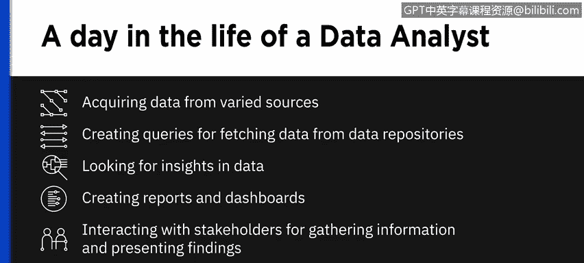
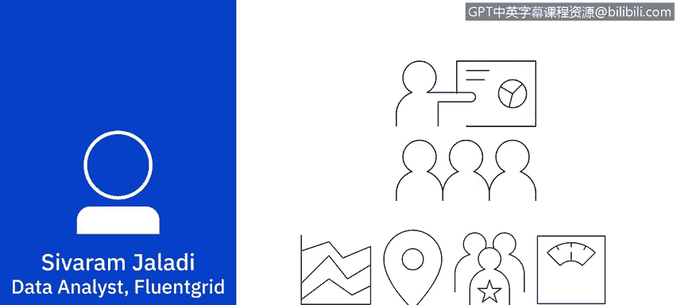

# 008：数据分析师的日常生活

在本节课中，我们将通过一位数据分析师的实际工作案例，了解数据分析师日常工作中的一项核心任务：从数据中寻找洞察。我们将跟随一位分析师，探索如何通过系统性的分析来解决一个具体的业务问题。

---

数据分析师的日常工作包含多种可能性。从获取多样化的数据源，到编写查询语句从数据仓库中提取数据，再到逐行筛查数据以寻找洞察、创建报告和仪表板，以及与利益相关者沟通以收集信息和呈现发现，这是一个完整的流程。当然，还有一个重要的环节：**清洗和准备数据**，以确保分析结果具有可信的基础。这通常是数据分析师工作中很大的一部分。

如果必须选择一种典型的工作日来描述，我会选择在数据中探索以寻找洞察的那一天。这是我工作中最令我着迷的部分。

大家好，我是 Sieveramjaladi。我在 Fluent Grid 公司担任数据分析师。Fluent Grid 是一家位于印度维沙卡帕特南的智能电网技术解决方案公司，也是 IBM 的合作伙伴，并因其在智能能源和智慧城市领域的解决方案而获得 IBM Beacon 奖项。我们利用名为 **Fluent Grid ACT Diligence** 的可执行智能平台，为电力公司和智慧城市提供集成的运营中心解决方案。

我们的客户是印度南部的一家电力公司，他们注意到关于账单过高的投诉激增。投诉的频率表明，这可能不是随机事件，背后或许存在某种规律。因此，我被要求查看投诉数据和账单数据，看看是否能发现什么。

我首先盘点手头已有的数据。一些显而易见的需要查看的数据包括：投诉数据、用户信息数据和账单数据。这将是我的起点。

在深入分析具体数据之前，我会先列出一些问题，也就是我最初的假设。例如：

以下是几个初始假设：

1.  **投诉用户的用电模式**：账单过高是否更频繁地发生在某个特定的用电量区间？
2.  **投诉的区域集中度**：投诉是否集中在城市的特定区域？
3.  **投诉的频率与用户关联**：是否同一用户反复投诉账单过高？如果是，重复投诉的频率如何？如果用户被多收费一次，是从第一次开始每月都发生，还是偶尔发生，或者之后不再发生？

明确了初始假设和问题后，我确定了需要隔离和分析以验证或反驳这些假设的数据集。

我提取了投诉用户的年平均、季度平均和月平均账单金额，寻找投诉更集中的金额区间。

接着，我调取了投诉用户的位置数据，查看账单过高是否与邮政编码有关联。在这里，我发现投诉似乎集中在某些区域。这看起来可能是一个线索，因此我没有立即转向第三个假设，而是决定更深入地挖掘这部分数据。

接下来，我提取了用户的接入日期数据。超过 95% 的投诉用户成为我们的用户已超过七年，当然，并非所有超过七年的用户都面临此投诉。

至此，我们看到了一些区域集中性，并且基于接入日期，投诉也存在显著的集中性。

然后，我提取了电表的制造商和序列号。答案出现了：这些序列号属于同一供应商提供的同一批电表。这些电表的安装区域，也正是投诉集中的区域。

在这个阶段，我有信心将这些发现呈现给利益相关者。我也会分享数据来源和分析过程，这总是能极大地增加发现结果的可信度。

这个项目可能就此结束，也可能会有后续。也许会出现具有不同共性的相同投诉，或者出现一组全新的、需要我们寻找答案的投诉。

---

本节课中，我们一起学习了数据分析师如何通过定义问题、提出假设、提取和分析数据来逐步解决一个实际的业务问题。这个过程展示了数据分析的核心：从杂乱的数据中梳理出有意义的模式，并为决策提供可信的依据。记住，清晰的问题定义和系统性的分析步骤是成功的关键。