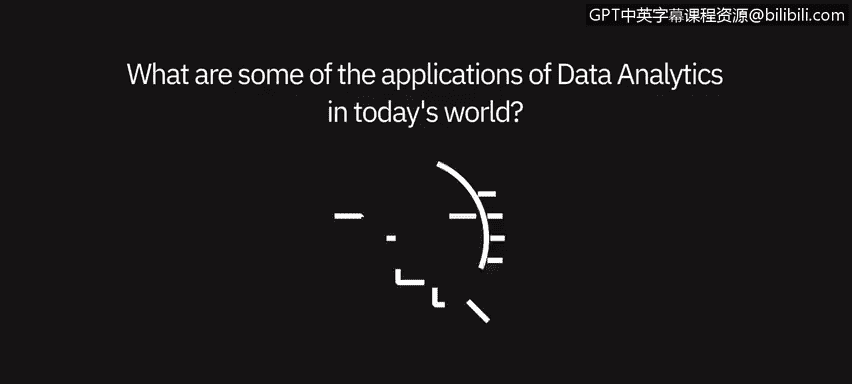
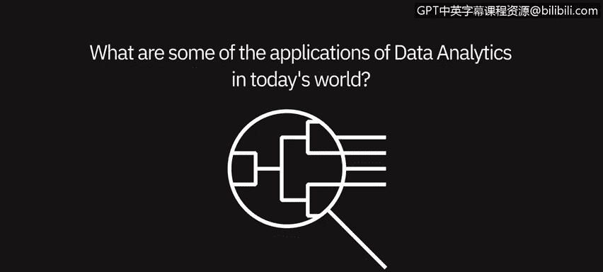

# 009：数据分析的应用 🌍

在本节课中，我们将通过从业者的视角，了解数据分析在当今世界中的广泛应用。数据分析已渗透到各行各业，成为决策和创新的核心驱动力。

---

## 概述

本节视频中，多位数据实践者将讨论数据分析在当今世界的多种应用场景。从商业广告到健康管理，从传统行业到新兴领域，数据分析正发挥着不可或缺的作用。

---

## 数据分析的普遍性

数据分析在当今世界的应用无处不在。你看到的每一个商业广告，背后都有人通过分析来确定要向消费者或公司传达何种信息。例如，“十分之四的牙医推荐”这类表述，或是与卡路里计数、对某些事物的反应相关的信息，所有这些都需要数据分析。数据分析不应被视为独立于日常生活的事物，它正是我们日常所做的一部分。即使是糖尿病患者监测血糖水平，也始终伴随着分析过程。因此，数据分析的应用是普遍存在的。

当今时代，数据分析的一大优势在于其广泛适用性。

---

## 跨行业与跨职能的应用

数据分析的益处遍及每个行业、每个垂直领域以及组织内的每一项职能。

以下是数据分析的一些典型应用场景：

*   **销售渠道分析**：评估销售流程和业绩。
*   **月度财务分析**：在月末进行财务数据核算与总结。
*   **生成预定义和标准化的格式化报告**：自动创建统一格式的业务报告。
*   **人员编制规划或审查**：基于数据制定或评估人力资源计划。

正如之前提到的，这些应用跨越所有垂直领域，无论是航空、制药还是银行业，其内部的各项职能都能从数据分析中获益。

---

## 特定环境下的应用价值

在我们当前所处的疫情环境下，数据分析显得尤为重要。

许多公司正在密切关注客户的购买习惯。显然，这些习惯可能与公司的预期有所不同。因此，数据分析现在变得更加重要，因为它能帮助公司确保及时调整策略，跟上需求变化，并真正满足其客户和顾客的需求。

---

## 金融领域的应用实例

我可以谈谈数据分析在金融领域的应用。近年来，我们在金融界看到了越来越多另类数据分析的应用。

例如，我们可以利用对推文和新闻故事的情感分析来补充传统的金融分析，从而做出更明智的投资决策。此外，卫星图像数据可用于追踪工业活动的发展，而地理位置数据则可用于跟踪门店客流量并预测销售额。

---

## 总结

本节课中，我们一起学习了数据分析广泛而深入的应用。从日常生活的细微之处到企业战略的核心决策，从传统行业的运营优化到金融领域的创新投资，数据分析已成为理解和塑造世界的关键工具。认识到其普遍性和跨领域价值，是成为一名数据分析师的重要起点。