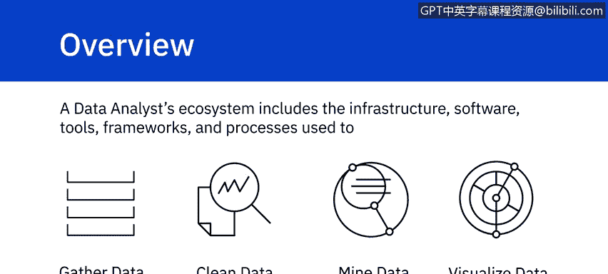
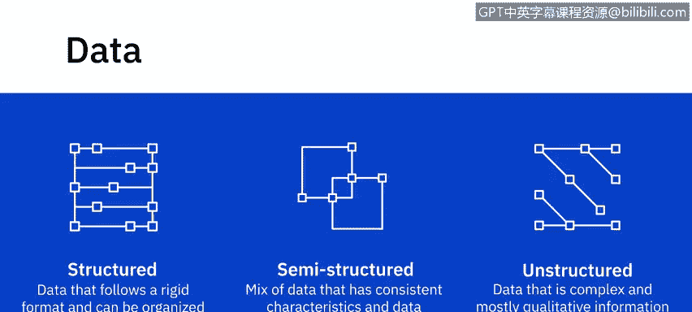
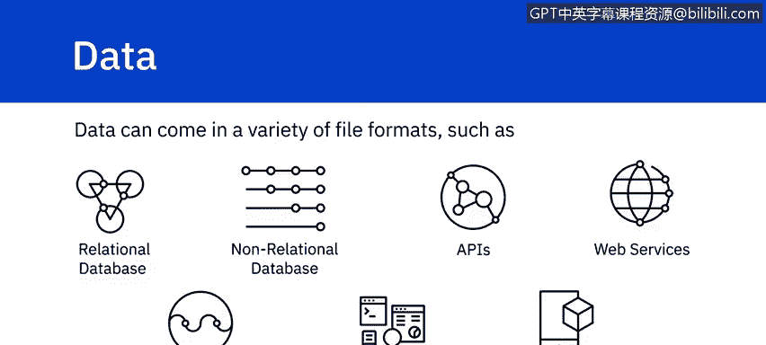
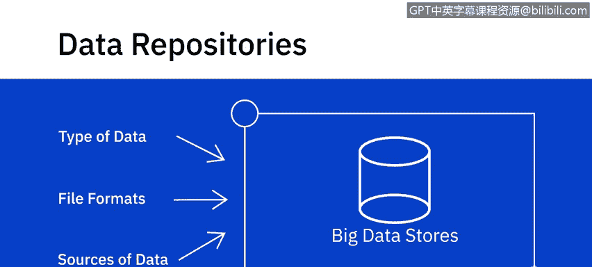
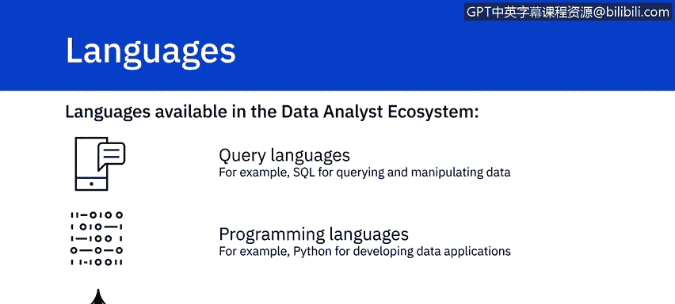
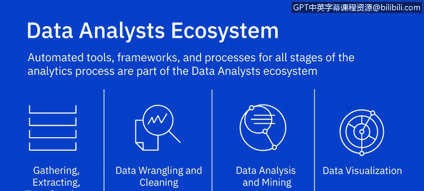

# 010：数据分析师生态系统概述 🌐

在本节课中，我们将学习数据分析师生态系统的基本构成。这个生态系统包含了用于收集、清洗、分析、挖掘和可视化数据的基础设施、软件、工具、框架和流程。我们将首先对生态系统进行一个概览，后续视频会深入探讨每个主题的细节。

---

## 数据分类 📊

首先，我们来谈谈数据。根据数据结构的明确程度，数据可以分为结构化、半结构化和非结构化数据。

以下是不同类型数据的定义和示例：

*   **结构化数据**：遵循严格格式，可以整齐地组织成行和列的数据。例如，你在数据库和电子表格中看到的数据。
*   **半结构化数据**：混合了具有一致特征的数据和不符合刚性结构的数据。例如，电子邮件包含发件人、收件人（结构化数据），也包含邮件正文内容（非结构化数据）。
*   **非结构化数据**：结构复杂且主要为定性信息，无法简化为行和列的数据。例如，照片、视频、文本文件、PDF 文件和社交媒体内容。

数据的类型决定了可以收集和存储数据的种类，也决定了可用于查询或处理数据的工具。

---

## 数据来源与存储库 🗄️

上一节我们介绍了数据的类型，本节中我们来看看数据的来源和存储方式。数据以多种文件格式存在，并从各种数据源收集，范围涵盖关系型和非关系型数据库、API、网络服务、数据流、社交平台和传感器设备。

这引出了**数据存储库**的概念，它包括数据库、数据仓库、数据集市、数据湖和大数据存储。数据的类型、格式和来源会影响你用于收集、存储、清洗、分析和挖掘数据的数据存储库类型。

例如，如果你处理的是大数据，你将需要能够存储和处理海量、高速数据的大数据仓库，以及允许你对大数据进行实时复杂分析的框架。

---

## 数据分析语言 💻

生态系统还包括各种语言，可分为查询语言、编程语言以及 Shell 和脚本语言。

以下是数据分析师工作台中重要的语言组件：

*   **查询语言**：使用 **`SQL`** 查询和操作数据。
*   **编程语言**：使用 **`Python`** 开发数据应用程序。
*   **Shell 和脚本语言**：编写 Shell 脚本以执行重复性操作任务。

---

## 工具与框架 🛠️

自动化工具、框架和流程是数据分析师生态系统的一部分，它们覆盖了分析过程的各个阶段。

从用于将数据收集、提取、转换和加载到数据存储库的工具，到用于数据整理、数据清洗、分析、数据挖掘和数据可视化的工具，这是一个非常多样化和丰富的生态系统。电子表格、Jupyter Notebooks 和 IBM Cognos 只是其中的几个例子。

我们将在课程后续章节中更详细地介绍一些数据分析工具。

---

## 总结 📝

本节课中，我们一起学习了数据分析师生态系统的核心组成部分。我们了解了数据的三种主要类型（结构化、半结构化和非结构化），认识了不同的数据来源和存储库（如数据仓库、数据湖），熟悉了数据分析中常用的语言（如 SQL、Python），并概览了支持整个分析流程的各种工具和框架。理解这个生态系统是成为一名高效数据分析师的重要基础。