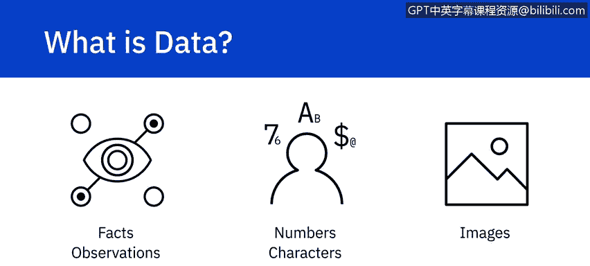
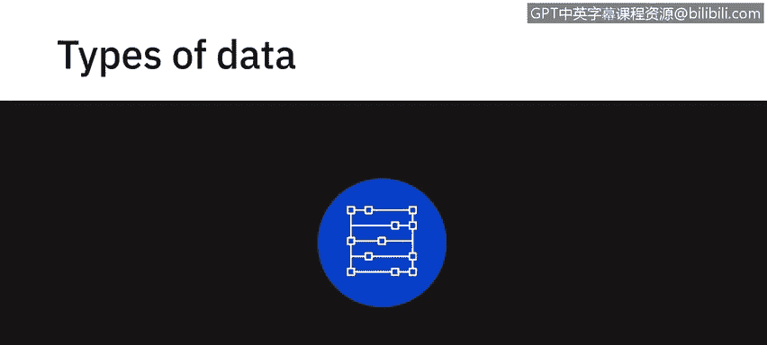
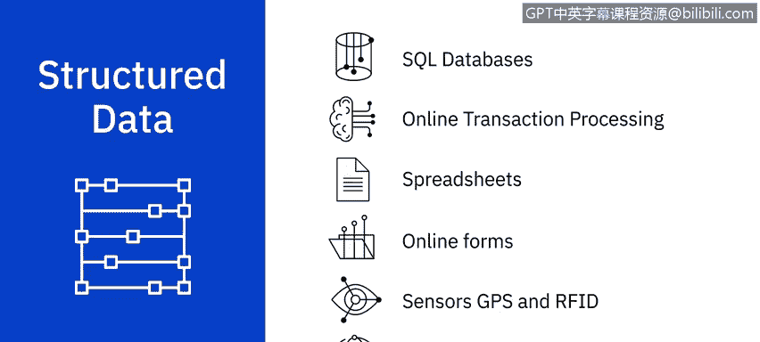
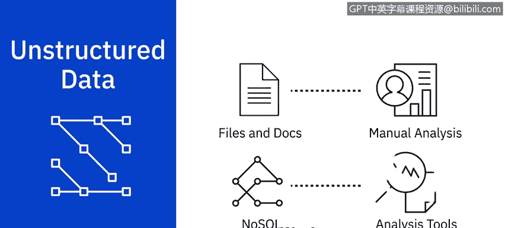
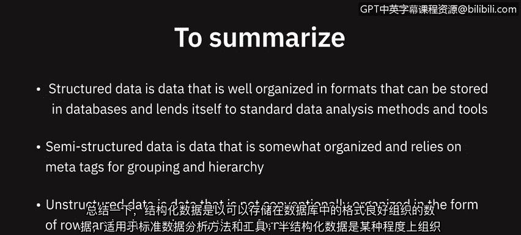
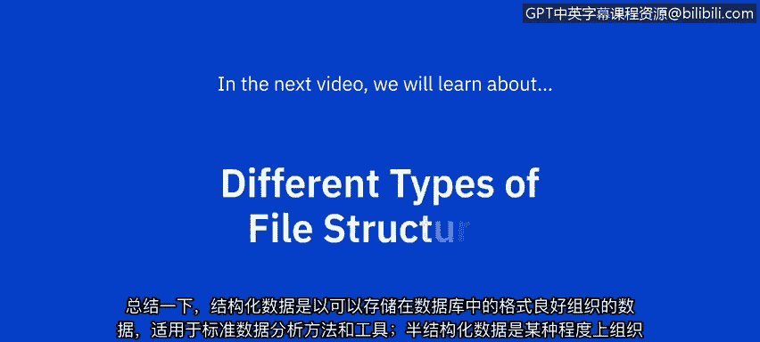

# 011：数据类型

在本节课中，我们将学习数据的基本分类方式。理解不同类型的数据是进行有效数据分析的第一步。我们将重点介绍结构化数据、半结构化数据和非结构化数据，并探讨它们各自的特点与来源。

---

数据是未经组织的信息，经过处理后变得有意义。数据包含事实、观察、感知、数字、字符、符号和图像，这些内容可以被解释以获取含义。对数据进行分类的一种方式是依据其结构。数据可以分为**结构化数据**、**半结构化数据**和**非结构化数据**。

## 🗂️ 结构化数据

结构化数据具有定义良好的结构，或遵循特定的数据模型。它可以存储在定义明确的模式中，例如数据库，并且在许多情况下可以以包含行和列的表格形式表示。

结构化数据是客观的事实和数字，可以被收集、导出、存储和组织在典型的数据库中。

以下是结构化数据的一些来源：
*   SQL数据库
*   在线事务处理系统
*   电子表格
*   在线表单
*   传感器
*   网络和Web服务器日志

你可以使用标准的数据分析工具和方法轻松地检查结构化数据。

## 📄 半结构化数据

上一节我们介绍了具有固定格式的结构化数据，本节中我们来看看半结构化数据。半结构化数据具有一定的组织属性，但缺乏固定或严格的模式。它不能像数据库中那样以行和列的形式存储。

它包含标签、元素或元数据，用于对数据进行分组并以层次结构进行组织。

以下是半结构化数据的一些来源：
*   电子邮件
*   XML等标记语言
*   二进制可执行文件
*   TCP/IP数据包
*   压缩文件
*   来自不同来源的数据集成

XML和JSON允许用户定义标签和属性，以分层形式存储数据，并被广泛用于存储和交换半结构化数据。

## 🗃️ 非结构化数据

与具有特定格式的数据不同，非结构化数据没有易于识别的结构，因此无法以行和列的形式组织到主流的关系型数据库中。它没有任何特定的格式、顺序、语义或规则。

非结构化数据可以处理来源的异构性，并具有多种商业智能和分析应用。

以下是非结构化数据的一些来源：
*   网页
*   社交媒体信息流
*   图像文件
*   视频和音频文件
*   文档和PDF文件
*   PowerPoint演示文稿
*   媒体日志和调查问卷

非结构化数据可以存储在文件和文档中，也可以存储在拥有专门分析工具的NoSQL数据库中。

---

本节课中我们一起学习了数据的三种主要类型。

*   **结构化数据**是组织良好的数据，格式规范，可存储在数据库中，适用于标准的数据分析方法和工具。
*   **半结构化数据**具有一定组织性，依赖元标签进行分组和层次化。
*   **非结构化数据**则没有以特定的行、列格式进行常规组织。

在下一个视频中，我们将学习不同类型的文件结构。