# 012：理解不同类型的文件格式 📁

在本节课中，我们将学习数据分析工作中常见的几种数据文件格式。理解这些格式的底层结构、优势与局限性，将帮助你根据数据和性能需求做出正确的格式选择。

---

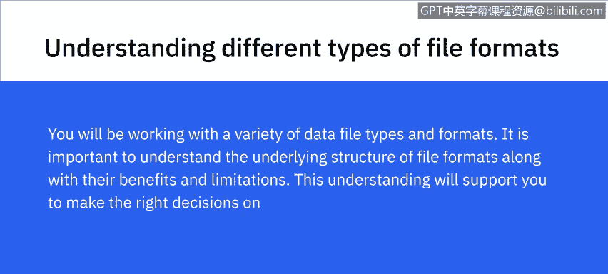

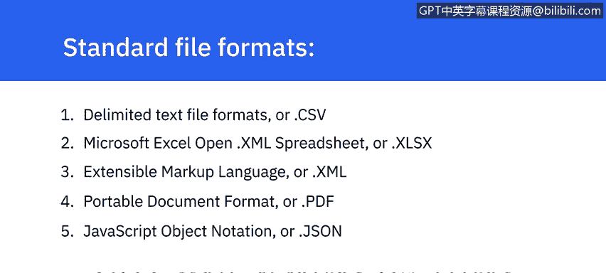

## 分隔文本文件 📄

上一节我们介绍了课程目标，本节中我们首先来看看**分隔文本文件**。这是一种以文本形式存储数据的文件，其中每一行（或每一行记录）的值都由一个**分隔符**隔开。分隔符是一个或多个字符的序列，用于指定独立实体或值之间的边界。

以下是分隔文本文件的核心特点：
*   任何字符都可以用作分隔符，但最常见的包括：**逗号**、**制表符**、**冒号**、**竖线**和**空格**。
*   **逗号分隔值文件**和**制表符分隔值文件**是此类中最常用的文件类型。
    *   在CSV中，分隔符是逗号。
    *   在TSV中，分隔符是制表符。
*   当文本数据本身包含逗号时，TSV可作为CSV的替代格式，因为文本中很少出现制表符。
*   文本文件中的每一行代表一条记录，包含一组由分隔符分隔的值。
*   第一行通常作为列标题，每列可以包含不同类型的数据（例如日期、字符串、整数）。
*   分隔文件允许字段值为任意长度，被视为提供简单信息模式的标准格式，几乎能被所有现有应用程序处理。

---

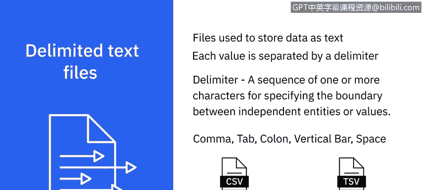

## Microsoft Excel Open XML 电子表格 📊

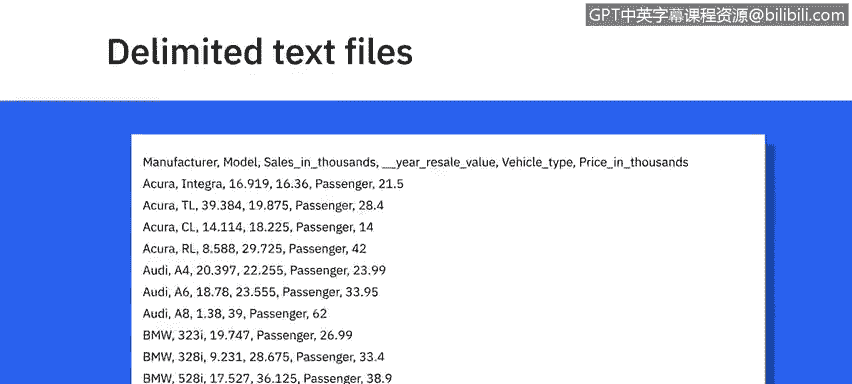

了解了基础的文本格式后，我们来看看更结构化的电子表格格式。**Microsoft Excel Open XML 电子表格**是一种基于XML的电子表格文件格式，由Microsoft创建。

以下是XLSX格式的核心特点：
*   一个XLSX文件也称为一个**工作簿**，可以包含多个**工作表**。
*   每个工作表由行和列组织，其交叉点称为**单元格**，每个单元格包含数据。
*   它采用开放文件格式，意味着大多数其他应用程序通常也能访问它。
*   它可以使用并保存Excel中的所有可用功能。
*   它被认为是更安全的文件格式之一，因为它无法保存恶意代码。

---

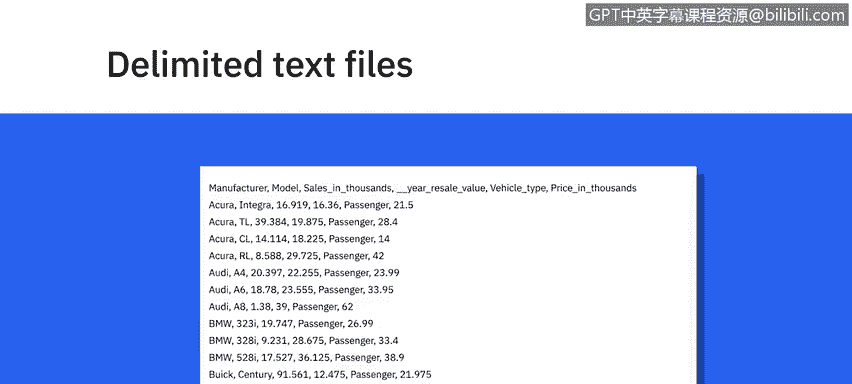

## 可扩展标记语言 🔖

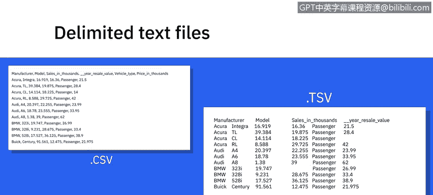

接下来，我们探讨一种用于数据编码的标记语言。**可扩展标记语言**是一种用于编码数据的标记语言，具有一套规则。

以下是XML格式的核心特点：
*   XML文件格式对人类和机器都可读。
*   它是一种自描述语言，专为在互联网上发送信息而设计。
*   XML在某些方面与HTML相似，但也有区别。例如，XML不像HTML那样使用预定义的标签。
*   XML独立于平台和编程语言，因此简化了不同系统之间的数据共享。

---

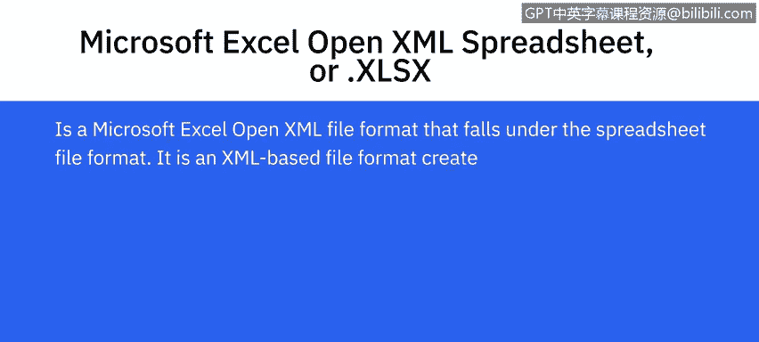

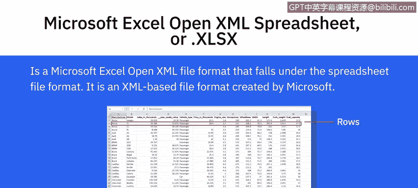

## 便携式文档格式 📑

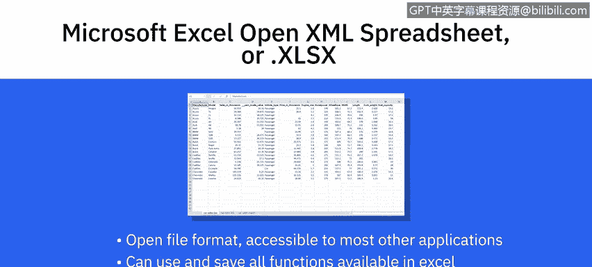

除了用于数据交换的格式，我们还需要了解用于文档呈现的格式。**便携式文档格式**由Adobe开发，用于呈现独立于应用软件、硬件和操作系统的文档。

以下是PDF格式的核心特点：
*   这意味着它可以在任何设备上以相同的方式查看。
*   这种格式常用于法律和金融文件，也可用于填写表格等数据。

---

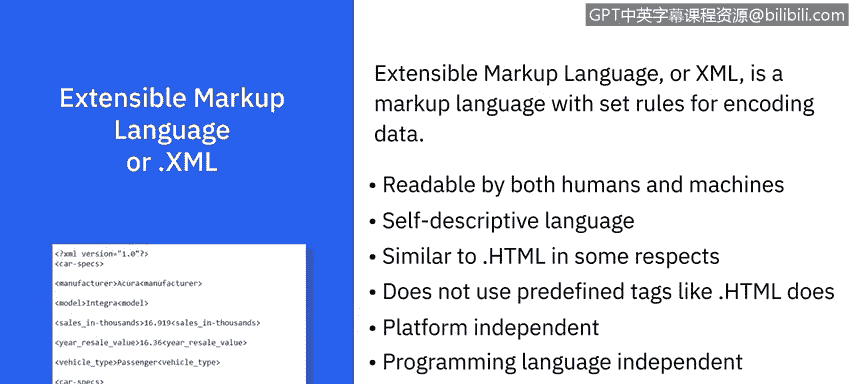

## JavaScript 对象表示法 🔄

最后，我们来看一种在现代Web开发中广泛使用的数据交换格式。**JavaScript 对象表示法**是一种基于文本的开放标准，专为在网络上传输结构化数据而设计。

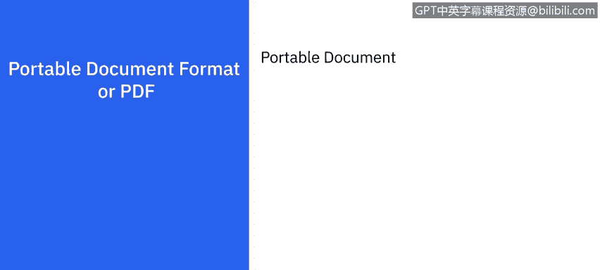

以下是JSON格式的核心特点：
*   该文件格式是一种独立于语言的数据格式，可以用任何编程语言读取。
*   JSON易于使用，与广泛的浏览器兼容，并被认为是共享任何大小和类型数据（甚至音频和视频）的最佳工具之一。
*   这也是许多API和Web服务器将数据以JSON格式返回的原因之一。

---

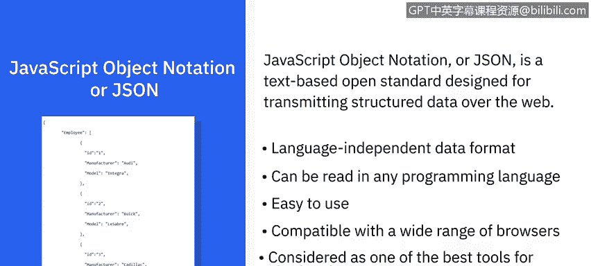

本节课中，我们一起学习了五种常见的数据文件格式：**分隔文本文件**、**XLSX电子表格**、**XML**、**PDF**和**JSON**。每种格式都有其特定的结构、用途和适用场景。理解这些差异是数据分析师高效处理和分析数据的基础。