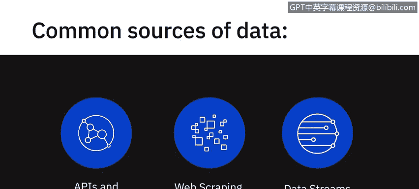
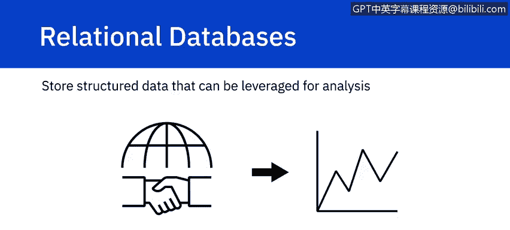
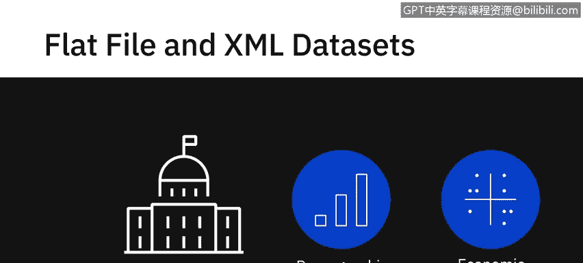
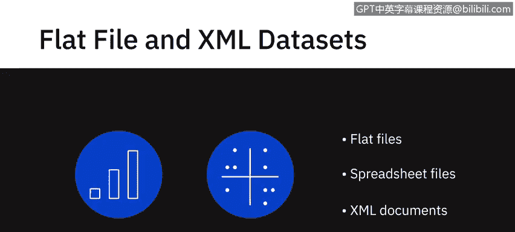
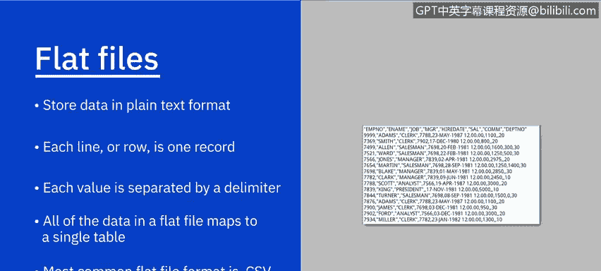
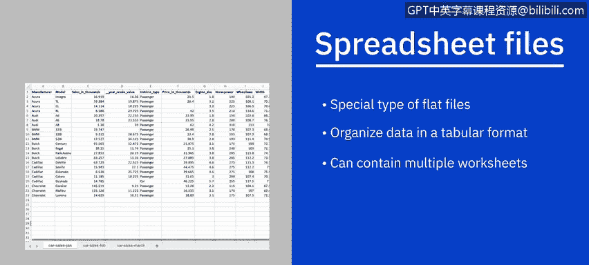
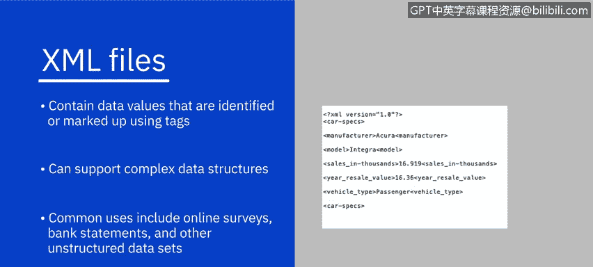
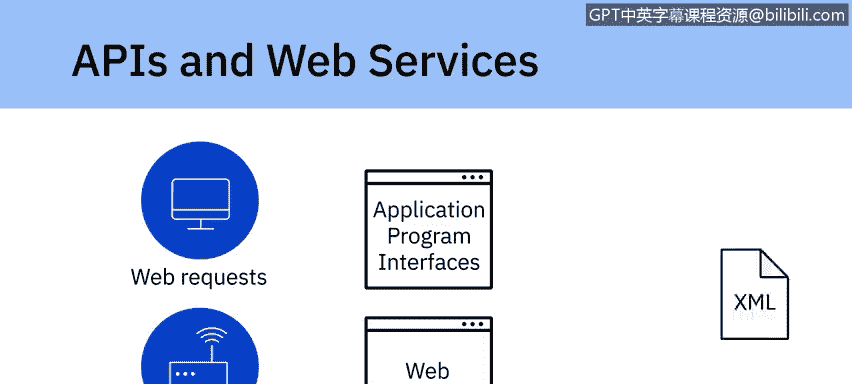
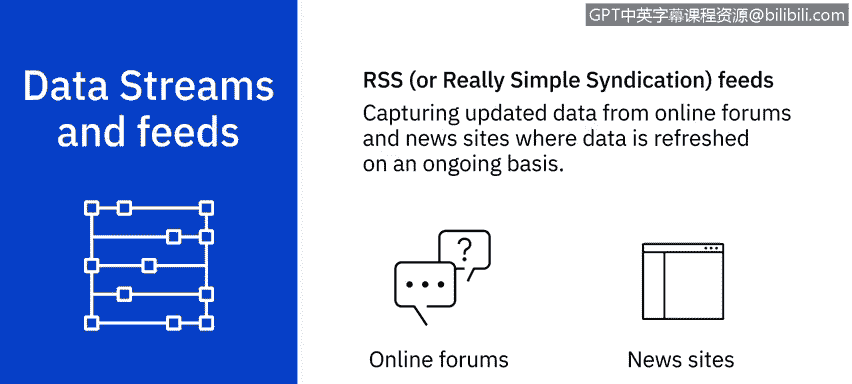

# 013：数据来源 📊

## 概述

在本节课中，我们将要学习数据分析中至关重要的一个环节：**数据来源**。数据是分析的基石，了解数据从何而来、以何种形式存在，是每位数据分析师必备的知识。我们将探讨当今动态且多样的数据来源，包括关系型数据库、平面文件、API、网络爬虫、数据流和订阅源等。



---

## 数据来源的多样性与动态性

正如我们在之前的视频中提到的，数据来源从未像今天这样动态和多样。本节中，我们将具体看看一些常见的数据来源。

以下是几种主要的数据来源类型：

*   **关系型数据库**
*   **平面文件与XML数据**
*   **API与网络服务**
*   **网络爬虫**
*   **数据流与订阅源**

---

## 内部数据源：关系型数据库





通常，组织拥有内部应用程序来支持其日常业务活动、客户交易、人力资源活动和工作流程的管理。

这些系统使用如 **SQL Server**、**Oracle**、**MySQL** 和 **IBM DB2** 等关系型数据库，以结构化的方式存储数据。存储在数据库和数据仓库中的数据可以作为分析的数据源。

例如，来自零售交易系统的数据可用于分析不同区域的销售情况；来自客户关系管理系统的数据可用于进行销售预测。



---

## 外部数据源：公开与私有数据集

在组织外部，还存在其他公开和私有的可用数据集。



例如，政府机构会持续发布人口统计和经济数据集。此外，还有一些公司销售特定数据，例如销售点数据、金融数据或天气数据。

企业可以利用这些数据来制定战略、预测需求，并在分销或营销推广等方面做出决策。

这类数据集通常以平面文件、电子表格文件或XML文档的形式提供。



---

## 平面文件与电子表格

上一节我们提到了外部数据常以文件形式提供，本节中我们来看看这些文件的具体格式。

**平面文件**以纯文本格式存储数据，每行一条记录，每个值由逗号、分号或制表符等分隔符分隔。平面文件中的数据映射到单个表，这与包含多个表的关系型数据库不同。最常见的平面文件格式是**CSV**，其值由逗号分隔。



```csv
姓名,年龄,城市
张三,28,北京
李四,35,上海
```

**电子表格文件**是一种特殊类型的平面文件，它也以表格格式（行和列）识别数据，但一个电子表格可以包含多个工作表，每个工作表可以映射到不同的表。虽然电子表格中的数据是纯文本，但文件可以以自定义格式存储，并包含格式、公式等附加信息。

**Microsoft Excel**（以XLS或XLSX格式存储数据）可能是最常见的电子表格。其他还包括Google Sheets、Apple Numbers和Libre Office。

---




## XML 数据

**XML文件**包含使用标签标识或标记的数据值。与映射到单个表的平面文件不同，XML文件可以支持更复杂的数据结构，例如层次结构。

XML的一些常见用途包括来自在线调查、银行对账单和其他非结构化数据集的数据。

```xml
<person>
  <name>张三</name>
  <age>28</age>
  <city>北京</city>
</person>
```

---

## API 与网络服务

许多数据提供商和网站提供**API**或应用程序编程接口以及网络服务，多个用户或应用程序可以与之交互，以获取数据进行处理或分析。

API和网络服务通常监听传入的请求（可以是来自用户的网络请求或来自应用程序的网络请求形式），并以纯文本、XML、HTML、JSON或媒体文件的形式返回数据。

让我们看一些将API用作数据分析数据源的流行例子：

*   **社交媒体API**：使用Twitter和Facebook API从推文和帖子中获取数据，用于执行意见挖掘或情感分析等任务，以总结对特定主题（如政府政策、产品、服务或总体客户满意度）的赞赏和批评数量。
*   **金融市场API**：用于提取股价和商品价格、每股收益和历史价格等数据，用于交易和分析。
*   **数据查询与验证API**：这对数据分析师清理和准备数据以及核对数据非常有用，例如，检查邮政编码属于哪个城市或州。
*   **数据库API**：也用于从组织内部和外部的数据库源中提取数据。

---

## 网络爬虫

**网络爬虫**用于从非结构化来源中提取相关数据，也称为屏幕抓取、网络采集和网络数据提取。网络爬虫使得可以根据定义的参数从网页下载特定数据成为可能。

网络爬虫可以从网站中提取文本、联系信息、图像、视频、产品项目等。网络爬虫的一些流行用途包括：
*   从零售商、制造商和电子商务网站收集产品详情以提供价格比较。
*   通过公共数据源生成销售线索。
*   从各种论坛和社区的帖子和作者中提取数据。
*   为机器学习模型收集训练和测试数据集。

一些流行的网络爬虫工具包括 **Beautiful Soup**、**Scrapy**、**Pandas** 和 **Selenium**。

---

## 数据流与订阅源

**数据流**是另一种广泛使用的数据源，用于聚合来自仪器、物联网设备、应用程序、汽车GPS数据、计算机程序、网站和社交媒体帖子等来源的持续数据流。这些数据通常带有时间戳，并带有地理标签以进行地理识别。

一些数据流及其利用方式包括：
*   用于金融交易的股票和市场行情。
*   用于预测需求和供应链管理的零售交易流。
*   用于威胁检测的监控和视频源。
*   用于情感分析的社交媒体源。
*   用于监控工业或农业机械的传感器数据源。
*   用于监控网络性能和改进设计的网络点击流。
*   用于重新预订和重新安排航班的实时航班事件。

用于处理数据流的一些流行应用程序包括 **Apache Kafka**、**Apache Spark Streaming** 和 **Apache Storm**。

**RSS** 是另一种流行的数据源。这些通常用于从在线论坛和新闻网站捕获更新的数据，这些地方的数据会持续刷新。

使用**订阅阅读器**（一种将RSS文本文件转换为更新数据流的接口），更新会被推送到用户设备。

---

## 总结



本节课中，我们一起学习了数据分析中多样化的**数据来源**。我们从组织内部的关系型数据库，探讨到外部的平面文件、XML、API和网络服务，并了解了如何通过网络爬虫获取网页数据，以及如何处理持续不断的数据流和订阅源。理解这些数据来源的特性和获取方式，是进行有效数据采集、为后续分析步骤准备高质量数据的基础。