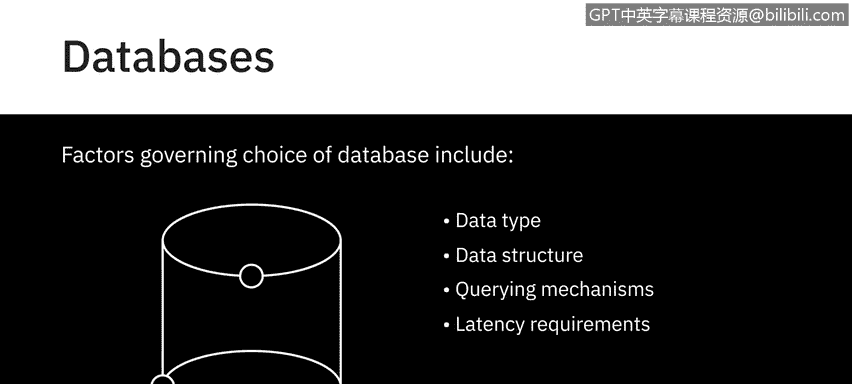
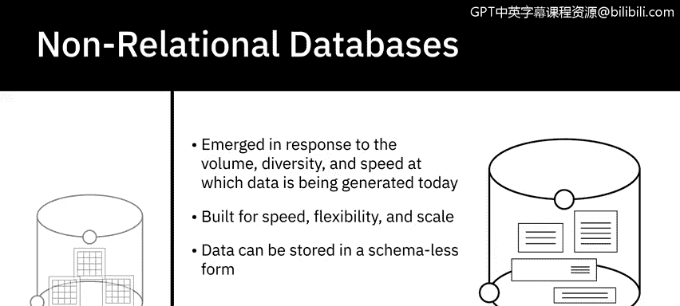
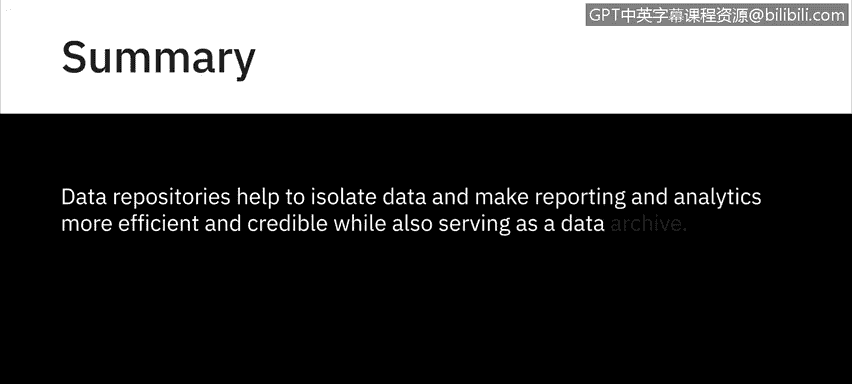

# 015：数据仓库概述 📊

在本节课中，我们将要学习数据仓库的基本概念。我们将了解数据存储库的不同类型，包括数据库、数据仓库和大数据存储，并探讨它们各自的特点与用途。

---

## 什么是数据存储库？ 🗃️

数据存储库是一个通用术语，指代那些被收集、组织并隔离起来的数据，以便用于业务运营，或用于生成报告和进行数据分析。它可以是一个小型或大型的数据库基础设施，包含一个或多个用于收集、管理和存储数据的数据库。

在接下来的视频中，我们将更详细地探讨不同类型的数据存储库。本节中，我们先来概述一下您的数据可能驻留的几种主要存储库类型：数据库、数据仓库和大数据存储。

---

## 数据库 🗄️

上一节我们介绍了数据存储库的总体概念，本节中我们来看看其中最常见的一种类型：数据库。

数据库是为数据的输入、存储、检索、搜索和修改而设计的数据或信息集合。数据库管理系统（DBMS）是一组用于创建和维护数据库的程序，它允许您通过一种称为“查询”的功能来存储、修改和从数据库中提取信息。

例如，如果您想查找已闲置六个月或更长时间的客户，使用查询功能，数据库管理系统将从数据库中检索出所有符合此条件的客户数据。

尽管“数据库”和“数据库管理系统”含义不同，但这两个术语经常互换使用。

以下是影响数据库选择的一些关键因素：
*   **数据类型和结构**
*   **查询机制**
*   **延迟要求**
*   **事务处理速度**
*   **数据的预期用途**

在此，需要提及两种主要的数据库类型：关系型数据库和非关系型数据库。

### 关系型数据库

关系型数据库，也称为 RDBMS，其组织原则建立在平面文件的基础上。数据被组织成具有行和列的表格格式，遵循明确定义的结构和模式。然而，与平面文件不同，RDBMS 针对涉及多个表和更大数据量的数据操作和查询进行了优化。

结构化查询语言（SQL）是关系型数据库的标准查询语言。

### 非关系型数据库

非关系型数据库，也称为 NoSQL 或“不仅仅是 SQL”，是为了应对当今数据生成的速度、多样性和体量而出现的，主要受到云计算、物联网和社交媒体普及的推动。

非关系型数据库为速度、灵活性和可扩展性而构建，使得以无模式或自由形式的方式存储数据成为可能。NoSQL 被广泛用于处理大数据。

---

## 数据仓库 🏢

上一节我们讨论了数据库，本节中我们来看看另一种专门用于分析的数据存储库：数据仓库。

数据仓库作为一个中央存储库，将来自不同来源的信息合并，并通过提取、转换和加载过程（也称为 **ETL 过程**）将其整合到一个用于分析和商业智能的综合性数据库中。

在较高层面上，ETL 过程帮助您从不同的数据源提取数据，将数据转换为干净可用的状态，并将数据加载到企业的数据存储库中。

与数据仓库相关的概念还有数据集市和数据湖，我们将在后面介绍。历史上，数据集市和数据仓库通常是关系型的，因为许多传统的企业数据都驻留在 RDBMS 中。然而，随着 NoSQL 技术和新数据源的出现，非关系型数据存储库现在也用于数据仓库。

---

## 大数据存储 🌐

另一类数据存储库是大数据存储，它包括分布式计算和存储基础设施，用于存储、扩展和处理非常大的数据集。

---

## 总结 📝

本节课中，我们一起学习了数据存储库的核心概念。我们了解到，数据存储库有助于隔离数据，使报告和分析更加高效和可靠，同时也充当数据档案库。我们探讨了数据库（包括关系型和非关系型）、数据仓库及其 ETL 过程，以及大数据存储的基本特点。理解这些不同类型的存储库是构建有效数据分析解决方案的基础。