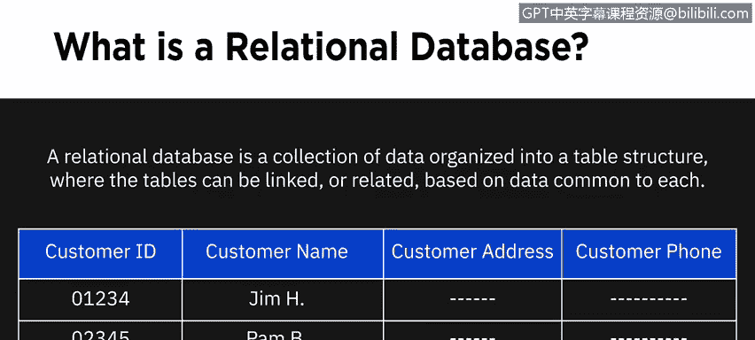
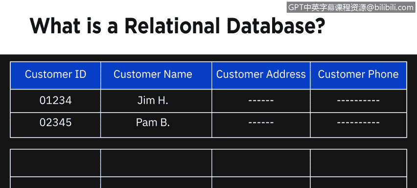
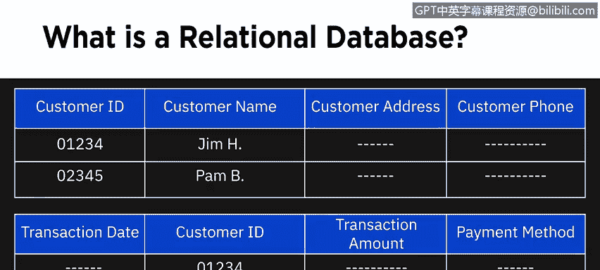
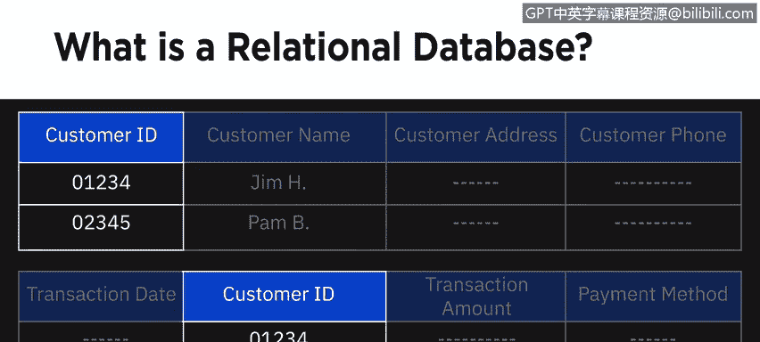
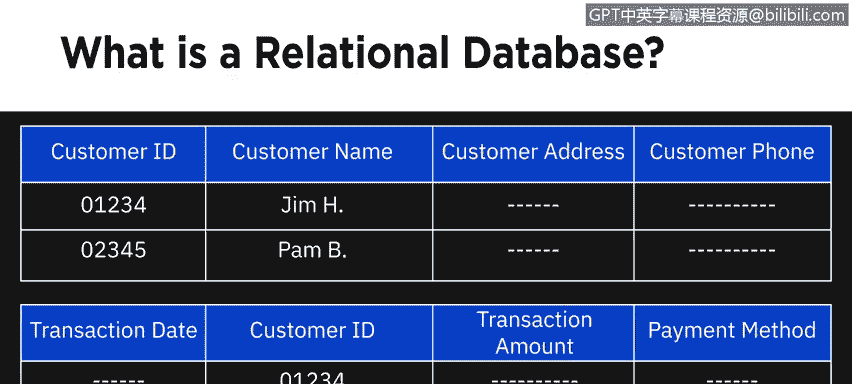
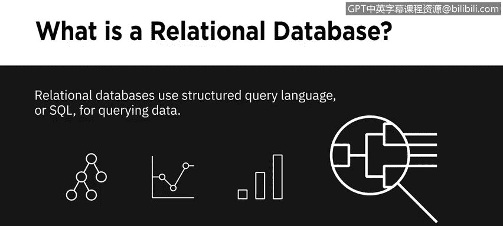
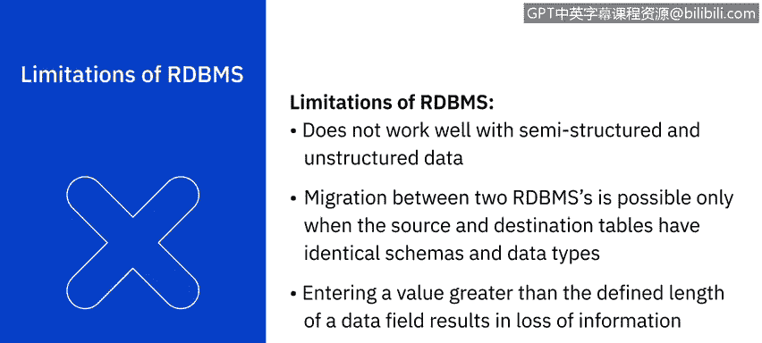

# 016：关系数据库管理系统 📊

在本节课中，我们将要学习关系数据库管理系统（RDBMS）的核心概念、工作原理、优势、局限性及其典型应用场景。关系数据库是组织和管理结构化数据的基础工具，理解它对于数据分析至关重要。

---

## 什么是关系数据库？ 🗂️

关系数据库是一种将数据组织成表格结构的数据集合。这些表格可以根据彼此共有的数据相互链接或关联。表格由行和列组成，其中行代表记录，列代表属性。

让我们以一个客户表为例，该表维护公司每位客户的数据。客户表中的列或属性包括：客户ID、客户姓名、客户地址和客户主要电话。每一行则代表一条客户记录。

---

## 表之间的关联 🔗

上一节我们介绍了关系数据库的基本结构，本节中我们来看看“表之间基于共有数据关联”的具体含义。

除了客户表，公司通常还会维护交易表，其中包含描述每位客户多笔独立交易的数据。

交易表的列可能包括：交易日期、客户ID、交易金额和支付方式。客户表和交易表可以通过共有的“客户ID”字段建立关联。

通过这种关联，你可以查询客户表来生成报告，例如一份汇总了特定时间段内所有交易的客户对账单。这种基于共有数据关联表格的能力，使你能够通过一次查询，从一个或多个表中的数据检索出一个全新的表格。它还允许你理解所有可用数据之间的关系，并获得新的见解以做出更好的决策。

实际的数据库使用**结构化查询语言（SQL）**来查询数据。我们将在本课程后续部分深入学习SQL。

---

## 关系数据库与平面文件的区别 📈

关系数据库建立在平面文件（如电子表格）的组织原则之上，数据按照定义良好的结构和模式组织成行和列。但相似之处仅此而已。

关系数据库在设计上非常适合对大量数据进行优化的存储、检索和处理。与行列数量有限的电子表格不同，关系数据库中的每个表都有唯一的行和列集合，并且可以在表之间定义关系，这最大限度地减少了数据冗余。

此外，你可以将数据库字段限制为特定的数据类型和值，这减少了不规则性，并带来了更高的一致性和数据完整性。

关系数据库使用**SQL**查询数据，这使你能够处理数百万条记录，并在几秒钟内检索大量数据。

关系数据库的安全架构提供了对数据的受控访问，并确保可以执行管理数据的标准和策略。

---

## 关系数据库的类型与示例 🌐

关系数据库的范围很广，从小型桌面系统到大规模云基系统都有。它们可以是开源且内部支持的、开源但有商业支持的，或商业闭源系统。

以下是部分流行的关系数据库：
*   IBM DB2
*   Microsoft SQL Server
*   MySQL
*   Oracle Database
*   PostgreSQL

基于云的关系数据库，也称为“数据库即服务”（DBaaS），正获得广泛应用，因为它们可以利用云提供的近乎无限的计算和存储能力。

一些流行的云关系数据库包括：
*   Amazon Relational Database Service (RDS)
*   Google Cloud SQL
*   IBM DB2 on Cloud
*   Oracle Cloud
*   SQL Azure

RDBMS是一项成熟且文档完善的技术，易于学习并找到合格人才。

---

## 关系数据库的优势 ✅

关系数据库方法最显著的优势之一是其通过连接表来创建有意义信息的能力。

以下是它的其他一些优势：

*   **灵活性**：使用**SQL**，你可以在数据库运行和查询进行时添加新列、添加新表、重命名关系并进行其他更改。
*   **减少冗余**：关系数据库最大限度地减少了数据冗余。例如，客户的信息仅在客户表中出现一次，而交易表只存储指向客户表的链接。
*   **易于备份和灾难恢复**：关系数据库提供简单的导入导出选项，使备份和恢复变得容易。导出可以在数据库运行时进行，使得故障恢复变得简单。基于云的关系数据库进行连续镜像，这意味着恢复时的数据丢失可以控制在几秒甚至更短的时间内。
*   **ACID 合规性**：ACID 代表原子性、一致性、隔离性和持久性。ACID 合规性意味着无论发生何种故障，数据库中的数据都保持准确和一致，并且数据库事务被可靠地处理。

---

## 关系数据库的典型应用场景 🎯

现在，我们来看看关系数据库的一些典型应用场景。

*   **在线事务处理（OLTP）应用程序**：这类应用专注于以高速率运行面向事务的任务。关系数据库非常适合 OLTP 应用，因为它们可以容纳大量用户，支持插入、更新或删除少量数据，也支持频繁的查询和更新以及快速的响应时间。
*   **数据仓库**：在数据仓库环境中，关系数据库可以针对在线分析处理（OLAP）进行优化，用于分析历史数据以获取商业智能。
*   **物联网（IoT）解决方案**：物联网解决方案需要速度以及从边缘设备收集和处理数据的能力，这些设备需要一个轻量级的数据库解决方案。

---

## 关系数据库的局限性 ⚠️

这引出了 RDBMS 的局限性。

*   RDBMS 不擅长处理半结构化或非结构化数据，因此不适合对此类数据进行广泛分析。
*   在两个 RDBMS 之间迁移时，源表和目标表的模式及数据类型需要完全相同。
*   关系数据库对数据字段的长度有限制。这意味着，如果你尝试向一个字段输入超出其容量的信息，这些信息将不会被存储。

---

## 总结 📝

本节课中，我们一起学习了关系数据库管理系统（RDBMS）。尽管存在局限性，并且在大数据、云计算、物联网设备和社交媒体时代数据形态不断演变，RDBMS 仍然是处理结构化数据的主导技术。我们了解了它的表格结构、表间关联原理、相较于平面文件的优势、不同类型、核心优势（如灵活性、ACID合规性）以及典型的应用场景（如OLTP、数据仓库）。理解 RDBMS 是成为一名数据分析师的重要基石。