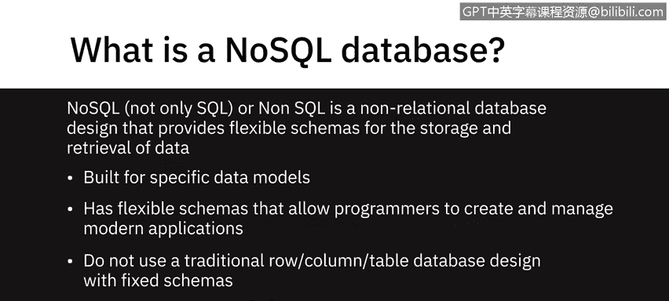
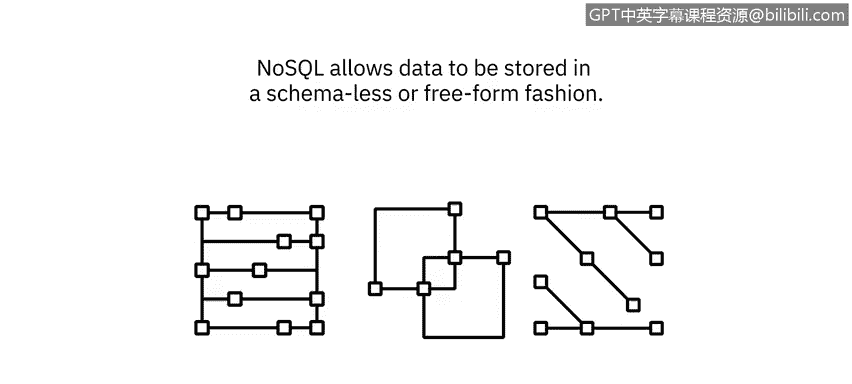
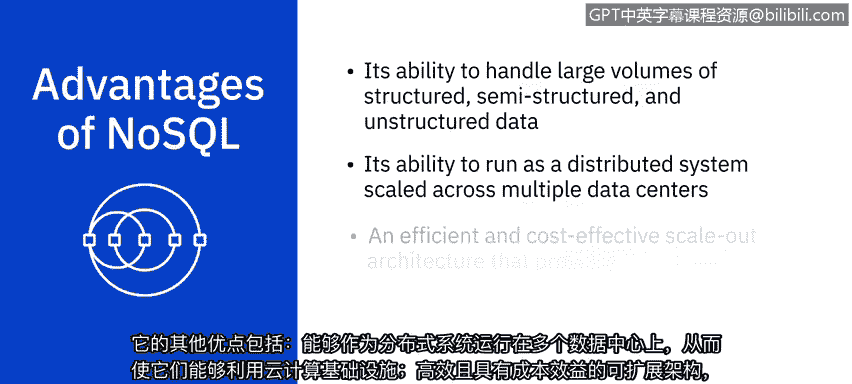
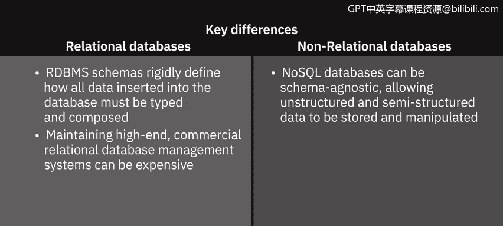

# 017：NoSQL 数据库简介 🗄️

在本节课中，我们将要学习 NoSQL 数据库。我们将了解 NoSQL 的含义、它与传统数据库的区别、常见的 NoSQL 数据库类型及其各自的优缺点。通过本节内容，你将能够理解 NoSQL 数据库在现代数据应用中的角色和适用场景。

---

NoSQL，全称为“Not Only SQL”（不仅仅是 SQL），有时也指“Non SQL”（非 SQL）。它是一种非关系型数据库设计，为数据的存储和检索提供了灵活的架构。

NoSQL 数据库已存在多年，但直到云、大数据以及高流量网络和移动应用时代才变得更为流行。如今，人们选择 NoSQL 是因为其在扩展性、性能和易用性方面的优势。需要强调的是，NoSQL 中的“No”是“Not Only”的缩写，而非简单的否定词“不”。

NoSQL 数据库为特定的数据模型构建，并拥有灵活的架构，使程序员能够创建和管理现代应用程序。它们不使用具有固定架构的传统行列式表格数据库设计，并且通常不使用结构化查询语言（SQL）来查询数据，尽管有些可能支持 SQL 或类 SQL 接口。

NoSQL 允许数据以无模式或自由格式的方式存储。任何数据，无论是结构化、半结构化还是非结构化的，都可以存储在任何记录中。

根据用于存储数据的模型，NoSQL 数据库主要有四种常见类型。

以下是四种主要的 NoSQL 数据库类型：

*   **键值存储**：在键值数据库中，数据以键值对的集合形式存储。键代表数据的属性，并且是唯一标识符。键和值可以是任何内容，从简单的整数或字符串到复杂的 JSON 文档。
    *   **适用场景**：存储用户会话数据、用户偏好设置、实时推荐、定向广告和内存数据缓存。
    *   **不适用场景**：需要对特定数据值进行查询、数据值之间存在关系或需要多个唯一键的情况。
    *   **知名示例**：`Redis`、`Memcached`、`DynamoDB`。

*   **文档型数据库**：文档数据库将每条记录及其关联数据存储在单个文档中。它们支持对文档集合进行灵活的索引、强大的即席查询和分析。
    *   **适用场景**：电子商务平台、医疗记录存储、CRM 平台和分析平台。
    *   **不适用场景**：需要运行复杂搜索查询和多重操作事务的情况。
    *   **知名示例**：`MongoDB`、`DocumentDB`、`CouchDB`、`Cloudant`。

*   **列式数据库**：列式模型将数据存储在按数据列（而非行）分组的单元格中。通常被一起访问的列的逻辑分组称为列族。
    *   **适用场景**：需要大量写入请求的系统、存储时间序列数据、天气数据和物联网数据。
    *   **不适用场景**：需要使用复杂查询或频繁更改查询模式的情况。
    *   **知名示例**：`Cassandra`、`HBase`。

*   **图数据库**：图数据库使用图模型来表示和存储数据。它们特别适用于可视化、分析和查找不同数据片段之间的连接。圆圈代表节点，包含数据；箭头代表关系。
    *   **适用场景**：处理关联数据（包含大量互连关系的数据），如社交网络、实时产品推荐、网络图、欺诈检测和访问管理。
    *   **不适用场景**：处理高吞吐量事务，因为图数据库未针对大规模分析查询进行优化。
    *   **知名示例**：`Neo4j`、`Cosmos DB`。

NoSQL 的出现是为了应对传统关系型数据库技术的局限性。其主要优势在于能够处理大量结构化、半结构化和非结构化数据。

以下是 NoSQL 数据库的其他一些优势：

*   能够作为分布式系统运行，跨多个数据中心扩展，从而利用云计算基础设施。
*   高效且经济高效的横向扩展架构，通过添加新节点提供额外的容量和性能。
*   设计更简单，对可用性有更好的控制，以及改进的可扩展性，使你能够更敏捷、更灵活、更快速地迭代。

上一节我们介绍了 NoSQL 的优势，现在我们来总结一下关系型数据库与非关系型数据库之间的关键区别。

以下是关系型数据库与非关系型数据库的主要区别：

*   **架构**：RDBMS 的架构严格定义了插入数据库的所有数据的类型和组成方式，而 NoSQL 数据库可以是模式无关的，允许存储和操作非结构化和半结构化数据。
*   **成本**：维护高端的商业关系型数据库管理系统成本高昂，而 NoSQL 数据库专为低成本商用硬件设计。
*   **事务**：与大多数 NoSQL 不同，关系型数据库支持 ACID 合规性，这确保了事务的可靠性和故障恢复能力。
*   **成熟度**：RDBMS 是一项成熟且文档完善的技术，这意味着其风险或多或少是可预见的；相比之下，NoSQL 是一项相对较新的技术。

尽管如此，NoSQL 数据库已经站稳脚跟，并且越来越多地被用于关键任务型应用程序中。

---

本节课中，我们一起学习了 NoSQL 数据库。我们了解了 NoSQL 的含义、其灵活的架构特点，并详细探讨了四种主要类型：键值存储、文档型、列式和图数据库，以及它们各自的适用场景。我们还对比了 NoSQL 与关系型数据库在架构、成本、事务和成熟度方面的关键差异。理解这些概念将帮助你在不同的数据应用场景中做出合适的数据库选择。