# 019：大数据基础 📊

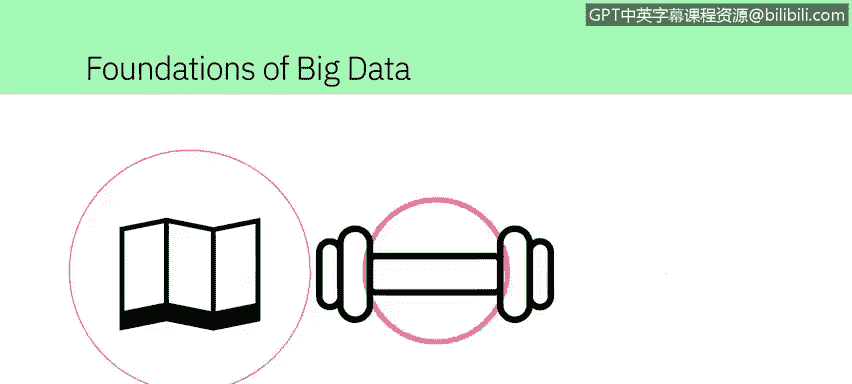

在本节课中，我们将要学习大数据的基础概念。我们将了解什么是大数据，以及描述其核心特征的“5V”模型。通过理解这些特征，我们可以更好地认识大数据在现代世界中的重要性及其带来的挑战。

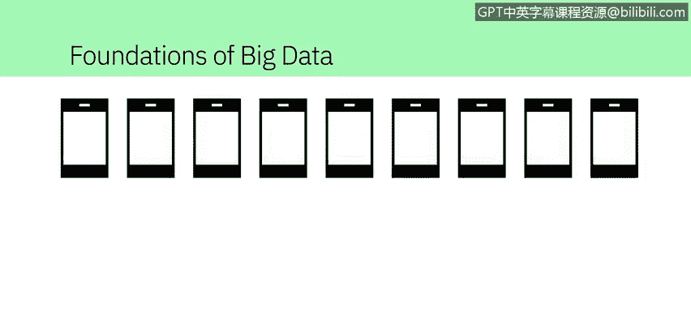

---

在这个数字化的世界里，每个人都会留下痕迹，从我们的出行习惯到锻炼和娱乐活动。

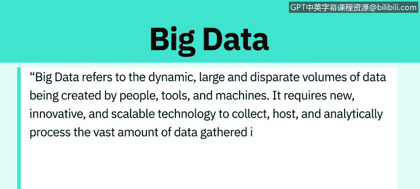

我们日常交互的联网设备数量日益增多，它们记录着关于我们的海量数据。

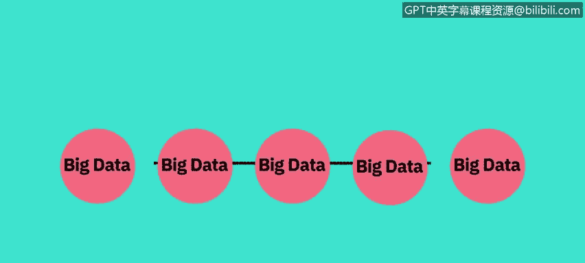

甚至有一个专门的术语来描述它：**大数据**。安永（Ernst & Young）提供了以下定义。

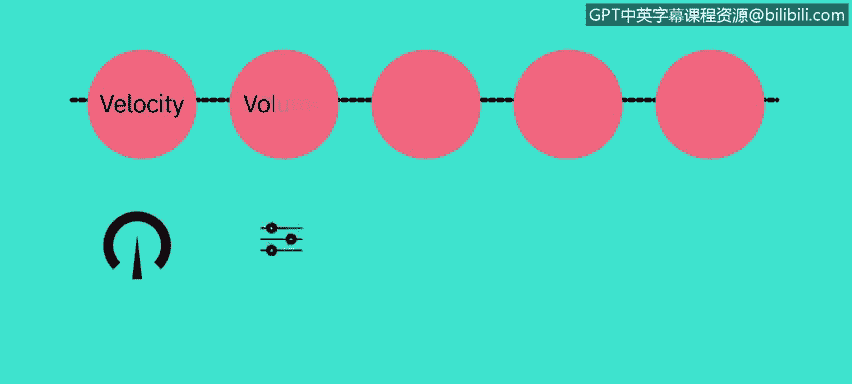

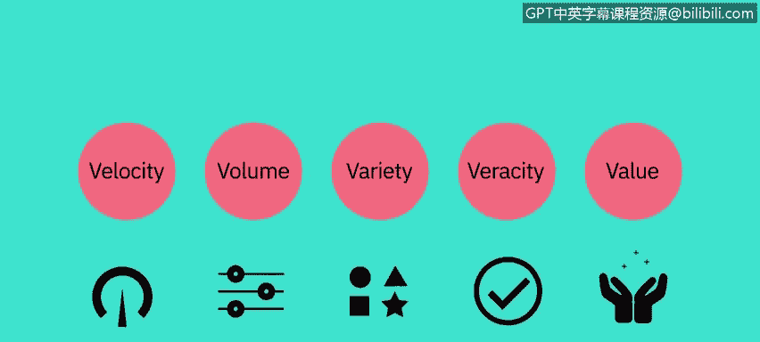

大数据指的是由人、工具和机器产生的动态、庞大且多样的数据量。

它需要新颖、创新且可扩展的技术来收集、存储和分析所汇集的海量数据，以获取与消费者、风险、利润、绩效、生产力管理和提升股东价值相关的实时商业洞察。

对于大数据没有一个统一的定义，但在不同的定义中存在一些共同的要素。

例如：**速度（Velocity）、体量（Volume）、多样性（Variety）、真实性（Veracity）和价值（Value）**。

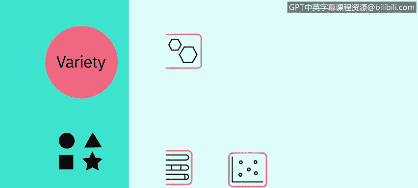

这些就是大数据的 **5V** 特征。

---

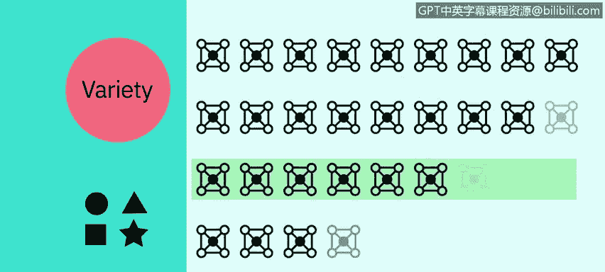

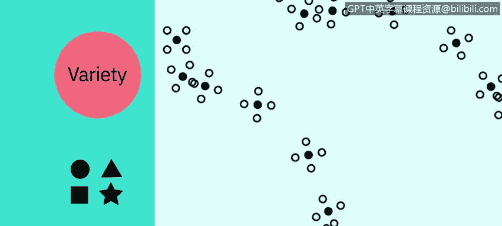

上一节我们介绍了大数据的定义和5V模型，本节中我们来详细看看每一个“V”具体指什么。

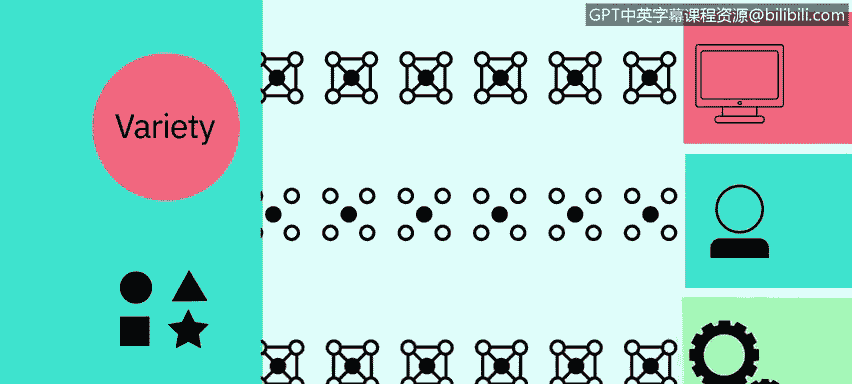

以下是关于大数据5V特征的详细解释：

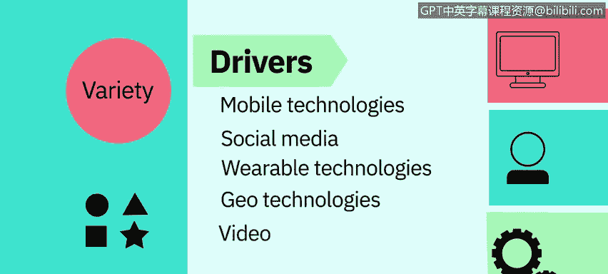

*   **速度（Velocity）**
    速度指的是数据积累的速率；数据正以极高的速度生成，这个过程永不停止。
    近实时或实时的流处理技术，以及本地和基于云的技术，可以非常快速地处理信息。

*   **体量（Volume）**
    体量指的是数据的规模或存储数据量的增长。
    驱动数据体量增长的因素包括数据源的增加、更高分辨率的传感器以及可扩展的基础设施。

*   **多样性（Variety）**
    多样性指的是数据的多样性。
    **结构化数据**可以整齐地放入行、列和关系型数据库中，而**非结构化数据**则没有预定义的组织方式，例如推文、博客文章、图片、数字和视频。
    多样性也反映了数据来自不同的来源：机器、人员和流程，既有组织内部的，也有外部的。
    驱动因素包括移动技术、社交媒体、可穿戴技术、地理技术、视频等等。

*   **真实性（Veracity）**
    真实性指的是数据的质量和来源，以及其与事实和准确性的符合程度。
    属性包括一致性、完整性、准确性和明确性。
    驱动因素包括成本和对海量数据可追溯性的需求。
    在数字时代，关于数据准确性的争论非常激烈。信息是真实的还是虚假的？

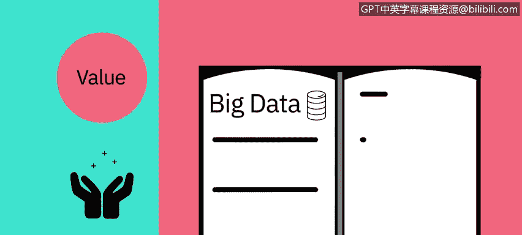

*   **价值（Value）**
    价值指的是我们将数据转化为价值的能力和需求。
    价值不仅仅是利润，它还可能带来医疗或社会效益，以及客户、员工或个人的满意度。
    人们投入时间去理解大数据的主要原因就是为了从中获取价值。

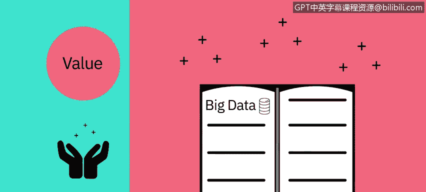

---

了解了每个“V”的含义后，我们来看看它们在现实世界中的具体例子。

以下是大数据5V特征的一些实际案例：

*   **速度（Velocity）示例**
    每分钟，都有数小时的视频被上传到YouTube，这就在不断生成数据。
    试想一下，数据在数小时、数天和数年内积累的速度有多快。

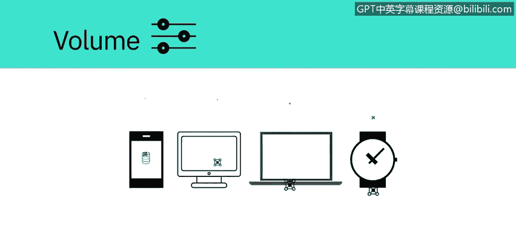

*   **体量（Volume）示例**
    世界人口大约有70亿，其中绝大多数人现在都在使用数字设备，如手机、台式机和笔记本电脑、可穿戴设备等。
    这些设备每天生成、捕获和存储大约**2.5万亿亿字节**的数据，这相当于1000万张蓝光DVD的容量。

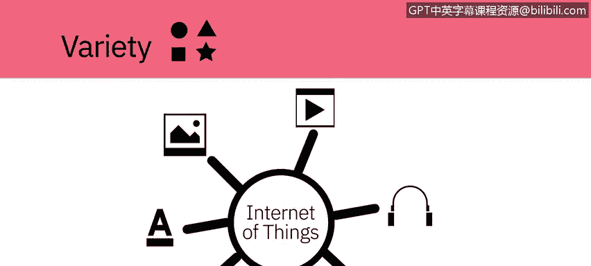

*   **多样性（Variety）示例**
    让我们想想不同类型的数据：文本、图片、电影、声音、来自可穿戴设备的健康数据，以及来自物联网设备的许多不同类型的数据。

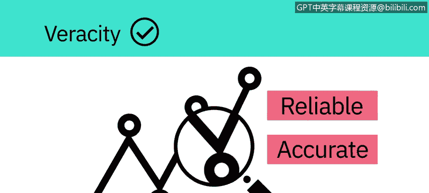

*   **真实性（Veracity）示例**
    大约80%的数据被认为是非结构化的。
    我们必须设计方法来产生可靠且准确的洞察；数据必须被分类、分析和可视化。

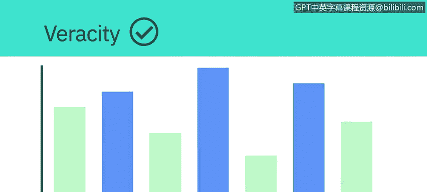

---

面对如此庞大、快速、多样的数据，传统的分析工具已难以应对。接下来，我们看看数据科学家们是如何处理这些挑战的。

如今的数据科学家从大数据中获取洞察，并应对这些海量数据集带来的挑战。
所收集数据的规模意味着使用传统的数据分析工具是不可行的。
然而，利用分布式计算能力的替代工具可以克服这个问题。
像 **Apache Spark**、**Hadoop** 及其生态系统这样的工具，提供了跨分布式计算资源提取、加载、分析和处理数据的方法，从而提供新的洞察和知识。

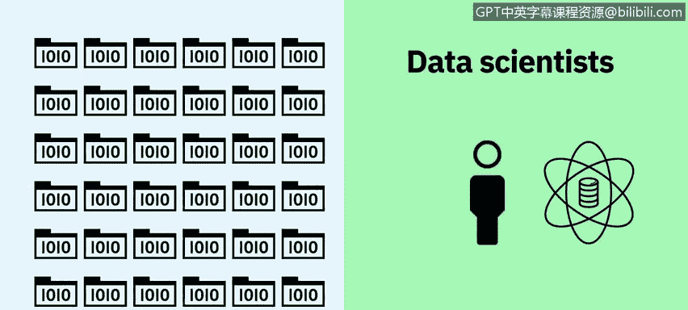

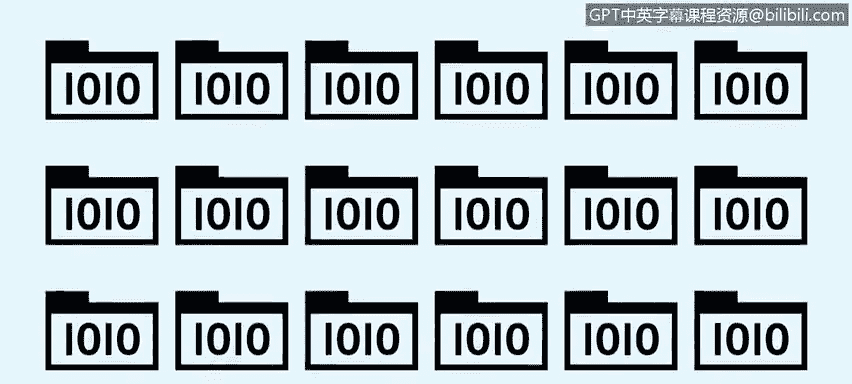

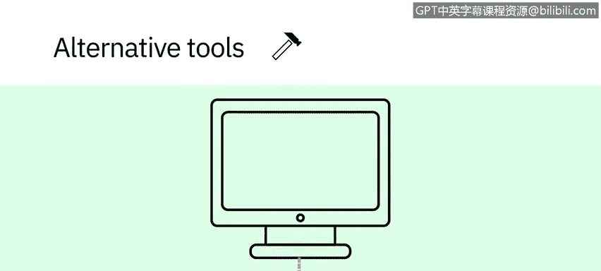

这为组织提供了更多与客户连接的方式，并丰富了他们提供的服务。

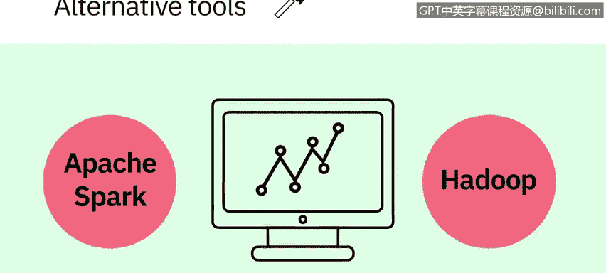

所以，下次当你戴上智能手表、解锁智能手机或追踪你的锻炼时，请记住，你的数据正在开始一段旅程，它可能通过大数据分析环游世界，然后再回到你身边。

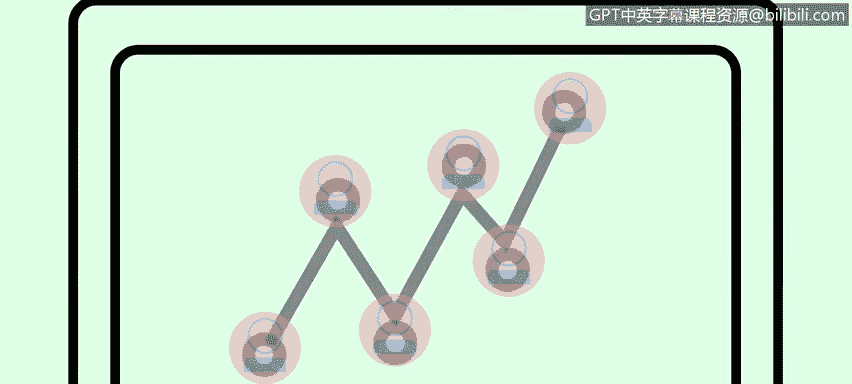

---

本节课中我们一起学习了大数据的基础知识。我们了解了大数据是由人、工具和机器产生的海量、多样、快速的数据集合。我们深入探讨了描述其核心特征的 **5V 模型**：**速度（Velocity）、体量（Volume）、多样性（Variety）、真实性（Veracity）和价值（Value）**，并通过实例加深了理解。最后，我们认识到处理大数据需要像 **Apache Spark** 和 **Hadoop** 这样的分布式计算工具。理解这些概念是成为一名数据分析师的重要第一步。