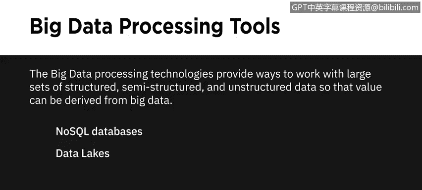
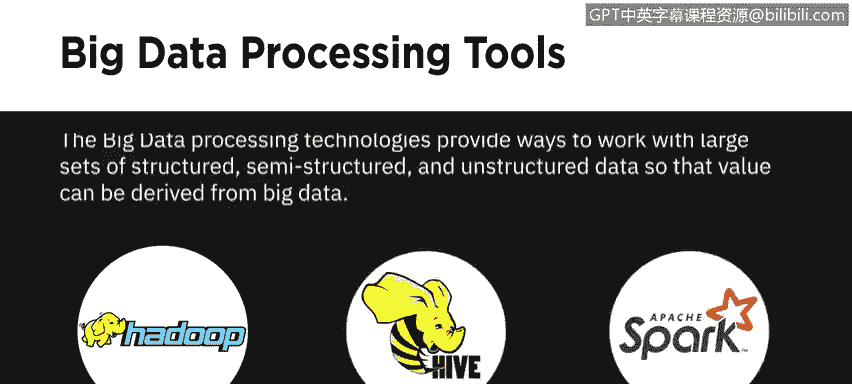
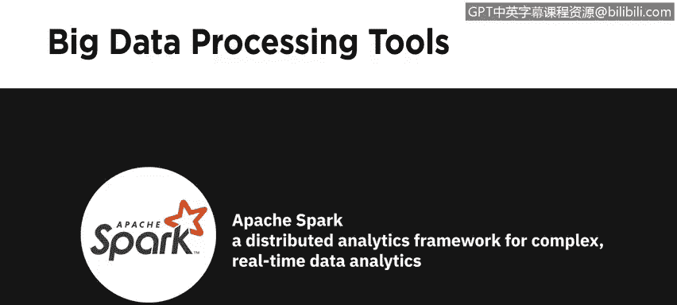
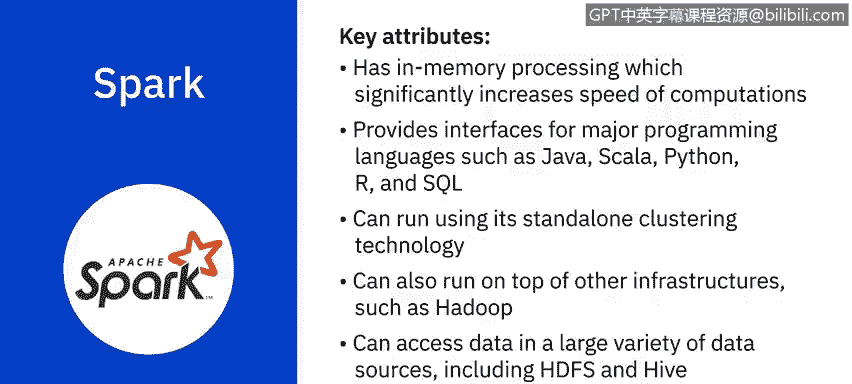

# 020：大数据处理工具 🛠️

在本节课中，我们将学习三种用于处理大规模数据集的开源技术：Apache Hadoop、Apache Hive 和 Apache Spark。这些工具为处理结构化、半结构化和非结构化的大数据提供了解决方案，并能从中提取价值。

---

## 大数据处理技术概述

大数据处理技术提供了处理大规模结构化、半结构化和非结构化数据集的方法，以便从大数据中提取价值。

在之前的课程中，我们讨论过 NoSQL 数据库和数据湖等技术。本节中，我们将重点介绍三种开源技术及其在大数据分析中的作用。

以下是三种核心的大数据处理工具：
*   **Apache Hadoop**：一个工具集合，提供大数据的分布式存储和处理。
*   **Apache Hive**：一个构建在 Hadoop 之上的数据仓库，用于数据查询和分析。
*   **Apache Spark**：一个分布式数据分析框架，旨在实时执行复杂的数据分析。

---

## Apache Hadoop：分布式存储与处理框架

Apache Hadoop 是一个基于 Java 的开源框架，它允许在计算机集群组成的分布式系统中，对大型数据集进行分布式存储和处理。

在 Hadoop 分布式系统中，一台单独的计算机称为一个**节点**，而节点的集合则构成一个**集群**。Hadoop 可以从单个节点扩展到任意数量的节点，每个节点都提供本地存储和计算能力。Hadoop 为存储数据提供了一个可靠、可扩展且经济高效的解决方案，并且对数据格式没有要求。

使用 Hadoop，您可以整合新兴的数据格式（如流媒体音频、视频、社交媒体情绪和点击流数据），以及传统数据仓库中不常使用的结构化、半结构化和非结构化数据。

Hadoop 的主要优势包括：
*   **为所有利益相关者提供近乎实时的服务访问**。
*   **通过整合整个组织的数据，并将“冷数据”（不频繁使用的数据）迁移到基于 Hadoop 的系统，来优化和简化企业数据仓库的成本**。

---

### Hadoop 分布式文件系统

Hadoop 的四个主要组件之一是 **Hadoop 分布式文件系统**。这是一个为大数据设计的存储系统，运行在通过网络连接的多台商用硬件上。

HDFS 通过将文件分区存储到多个节点上来提供可扩展且可靠的大数据存储。它将大文件分割并存储在多台计算机上，允许并行访问。因此，计算可以在存储数据的每个节点上并行运行。它还在不同节点上复制文件块以防止数据丢失，从而具备容错能力。

让我们通过一个例子来理解。假设有一个包含全美国电话号码的文件。姓氏以 A 开头的人的电话号码可能存储在服务器 1 上，以 B 开头的存储在服务器 2 上，依此类推。在 Hadoop 中，这个电话簿的各个部分会被存储在集群中，要重建整个电话簿，您的程序需要从集群中的每台服务器获取数据块。

HDFS 默认还会将这些较小的数据块复制到另外两台服务器，确保当一台服务器故障时数据仍然可用。除了更高的可用性，这还带来了多重好处：
*   它允许 Hadoop 集群将工作分解成更小的块，并在集群中的所有服务器上运行这些任务，从而实现更好的可扩展性。
*   最后，您获得了**数据本地性**的优势，即将计算任务移动到数据所在的节点附近执行。这在处理大型数据集时至关重要，因为它能最大限度地减少网络拥塞并提高吞吐量。

使用 HDFS 的其他好处还包括：
*   **强大的硬件故障恢复能力**，因为 HDFS 旨在检测故障并自动恢复。
*   **支持流数据访问**，因为 HDFS 支持高数据吞吐率。
*   **容纳大型数据集**，因为 HDFS 可以扩展到单个集群中的数百个节点或计算机。
*   **可移植性**，因为 HDFS 可在多个硬件平台上移植，并与各种底层操作系统兼容。

---

## Apache Hive：基于 Hadoop 的数据仓库

上一节我们介绍了 Hadoop 的存储基础，本节我们来看看构建在其之上的数据查询工具。Apache Hive 是一个开源数据仓库软件，用于读取、写入和管理直接存储在 HDFS 或其他数据存储系统（如 Apache HBase）中的大型数据集文件。

Hadoop 设计用于长时间的顺序扫描，而 Hive 基于 Hadoop，因此查询具有很高的**延迟**。这意味着 Hive 不太适合需要极快响应时间的应用程序。Hive 也不适合通常涉及大量写入操作的事务处理。

Hive 更适合数据仓库任务，例如 **ETL**、报告和数据分析，并且包含支持通过 **SQL** 轻松访问数据的工具。

---

## Apache Spark：快速通用数据处理引擎

从 Hive 的高延迟特性，我们自然过渡到对速度有更高要求的场景。Apache Spark 是一个通用数据处理引擎，旨在为广泛的应用（包括交互式分析、流处理、机器学习、数据集成和 ETL）提取和处理海量数据。

它利用**内存处理**来显著提高计算速度，仅在内存受限时才溢出到磁盘。Spark 支持多种主流编程语言，如 Java、Scala、Python、R 和 SQL。它可以使用其独立的集群技术运行，也可以在 Hadoop 等其他基础设施之上运行，并且可以访问 HDFS 和 Hive 等多种数据源中的数据，使其具有高度的通用性。

**快速处理流数据并实时执行复杂分析是 Apache Spark 的关键用例。**

---

## 课程总结

在本节课中，我们一起学习了三种核心的大数据处理工具：
1.  **Apache Hadoop**：提供了可扩展、容错的分布式存储和批处理基础架构，尤其适合存储海量多格式数据。
2.  **Apache Hive**：构建在 Hadoop 之上，通过类 SQL 接口简化了大数据的查询与分析，适用于数据仓库场景。
3.  **Apache Spark**：一个利用内存计算实现高速处理的通用引擎，擅长流处理、交互式查询和机器学习等实时或迭代计算任务。

理解这些工具的特点和适用场景，是构建有效大数据分析解决方案的重要基础。