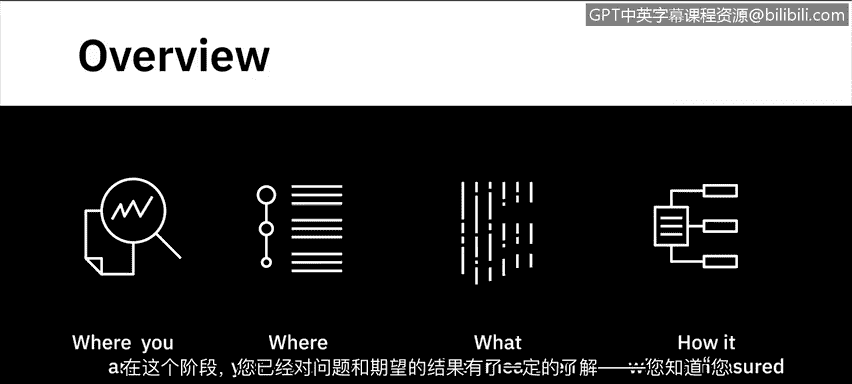
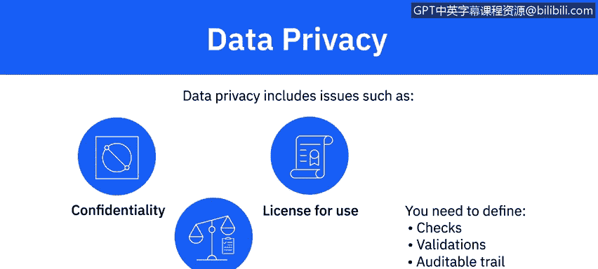
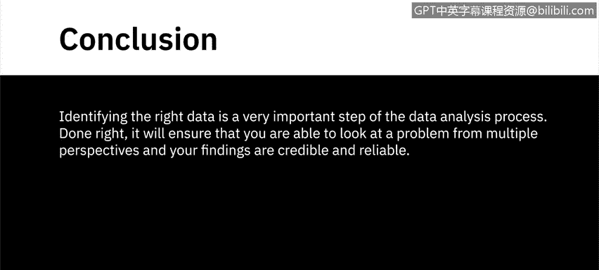

# 021：识别与分析数据 📊

在本节课中，我们将学习数据分析流程中的关键一步：如何识别和确定分析所需的数据。我们将了解从明确信息需求、制定收集计划到选择收集方法的完整过程，并讨论数据质量、安全与隐私等重要考量因素。

---

## 概述：识别数据的重要性

在上一阶段，你已经理解了问题与期望目标，明确了现状与理想状态，并定义了衡量指标。接下来，你需要为你的具体用例识别所需的数据。

识别数据的过程始于确定你想要收集的信息。这一步需要你决定所需的具体信息以及这些数据的可能来源。你的目标决定了这些问题的答案。

## 识别所需信息

以下是一个产品公司的例子，该公司希望根据最喜爱其产品的年龄段创建有针对性的营销活动。他们的目标是设计最能吸引该细分市场的推广方式，并鼓励他们进一步影响朋友和同龄人购买产品。

基于这个用例，你将识别出的一些明显信息包括：
*   客户档案
*   购买历史
*   地理位置
*   年龄
*   教育程度
*   职业
*   收入
*   婚姻状况

例如，为了确保你对该细分市场有更深入的了解，你可能还会决定收集该细分市场的客户投诉数据，以了解他们遇到的问题类型，因为这可能会阻碍他们向他人推荐你的产品。

为了了解他们对问题解决的满意程度，你可以收集他们客户服务调查的评分。

更进一步，你可能希望了解这些客户在社交媒体上如何谈论你的产品，以及他们的多少联系人在这些讨论中与他们互动，例如，他们的帖子获得的点赞、分享和评论数量。

## 制定数据收集计划

流程的下一步是制定数据收集计划。你需要为收集已识别的数据建立一个时间框架。你需要的某些数据可能需要持续收集，而有些则需要在特定时间段内收集。

例如，收集网站访问者数据可能需要实时更新数字，但如果你正在跟踪特定事件的数据，则数据收集有明确的开始和结束日期。

在这一步，你还可以定义多少数据量足以让你得出可信的分析。数据量是由细分市场定义的吗？例如，是所有21至30岁年龄段的客户，还是21至30岁年龄段的10万名客户数据集。

你也可以利用这一步来定义依赖关系、风险、缓解计划以及与你的项目相关的其他几个因素。该计划的目的应该是为执行建立所需的清晰度。

## 确定数据收集方法

流程的第三步是确定你的数据收集方法。在这一步，你将确定收集所需数据的方法。你将定义如何从已识别的数据源（如内部系统、社交媒体网站或第三方数据提供商）收集数据。

你的方法将取决于数据类型、你需要数据的时间框架以及数据量。

一旦你的计划和数据收集方法最终确定，你就可以实施数据收集策略并开始收集数据。在实施过程中，你需要不断更新你的计划，因为实际情况会随着计划的落地而发生变化。

## 数据质量、安全与隐私考量

你识别的数据、数据来源以及你用于收集数据的实践，对质量、安全和隐私都有影响。这些都不是一次性的考虑因素，而是在数据分析流程的整个生命周期中都相关的。

不考虑数据如何符合质量指标就使用来自不同来源的数据，可能导致失败。为了可靠，数据需要**无错误、准确、完整、相关且可访问**。你需要定义质量特征、指标和检查点，以确保你的分析将基于高质量的数据。

你还需要注意与数据治理相关的问题，例如安全、法规和合规性。数据治理政策和程序涉及数据的可用性、完整性和可用性。不合规的处罚可能高达数百万美元，不仅会损害你研究结果的可信度，还会损害你组织的信誉。

另一个重要的考虑因素是数据隐私。你收集的数据需要满足**保密性、使用许可和遵守强制性法规**的要求。需要计划好检查、验证和可审计的追踪记录。对用于分析的数据失去信任可能会损害流程，导致可疑的研究结果并招致处罚。

---

## 总结

本节课我们一起学习了识别与分析数据的完整流程。我们了解到，识别正确的数据是数据分析过程中非常重要的一步。如果操作得当，它将确保你能够从多个角度审视问题，并且你的研究结果是可信和可靠的。关键在于明确信息需求、制定周密的收集计划、选择合适的方法，并始终将数据质量、安全与隐私置于核心考量位置。