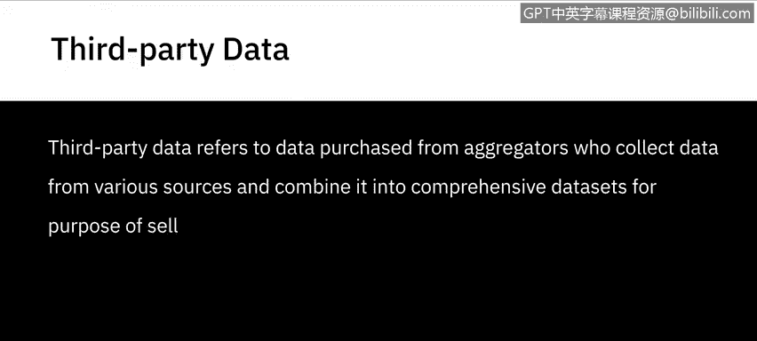
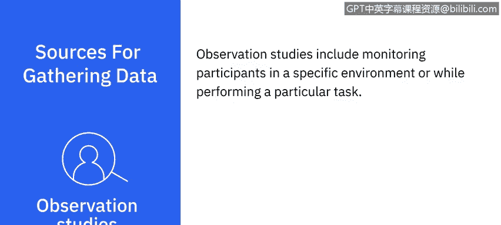

# 022：数据来源 📊

在本节课中，我们将要学习数据的不同来源。理解数据来自何处，以及如何获取和利用这些数据，是数据分析工作的基础。数据来源多种多样，掌握它们的特点有助于我们更有效地收集和分析信息。

---

## 数据来源的分类

数据来源可以根据其与组织的关系以及获取方式进行分类。它们可以是组织内部或外部的，也可以是**一手数据**、**二手数据**或**第三方数据**。

上一节我们介绍了数据来源的基本概念，本节中我们来看看这些类别的具体含义。

### 一手数据
**一手数据**是指你直接从源头获取的信息。
这可以来自内部来源，例如组织的客户关系管理（CRM）系统、人力资源（HR）系统或工作流应用程序中的数据。
它也包括你通过**调查**、**访谈**、**讨论**、**观察**和**焦点小组**直接收集的数据。

### 二手数据
**二手数据**是指从现有来源检索到的信息，例如外部数据库、研究文章、出版物、培训材料、互联网搜索或作为公开数据提供的财务记录。
这也包括通过外部进行的调查、访谈、讨论、观察和焦点小组收集的数据。

### 第三方数据
**第三方数据**是你从数据聚合商处购买的数据。这些聚合商从各种来源收集数据，并将其合并成综合数据集，其目的纯粹是为了出售数据。

---

## 主要数据来源示例

了解了数据的基本分类后，以下是实践中一些常见的数据来源。

### 数据库
数据库可以是一手、二手和第三方数据的来源。
大多数组织都有用于管理其流程、工作流和客户的内部应用程序。
外部数据库可通过订阅或购买获得。
许多企业已经或正在迁移到云端，云平台正日益成为获取实时信息和按需洞察的来源。

### 网络
网络是公开可用数据的来源，可供公司和个人免费或商业使用。
网络是公共领域中丰富的数据来源。这些数据可能包括教科书、政府记录、供公众消费的文章。
社交媒体网站和互动平台，如 Facebook、Twitter、Google、YouTube 和 Instagram，正越来越多地被用于获取用户数据和意见。
企业正在利用这些数据源，对现有和潜在客户进行定量和定性分析。

### 传感器数据
由可穿戴设备、智能建筑、智能城市、智能手机、医疗设备甚至家用电器产生的传感器数据，是一种被广泛使用的数据来源。

### 数据交换
数据交换是第三方数据的一个来源，涉及数据提供者和数据消费者之间自愿共享数据。
个人、组织和政府都可以既是数据提供者，也是数据消费者。
交换的数据可能包括来自商业应用程序、传感器设备、社交媒体活动、位置数据或消费者行为数据。

### 调查
调查通过向选定人群分发问卷来收集信息。
例如，衡量现有客户对产品更新版本的兴趣和消费意愿。
调查可以是基于网络或纸质的。人口普查数据也是收集家庭数据（如财富和收入）或人口数据的常用来源。

### 访谈
访谈是收集定性数据的来源，例如参与者的意见和经验。
例如，为理解客服专员日常面临的挑战而进行的访谈。
访谈可以通过电话、网络或面对面进行。

### 观察研究
观察研究包括在特定环境中或执行特定任务时监测参与者。
例如，观察用户浏览电子商务网站，以评估他们查找产品和进行购买的难易程度。

来自调查、访谈和观察研究的数据，可以作为一手、二手或第三方数据提供。

---

## 总结

本节课中我们一起学习了数据的各种来源。数据来源从未像今天这样动态和多样，并且还在不断演变。用二手和第三方数据源来补充你的一手数据，可以帮助你以新的、有意义的方式探索问题和解决方案。理解并善用这些来源，是成为一名优秀数据分析师的关键一步。