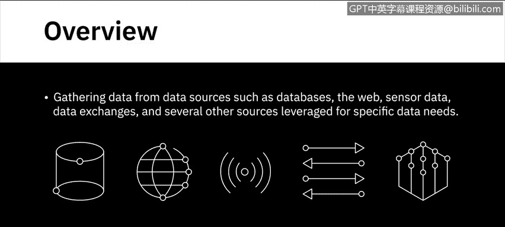
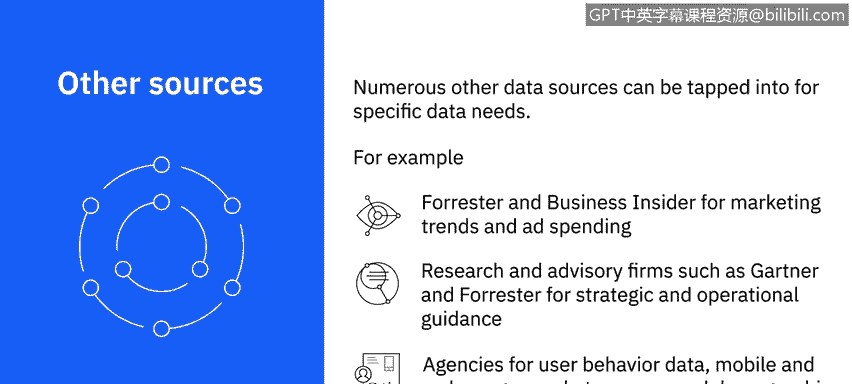
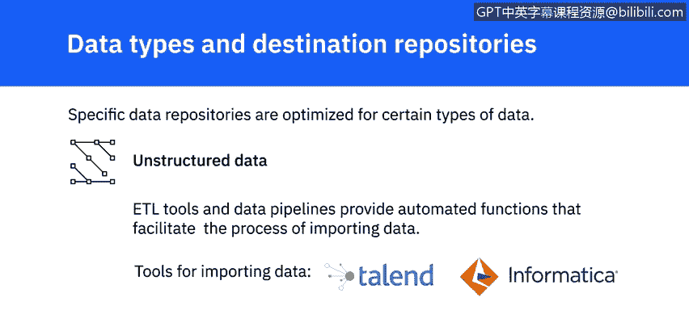

# 023：如何收集和导入数据

在本节课中，我们将学习从课程前面讨论过的各种数据源（如数据库、网络、传感器数据、数据交换平台等）收集数据的不同方法与工具。我们还将学习如何将数据导入到不同类型的数据存储库中。

---



## 🔍 数据收集方法

上一节我们介绍了数据源的类型，本节中我们来看看从这些数据源收集数据的具体方法。

### 结构化查询语言 (SQL)

SQL 是一种用于从关系型数据库中提取信息的查询语言。它提供简单的命令来指定需要从数据库中检索什么、从哪个表中提取、对具有匹配值的记录进行分组、控制查询结果的显示顺序以及限制查询返回的结果数量等众多功能。

**核心概念公式/代码示例：**
```sql
SELECT column1, column2
FROM table_name
WHERE condition
GROUP BY column1
ORDER BY column2
LIMIT 10;
```

非关系型数据库也可以使用 SQL 或类 SQL 的查询工具进行查询。一些非关系型数据库拥有自己的查询工具，例如 Cassandra 的 CQL 和 Neo4j 的 GraphQL。

### 应用程序编程接口 (API)

API 也普遍用于从各种数据源提取数据。需要数据的应用程序会调用 API 并访问包含数据的端点。这些端点可以包括数据库、网络服务和数据市场。

API 还可用于数据验证。例如，数据分析师可以使用 API 来验证邮政地址和邮政编码。

### 网络爬取

网络爬取（也称为屏幕抓取或网络采集）用于根据定义的参数从网页下载特定数据。网络爬取可用于从网站提取文本、联系信息、图像、视频、播客和产品项目等数据。

### RSS 源

RSS 源是另一个数据源，通常用于从在线论坛和新闻网站捕获持续更新的数据。

### 数据流

数据流是聚合来自仪器、物联网设备、应用程序以及汽车 GPS 数据等来源的持续数据流的常用来源。数据流和源也用于从社交媒体网站和互动平台提取数据。

### 数据交换平台

数据交换平台允许数据提供者和数据消费者之间交换数据。数据交换平台有一套明确定义的、与数据交换相关的交换标准、协议和格式。

这些平台不仅促进数据交换，还确保安全性和治理得到维护。它们提供数据许可工作流、个人信息的去标识化和保护、法律框架以及隔离的分析环境。

以下是流行的数据交换平台示例：
*   AWS Data Exchange
*   Crunchbase
*   Loomy
*   Snowflake

### 其他特定数据源

许多其他数据源可以满足特定的数据需求。例如，对于营销趋势和广告支出数据，Forrester 和 Business Insider 等研究公司以提供可靠数据而闻名。Gartner 和 Forrester 等研究和咨询公司是战略和运营指导方面广受信赖的来源。



同样，在用户行为数据、移动和网络使用情况、市场调查和人口统计研究领域也有许多值得信赖的机构。

---

## 🗃️ 数据导入与存储库

从各种数据源识别和收集到的数据，在能够进行整理、挖掘和分析之前，需要被加载或导入到数据存储库中。导入过程涉及将来自不同来源的数据组合起来，提供一个统一的视图和单一接口，以便查询和操作数据。

根据数据类型、数据量以及目标存储库的类型，您可能需要不同的工具和方法。

### 数据存储库类型

特定的数据存储库针对某些类型的数据进行了优化。

**关系型数据库**存储具有明确定义模式的结构化数据。如果您使用关系型数据库作为目标系统，您将只能存储结构化数据，例如来自 OLTP 系统、电子表格、在线表单、传感器、网络和 Web 日志的数据。结构化数据也可以存储在 NoSQL 数据库中。

**半结构化数据**具有一些组织属性，但没有严格的模式，例如来自电子邮件、XML、ZIP 文件、二进制可执行文件以及 TCP/IP 协议的数据。半结构化数据可以存储在 NoSQL 集群中。XML 和 JSON 通常用于存储和交换半结构化数据。JSON 也是 Web 服务的首选数据类型。

**非结构化数据**是没有结构且无法组织成模式的数据，例如来自网页、社交媒体源、图像、视频、文档、媒体日志和调查的数据。NoSQL 数据库和数据湖为存储和操作大量非结构化数据提供了很好的选择。数据湖可以容纳所有数据类型和模式。

### 导入工具

ETL 工具和数据管道提供了自动化功能，以促进数据导入过程。诸如 Talend 和 Informatica 等工具，以及 Python 和 R 等编程语言及其库，被广泛用于导入数据。

---

## 📝 总结



本节课中我们一起学习了数据收集与导入的核心知识。我们探讨了使用 SQL、API、网络爬取等多种方法从不同数据源收集数据，并了解了如何根据数据的结构类型（结构化、半结构化、非结构化）将其导入到相应的数据存储库（如关系型数据库、NoSQL、数据湖）中。理解这些方法是进行有效数据分析的重要基础。