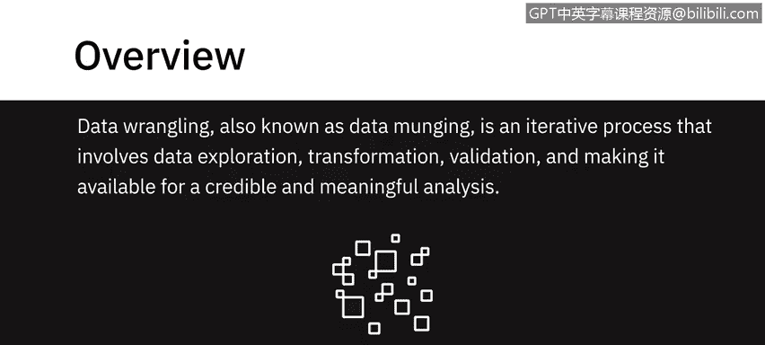
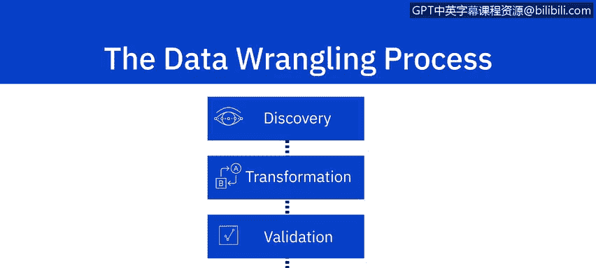
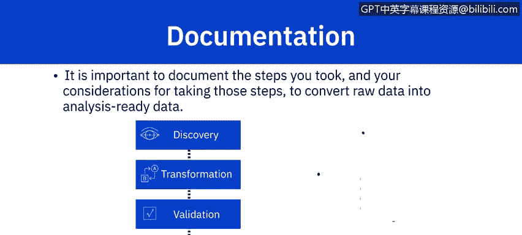

# 024：什么是数据整理

在本节课中，我们将学习数据整理的核心概念、步骤及其在数据分析中的重要性。数据整理是数据分析流程中至关重要的一环，它确保原始数据被转化为可信、有意义且可用于分析的形式。

---

数据整理，也称为数据清洗，是一个迭代过程，涉及数据探索、转换、验证，并使其可用于可信且有意义的分析。它包括一系列任务，旨在为明确定义的目的准备原始数据。此阶段的原始数据是指通过数据存储库中的各种数据源收集的数据。

数据整理涵盖了为分析准备数据所涉及的一系列任务。通常，它是一个包含四个步骤的过程：发现、转换、验证和发布。

## 发现阶段

发现阶段，也称为探索阶段，是关于根据您的用例更好地理解您的数据。其目标是具体找出如何最好地为您拥有的数据进行清理、结构化、组织和映射，以满足您的用例需求。

## 转换阶段

接下来是转换阶段，它构成了数据整理过程的主体。它涉及您为转换数据而执行的任务，例如结构化、规范化、反规范化、清理和丰富数据。

以下是转换阶段的主要任务类型：

**1. 结构化**
此任务包括改变数据形式和模式的操作。传入的数据可能具有多种格式。例如，您可能有一些数据来自关系数据库，另一些数据来自Web API。为了合并它们，您需要更改数据的形式或模式。这种更改可能简单到改变记录内字段的顺序，也可能复杂到将字段组合成复杂的结构。

连接（Joins）和联合（Unions）是用于合并一个或多个表中数据的最常见的结构转换。它们合并数据的方式不同：
*   **连接（Joins）合并列**：当两个表连接时，第一个源表的列与第二个源表的列在同一行中组合。因此，结果表中的每一行都包含来自两个表的列。
    *   **公式/代码示例**：`SELECT * FROM table_a JOIN table_b ON table_a.id = table_b.id`
*   **联合（Unions）合并行**：第一个源表的数据行与第二个源表的数据行组合成一个表。结果表中的每一行都来自某一个源表。
    *   **公式/代码示例**：`SELECT * FROM table_a UNION SELECT * FROM table_b`

**2. 规范化与反规范化**
转换还可以包括数据的规范化和反规范化。
*   **规范化**侧重于清理数据库中未使用的数据，并减少冗余和不一致性。例如，来自事务系统的数据，其中持续执行大量插入、更新和删除操作，通常是高度规范化的。
*   **反规范化**用于将来自多个表的数据合并到单个表中，以便更快地进行查询。例如，来自事务系统的规范化数据通常在运行报告和分析查询之前进行反规范化。

**3. 清理**
清理任务是修复数据中的不规则性，以产生可信且准确的分析。不准确、缺失或不完整的数据可能会扭曲您的分析结果，需要加以考虑。数据也可能存在偏差、相关字段中存在空值或存在异常值。

例如，您可能想了解某产品的销售人口统计信息，但您收到的数据没有记录性别。您要么需要获取这个数据点并将其与现有数据集合并，要么可能需要删除或不考虑缺少此字段的记录。我们将在本课程后续部分探讨更多数据清理的示例。

**4. 丰富数据**
丰富数据是第四种转换类型。当您审视现有数据，并考虑可能使您的分析更有意义的额外数据点时，您就是在考虑丰富您的数据。

例如，在一个信息分散在多个系统中的大型组织中，您可能需要用其他系统甚至公共数据集中可用的信息来丰富一个系统提供的数据集。

考虑这样一个场景：您向企业销售IT外设，并想分析过去五年客户的购买模式。您拥有客户主表和交易表，从中捕获了客户信息和购买历史。用这些企业的绩效数据（可能作为公共数据集提供）来补充您的数据集，可能对您理解影响其购买决策的因素很有价值。

插入元数据也能丰富数据。例如，从客户反馈日志计算情感得分，从度假村位置收集基于地理位置的天气数据以分析入住趋势，或捕获博客文章的发布时间和标签。

## 验证阶段

转换之后，数据整理的下一个阶段是验证。在此阶段，您检查经过结构化、规范化、清理和丰富后的数据质量。验证规则指的是用于验证数据一致性、质量和安全性的重复性编程步骤。

## 发布阶段

这引出了数据整理过程的第四阶段——发布。发布涉及为下游项目需求交付整理后的数据输出。发布的是输入数据集的转换和验证版本，以及关于数据的元数据。

## 文档记录的重要性

最后，必须注意记录您将原始数据转换为可用于分析的数据所采取的步骤和考虑因素的重要性。数据整理的所有阶段本质上都是迭代的。为了复制这些步骤并重新审视执行这些步骤时的考虑因素，记录所有考虑因素和操作至关重要。

---

**总结**
在本节课中，我们一起学习了数据整理（Data Wrangling）的完整流程。我们了解到它是一个包含**发现、转换、验证和发布**四个核心阶段的迭代过程。转换阶段是核心，涉及**结构化、规范化/反规范化、清理和丰富**数据。我们强调了**验证**对于确保数据质量的关键作用，以及**发布**整理后数据以供下游使用的必要性。最后，我们认识到**详细记录**整个整理过程的步骤和决策对于确保分析的可重复性和透明度至关重要。掌握数据整理是成为一名合格数据分析师的基础技能。