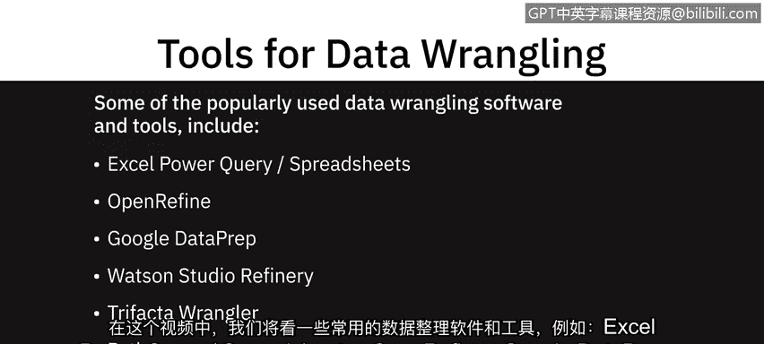
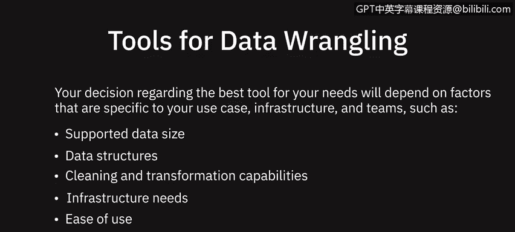

# 025：数据整理工具 🛠️

在本节课中，我们将学习一些常用的数据整理软件和工具。数据整理是数据分析的关键步骤，它涉及清洗、转换和准备原始数据，使其适合进行分析。我们将介绍从基础的电子表格到高级编程语言中的多种工具。

## 电子表格软件 📊

上一节我们介绍了数据整理的概念，本节中我们来看看最基础的手动整理工具——电子表格。

电子表格，如 Microsoft Excel 和 Google Sheets，拥有丰富的功能和内置公式，可以帮助你识别问题、清洗和转换数据。

以下是电子表格工具的特点：
*   它们提供插件或功能，允许你从多种不同类型的源导入数据，并根据需要进行清洗和转换。
*   例如，Microsoft Excel 的 Power Query 和 Google Sheets 的查询函数。

## 专用数据整理工具 🧹

除了通用电子表格，还有一些专门为数据整理设计的工具。

**OpenRefine** 是一个开源工具，允许你以多种格式（如 TSV、CSV、XLS、XML、JSON）导入和导出数据。使用 OpenRefine，你可以清洗数据、将其从一种格式转换为另一种格式，并通过网络服务和外部数据扩展数据集。它的优点是易于学习和使用，提供基于菜单的操作，无需记忆命令或语法。

**Google Data Prep** 是一个智能的云数据服务，允许你直观地探索、清洗和准备结构化和非结构化数据以进行分析。它是一个完全托管的服务，意味着你无需安装或管理软件或基础设施。它的特点是易于使用，会根据你的每一步操作提供下一步的建议，并能自动检测模式、数据类型和异常。

**Watson Studio Refinery**（通过 IBM Watson Studio 提供）允许你使用内置操作来发现、清理和转换数据。它将大量原始数据转换为可供分析使用的优质信息。该工具提供了将数据导出到各种数据源的灵活性，能自动检测数据类型和分类，并自动执行适用的数据治理策略。

**Trifacta Wrangler** 是一个基于云的交互式服务，用于清理和转换数据。它处理混乱的真实世界数据，并将其清理和重新排列成数据表，然后可以导出到 Excel、Tableau 和 R。它以协作功能著称，允许多个团队成员同时工作。

## 编程语言工具 🐍📈

对于需要更强大、自动化处理能力的场景，编程语言提供了丰富的库和包。

**Python** 拥有庞大的库和包集合，提供强大的数据操作能力。

以下是 Python 中一些重要的数据整理库：
*   **Jupyter Notebook**：一个广泛用于数据清洗和转换、统计建模以及数据可视化的开源 Web 应用程序。
*   **NumPy**（Numerical Python）：Python 提供的最基础的包。它快速、灵活、可互操作且易于使用。它支持大型多维数组和矩阵，并提供用于操作这些数组的高级数学函数。其核心是 `ndarray` 对象。
*   **Pandas**：专为快速简便的数据分析操作而设计。它允许使用简单的单行命令执行复杂操作，如合并、连接和转换大量数据。使用 Pandas，可以防止因来自不同源的数据未对齐而导致的常见错误。其核心数据结构是 `DataFrame`。

**R** 语言也提供了一系列专门为整理混乱数据而创建的库和包。

以下是 R 语言中一些重要的数据整理包：
*   **dplyr**：一个用于数据整理的强大库，语法精确且直接。
*   **data.table**：帮助你快速聚合大型数据集。
*   **jsonlite**：一个强大的 JSON 解析工具，非常适合与 Web API 交互。

## 如何选择工具？ 🤔

数据整理工具具有不同的能力和维度。关于哪种工具最适合你需求的决策，将取决于你特定用例、基础设施和团队的因素。

以下是选择工具时需要考虑的关键因素：
*   **支持的数据大小**：工具能处理的数据量级。
*   **支持的数据结构**：工具是否能处理你的数据格式（如表格、JSON、XML）。
*   **清洗和转换能力**：工具提供的具体数据操作功能。
*   **基础设施需求**：是本地软件、云服务，还是需要特定环境。
*   **易用性和学习曲线**：工具是否容易上手和使用。

---

本节课中我们一起学习了多种数据整理工具，从直观的电子表格和图形化工具（如 OpenRefine、Google Data Prep），到功能强大的编程环境（如 Python 的 Pandas、R 的 dplyr）。理解这些工具的特点和适用场景，将帮助你在实际数据分析项目中，根据数据规模、复杂度和团队技能，选择最合适的工具来高效地准备数据。