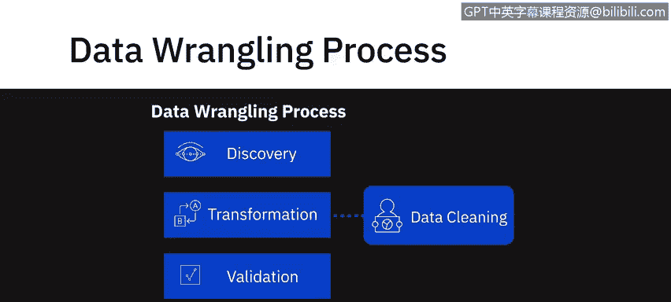
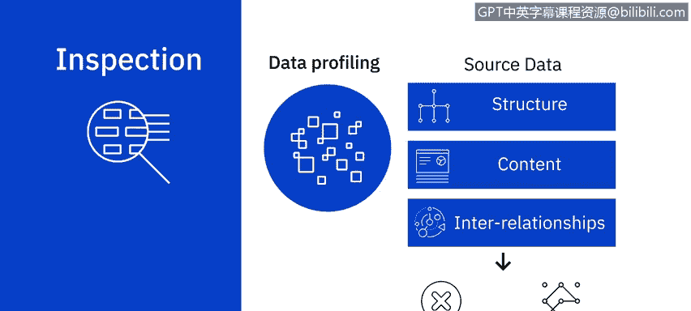
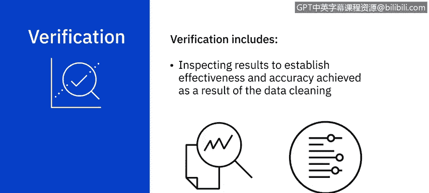
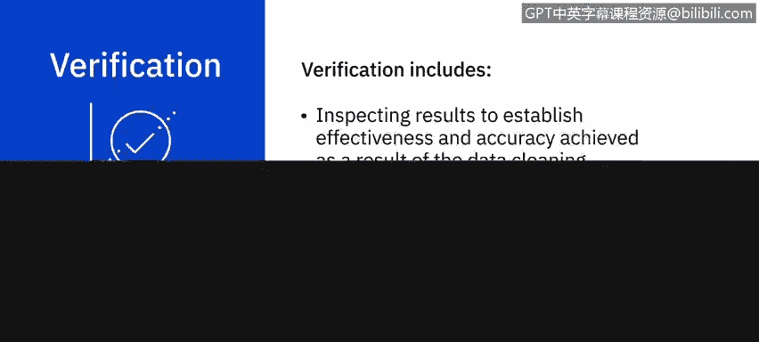

# 026：数据清洗

在本节课中，我们将学习数据清洗的核心概念、工作流程以及常见的数据问题处理方法。数据清洗是确保数据质量、支持有效决策的关键步骤。

---

根据Gartner的数据质量报告，低质量数据会削弱组织的竞争力，并破坏关键业务目标。

缺失、不一致或不正确的数据可能导致错误结论，进而引发无效决策。在商业世界中，这可能造成高昂代价。

从不同来源收集的数据集可能存在多种问题，包括缺失值、不准确数据、重复记录、错误或缺失的分隔符、不一致的记录以及参数不足。

在某些情况下，可以借助数据整理工具和脚本手动或自动纠正数据。但如果数据无法修复，则必须从数据集中移除。

---

虽然数据清洗和数据整理这两个术语有时被互换使用，但必须记住，数据清洗只是整个数据整理过程的一个子集。

数据清洗在数据整理工作流程的转换阶段中，构成了非常重要且不可或缺的部分。

---

## 🔍 典型的数据清洗工作流程

一个典型的数据清洗工作流程包括检查、清洗和验证三个步骤。

### 数据检查

数据清洗工作流程的第一步是检测数据集中可能存在的不同类型的问题和错误。

您可以使用脚本和工具来定义特定的规则和约束，并根据这些规则和约束验证数据。

您也可以使用数据剖析和数据可视化工具进行检查。

数据剖析帮助您检查源数据，以理解数据的结构、内容和相互关系。它能揭示异常和数据质量问题。

例如，空白或空值、重复数据，或某个字段的值是否落在预期范围内。

使用统计方法可视化数据可以帮助您发现异常值。例如，绘制人口统计数据集的平均收入可以帮助您发现异常值。

---

### 数据清洗

接下来，我们进入数据的实际清洗阶段。应用于清洗数据集的技术将取决于具体用例和您遇到的问题类型。

以下是几种更常见的数据问题及其处理方法。

**1. 处理缺失值**
缺失值的处理非常重要，因为它们可能导致意外或有偏差的结果。
您可以选择过滤掉含有缺失值的记录，或者，如果该信息对您的用例至关重要，则设法找到获取该信息的途径。
第三种方法是使用**插补法**，即基于统计值计算缺失值。
您选择采取何种行动方案，需要基于对您的用例最有利的原则来决定。

**2. 处理重复数据**
数据集中重复出现的数据点即为重复数据，这些需要被移除。

**3. 处理无关数据**
不符合您用例上下文的数据可被视为无关数据。
例如，如果您正在分析某一人群总体健康状况的数据，他们的联系电话可能对您不相关。

**4. 数据类型转换**
清洗可能涉及数据类型转换。这是为了确保字段中的值以该字段的数据类型存储。
例如，数字存储为数值数据类型，日期存储为日期数据类型。

**5. 数据标准化**
您可能还需要清洗数据以实现标准化。
例如，对于字符串，您可能希望所有值都采用小写形式。同样，日期格式和度量单位也需要标准化。

**6. 修正语法错误**
例如，字符串开头或结尾的空格或多余空格是需要纠正的语法错误。
这也包括修正拼写错误或格式。例如，在某些记录中，州名以全称形式输入（如 New York），而在另一些记录中以缩写形式输入（如 NY）。

**7. 处理异常值**
数据中也可能存在异常值，即与数据集中其他观测值差异极大的值。
异常值可能正确，也可能不正确。
例如，当选民数据库中的年龄字段值为5时，您知道这是不正确的数据，需要纠正。
现在，考虑一组人群，其年收入在10万到20万美元之间，但其中一人年收入为100万美元。虽然这个数据点并非不正确，但它是一个异常值，需要审视。
根据您的用例，您可能需要决定包含此数据是否会以不利于您用例的方式扭曲结果。

---

### 数据验证

这使我们进入数据清洗工作流程的下一步：验证。
在此步骤中，您检查结果，以确定数据清洗操作所达到的有效性和准确性。
您需要重新检查数据，以确保在您进行修正后，适用于数据的规则和约束仍然成立。

---

最后，必须注意，作为数据清洗操作一部分进行的所有更改都需要被记录。
不仅要记录更改，还要记录进行这些更改的原因以及当前存储数据的质量。报告数据的健康程度是一个非常关键的步骤。

---

## 📝 总结

在本节课中，我们一起学习了数据清洗的重要性及其在数据整理中的位置。我们详细探讨了数据清洗的标准工作流程：检查、清洗和验证。我们还介绍了处理缺失值、重复数据、无关数据、数据类型转换、标准化、语法错误和异常值等常见数据问题的方法。记住，记录所有清洗操作及其原因对于维护数据质量和确保分析的可追溯性至关重要。