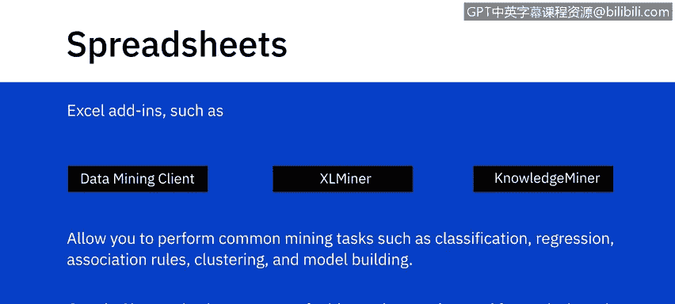
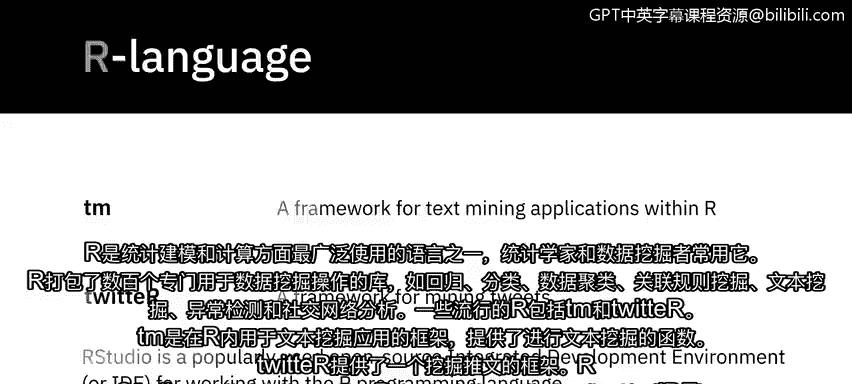
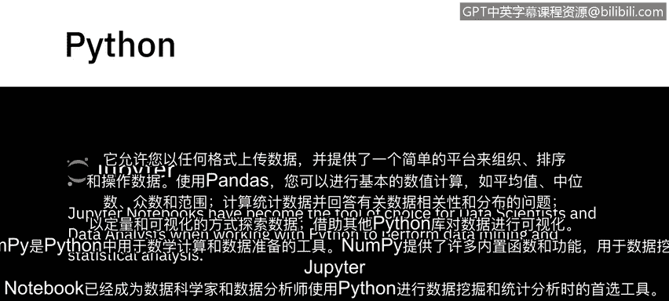
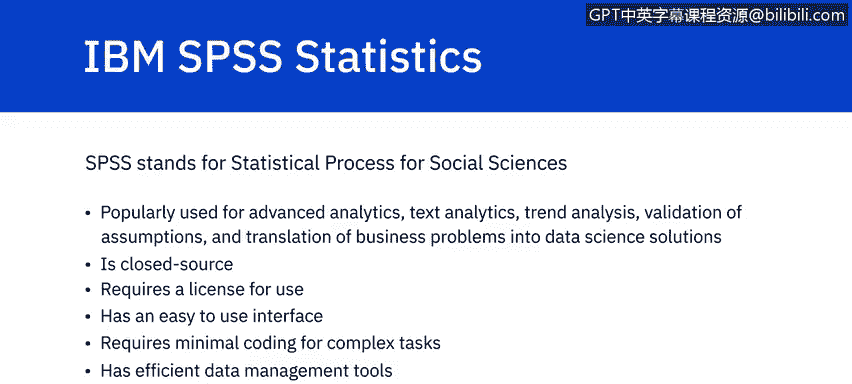
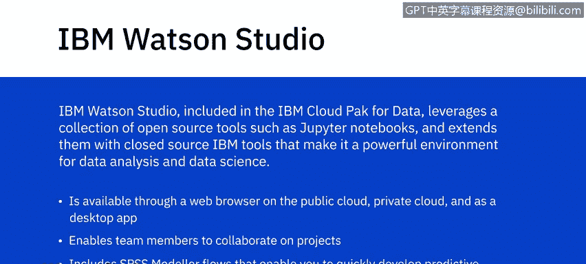
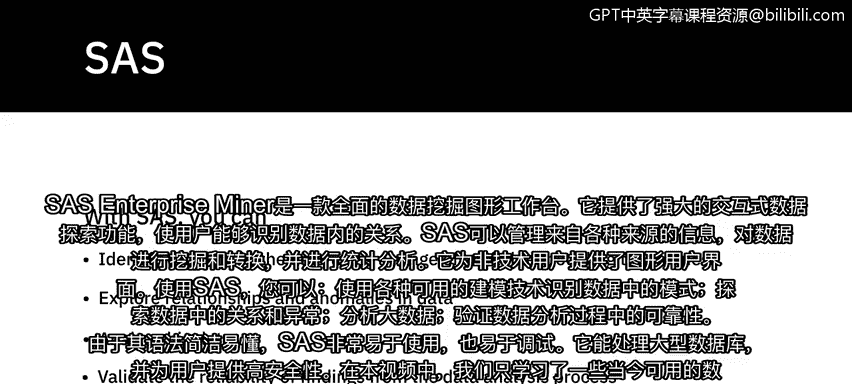
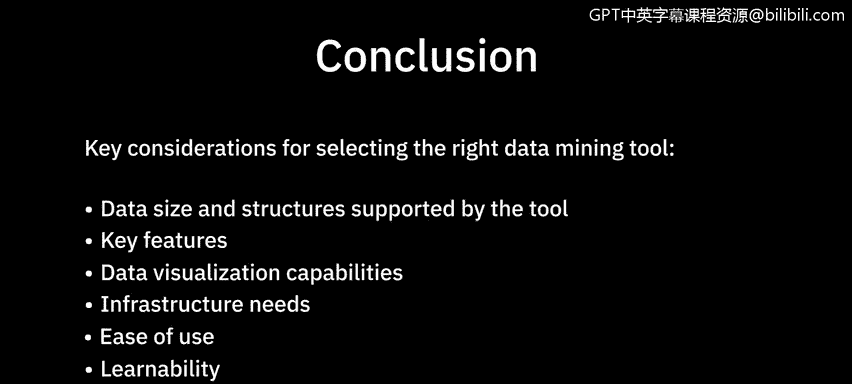

# 030：数据挖掘工具

在本节课中，我们将学习一些常用的数据挖掘软件和工具，包括电子表格、R语言、Python、IBM SPSS Statistics、IBM Watson Studio 和 SAS。了解这些工具的特点和适用场景，将帮助你为不同的数据挖掘任务选择合适的工具。

---

## 📈 电子表格工具

上一节我们介绍了数据挖掘的基本概念，本节中我们来看看最基础的工具——电子表格。电子表格，如 Microsoft Excel 和 Google Sheets，常用于执行基本的数据挖掘任务。

以下是电子表格在数据挖掘中的主要应用：

*   **数据承载与展示**：电子表格可以承载从其他系统导出的数据，并以易于访问和阅读的格式呈现。
*   **数据透视**：你可以使用数据透视表来展示数据的特定方面。这在需要筛选和分析大量数据时至关重要。
*   **数据比较**：它们使不同数据集之间的比较变得相对容易。
*   **插件扩展功能**：Excel 有可用的插件，如 **Data Mining Client for Excel**、**XL Miner** 和 **Knowledge Miner for Excel**，允许你执行常见的挖掘任务，如分类、回归、关联规则、聚类和模型构建。
*   **Google Sheets 插件**：Google Sheets 也有一系列可用于分析和挖掘的插件，如文本分析、文本挖掘和 Google Analytics。

---

## 🔢 R 语言与 RStudio

电子表格适合入门和简单分析，但对于更复杂的统计建模，我们则需要更专业的工具。R 语言是统计学家和数据挖掘者用于执行统计建模和计算的最广泛使用的语言之一。

以下是 R 语言的核心特点：

*   **丰富的库**：R 打包了数百个专门为数据挖掘操作构建的库，例如回归、分类、数据聚类、关联规则挖掘、文本挖掘、异常值检测和社交网络分析。
*   **流行包示例**：一些流行的 R 包包括 `tm` 和 `twitter`。
    *   `tm`：一个在 R 中用于文本挖掘应用程序的框架，提供了文本挖掘功能。
    *   `twitter`：提供了一个挖掘推文的框架。
*   **集成开发环境**：**RStudio** 是一个广泛使用的开源集成开发环境（IDE），用于处理 R 编程语言。

---

## 🐍 Python 与相关库

除了 R，Python 是另一个在数据科学领域极其流行的语言。Python 库如 **Pandas** 和 **NumPy** 常用于数据挖掘。

以下是这些库的主要功能：

*   **Pandas**：这是一个用于处理数据结构和分析的开源模块。它可能是 Python 中最流行的数据分析库。
    *   它允许你以任何格式上传数据，并提供一个简单的平台来组织、排序和操作数据。
    *   使用 Pandas，你可以执行基本的数值计算，如**均值、中位数、众数和极差**。
    *   它可以计算统计数据，回答有关数据相关性和数据分布的问题。
    *   它可以帮助你以可视化和定量的方式探索数据。
    *   可以借助其他 Python 库（如 Matplotlib, Seaborn）实现数据可视化。
*   **NumPy**：这是 Python 中用于数学计算和数据准备的工具。NumPy 为数据挖掘提供了一系列内置函数和能力。
*   **Jupyter Notebooks**：**Jupyter Notebooks** 已成为数据科学家和数据分析师使用 Python 执行数据挖掘和统计分析时的首选工具，因为它支持交互式代码编写和文档记录。

---

## 🧮 IBM SPSS Statistics

对于寻求图形化界面和强大分析能力的企业用户，SPSS 是一个重要选择。SPSS 代表“社会科学统计软件包”。

以下是 SPSS 的主要特点：

*   **广泛应用**：虽然其名称暗示了最初在社会科学领域的用途，但它现在广泛用于高级分析、文本分析、趋势分析、假设验证以及将业务问题转化为数据科学解决方案。
*   **商业软件**：SPSS 是闭源软件，需要许可证才能使用。
*   **易于使用**：SPSS 拥有易于使用的界面，对于复杂任务只需最少的编码。
*   **强大功能**：它包含高效的数据管理工具，并因其深入的分析能力和准确的数据结果而广受欢迎。

---

## ☁️ IBM Watson Studio

在云平台和协作成为趋势的今天，IBM 提供了集成化的解决方案。**IBM Watson Studio** 包含在 IBM Cloud Pak for Data 中。

以下是 IBM Watson Studio 的核心优势：

*   **工具集成**：它利用了一系列开源工具（如 Jupyter Notebooks），并通过 IBM 的闭源工具对其进行了扩展，使其成为一个强大的数据分析和数据科学环境。
*   **多平台访问**：它可以通过 Web 浏览器在公有云、私有云上使用，也可作为桌面应用程序使用。
*   **团队协作**：Watson Studio 使团队成员能够在项目上进行协作，项目范围可以从简单的探索性分析到构建机器学习和 AI 模型。
*   **快速建模**：它还包括 SPSS Modeler 流程，使你能够快速为业务数据开发预测模型。

---

## 🏢 SAS Enterprise Miner

最后，我们来看一个为企业级数据挖掘设计的综合平台。**SAS Enterprise Miner** 是一个用于数据挖掘的综合性图形化工作台。

以下是 SAS 的主要功能：

*   **交互式探索**：它提供了强大的交互式数据探索能力，使用户能够识别数据内部的关系。
*   **数据管理**：SAS 可以管理来自各种来源的信息，挖掘和转换数据，并分析统计数据。
*   **图形化界面**：它为非技术用户提供了图形用户界面。
*   **核心分析能力**：使用 SAS，你可以：
    *   使用一系列可用的建模技术识别数据中的模式。
    *   探索数据中的关系和异常。
    *   分析大数据。
    *   验证数据分析过程中发现的可靠性。
*   **易用性与安全性**：SAS 因其语法而非常易于使用，也易于调试。它能够处理大型数据库，并为用户提供高安全性。

---

## 📝 总结与工具选择建议

本节课中，我们一起学习了几种当今可用的数据挖掘工具。关于最适合你需求的工具的决定，将受到以下因素驱动：

*   工具支持的数据大小和结构
*   它提供的功能
*   其数据可视化能力
*   基础设施需求
*   易用性和可学习性

为了满足你的所有需求，结合使用多种数据挖掘工具是相当常见的做法。建议初学者从电子表格或 Python 入手，掌握基础后，再根据项目复杂度和团队需求，探索 R、SPSS 或 SAS 等专业工具。