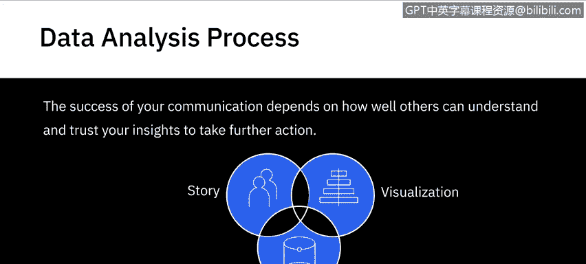
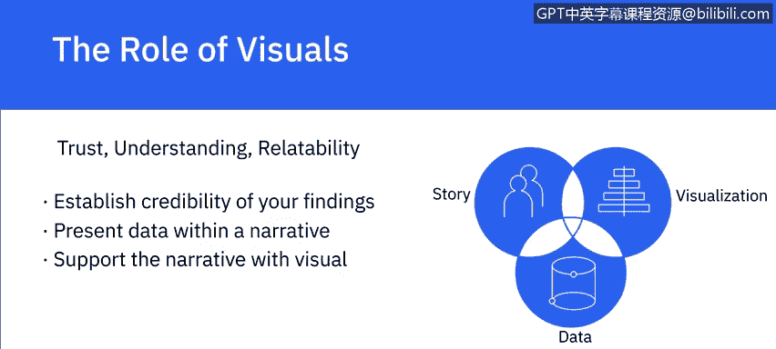

# 031：分享和传播数据分析结果的概述 📊

在本节课中，我们将要学习如何有效地分享和传播数据分析结果。理解如何将你的发现清晰地传达给受众，是数据分析流程中至关重要的一环，它直接影响决策的制定和后续行动。

数据分析流程始于理解需要解决的问题和期望达成的目标，终于以能够影响决策的方式传达分析结果。数据项目通常是跨部门协作的成果，涉及具备多领域技能的人员，其发现最终会融入更广泛的业务计划中。

## 理解你的受众 👥

上一节我们介绍了数据分析流程的起点与终点，本节中我们来看看成功沟通的关键——理解你的受众。沟通的成功与否，取决于他人能否理解并信任你的见解，从而采取进一步行动。因此，数据分析师需要通过清晰的可视化数据和结构化的叙述，用数据讲述故事。

在开始构思沟通内容前，你需要重新连接你的受众。以下是开始前需要问自己的几个关键问题：

*   **我的受众是谁？**
*   **对他们而言，什么是重要的？**
*   **什么能帮助他们信任我？**

你的受众通常是一个多元化的群体，他们代表不同的业务职能，在组织中扮演运营或战略角色，受问题影响的程度也各不相同。

## 构建你的演示内容 🗣️

理解了受众之后，下一步就是围绕他们已有的信息水平来构建你的演示内容。基于对受众的理解，你将决定哪些信息以及多少信息对于帮助他们更好地理解你的发现是至关重要的。

以下是构建演示内容的核心原则：

*   **聚焦关键信息**：你可能会忍不住展示所有处理过的数据，但必须考虑哪些部分对你的受众更重要。演示不是数据倾倒。单纯的事实和数字无法影响决策或推动人们行动。
*   **讲述引人入胜的故事**：只包含解决业务问题所必需的信息。信息过多会让受众难以理解你的核心观点。
*   **从问题共识开始**：通过向受众展示你对业务问题的理解来开始你的演示。重申需要解决的问题和期望达成的目标，是赢得他们关注和建立信任的良好第一步。
*   **使用业务领域语言**：使用你所在组织的业务领域语言，是建立你与受众之间联系的另一个重要因素。

## 组织信息与建立可信度 📝

设计沟通的下一步，是为实现最大影响力而构建和组织你的演示。你需要引用所收集的数据。记住，数据是你一切沟通的基础，但对受众来说可能像一个“黑箱”。

为了建立可信度，你需要：

1.  **分享数据来源**：说明你的数据从何而来。
2.  **阐明假设与验证**：清晰地陈述分析过程中所做的关键假设，并说明你是如何验证数据和结论的。
3.  **逻辑分类信息**：根据你掌握的信息，将其组织成逻辑类别。例如，你是否同时拥有定性和定量信息？

在叙述中，可以有意识地采用自上而下或自下而上的方法，两者都可能有效，具体取决于你的受众和使用场景。关键在于保持方法的一致性。

## 选择沟通格式与可视化 📈

确定哪种沟通格式对你的受众最有用至关重要。他们需要带走一份执行摘要、一份事实清单还是一份完整报告？受众将如何使用你提供的信息，这应该决定你选择的格式。

见解必须以能激发行动的方式解释。如果你的受众没有领会到见解的重要性，或对其效用持怀疑态度，那么该见解就无法创造任何价值。

在受众脑海中创建清晰的心理图像方面，一段100字的论述可能不如一张可视化图表有冲击力。强大的可视化通过图形化描绘事实和数字来讲述故事。

数据可视化，如图表、图形和示意图，是让数据“活”起来的好方法。无论你是要展示**比较**、**关系**、**分布**还是**构成**，都有相应的工具可以帮助你展示关于假设的模式和结论。

## 总结 📋

本节课中，我们一起学习了如何有效地分享和传播数据分析结果。数据通过其讲述的故事产生价值。你的受众必须能够信任你、理解你并与你的发现和见解产生共鸣。通过**建立发现的可信度**、**在叙述中呈现数据**并**通过视觉印象加以支持**，你可以帮助你的受众获得有价值的见解，从而推动决策和行动。