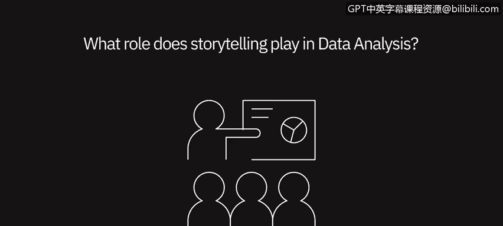

# 032：数据分析中的故事讲述 📖

在本节课中，我们将聆听数据专业人士分享故事讲述在数据分析师工作中的角色。我们将探讨为何故事讲述是数据分析中不可或缺的一环，以及如何通过故事有效地传达数据见解。

---

故事讲述在数据分析师生活中的作用至关重要。擅长用数据讲故事极为关键。人类天生通过故事理解世界。因此，若想说服他人依据数据采取行动，首要任务是讲述一个清晰、简洁且引人入胜的故事。

对于数据分析师而言，在处理任何数据集时构建一个故事也极为有用。这能帮助他们更好地理解底层数据集及其运作方式。

在讲述一个清晰、连贯、简单的故事与确保传达数据中可能存在的所有复杂性之间，总需要取得平衡。找到这种平衡可能极具挑战性，但也确实至关重要。

故事讲述的艺术在数据分析师的生活中意义重大。无论你发现了多少或多么出色的信息，如果无法找到方法将其传达给你的受众，无论是消费者、总监级还是高管级人员，这些信息都将毫无价值。

你必须找到传达信息的方法。通常，最佳方式是通过可视化或讲述故事来实现，以便他们理解这些信息如何发挥作用。

故事讲述是一项必不可少的技能。它就像是交付过程中的“最后一公里”。许多人可以通过短期培训掌握技术层面，然而，从数据中提取价值并进行沟通的能力却供不应求。

从长远职业发展来看，掌握如何用数据讲述一个引人入胜的故事非常关键。故事讲述对数据分析绝对至关重要，这是你实际传达信息的方式。每个人都能展示数字，但如果没有一个故事围绕其中，没有一个令人信服的行动理由，那么你呈现的内容最终将无法引起受众的共鸣。

斯坦福大学进行了一项研究，让人们进行提案演示。在演示中，他们既展示了简单的关键绩效指标、数字和统计数据，也讲述了一个故事。事后对听众进行测试，询问他们记住了演示中的哪些内容，结果发现是那些故事给他们留下了深刻印象。

当然，故事中仍然包含事实和数字，但正是通过故事，你才能将观点深入人心。与故事、理解或数据建立情感联系，才是促使人们采取你希望和需要他们采取的行动的真正方式。

---

本节课中，我们一起学习了故事讲述在数据分析中的核心作用。关键要点包括：故事是人类理解世界的基本方式，是有效沟通数据见解的“最后一公里”；在简洁叙事与呈现数据复杂性之间需取得平衡；通过故事建立情感连接，是推动决策和行动的关键。掌握用数据讲故事的技能，对于数据分析师的长期职业发展至关重要。