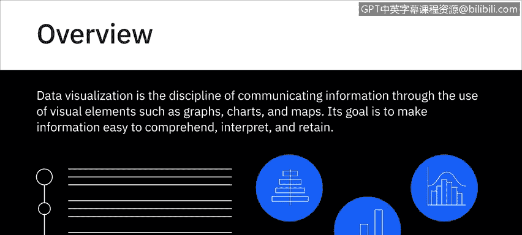
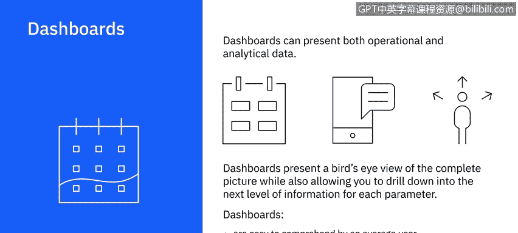

# 033：数据可视化介绍

在本节课中，我们将学习数据可视化的基本概念、目的以及如何选择合适的图表类型来有效传达信息。数据可视化是数据分析中至关重要的一环，它帮助我们更直观地理解数据背后的故事。

---

## 🎯 什么是数据可视化？

数据可视化是通过图形、图表和地图等视觉元素传达信息的学科。其目标是使信息易于理解、解释和记忆。

想象一下，你需要浏览数千行数据来得出结论，而相比之下，通过可视化呈现相同数据的摘要结果则更为直观。使用数据可视化，你可以总结数据中隐藏的关系、趋势和模式，这些信息如果仅从原始数据中解读，即使不是不可能，也会非常困难。

---

## ❓ 如何选择正确的可视化方式？

要使数据可视化具有价值，你必须选择最能有效向受众传达发现的可视化方式。为此，你需要首先问自己一些问题：

以下是需要考虑的关键问题：
*   我想建立什么样的关系？
*   我是否想比较一个整体中各部分的相对比例？例如，不同产品线对公司总收入的贡献。
*   我是否想比较多个值？例如，过去三年销售的产品数量和产生的收入。
*   我是否想分析单个值随时间的变化？例如，某一特定产品在过去三年的销售情况如何变化。
*   我是否需要受众看到两个变量之间的相关性？例如，天气条件与滑雪胜地预订量之间的相关性。
*   我是否想检测数据中的异常值？例如，查找可能影响结论的潜在异常数据。

“我想回答什么问题？” 这不仅是数据可视化设计和过程中的一个总体性问题。对于你可视化的每一个数据集和信息，你都需要能够为你的受众回答这个问题。

你还需要考虑可视化应该是静态的还是交互式的。例如，交互式可视化可以允许你更改值并实时查看对相关变量的影响。

因此，请思考你的受众的关键收获、他们的信息需求以及他们可能提出的问题，然后规划出能够清晰、有力地传达你信息的可视化方案。

---

## 📈 基本图表类型介绍

上一节我们探讨了如何根据目标选择可视化方式，本节中我们来看看一些可用于可视化数据的基本图表类型示例。

以下是几种常见的图表类型及其适用场景：
*   **条形图**：非常适合比较相关的数据集或整体的各个部分。例如，在条形图中，你可以看到10个不同国家的人口数量以及它们之间的比较。
*   **柱状图**：并排比较数值，可以非常有效地显示随时间的变化。例如，显示你网站的页面浏览量和用户会话时间如何逐月变化。
*   **饼图**：显示一个实体如何分解为其子部分，以及子部分之间的比例关系。饼图的每一部分代表一个静态值或类别，所有类别的总和等于100%。
*   **折线图**：显示趋势。非常适合展示数据值如何随连续变量变化。例如，你的产品或多种产品的销售额如何随时间变化，其中时间是连续变量。折线图可用于理解数据的趋势、模式和变化，也可用于比较多个系列的不同但相关的数据集。

> **注意**：尽管条形图和柱状图除了方向外很相似，但它们并不总是可以互换使用。例如，柱状图可能更适合显示负值和正值。

---

## 🖥️ 数据仪表板

数据可视化也可用于构建仪表板。仪表板将来自多个数据源的报告和可视化内容组织并显示在单个图形界面中。

你可以使用仪表板来监控日常进度、业务功能甚至特定流程的整体健康状况。仪表板可以呈现运营数据和分析数据。

例如，你可以拥有一个营销仪表板，从中实时监控当前营销活动的覆盖范围、产生的查询和销售转化率。在同一仪表板中，你还可以看到此活动的转化率与过去一些成功运行的活动的转化率相比如何。

仪表板是一个很好的工具，可以呈现整体情况的概览，同时也允许你深入查看每个参数的下一级信息。仪表板易于普通用户理解，使团队之间的协作变得容易，并允许你使用仪表板随时随地生成报告。

使用仪表板，你几乎可以立即看到数据和指标变化的结果。这可以帮助你在行进中从多个角度评估情况，而无需重新开始规划。

---

## 📝 课程总结

本节课中，我们一起学习了数据可视化的核心概念。我们了解到，数据可视化是通过视觉元素清晰传达数据洞察的关键工具。我们探讨了如何通过提问来选择合适的图表类型，并介绍了条形图、柱状图、饼图和折线图等基本图表的用途。最后，我们介绍了功能强大的数据仪表板，它能够整合多源信息，提供实时、全面的业务视图，助力高效决策。掌握这些基础知识，是成为一名优秀数据分析师的重要一步。